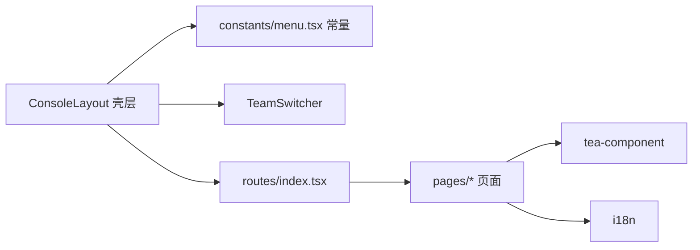

# REVIEW: MemoryPanel UI 重构 —— Agent 协作平台

- **Change ID**: agent-collab-ui-redesign
- **关联**: `@.specs/agent-collab-ui-redesign/REQUIREMENT.md`、`DESIGN.md`、`UI-DESIGN.md`、`TASK.md`、`TEST.md`
- **审查范围**: 本次 change 核心产出（导航/menu、路由、ConsoleLayout、TeamSwitcher、工作台栅格、项目/Agent 详情、记忆空间、layout.css、i18n）

---

## 第一轮 · Spec 合规审查

| AC | 实现 | 测试覆盖 | 判定 |
|---|---|---|---|
| AC-1 导航信息架构 | menu.tsx 5 组 + `__hidden__` | TEST.md AC-1 e2e | ✅ |
| AC-2 视觉保持 + 布局 | 双列栅格 + 三段式 + `--tea-color-*` 别名 | AC-2 e2e + tsc | ✅ |
| AC-3 协作项目 7 Tab | ProjectDetailPage 7 TabPanel | AC-3 e2e | ✅ |
| AC-4 Agent 4 Tab | AgentDetailPage 4 TabPanel | AC-4 e2e | ✅ |
| AC-5 记忆空间入口 | /memory-spaces 列表 + 详情 | AC-5 e2e | ✅ |
| AC-6 旧功能不回归 | 旧路由保留 + `/graph` 重定向 + legacyHash | AC-6 e2e + build | ✅ |

- [x] 每条 AC 被实现（6/6）
- [x] 每条 AC 被测试覆盖（TEST.md 6/6）
- [x] 未引入 out of scope（未碰 MemoryCore / DB / 算法）
- [x] 无范围蔓延（未新增 REQUIREMENT 之外功能）
- [x] 未触动 DESIGN §0.5.1 禁动清单（App.tsx / base.ts / app.ts 未改）

---

## 第二轮 · 代码质量审查（书本驱动 6 维衰退风险）

> 未装 brooks-lint，走内置 R1~R6 逐个维度诊断。

### 2.0 TEST.md 5 轮金字塔完整性（先查）

- [x] 5 轮状态明确（功能必跑 / 性能安全部分 / 兼容必跑 / 可观测跳过）
- [x] 跳过轮次有理由（可观测 = 无埋点要求）
- [x] 第 1 轮每条 AC 有覆盖（6/6）
- [x] 第 2 轮：LCP 实测 896ms / 预算 2.5s / bundle 706KB 判历史债
- [x] 第 3 轮：依赖 0 high/critical / 秘钥 0 / ESLint 本次文件 0 error / OWASP 减项记录
- [x] 第 4 轮：多视口 360~1440 单列→双列，无溢出
- [x] 第 5 轮：跳过有理由

### 2.1 代码质量诊断

```markdown
### 🟡 R6 · 领域扭曲：TeamSwitcher 文件仍寄居 GlobalHeader 目录
**Symptom**：`src/layouts/GlobalHeader/TeamSwitcher.tsx`（及 team-switcher.css）
**Source**：Evans · DDD · "Module should reflect the domain, not history"（命名应反映当前职责，而非历史出身）
**Consequence**：TeamSwitcher 职责已从「全局顶栏」改为「侧边栏团队分组标题」，但目录仍是 GlobalHeader；后续开发者会误以为它还在顶栏，6 个月内大概率有人改错位置或反向迁移。
**Remedy**：移动到 `src/layouts/TeamSwitcher/`（或 `src/components/TeamSwitcher/`），同步更新 ConsoleLayout 的 import 与 css 引用。→ T-FIX-01
```

```markdown
### 🟢 R2 · 变更传播：导航配置分散三处
**Symptom**：新增一个导航页需改 `constants/menu.tsx`（PageMeta）+ `routes/index.tsx`（路由）+ `layouts/ConsoleLayout.tsx`（PATH_TO_PAGE）
**Source**：Fowler · Refactoring · Shotgun Surgery
**Consequence**：三处易漏改（本次 `/memory-spaces` 已靠顺序注释规避 `/memory` 前缀冲突），未来加页面需小心。
**Remedy**：可选收敛为单一导航配置源（Path→PageId→Meta 同构），记 backlog，不阻塞本次。
```

```markdown
### 🟢 R4 · 偶然复杂：团队分组在 menuGroups map 里的特判分支
**Symptom**：`ConsoleLayout.tsx` restGroups.map 内 `isTeamGroup` 分支单独渲染 Fragment
**Source**：Brooks · "Accidental complexity"（特殊 case 增加心智）
**Consequence**：目前只有 team 一个特例，可读性尚可；若后续更多分组要内嵌交互组件，此分支会膨胀。
**Remedy**：暂接受；若出现第二个特殊分组，抽象为「分组渲染器」配置。
```

### 2.2 架构依赖检查

触发条件判定：本次**新增顶级模块 `src/pages/memory-space/`、`src/theme/`**，命中「新增顶级目录」。

依赖方向（简化 Mermaid）：



- 循环依赖：无（menu 常量 ← 壳层单向；页面 ← 路由单向）
- 反向依赖：无（无 `domain → controller` 式越界；无前端直接 import 后端实现）
- 跨边界依赖：无

### 严重度统计

| 编号 | 风险 | 严重度 | 处理 |
|---|---|---|---|
| R6 | TeamSwitcher 目录命名扭曲 | 🟡 Major | T-FIX-01 |
| R2 | 导航配置分散三处 | 🟢 Minor | backlog |
| R4 | 团队分组特判分支 | 🟢 Minor | 接受 |

---

## 第三轮 · UI 视觉审查（前端项目）

### 3.1 Design Tokens 一致性

- [x] 颜色全部来自 `--tea-color-*` 别名（layout.css / team-switcher.css 均引用 token）
- [x] 0 硬编码 hex（grep 仅 i18n 文案示例 `#142`，非颜色值）
- [x] 字体沿用 Tea 官方字体栈（现有风格，内部工具场景，未新引入 Inter/Roboto 作主字体）

### 3.2 Anti-Pattern 扫描（对照 ui-anti-patterns.md 强制禁忌）

| 类 | 结果 |
|---|---|
| 字体（Inter/Roboto/Arial 主字体）| ✅ 未命中（Tea 官方栈，现有）|
| 颜色（纯黑/纯白/紫渐变/彩底灰字/双强调色）| ✅ 未命中 |
| 阴影（静态 drop shadow / alpha>0.15）| ✅ 未命中（layout.css 无 box-shadow）|
| 边框（彩色侧条>1px / 渐变边框 / 玻璃拟态）| ✅ 未命中 |
| 动效（bounce/elastic / animate layout / 无 reduced-motion）| ✅ 未命中（layout.css 含 `prefers-reduced-motion`）|
| 布局（卡片嵌套 / SaaS hero-metric / 默认 dark）| ✅ 未命中（双列栅格，无嵌套卡片）|
| 文案（hedging / lorem ipsum / 空动词）| ✅ 未命中 |
| 组件（placeholder 当 label / 模态无 ESC）| ✅ 未命中（骨架无表单）|

### 3.3 视觉北极星一致性

北极星 =「保持现有极简皮肤（tea + 腾讯蓝），重做布局」。Playwright 截图/文本验证：tea Menu 分组 + 腾讯蓝 brand + 极简双列栅格，调性一致。✅

### 3.4 无障碍快检

- [x] 颜色对比：沿用 tea token（text-tertiary/text-primary），未单独 WCAG 实测（骨架阶段，token 系 tea 官方）
- [x] 键盘可达：TeamSwitcher 为 `<button>`，菜单项 Tea Menu 自带键盘
- [x] `prefers-reduced-motion`：layout.css 响应 ✅
- [x] 表单 label：骨架无表单，占位用 StatusTip 空态 ✅

---

## 第四轮 · 补充审查

- 4.1 技术债评估：❌ 未命中（非里程碑/季度版本）
- 4.2 跨模型 spot-check：❌ 未命中（无安全/并发/超长函数/覆盖率下降）

---

## 产出修复任务

| 编号 | 严重度 | 内容 |
|---|---|---|
| T-FIX-01 | 🟡 Major | 移动 TeamSwitcher 出 GlobalHeader 目录（R6 命名扭曲）|

---

## 🛡️ 专家团门禁 · G4 审查门（强制 · R9/R13）

Master 角色：测试专家。

### 🗳️ G4 审查门: REVIEW.md 是否通过？

> 「REVIEW.md 审查结论是否可信？Critical 是否都已修复或接受？从测试完整性、架构合规、业务正确性、安全充分性四个维度看，可以进入集成阶段吗？」

- 🟫 **资深测试工程师(M)**: ✅ TEST.md 5 轮完整性已核查（2.0 全绿），AC 覆盖 6/6，无跳轮漏项。审查发现 1 个 🟡（R6 目录命名）已生成 T-FIX-01、2 个 🟢 记 backlog，无 🔴 Critical。**通过**。
- 🟦 **架构师**: ✅ 依赖方向正确（壳层→常量→页面单向，无循环/越界）。导航配置分散三处（R2）为已知 Minor，不阻塞。TeamSwitcher 目录命名（R6）已列入 fix。**通过**。
- 🟩 **领域专家**: ✅ 领域命名忠实（memory_spaces / project_detail / agent_detail 反映真实实体），无范围蔓延，out of scope（MemoryCore/算法）未触碰。**通过**。
- 🔴 **安全审计师**: ✅ 依赖 0 high/critical、秘钥 0 命中、OWASP 逐项标注不适用理由（纯前端骨架），无新增敏感面。hono 7 moderate 为后端传递依赖，已记录升级 backlog。**通过**。

### 结果: 4/4 → 全票通过 ✅ 自动进入 7-integration

> 附带：T-FIX-01（🟡 Major，非 Critical）—— 因 6-review 约束 R3.3「禁止直接改代码」，随 review 结果转入 4-dev 执行 fix，不阻塞集成。
