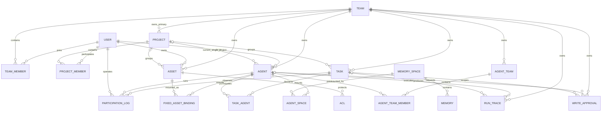

# Agent Memory OS UI V2 — Code Scan Supplement

## 1. 扫描结论

本轮以实际代码为准，扫描了 MemoryPanel 的路由、布局、页面、状态层、API 客户端与 Panel 聚合路由，以及 MemoryCore 的实体、schema、路由和记忆内核。

1. **页面能力已经存在大半**：Project CRUD、任务看板、Agent 资产管理、Chat Memory L0–L3、AgentTeam、Automation、RunTrace、WriteApproval、ACL、审计都有真实实现。
2. **缺的是统一对象模型和深接口**：现状按模块分散，Project 页面靠多个请求拼装，Agent Loadout 与 MemorySpace 管理只有部分读接口。
3. **先补契约再改导航**：直接做新页面会产生 N+1/fan-out、前端推导关系和后端不支持的假 UI。
4. **Project 是默认工作现场但不是唯一权限边界**：Team 是组织和公共池，Project 是协作轴，各实体保留独立归属与权限语义。

## 2. 当前前端结构

| 层 | 现状 | 对 V2 的影响 |
|---|---|---|
| 路由 | `createHashRouter`；页面挂在 `ConsoleLayout` 下 | 保留 hash 兼容，新增嵌套路由与 redirect 表 |
| 导航 | 静态 PageId；`ConsoleLayout` 用前缀字典识别页面 | 需改成路由元数据，支持动态实体详情 |
| 页签 | `TabBar` 以 PageId 管理 | 动态详情会互相覆盖；改用 `routeId + entityId + subroute`，或移除实体多页签 |
| 全局上下文 | Zustand 只持久化 `activeTeamId` | URL 作为 Team/Project/Agent/Task 权威，localStorage 只记默认值 |
| 服务端状态 | 自定义 Zustand 缓存，没有 React Query/SWR | 第一阶段沿用；工作区聚合使用独立 hook |
| 组件体系 | Tea Component + 现有 CSS token | 抽 `EntityPageHeader`、`FilterBar`、`RelationshipDrawer` 与状态视图 |
| 测试 | Web 未发现测试文件或浏览器测试配置 | 先以 typecheck/build/lint 和真实浏览器验收为门禁 |

## 3. 实体关系：当前真实模型



### 3.1 关系表与 UI 含义

| 关系 | 当前基数与来源 | UI 语义 | 约束/缺口 |
|---|---|---|---|
| User ↔ Team | `TeamMember` 多对多，含 `admin/member/reviewer` | 组织成员、角色、公共池访问 | Team 不是 Project 成员关系的替代品 |
| Team → Project | Project 有唯一 `team_id` | Project 主组织、默认公共资产来源 | Project 成员可跨 Team |
| User ↔ Project | `ProjectMember` 多对多，含 `manager/member` | 项目参与者和管理权 | owner、manager、成员角色必须分开显示 |
| Project → Agent | Agent 有可空单值 `project_id` | 当前所属项目 | 多 Project 尚未落地，首期不提供多选 |
| Project → Task | Task 有可空单值 `project_id` | 项目任务与全局筛选 | Core 支持，前端类型/create 未完整暴露 |
| Task ↔ Agent | `TaskAgent` 多对多，含 `role_in_task` | 声明参与者 | 与 ParticipationLog 的实际参与证据分开 |
| Task ↔ User/Agent | `ParticipationLog` append-only | 实际参与者、活跃度 | Project 需通过 Task 聚合 |
| Project → Asset | Asset 有可空单值 `project_id` | 项目资产库 | 资产类型作为筛选而不是一级产品 |
| Agent ↔ Asset | `FixedAssetBinding` 多对多 | 固定装配 | Skill=fork，知识资产=allocate，保留类型语义 |
| Asset ↔ Subject | ACL 主体为 User/TeamRole/Agent | 可访问候选集 | ACL 不等于固定装配或本轮召回 |
| Agent ↔ MemorySpace | `AgentSpace` 多对多 | Agent 挂载空间 | 目前只有列表，无 mount/unmount/policy update |
| MemorySpace → Memory | L1 `MemoryRecord.spaceId` | 空间中的原子记忆 | Chat Memory 仍以 block/agent 资产组织 |
| Memory → Source | session/task/message 字段 | 来源对话、任务和消息 | Run 不是一等来源 |
| Team → AgentTeam | Team 一对多，AgentTeam ↔ Agent 多对多 | 多 Agent 编排 | 已可 CRUD，可迁到 Collaboration |
| RunTrace → Agent/Task | 可选 `agent_id/task_id` | 运行回放 | 无 `project_id`，list 无 task/project 筛选 |
| WriteApproval → Agent/Task | 可选 agent/task/session | 写入治理 | 无 `project_id`，项目归属只能间接推导 |
| KnowledgeEntry → Team/Project | `scope + scope_id` | 决策、交付、工作模式 | 不应混入 Asset |

## 4. Agent Loadout 三层

| 层 | 回答的问题 | 当前数据源 | 状态 |
|---|---|---|---|
| 可访问 | Agent 按 Team/Project/Owner/ACL 能看到什么？ | `assetsApi.listAccessible()` | 可直接复用 |
| 固定装配 | 哪些资产长期绑定给 Agent？ | Agent fixed-assets API；Skill 另走 fork | 可直接复用，统一展示术语 |
| 本轮生效 | 这次 Run 最终用了哪些资产、空间、策略和版本？ | `execution-bundle/resolve` | 仅有 spaces、sceneIds、bundleId，不足以完整展示 |

V2 固定使用 **可访问**、**固定装配**、**本轮生效**，不能统称“绑定”。

## 5. 页面切片可实现性

### 5.1 可直接复用

- Project CRUD、成员、资产与 KnowledgeEntry；
- Project 任务聚合接口和按 Project 查询 Agent；
- Agent 固定资产与现有编辑流程；
- Chat Memory L0–L3、搜索、编辑、导入、创建、分配/解绑；
- AgentTeam、Automation、RunTrace、WriteApproval、ACL、审计。

### 5.2 需要 Panel 聚合适配

| UI 切片 | 原因 | 建议接口 |
|---|---|---|
| Project Overview | 关系分散，前端会产生 6–N 次请求 | `POST /api/v1/project-workspace/overview` |
| Agent Overview | 现有 bootstrap 偏资产计数 | 扩展 bootstrap 或新增 `agent-workspace/overview` |
| Task Detail | Task、声明/实际参与者、Run、知识、Memory 分散 | `POST /api/v1/task-workspace/detail` |
| Governance Inbox | 审批、失败 Run、审计事件分散 | `POST /api/v1/governance/inbox` |

Panel 只负责编排 caller-aware Core API，不复制权限裁决。

### 5.3 需要 Core 契约/模型工作

| 能力 | 当前缺口 | 最小改造 |
|---|---|---|
| Agent 选择 Project | Core 支持，前端 create/update 未暴露 | 补参数、表单和类型 |
| Task 选择 Project | Core create/list 支持，前端类型/create 缺字段 | 先补 create/type；迁移 Project 单独决策 |
| Agent 多 Project | 当前为单值 `project_id` | 关系表落地后再开放多选 |
| 完整 ExecutionBundle | 无资产、版本、策略来源、解析链和快照时间 | 增加 read model 与可回放快照 |
| MemorySpace 管理 | 仅 `space/list` | 增加详情、mount/unmount、policy tighten、影响预览 |
| remember/correct/forget | 只有纯函数和底层编辑 | 增加带 actor/source/scope/version/audit 的命令 |
| 评测趋势 | evaluator 只即时计算调用方数据 | 增加 EvalSuite/EvalRun 持久化 |
| Project Run/审批筛选 | 无 `project_id` 且 list 筛选不足 | 短期经 Task 聚合，长期由 ADR 决定 |
| Memory 来源链 | L1 有 session/task/message | 增加 provenance read model，评估 `run_id` |

## 6. ProjectWorkspace 聚合契约

首版只返回首屏摘要，详情仍走分页接口：

```ts
interface ProjectWorkspaceOverview {
  project: Project;
  viewer: { role: string; permissions: string[] };
  counts: {
    members: number;
    agents: number;
    tasks: { total: number; running: number; completed: number; risky: number };
    assets: Record<'skill' | 'llm_wiki' | 'code_graph' | 'chat_memory', number>;
    spaces: number;
    runs: { total: number; failed: number };
    pendingApprovals: number;
  };
  recent: { tasks: TaskSummary[]; runs: RunSummary[]; knowledgeEntries: KnowledgeEntry[] };
  warnings: Array<{ code: string; message: string; partial: boolean }>;
}
```

- 子系统失败返回 `warnings` 和 partial data，不把整页打成 500；
- 不返回未授权实体的存在性计数；
- counts/recent 必须定义统计口径；
- overview 不返回全量详情列表。

## 7. ExecutionBundle V2

为支撑“本轮生效”，至少增加 `resolvedAt`、context、agent revision、assets + version + injectionMode、spaces + source、scene version、policy decisions 和 source chain。真正 Run 回放还需要把 bundle 快照或 revision 写入 RunTrace。

## 8. 路由与状态迁移

1. 路由元数据替换 `PATH_TO_PAGE` 前缀首匹配，动态详情页拥有独立 route id。
2. URL query `team/project/agent/task` 是上下文权威，Zustand 只缓存最近选择。
3. 切 Team 后验证 Project，切 Project 后验证 Agent/Task；失效时清理下游并说明原因。
4. Project/Agent/Task 子页面使用 URL path，不再只存在组件 state。
5. 旧模块路由保留兼容，能力等价后再 redirect。

## 9. 代码债与风险

- `MemoryPanel/src/panel/http/app.ts` 重复注册 `registerMemoryProxyRoutes()`；
- `MemoryPanel/src/panel/http/routes/chat-memory.ts` 重复注册 `/chat-memory/list-combined`；
- `MemoryPanel/web/src/lib/api/types.ts` 重复声明 Project/ProjectMember 与 Automation；
- `MemoryCore/src/metadata/store/interface.ts` 重复声明 AgentSpace 和 AgentTeam 相关接口；
- `stores/backend.ts` 的 `fetchTasks` 声明允许筛选，但实现没有透传，缓存键也不含筛选；
- Agent 详情与 MemorySpace 详情仍是骨架占位；
- `MemoryCapabilitiesPanel` 大量表单是纯函数试调，不是普通用户业务流；
- Project 详情当前只真实接入成员、资产和 KnowledgeEntry，记忆仍为空态；
- 前端没有自动化测试基础。

这些问题应建独立清理任务，不与无关 UI 切片混修。

## 10. 修订后的交付顺序

1. 契约对齐：Project 字段、Task 筛选缓存、聚合 DTO、ExecutionBundle V2。
2. 导航骨架：路由元数据、URL 上下文、共享实体组件、旧路由兼容。
3. Project 垂直切片：Overview → Tasks → Agents → Assets → Memory → Members。
4. Agent/Task 垂直切片：真实详情、Loadout 三层、Run/来源关系。
5. Memory Center：先迁移真实浏览/搜索/编辑，再补显式命令与空间管理。
6. Governance：先迁移真实审批/审计/Run，再建设持久化评测。
7. 新流程达到同等能力后再收敛旧入口。

## 11. 验证门禁

- 每个垂直切片执行 Web typecheck/build；
- 浏览器验证 320/768/1024/1440px、键盘、URL 恢复、权限拒绝和 partial data；
- Project overview 禁止按列表项逐个 fan-out；
- 禁止通过计数或错误消息泄露未授权对象；
- 新业务动作必须有审计；纯函数试调只留在开发者诊断区；
- 新增聚合路由在现有后端测试体系中补契约测试。
