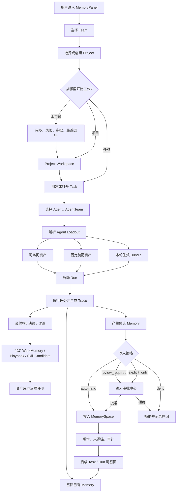
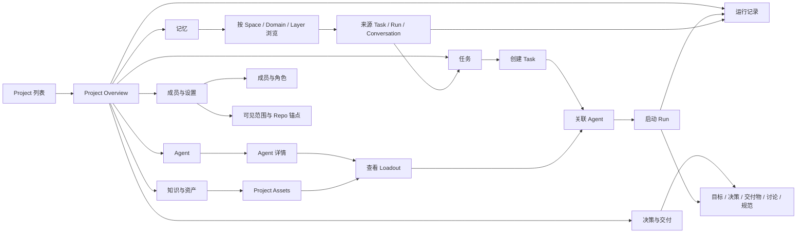
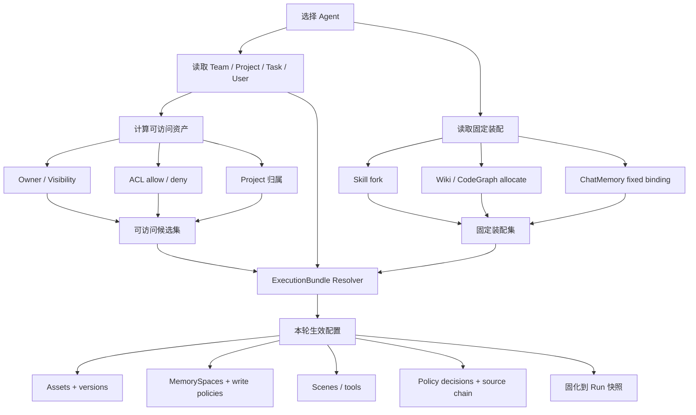
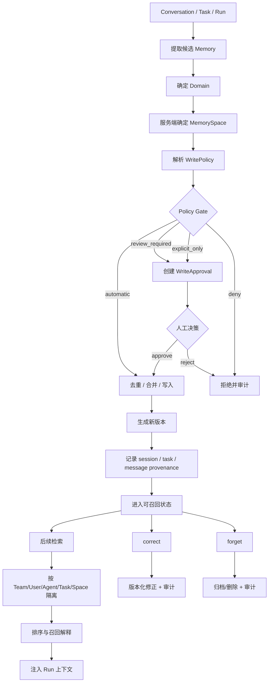
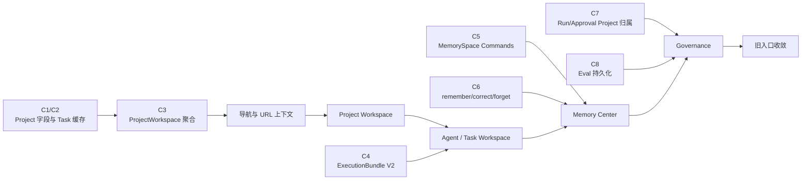

# Agent Memory OS UI V2 — Core Flows

## 1. 系统主流程

## 2. Project Workspace 用户流

## 3. Agent Loadout 解析流

> 当前代码只完成 MemorySpaces、sceneIds 和 bundleId；Assets、版本、策略来源、source chain 与 Run 快照属于 ExecutionBundle V2。

## 4. Memory 写入与治理流

## 5. UI 实施顺序

