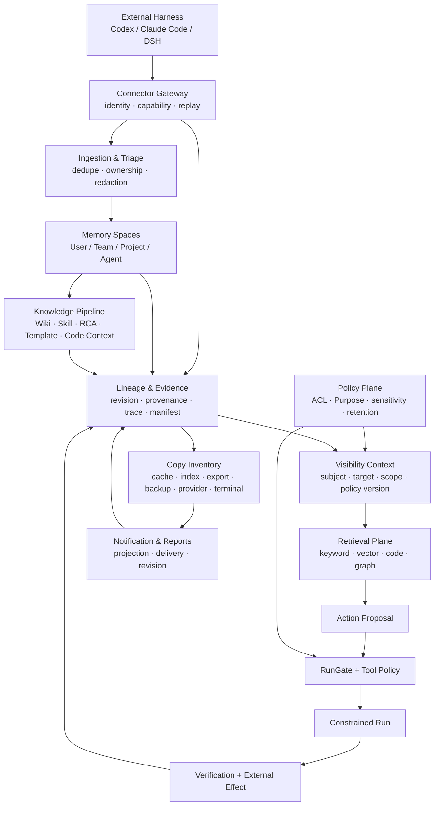
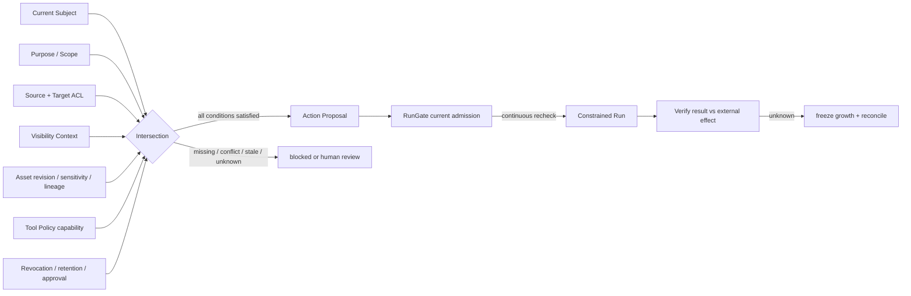
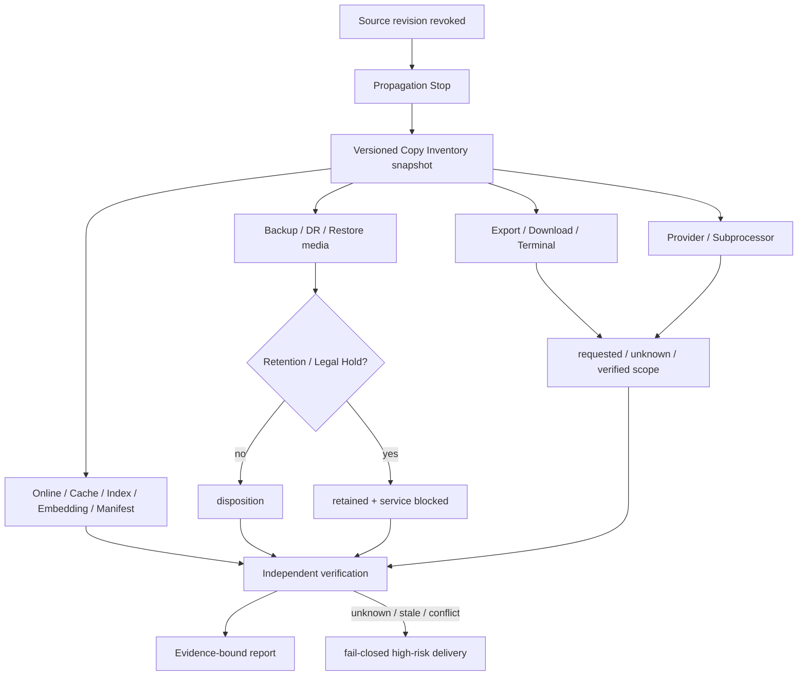

# 架构设计与图示：Enterprise Agent Memory Platform

## 1. 分层架构



## 2. 权限和执行判定



## 3. 清理和副本闭包



## 4. 数据和事件边界

```text
EvidenceEvent
  ├─ event_id / event_type / observed_at
  ├─ subject / harness / agent / purpose
  ├─ source_asset / source_revision / target_scope
  ├─ sensitivity / policy_version / lineage_ref
  ├─ operation / result / external_effect
  ├─ evidence_ref / coverage / freshness
  └─ unknown_reason / responsibility / supersedes

清理、报告、投递和补救都引用 EvidenceEvent 与版本化 snapshot；
不要用一个实时布尔字段覆盖历史事实。
```

## 5. 关键架构决策

| 决策 | 结论 | 原因 |
|---|---|---|
| 物理存储 | 语义统一、物理实现可替换 | 不提前冻结图数据库、向量库、Provider |
| 权限过滤顺序 | 先授权/用途/敏感/撤回，再召回/投影/执行 | 防止候选、侧信道和模板泄露 |
| 执行模型 | Action Proposal 与 RunGate 分离 | 建议不等于执行；Tool Policy 是硬边界 |
| 状态模型 | 证据分层、unknown/partial/stale 显式 | 请求、执行、验证和外部效果不等价 |
| 恢复模型 | 新 revision/副本重新入闭包 | 旧证明不能覆盖恢复后的新资产 |
| 报告模型 | 事实内核 → 授权投影 → 渠道 Delivery Intent | 防止多受众越权和版本漂移 |

## 6. 非功能与风险

- 安全：fail-closed、最小投影、秘密不回显、当前授权持续重检。
- 隐私：重识别、Embedding、缓存、终端和外部 Provider 视为独立泄露面。
- 可审计：每次决策绑定主体、Purpose、范围、revision、政策版本、证据和责任。
- 可恢复：恢复、迁移、重试和补偿幂等且可对账；unknown 不自动扩大副作用。
- 可替换：Schema、PDP/PEP、事件总线、Provider、图/向量实现待真实拓扑验证。

本文件是产品架构设计，不是最终工程架构；实现前需要以低敏样本、真实部署边界和责任矩阵验证。
