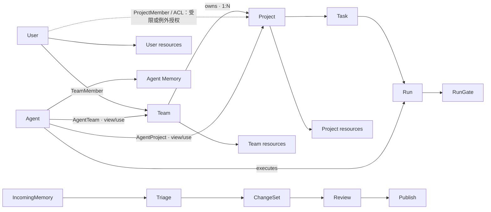

# 领域模型：概念、关系、归属与权限

## 1. 先分清五件事

| 维度 | 回答的问题 | 权威来源 | 不可推导的结论 |
|---|---|---|---|
| Identity | 谁在发起请求？ | 认证出的 Principal；无法识别真人时为 `actor_unknown` | Key 的登记人不等于实际操作者。 |
| Relation | 两个对象是否关联？ | 成员、归属、Agent 关联、挂载等关系边 | 有关联不等于可改关系本身。 |
| Ownership | 对象由谁负责、落在哪个边界？ | Project 的 owning Team；资源 owner 与 ACL | 创建者不等于 owner。 |
| Context | 本次工作在哪里发生？ | ContextBinding | 最近项目、仓库路径只是提示。 |
| Authorization | 当前主体能执行什么动作？ | `credential scope ∩ binding/membership grant ∩ resource ACL ∩ inherited policy ∩ action policy ∩ delegation` | 可查看不等于可写；可使用不等于可管理。 |

## 2. 核心对象

| 对象 | 定义 | 不是什么 |
|---|---|---|
| User | 可独立创建的身份主体；可选在创建时加入 Team，之后也可加入 Team。 | 不是必须隶属于某个 Team 的对象。 |
| Team | 组织与共享协作层，管理成员、Team scope 资源、默认规则，并拥有 Project。 | 不是 Platform 公共资源的 owner。 |
| Project | 具体协作现场，必须且只能归属一个 Team，组织 Task、关联 Agent 与 Project scope 资源。 | 不是可同时属于多个 Team 的标签。 |
| Agent | 可版本化执行配置；可 private / scope-visible / public-discoverable，并可关联多个 Team 和 Project。其元数据包含名称、描述、类型、可见性、owner、状态、版本与关联范围。 | 不是 User、权限角色或关系管理员。 |
| Task | Project 内有验收标准的工作目标。 | 不是一次执行记录。 |
| Run | 为完成一个 Task 的一次执行尝试和不可改写证据。 | 成功不等于 Task 已验收。 |
| MemorySpace / Memory | 长期记忆的归属与策略边界 / 其中版本化内容。 | 不是公共资源；不支持 public Memory。 |
| Wiki / Code / Skill / Template | User、Team、Project 均可独有的专业资源；Platform 可维护公开的 Wiki、Skill、Template。 | 不由一张 Asset 表替代。 |
| ContextBinding | 工作的主 Project、参考 Project、写目标空间。 | 不是页面筛选或最近访问。 |
| ChangeSet / RunGate | 内容变更审核发布对象 / 高风险运行副作用闸门。 | 不是同一种审批。 |
| PublicModelConfig | Platform 维护的模型 Provider / Model 配置与 Vault 凭据引用。 | 不是每个 Agent 独立复制的密钥。 |

长期 MemorySpace 的 owner 仅为 `user | team | project | agent`。

## 3. 关系模型



### 关系的准确含义

1. **Team → Project 是一对多归属关系。**每个 Project 必须且只能有一个 owning Team。
2. **User ↔ Team、User ↔ Project 是独立关系。**TeamMember 不等于 ProjectMember，也不等于资源 CRUD；ProjectMember / ACL 用于受限 Project 或额外授权。
3. **Agent ↔ Team / Project 是可使用范围授权。**Agent 可在关联范围内查看已获准对象，并使用已获准模型、工具、Skill、Memory、Template 和上下文；它不能修改 Team、Project、成员、关联、策略或配置。
4. **Project → Task → Run 是工作主链。**Run 从 Task 或所属 Project 下钻；它不是日常一级对象。
5. **资源拥有者唯一。**User、Team、Project 分别拥有自己的专业资源；Agent 只拥有其专属 Memory。Platform 只拥有公开 Wiki、Skill、Template 和公共模型配置。
6. **接入与变更不改变归属。**接入中心只聚合候选；ChangeSet 可跨 scope 被发现，但仍归具体目标对象。

## 4. 权限推导与能力矩阵

```text
Effective permission = credential scope
                     ∩ membership / binding grant
                     ∩ resource ACL
                     ∩ Platform → Team → Project inherited policy
                     ∩ action policy
                     ∩ delegation / RunGate (when applicable)
```

### Project 能力矩阵

| 动作 | `open` Project 的 owning Team 成员 | `restricted` Project 的 ProjectMember / ACL 主体 | 已关联 Agent |
|---|---|---|---|
| 进入、查看 Project 基础信息与允许的 Task | 允许 | 依显式读权限 | 允许查看关联范围内、且 policy/ACL 允许的信息 |
| 新建 / 编辑日常 Task | 允许，受项目角色约束 | 依显式写权限 | 只能通过获准工具协作执行；产出进入 Run / Artifact |
| 使用项目允许的 Agent、工具、已挂载资源 | 允许，仍受 ACL / policy | 依显式授权 | 可使用关联中获准能力 |
| Memory / Wiki / Code / Skill / Template CRUD | 仍须资源 ACL / role | 仍须资源 ACL / role | 仍须资源 ACL、write policy 和工具 policy |
| 审核 / 发布 ChangeSet；通过 RunGate | 需要治理角色 | 需要治理角色 | 只能提出或执行获准动作，不能自我审批 |
| 改成员、关联、ACL、visibility、Agent 配置；删除/转移 Project | 仅 Team Owner / Project Admin | 同上 | 不允许 |

`open` 是日常协作入口，不是对所有资源和管理动作的全权授权。

### Agent 配置与资源能力

Agent 配置分为两个层面：**可见/可管理的 Agent 定义**，以及**运行时被授予的资源能力**。

| 配置组 | 字段或对象 | 说明 |
|---|---|---|
| 基本信息 | `name`、`description`、`type`、`visibility`、`owner`、`status`、`version`、标签 | `visibility` 只控制发现/查看元数据；`type` 可为 assistant、retriever、coder、reviewer、workflow 等产品定义类型。 |
| 行为配置 | 系统提示词、运行参数、模型配置引用、工具、Skill、Hooks | 只有 Agent Admin 可修改；模型与工具仍受上级 policy 限制。 |
| 执行资源 | Memory、Wiki、Code、Skill 的 `view / use / write` grant | 必须逐项按资源 owner、ACL、write policy 和关联 scope 授予；Agent public 不会使私有资源公开。 |
| 运行与安全 | 定时任务、Run evidence、Vault secret reference | Vault 只保存引用与状态，Secret 永不回显；定时任务须携带明确 scope 与最低权限。 |

`write` 必须拆分为资源类型的受控写入动作：对 Memory 是按 MemorySpace write policy 写入候选；对 Wiki / Code / Skill 是创建或修改候选并进入 ChangeSet。Agent 不能凭自身关联修改资源的 ACL、owner 或发布状态。

## 6. 资源归属、共享与模板版本

| 资源类型 | 可拥有的 scope | Platform 公共版本 | 共享与版本规则 |
|---|---|---|---|
| Memory | User、Team、Project、Agent | **不允许** | 不跨 scope 直接共享；经分诊、脱敏、审核后可发布为受控 Wiki / Skill / Template。 |
| Wiki | User、Team、Project | 允许 | Platform 版本受发布治理；scope 内版本默认隔离。 |
| Code | User、Team、Project | 不复制 | 固定 `source + revision`，遵循原仓库 ACL。 |
| Skill | User、Team、Project | 允许 | 公开版本可发现/按策略使用；定制时复制或派生。 |
| Template | User、Team、Project | 允许 | 引用必须锁定版本；可显式复制/派生，绝不自动持续同步。 |

- Team 管理 Team scope 的共享资源与默认规则；Project 管理自己的资源和工作上下文。
- Project 可比 Team 默认规则更严格，不能放宽或绕过 Platform / Team 的上级限制。
- Team Template 变更属于 Team scope；Project 对它的引用稳定指向已锁定版本。升级、复制或派生是显式 ChangeSet。

## 7. 接入、变更与上下文

```text
导入文档 / Memory 候选 / Run 记录
→ Team 接入中心聚合
→ 授权候选、去重、脱敏
→ Triage
→ 明确写入 Team 或 Project MemorySpace
```

- 归属不明、混合多个 Project、低置信度或无写权限时进入待分流队列；不能 fallback 到 Team、最近 Project 或个人空间。
- Project 仅看到自己关联的导入、分流、失败记录和最终归属。
- 变更中心先授权后聚合：Team Template / Team 资源在 Team scope 审核；Project 资源在 Project scope 审核；系统策略和公共模型配置仅由 Platform Admin 审核。
- `ContextBinding` 使用 `primaryProjectId`、`referenceProjectIds`、`writeTargetSpaceId`；读取权限不等于写入权限。
- `accessible`、`mounted`、`effective` 分别表示有资格使用、默认装配、本次 Run 实际生效，三者不可互换。

## 8. 安全与审计不变量

- `createdBy ≠ owner ≠ actor`；Key owner 不等于实际操作者。
- API Key 只在创建时展示一次；系统保存哈希/指纹、scope、期限、最后使用和撤销状态，不能回显明文。
- Vault 只保存/展示密钥引用和状态；任何页面、日志或 Agent 配置都不能回显密钥内容。
- `Agent proposal ≠ approval / publish`；`Run succeeded ≠ Task accepted`；`approved ≠ published`。
- 历史 Snapshot 保存事实，不能绕过当前撤权。
