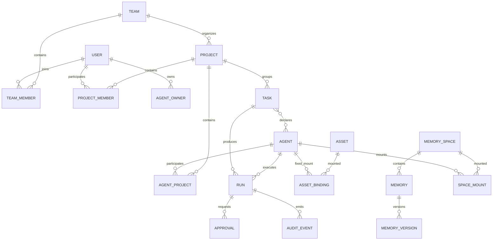

# TencentDB Agent Memory · 重新设计落地总纲（Spec v2）

> 状态：设计冻结候选，**仅文档，不修改代码**  
> 日期：2026-09-10  
> 适用仓库：`TencentDB-Agent-Memory`  
> 事实来源：本仓库源码、`my-tencentDB-Agent-memory` 源码、`intent-os-platform` 扫描摘要、`MindMemOS` 源码与测试。

## 0. 本轮交付边界

本轮只完成设计重构与落地文档，不执行：复制页面、修改路由、修改 API、数据库迁移、删除死代码、安装依赖、提交代码。

文档中的状态严格使用：

- `现存-可复用`：在目标仓库有源码证据，可作为实现输入；
- `现存-断入口`：能力或组件存在，但没有可达 UI/调用链；
- `骨架-待契约`：页面存在但没有真实数据；
- `设计-待实现`：本轮新增目标；
- `不采纳`：参考项目存在，但不纳入 TencentDB 当前范围。

禁止把“有规格文档”“有类型”“有纯函数”写成“已实现”。

## 1. 设计结论

TencentDB Agent Memory 不复制 Agent OS，也不把 MindMemOS 直接当算法真相源。目标产品定义为：

> **以 Project 为工作现场、以 Agent 为执行主体、以 MemorySpace 为认知边界、以 Asset/Skill/Knowledge 为可装配能力、以 Run/Approval/Audit 为治理证据的团队记忆与协作控制面。**

三个参考项目各自只承担一种输入：

| 参考 | 真实价值 | 不照搬 |
|---|---|---|
| `intent-os-platform` | Agent/Run/ToolPlan/Approval/CanonicalEvent 的执行控制面；fail-closed、安全门禁、分层与证据纪律 | 文档与代码存在冲突；不引入其重型 Scene/Workflow runtime；不照搬三套会话、无状态 Task Center、静默回退 |
| `MindMemOS` | add/search/feedback/dreaming/skill-evolution 的记忆算法闭环；Provider、RRF/rerank、schema、评测和 OTel 实践 | 仅配置但未生效的能力；skill 演进的非原子、无锁、静默丢失问题；不把 Brain/MemorySpace 当其现有实体 |
| `my-tencentDB-Agent-memory` | 页面功能基线、Tea UI 风格、Analytics、Workbench、Wiki/Code/Skill/ChatMemory 的直白入口 | 不以旧页面目录直接覆盖新关系模型；只恢复确证丢失能力 |

## 2. 当前真实基线

### 2.1 页面与入口

| 能力 | 当前证据 | 设计处理 |
|---|---|---|
| Workbench、Wiki、Code、Skill、Chat Memory | `MemoryPanel/web/src/routes/index.tsx`、`pages/` | 保留，迁入新信息架构时保留旧路由 |
| Project、Team、MemorySpace、Admin | 当前路由与页面存在 | 从模块页升级为关系工作区；骨架必须先补契约 |
| Analytics | 早期版 `pages/AnalyticsPage/` 29 文件；当前 client、i18n、Panel/Core 路由仍在 | P0 恢复 `/analytics`，不改后端 |
| 默认 Agent 模板 | 早期版两个组件；当前后端 action/client 仍在 | P0 恢复管理 UI，仅管理员可见/可调用 |
| L1 刷新 | 早期 hook 有 `refreshLayer`，当前无 | P0 恢复按钮与真实刷新动作 |
| Agent 详情、MemorySpace 详情、Project Memory Tab | 当前页面明确为骨架，缺真实调用 | P1 先定义契约，未接通前不作为完成页面 |
| CodeGraph 孤儿组件 | `pages/codegraph/` 多组件存在，部分无调用点 | P1 接线或明确归档，不能继续隐藏 |

### 2.2 后端与内核事实

当前由 `MemoryCore`、`MemoryKnowledge`、`MemoryPanel`、`MemoryProxy` 构成；已有 L0-L3 记忆、Meta、Skill、Analytics、知识/代码图谱、隔离、trace/metrics/log 与部分 memory record 能力。当前缺口集中在：统一读模型、统一运行编译、MemorySpace 命令、Project/Agent/Task 深关系、持久化治理视图和页面入口。

## 3. 目标域模型



### 3.1 三种关系必须分开

1. **可访问（Accessible）**：由 `team/user/project + visibility + ACL` 决定；回答“能看到什么”。
2. **固定装配（Mounted/Fixed）**：Agent 长期绑定的 Skill、Wiki、CodeGraph、ChatMemory、MemorySpace；回答“默认带什么”。
3. **本轮生效（Effective）**：一次 Run 经服务端 resolver、版本、策略、工具授权后真正使用的快照；回答“这次用了什么”。

UI、API、审计字段均禁止用一个泛化的 `binding` 同时表达三者。

## 4. 目标分层

```text
Web UI / SDK / Agent Adapter
        ↓ 仅调用 Panel/BFF，不直连内核
Panel API + Read Model + Command Adapter
        ↓ caller-aware，不复制权限裁决
Domain: Project / Agent / Task / Asset / MemorySpace / Governance
        ↓ ports
MemoryCore: L0-L3 / search / retention / feedback / lifecycle / skill
Knowledge: Wiki / CodeGraph / ingestion / analysis
Infrastructure: SQLite / LadybugDB / vector / telemetry / provider
```

依赖规则：Web → Panel；Panel → Core/Knowledge/Proxy；Domain 通过 port 依赖基础设施；任何路径不得绕过 caller-aware 权限入口；Provider 解析失败不得静默降级。

## 5. 分阶段落地

| 阶段 | 目标 | 设计交付物 | 完成条件 |
|---|---|---|---|
| P0 | 恢复真实能力、清除入口断裂 | Analytics、默认模板、L1 refresh、admin 守卫、路由/重复/i18n 门禁 | 页面有真实数据，命令/构建/浏览器证据齐全 |
| P1 | 契约与读模型 | Project/Agent/Task/Governance/MemoryCenter DTO 与契约测试 | Web 首屏最多 3 个请求，权限计数不泄露 |
| P2 | 关系与运行快照 | Agent↔Project、SpaceMount、ExecutionBundle、provenance | 一个 resolver 产出可解释快照，Run 可回放 |
| P3 | UI 重排 | Project/Agent/Task/Memory/Assets/Governance 工作区 | 旧路由兼容、四档视口、五态齐全 |
| P4 | 算法治理闭环 | golden set、RRF/rerank、dedup、retention、dreaming、feedback、eval | recall@k/MRR/nDCG、scope leakage=0、审计可追踪 |

## 6. 强制门禁

- 路由门禁：每个 route 有菜单或 `__subpage__`；每个页面目录有消费者；旧路由 redirect 有测试。
- 契约门禁：DTO、OpenAPI、Panel proxy、Web client、页面调用点必须成链。
- 安全门禁：未知能力 deny；权限由服务端裁决；私有资源返回 not-found 语义；模型不能批准自身调用。
- 配置门禁：每个配置项有运行时生效路径和测试；Provider 失败显式报错/告警。
- 证据门禁：规格中的“已完成”必须带文件行号、测试、curl 或浏览器证据。
- 页面门禁：loading/empty/error/denied/partial 五态；无未接数据的“完成”页面；中文键中英对称。

## 7. 本次文档索引

- `01-REFERENCE-ARCHITECTURES.md`：三项目概念、实体关系、分层与借鉴边界。
- `02-TARGET-DOMAIN-AND-CONTRACTS.md`：目标实体、字段、API、读模型、命令和状态机。
- `03-CALL-SEQUENCES.md`：接入、召回、写入、审批、任务、技能演进、观测时序图。
- `04-UI-RESTORATION-AND-REDESIGN.md`：蓝图页面差异、信息架构、页面规格、Tea UI 约束。
- `05-DELIVERY-BACKLOG-AND-ACCEPTANCE.md`：按 change 的任务、依赖、验收、回滚和“不改代码”后的下一步。
- `refs/intent-os-platform.md`、`refs/mindmemos.md`、`refs/page-parity-audit.md`：扫描证据原文。

## 8. 明确不做

本轮不修改任何代码；不复制早期页面；不新增数据库表；不宣称现有骨架已完成；不引入完整 Agent OS Scene/Flow runtime；不把 MindMemOS 未验证公式写入实现规范。
