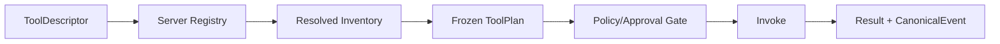
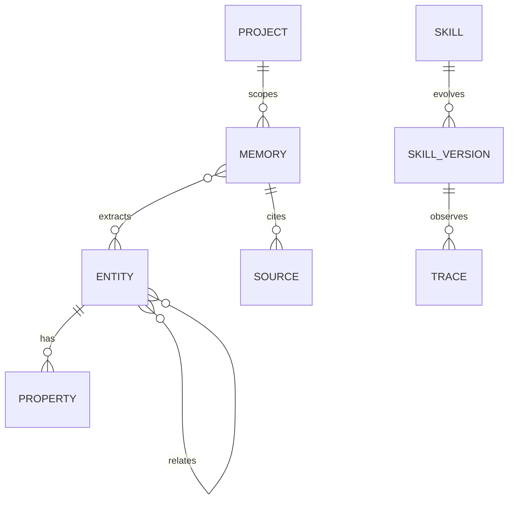

# 参考架构研究与采纳矩阵

## 1. intent-os-platform

### 1.1 真实分层

源码与权威文档呈现的可借鉴结构是：

```text
Foundation: intent-core / intent-toolkit / intent-auth
Infrastructure: intent-harness / intent-agents / intent-capability / intent-dispatch / container-manager / shell
Domain: agent-teams / memory / scenes / claw / flow / form / workbench / onboarding
App: service-core / service-runner
```

对应证据：`intent-os-platform/docs/design/architecture-guide.md`、`docs/architecture/arch-refactor-authoritative.md`、`sdk/intent-core`、`crates/domain`。

**采纳**：TencentDB 的 Web、Panel/BFF、Domain、Core、Infrastructure 单向依赖；将组装与领域决策分离。  
**不采纳**：AO 文档/代码有冲突，不用其“服务数量”和产品宣传图作为现状证据；不引入重型多进程运行时。

### 1.2 实体与关系

| 实体 | 作用 | TencentDB 映射 |
|---|---|---|
| Agent | 唯一执行原子，带 revision | `meta_agents` + AgentWorkspace |
| Team/Project/Task | 组织、协作、工作项 | 当前已有，补统一关系读模型 |
| EntryKind | 请求入口的正交分类 | `source_kind` / `entry_kind`，避免由 URL 猜执行语义 |
| RuntimeProfile | 一次执行生命周期 | Run 的 `profile` |
| Run/Attempt | 执行事实与重试尝试 | RunTrace/Run，需统一快照 |
| ToolPlan/ToolDescriptor | 工具授权冻结制品与六轴分类 | Tool source + approval policy |
| Scene/SceneRelease | 可版本化场景配方 | TencentDB 首期只做 Playbook/Scene 设计，不引擎化 |
| MemorySpace/MemoryItem | 记忆工作面与条目 | MemorySpace/L1 record |
| CanonicalEvent | 统一、分级、脱敏的事件账本 | Audit/Trace/Approval/Memory ledger |
| Approval | 调用前审批和裁决 | WriteApproval + 操作审批扩展 |

### 1.3 工具系统



关键原则：工具是“能做什么”，Skill 是“会什么”，MCP 是“连到哪里”；工具描述必须服务端拥有，未知工具默认拒绝；调用前先授权/审批，再产生副作用；事件载荷按脱敏等级持久化。

### 1.4 场景、意图、任务与“疾患”

AO 源码中 Scene 是 recipe（步骤、参数、能力引用、release），Task 是协作工作项，Run 是执行事实；四大 Scenario 多为产品分类，不应虚构成运行时实体。Intent/Plan 中间层在 AO 中有退役/零生产写入迹象。

因此 TencentDB 采用：

- `UserIntent`：只作为请求解析结果/可澄清槽位，不持久化成强实体；
- `Task`：跨会话业务工作项，必须有状态机；
- `Run`：一次执行事实；
- `Playbook/Scene`：可复用流程资产，带 draft/released/revoked；
- 用户所说的“疾患”按领域语义落为 `Problem/Issue`（问题/故障），与 Task、Diagnosis、Remediation 关联，不把“疾患”做平台通用核心实体。

### 1.5 审批与安全

采纳：身份策略 → 工具注册校验 → 调用前审批 → 原子认领 → 执行 → 终态；pending 可恢复；SSE 只暴露必要计数；未知能力 fail-closed；Secret 只引用不回显；审计事件带 trace/span/parent。

不采纳：AO 当前无完整审批 DSL/多级委托实现；其存在 SSRF、绑定越权和传播链断裂审计风险，必须做反例。

### 1.6 可观测

目标三面：

1. **事件账本**：控制、工具、审批、计划、终态事件，可断点回放；不落原始推理和敏感工具输出；
2. **Run/Attempt**：accepted → compiling → queued → running → approval_pending → terminal；
3. **工具取证**：tool、risk、decision、latency、session、turn、trace。

排障顺序固定为：事件白名单 → 审批记录 → 工具取证 → Run 终态，不翻服务日志猜。

## 2. MindMemOS

### 2.1 实际架构

源码模块：

```text
FastAPI API/Auth
  → API services/routes/mappers
  → pipelines(add/search/get/update/delete/feedback/dreaming/skill)
  → components(extractor/chunker/searcher/dreaming/feedback/skill)
  → infra(Qdrant + Neo4j + Kafka + optional ClickHouse/OTel)
  → LLM routers(chat/embedding/rerank)
```

证据：`MindMemOS/src/mindmemos/mindmemos/api/`、`pipelines/`、`components/`、`infra/`、`tests/`。

### 2.2 实体与关系

MindMemOS 的有效核心是 `Memory`、`Source`、`Entity`、`Property`、`Edge`、`SkillVersion`、`ProviderBinding`、`OperationRecord`；`project_id` 是租户/隔离上下文。不要把其宣传中的 Brain/MemorySpace/Agent 当成源码已有实体。



### 2.3 核心调用闭环

- `memory.add`：鉴权/project context → chunk/normalize → extraction/schema/embedding → safety/dedup → vector/graph/operation record；可同步或 Kafka 异步。
- `memory.search`：query normalize → lexical/vector/schema/entity recall → fusion/RRF → optional rerank → final filter → mapper；同一 project scope。
- `feedback`：显式/隐式信号 → query rewrite/search decision/action planner → update/delete/merge 等动作。
- `dreaming`：关系检测/action planning → 合并/归档/删除计划 → executor/operation record。
- `skills.evolve`：trace 聚合 → summary → draft/version → pending/review/evaluation；实际生命周期存在实现债，不能直接复制。

### 2.4 可借鉴与禁用

| 采纳 | 处理方式 |
|---|---|
| Provider/Router 可插拔 | 由配置选择，但解析失败显式告警/失败 |
| embedding + lexical + graph + rerank | 先建立 golden set，再调整排序 |
| chunking、dedup、entity/source provenance | 作为 MemoryCore 管线阶段，保留 scope 条件 |
| feedback/dreaming/skill 闭环 | 每一步可观测、可回滚、幂等 |
| OTel/ClickHouse 观测 | 只展示脱敏聚合，不把原始推理写入账本 |

禁用：只配置不接线；无锁非原子 evolve；异常静默吞掉；无 continuation 的扫描上限；skill 双真相源；跨 project 聚类。

## 3. my-tencentDB-Agent-memory

### 3.1 功能基线

蓝图 `MemoryPanel/web/src/routes/index.tsx` 与 `constants/menu.tsx` 提供：Workbench、Analytics、Wiki、Code、Skill、Chat Memory、Members、Agents、API Keys、Guide。蓝图 UI 采用 Tea Component、腾讯蓝/中性灰、高密度开发者控制台、列表/详情/抽屉、双列布局。

### 3.2 当前对账结论

依据 `refs/page-parity-audit.md`：后端路由没有删除；主要丢失是当前前端的 Analytics 整页、默认 Agent 模板 UI、Chat Memory L1 refresh；成员/Agent 页面已合并到 Team；当前新增 Project、MemorySpace、Code Analysis、Admin 等能力，但 Agent/Space 详情仍是骨架。

### 3.3 蓝图中必须保持的 UI 规则

- Tea Component 为组件源；语义色走 Tea token，不新增独立色板；主色蓝 `#2563eb`。
- 14px 基础字号、信息密度优先、ID/trace/请求体使用等宽字体。
- 页面采用 Header → Tab/Segment → 内容区；卡片轻边框、6px 圆角、弱阴影。
- 统一 loading/empty/error/denied/partial；不以颜色作为唯一状态表达。
- 1440 固定侧栏+主区；1024 上下文栏抽屉；768 侧栏折叠；320 单列。

## 4. 采纳决策

1. 采用 AO 的“唯一运行编译链、fail-closed、CanonicalEvent、审批前置、分层和 ratchet 门禁”。
2. 采用 MM 的“管线分层、Provider、source/entity provenance、feedback/dreaming、评测优先”。
3. 采用蓝图的“页面完整入口、功能直白、Tea 风格和兼容路由”。
4. 不接受任何没有源码/测试/运行证据的“已完成”结论。
