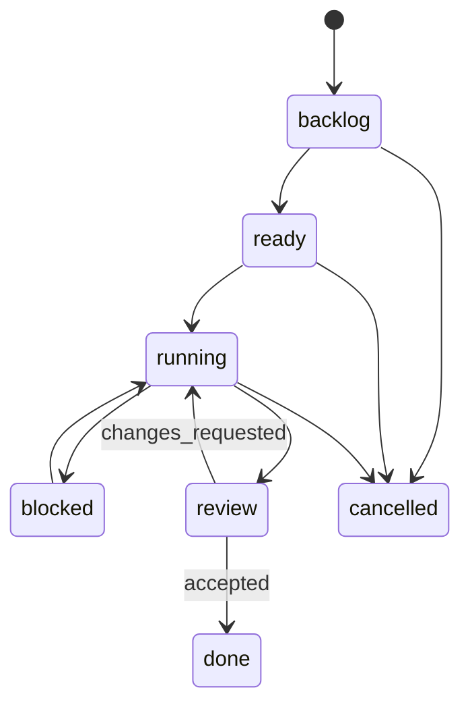
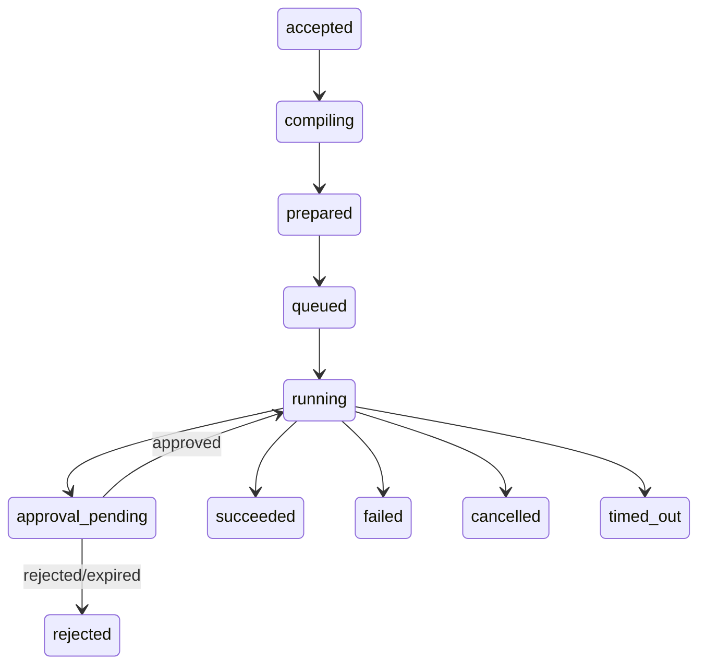

# 目标领域、契约与状态机详细设计

## 1. 聚合根与所有权

| 聚合根 | 标识 | 所有权/隔离 | 关键关系 |
|---|---|---|---|
| Team | `team_id` | 组织公共池 | members、projects、public assets |
| Project | `project_id` | 协作边界；成员可跨 Team | tasks、agents、assets、spaces、knowledge entries |
| Agent | `agent_id` + revision | owner user/team；服务端定义 | projects、fixed assets、spaces、runs |
| Task | `task_id` | project/team | declared agents、participants、runs、deliverables |
| Asset | `asset_id` + type/version | owner + visibility + ACL | project、agent mounts |
| MemorySpace | `space_id` | ownerType/user/team/project/agent/task + policy | memories、mounts |
| Memory | `memory_id` + version | 继承 space scope，带 provenance | source、lineage、superseded_by |
| Run | `run_id` + attempt | caller/scope/agent/task/project | execution bundle、events、approvals |

Team 是归属轴，Project 是协作轴，两者不可互相替代。读集合为：团队公共 ∪ 本人私有 ∪ 本人参与 Project；写入必须同时写 actor、owner、project/space、visibility 和 source。

## 2. 核心枚举

```ts
type Visibility = 'private' | 'team' | 'restricted';
type WorkspaceRole = 'owner' | 'manager' | 'member' | 'viewer';
type WritePolicy = 'automatic' | 'review_required' | 'explicit_only' | 'deny';
type MountSource = 'owner_default' | 'team_default' | 'project' | 'agent_fixed' | 'task' | 'scene';
type AssetType = 'skill' | 'wiki' | 'code_graph' | 'chat_memory';
type RunStatus =
  | 'accepted' | 'compiling' | 'prepared' | 'queued' | 'running'
  | 'approval_pending' | 'succeeded' | 'failed' | 'cancelled'
  | 'timed_out' | 'rejected';
type TaskStatus = 'backlog' | 'ready' | 'running' | 'blocked' | 'review' | 'done' | 'cancelled';
type ApprovalDecision = 'approved' | 'rejected' | 'expired' | 'cancelled';
```

未知 role 降为 viewer；未知 capability/operation deny；前端声明的审批级别不是权威。

## 3. 读模型契约

统一 envelope：

```ts
interface ApiEnvelope<T> {
  requestId: string;
  data: T;
  warnings?: Array<{ code: string; message: string; partial: boolean }>;
}
```

### 3.1 `POST /api/v1/project-workspace/overview`

输入：`{ projectId }`。输出：project、viewer permissions、成员/Agent/Task/Asset/Space/Run/Approval 计数、最近 Task/Run/Knowledge、partial warnings。

规则：计数只能基于 caller 可见集合；任一子系统失败只令对应段 partial；列表详情不放 overview；服务端并行聚合。

### 3.2 `POST /api/v1/agent-workspace/overview`

```ts
interface AgentWorkspaceOverview {
  agent: AgentSummary & { revision: string; model?: string; promptDigest?: string };
  viewer: { permissions: string[] };
  projects: ProjectSummary[];
  loadout: {
    accessible: { counts: Record<AssetType, number> };
    fixed: MountedAssetSummary[];
    spaces: SpaceMountSummary[];
    latestEffective?: ExecutionBundleSummary;
  };
  runs: { recent: RunSummary[]; failed: number };
  approvals: { pending: number };
  warnings: Warning[];
}
```

### 3.3 `POST /api/v1/task-workspace/detail`

输出 Task、Project、声明 Agent、实际参与者、依赖/阻塞、Run、Approval、Deliverable、Decision、相关 Memory provenance。所有列表分页，首屏只带 top N。

### 3.4 `POST /api/v1/governance/inbox`

输入支持 `teamId/projectId/agentId/taskId/type/status/cursor`；统一返回审批、失败 Run、安全告警、记忆冲突。每条必须提供 `subjectRef`、`reasonCode`、`risk`、`createdAt`、`actionSchema`，详情按独立 endpoint 拉取，列表不泄露敏感参数。

### 3.5 Memory Center

- `POST /api/v1/memory-center/list`：按 scope/domain/type/status/source/cursor 分页；
- `POST /api/v1/memory-center/search`：query + scope + topK + tokenBudget；
- `POST /api/v1/memory-center/explain`：返回 rank、各路得分、过滤原因、scope、lineage、source；
- `GET /api/v1/memory-spaces/:spaceId`：详情、policy、mount count、memory stats；
- `GET /api/v1/memory-spaces/:spaceId/mounts`：按 caller 可见分页。

## 4. 命令契约

所有命令字段：`actor` 从认证上下文得到，客户端不得伪造；请求需 `idempotencyKey`、`expectedVersion`（变更命令）、`reason`（治理动作）。

### 4.1 MemorySpace

- `POST /api/v1/memory-spaces/:id/mount` `{subjectType, subjectId, accessMode, expectedVersion}`
- `POST /api/v1/memory-spaces/:id/unmount` `{subjectType, subjectId, expectedVersion}`
- `POST /api/v1/memory-spaces/:id/policy/preview`：先返回受影响 Agent/Memory/Run 数；
- `POST /api/v1/memory-spaces/:id/policy/update`：收紧可直接执行；放宽需权限/审批。

### 4.2 显式记忆

- `remember`：`content/domain/spaceId/sourceRef/visibility`
- `correct`：`memoryId/expectedVersion/newContent/reason`，生成新版本并写 `superseded_by`
- `forget`：默认 archive；hard delete 仅合规权限且先 preview；
- `restore`：仅在来源/权限仍有效时恢复。

### 4.3 Approval

- 创建由服务端 policy gate 触发，模型和工具不可直接创建“已批准”记录；
- `claim` 原子占有 pending；
- `decide` 仅 caller/API 调用方，不能由产生请求的模型批准；
- 默认 120 秒超时自动拒绝；重启可从 pending snapshot 恢复；
- 副作用必须在 approved 事件持久化之后发生。

## 5. ExecutionBundle V2

```ts
interface ExecutionBundleV2 {
  bundleId: string;
  resolvedAt: string;
  context: { teamId?: string; projectId?: string; taskId?: string; userId: string };
  agent: { id: string; revision: string; model?: string };
  assets: Array<{
    assetId: string; type: AssetType; version?: string;
    accessSource: string; mountSource?: MountSource; injectionMode: 'index' | 'full' | 'tool';
  }>;
  spaces: Array<{ spaceId: string; source: MountSource; read: boolean; writePolicy: WritePolicy }>;
  skills: Array<{ name: string; version?: string; disclosure: 'index' | 'full' }>;
  tools: Array<{ name: string; descriptorRevision: string; approval: string }>;
  policyDecisions: Array<{ code: string; outcome: 'allow' | 'deny' | 'approval'; reason: string }>;
  sourceChain: Array<{ kind: string; id: string; revision?: string }>;
}
```

`bundleId` 由规范化内容稳定 hash 生成；Run 必须固化 bundle 或 revision；resolver 是本轮生效配置唯一入口，禁止各页面/adapter 自拼。

## 6. 状态机

### 6.1 Task



每次转换校验角色、expectedVersion、阻塞理由和审计；状态不可由“最近 12 小时有活动”推断。

### 6.2 Run



### 6.3 Memory

`active → superseded/archive/quarantined`；纠错用 `superseded_by` 自引用，不把取代压成普通状态；替代者被删除时按约束恢复旧项或进入人工复核。Dreaming 的 merge/archive/delete 必须幂等、scope 同源、失败不标完成。

## 7. Schema 方向（仅设计）

新增/演进优先关系表，不把数组继续塞 JSON：`agent_projects`、`memory_space_mounts`、`run_bundle_snapshots`、`memory_versions`、`memory_edges`、`approval_events`。迁移只增不改，旧单值列保持双写观测期；切读后再单独评审清理。具体 DDL 沿用 `.specs/redesign/04-SCHEMA.md`，但以本契约的字段和状态机为约束。
