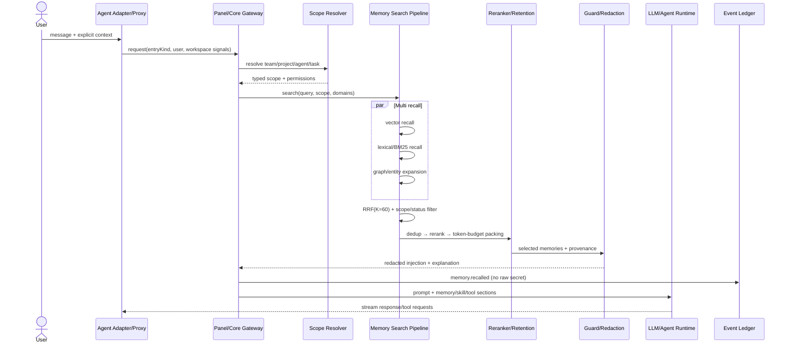
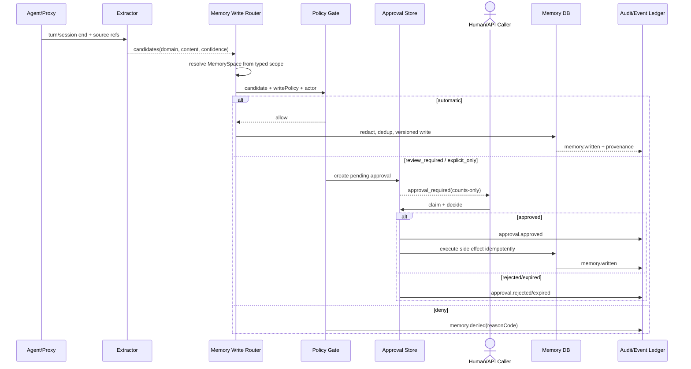
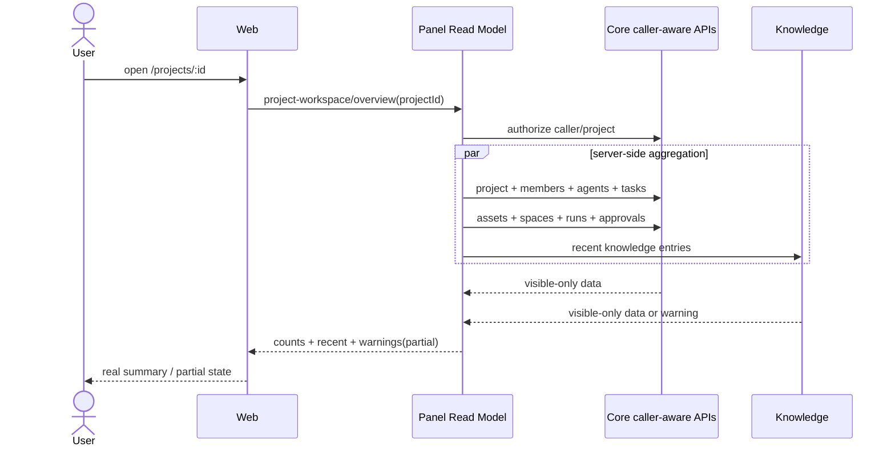
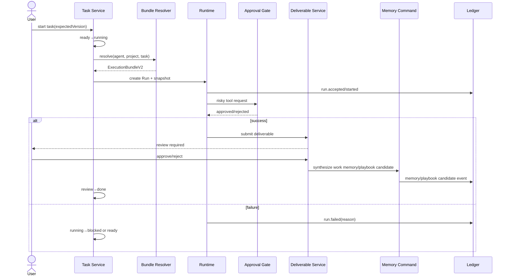
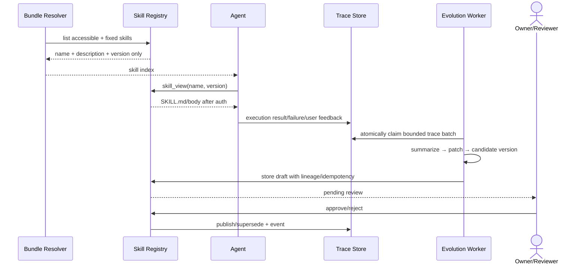
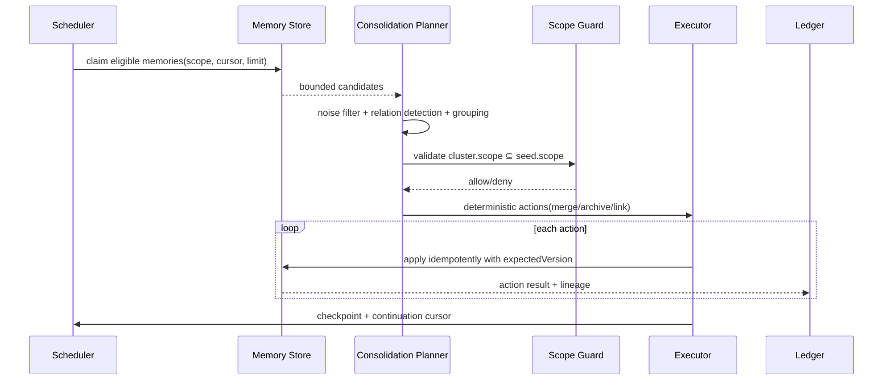
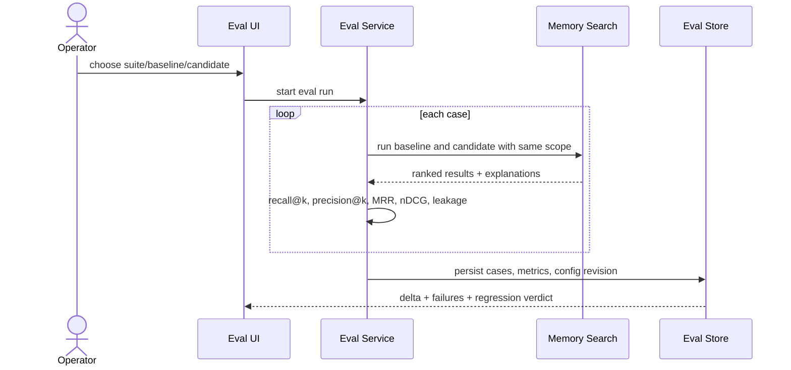
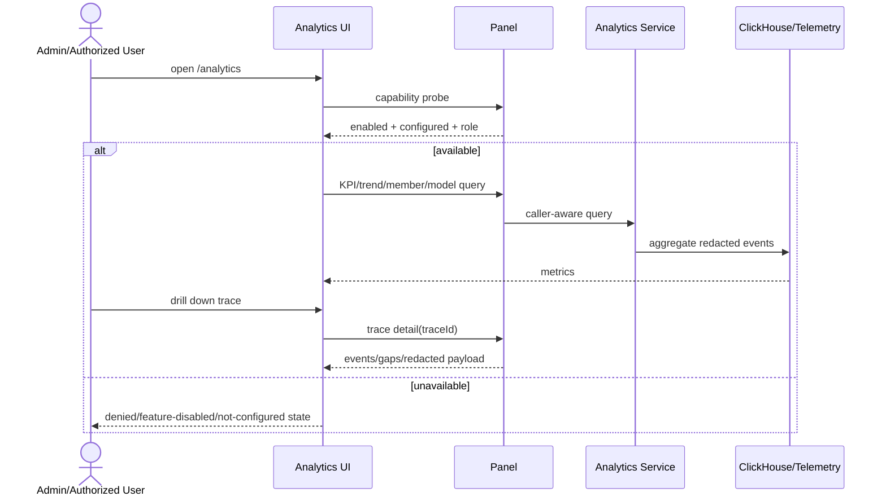

# 核心调用时序详细设计

## 1. Agent 请求、召回与注入

硬约束：scope 解析和可见性过滤只有一条生产路径；graph、vector、keyword 的过滤语义一致；低相关结果拒绝注入；原始推理不进账本。

## 2. 对话写入与审批

## 3. Project 工作区首屏

不得由浏览器进行 6-N 个接口 fan-out；任何 count 也必须经过权限过滤。

## 4. Task → Run → Deliverable → Memory

## 5. Skill 渐进披露与演进

要求：Skill 不新增 callable；完整内容按需加载；claim/consume 原子、有锁、可续扫；失败不丢 trace；单一正文真相源。

## 6. Dreaming 离线巩固

确定性 archive/关系先行；LLM 无法判断则不操作；任何异常短路且保留 checkpoint；目标侧再次校验写权限。

## 7. 记忆检索评测

scope leakage 必须为 0；算法改动必须在 golden set 建立后进行；配置 revision 和数据集 revision 必须可追溯。

## 8. Analytics/Trace 下钻

Analytics 与 Code Analysis 是不同域：前者是线上调用、成本、成员、模型、trace 的可观测；后者是代码仓库分析。导航和术语不得混用。
