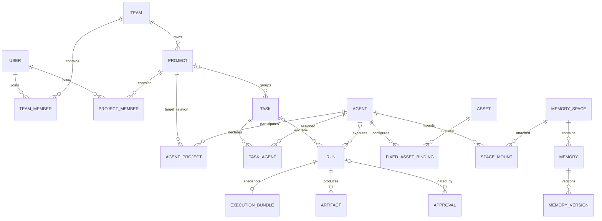
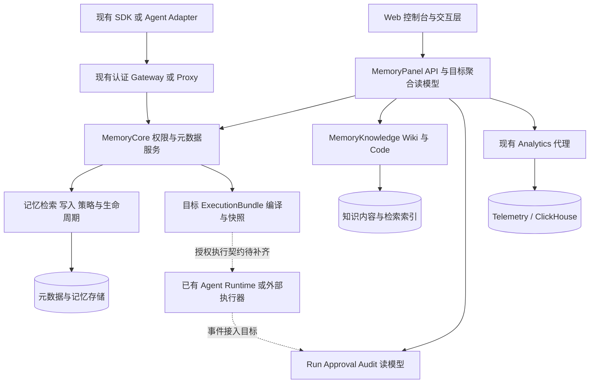
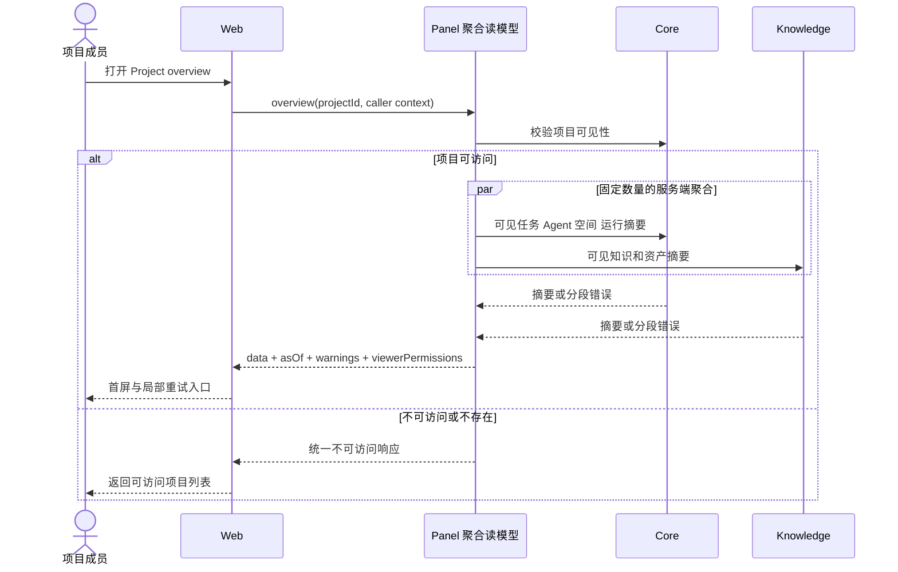
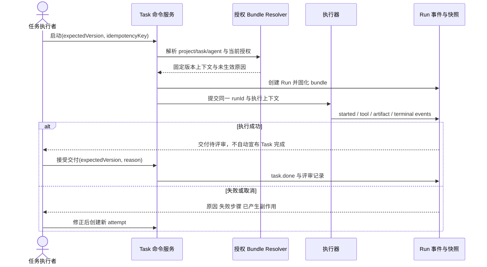
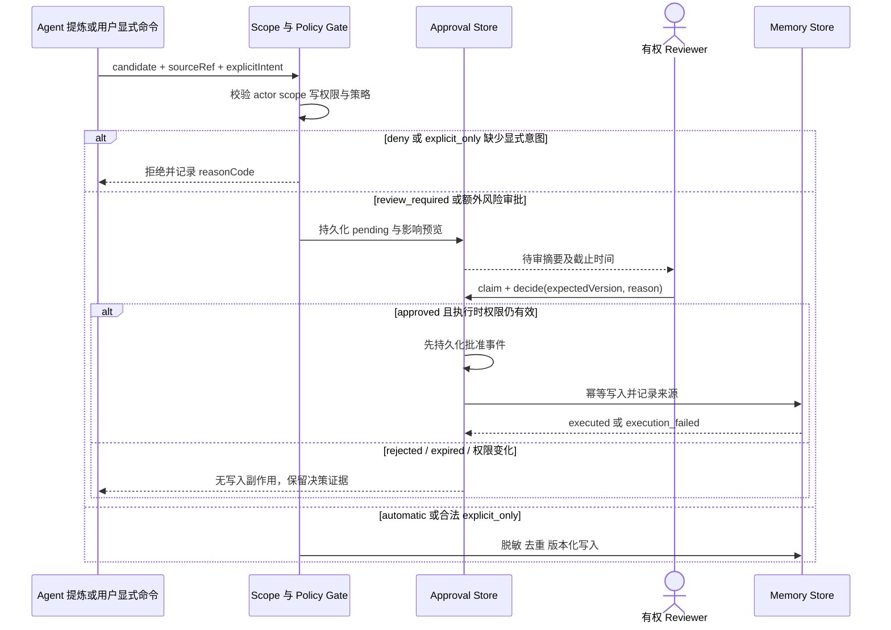

# TencentDB Agent Memory 产品设计文档 V3

> 版本：V3 评审稿 · 2026-09-11 · **本轮仅设计，不修改业务代码，不执行迁移。**  
> 配套单文件文档与交互原型：[`product-design-v3.html`](./product-design-v3.html)；旧版 [`product-prototype.html`](./product-prototype.html) 保留原内容与布局，完成深链、点击和焦点修复后独立保留。  
> 事实依据：本次本地源码静态检查；未启动服务验证接口，文中的“可复用”不等于端到端已验收。

## 0. 阅读方式与事实口径

- 第一次了解产品：读 §1 定位、§2 核心概念、§3 布局，再从原型工作台进入一个项目。
- 业务用户：直接读 §5 首次使用和 §6 逐模块指南；不需要先理解部署、数据库或算法参数。
- 研发与测试：读 §4 架构、§7 交互、§8 权限、§9 状态、§10 契约与 §12 验收。
- 评审人：重点检查“为什么这样组织”“哪些依赖后端”“旧能力如何保留”；证据索引见 §13。
- `现存-可复用`：已检查到相关源码/调用；`恢复`：历史材料提出恢复且当前仍有底层入口；`待契约`：需要读模型、权限或命令补齐；`目标态`：设计体验；`建议`：尚未进入承诺范围。
- 本文所有未明确标注为现状的交互、状态机、接口扩展、性能门槛均为**目标规格**；原型数据、图表、表单结果与审批决策均为演示，不证明后台能力已完成。
- V1/V2 是历史设计意图，不继承其完成度；遇到冲突，以本轮源码证据说明差异，不在本轮修改历史材料。

### 0.1 配套原型的模拟范围与实现边界

- 配套 HTML 的交互范围为 24 个 page key、66 个页面与 Tab 视图、跨对象抽屉、筛选分页、8 种演示状态、角色切换与明暗主题；默认进入文档模式，按本文二级标题组织章节。
- create task、remember、correct、archive、approve、reject 仅修改浏览器内的演示状态；archive 不删除真实文件或数据，刷新/重置后的持久性以原型说明为准。
- 策略、默认模板、API Key 与成员邀请仅提供**预览及演示审计**，不会配置真实服务、创建密钥或发送邀请；本文后续描述的正式提交、验权和持久化均是未来实现规格。
- Graph 为示例关系图，不是完整图谱引擎；Analytics 使用固定虚构指标，筛选交互不证明存在实时查询；列表中的样本 Run 不是完整的 128 条运行明细，汇总与可浏览样本需分别标识。
- 文档、架构图和时序图以内嵌内容、离线示意图或 Mermaid 源码承载，不要求访问外部渲染服务；原型角色切换与审计条目只帮助评审体验，不等于生产鉴权或不可篡改审计。
- 这些是原型范围约定，不是本 Markdown 编辑任务对 HTML 浏览器测试的通过声明；最终实际可交互范围以主交付方的测试证据为准。

## 1. 产品全景：帮团队把执行经验变成可信的共享记忆

### 1.1 定位、问题与边界

TencentDB Agent Memory 是面向团队协作 Agent 的记忆与知识控制面：**Project 是工作现场，Task 是目标，Agent 是执行主体，MemorySpace 是记忆归属与策略边界，Run 是执行事实。** 用户能从任务找到运行、从运行找到本轮上下文、从记忆回溯来源，再由审批、审计和评测判断是否应长期复用。
当前问题不是缺少更多菜单，而是已有对象被分散在资源页和团队详情中：用户难以回答“下一步做什么”“这个 Agent 为什么记得这件事”“更改会影响谁”。Agent 与空间详情仍有占位，不能靠换导航解决。[E1–E4]
本次设计优先连通“选择项目 → 明确任务 → 检查 Agent 装配 → 查看运行 → 评审交付 → 沉淀记忆”，并保留 Wiki、Code、Skill、Chat Memory 的专业操作。
**不做**通用 Agent OS、另建 Scene/Flow 重型运行时、替换现有执行器、重写检索算法、把本地试调包装为生产业务；也不把原型做成真实管理后台。

### 1.2 用户、工作动机与入口

| 用户角色 | 要完成的工作 | 当前痛点 / 频率假设 | 首要入口与完成证据 |
|---|---|---|---|
| 项目负责人 | 分配任务、判断阻塞、验收交付 | 每日查看，多页拼上下文 | Project → Task；交付评审与状态变更有记录 |
| 项目成员 / Agent 使用者 | 找到可信知识，让 Agent 完成具体任务 | 高频使用，不知道资产是否真正注入 | Task、Agent、Memory；Run 能解释实际使用版本 |
| 知识维护者 | 导入资料、纠正过期结论、复用 Skill | 每周或知识变更时；担心误覆盖 | Assets、Wiki、Code、Skill、Memory；有来源和版本 |
| Reviewer / 安全审阅者 | 决定风险写入，回溯异常 | 事件触发；缺少审批影响上下文 | Governance；决策理由、操作者和副作用结果可追溯 |
| 平台管理员 | 管成员、密钥、模型连接与线上用量 | 配置变更 / 排障时；管理入口隐蔽 | Team、Settings、Analytics；权限与连接状态可解释 |

以上频率为设计假设，未进行用户访谈或线上埋点分析；不得把角色画像写成已验证的用户研究。

### 1.3 能力地图与目标指标

| 工作域 | 能力与对象 | 用户收益 | 建议验收目标（尚无基线） |
|---|---|---|---|
| 工作 | Home / Project / Task | 找到需处理事项而非阅读全量统计 | 首次使用者 5 分钟内找到一个阻塞任务及原因 |
| 协作 | Agent / Orchestration / Run | 区分配置意图与执行证据 | 从任务到本轮上下文不超过 3 次对象跳转 |
| 知识与记忆 | Memory / Space / Asset / Wiki / Code / Skill | 复用有出处的知识，纠错可控 | 详情中来源、范围、版本、状态缺失时明确说明 |
| 治理 | Approval / Permissions / Audit / Eval | 风险动作有人审、出了问题可追 | 越权详情与存在性计数泄露均为 0 |
| 组织与观测 | Team / Settings / Analytics | 配置可管理，线上问题可定位 | 未配置、无权限、无数据三类反馈可明确区分 |

测量采用固定脚本的可用性走查、权限负例与请求记录；不能用演示数据算业务转化率。上线后再建立任务完成耗时、审批等待时间、检索有用率与失败定位耗时基线。

## 2. 核心概念与对象关系

### 2.1 对象字典：归属、配置、事实分开

| 对象 | 是什么 / 关键字段 | 与其他对象的关系及设计边界 |
|---|---|---|
| Team 团队 | 组织归属与公共资产池，`team_id` | 不等于 Project；团队成员与项目成员分别授权 |
| Project 项目 | 持续协作现场，名称、owner、visibility、代码锚点 | 一个主 Team，成员可跨 Team；汇集任务、Agent、资产与知识条目 |
| Task 任务 | 可验收的工作目标，目标、负责人、状态、风险、完成条件 | 可归入 Project；声明 Agent 与实际参与者分开；一次任务可有多次 Run |
| Agent | 有 owner 的执行配置，prompt、模型引用、资产装配 | 当前 `project_id` 单值；多项目关系是目标态，首期表单不承诺多选 |
| AgentTeam / Automation | Agent 协作组 / 触发配置 | 属于编排，不是组织 Team；现有配置 CRUD 不等于已具备完整调度控制台 |
| Asset 资产 | 可复用知识/能力入口，类型、版本、owner、visibility、内容引用 | 当前类型 `skill / llm_wiki / code_graph / chat_memory`；统一目录不合并专属编辑器 |
| MemorySpace 记忆空间 | `(ownerType, ownerId, domain)` 的容器及策略基线 | owner 可为 user/team/project/agent/task；挂载关系与空间本体不能混为一行 |
| Memory 记忆 | 可检索的事实、偏好、方法、任务或产出描述 | 有来源、scope、版本和生命周期；不是所有 Asset 的统称 |
| Run 运行 | 某次执行尝试及当时事实，agent/task、状态、时间、bundle | 当前 RunTrace 以摘要和 `trace_json` 为主；不可推断已存结构化事件与完整快照 |
| Artifact / KnowledgeEntry | 交付物 / 决策、规范等协作知识 | 交付不自动等于 Asset；先评审，再显式生成记忆或资产候选 |
| Approval / Audit / Eval | 风险决策 / 操作证据 / 质量比较 | 审批通过不代表执行成功；审计不是聊天；评测不是实时用量图 |

### 2.2 可访问 ≠ 固定装配 ≠ 本轮生效

1. **可访问 accessible**：当前主体在指定上下文下被允许读取/使用的候选集，由身份、归属、visibility、ACL 共同决定；`read` 与 `use` 权限也要区分。
2. **固定装配 mounted / fixed**：Agent 默认携带的资产与挂载空间，是配置意图；移除装配不删除资产，不撤销他人的权限。
3. **本轮生效 effective**：特定 Run 经 scope、版本、策略、任务选择和预算解析后的有效上下文；必须显示 `runId / bundleId / resolvedAt`，无 Run 时显示“尚无运行快照”。
4. 生效不能被简化为固定装配的子集：Task 临时选择、Project 默认来源也可能进入执行包；固定装配可能因权限撤销、版本过期或策略而未生效。服务端授权是所有路径的必要条件。
5. “进入执行包”“获得召回候选资格”“被检索命中”“正文实际注入”再分标签；Skill 仅注入索引时，不能写成正文已读。没有遥测只能显示“未记录”，不能显示“未使用”。
6. 当前 `assetsApi.listAccessible` 查询的是当前用户可访问集合，`agent_id` 参数还会筛固定绑定；不能直接把它当 Agent 的完整候选权限判定。目标 Agent 读模型需显式区分 `viewer` 与 `subjectAgent`。[E5]

### 2.3 记忆的四个独立维度

- **层级**：沿用界面术语 L0 对话原文、L1 原子记忆、L2 场景记忆、L3 核心记忆；层级不是权限级别，也不保证高层永远更可信。[E14]
- **内容域 domain**：例如 semantic、procedural、preference、instruction、rule；空间以域表达内容侧重，不能从 domain 推断调用者拥有权限。
- **范围 scope**：谁拥有、谁可访问、在哪个项目/任务使用；筛选范围是用户查看条件，不是给服务端追加授权。
- **写策略**：`automatic` 允许系统总结写入；`review_required` 先审后写；`explicit_only` 只接受有权用户的明确写入意图，自动提炼不能借审批绕过；`deny` 拒绝。当前规则已有纯逻辑依据。[E10]
- **纠错语义**：目标采用新版本替代旧版本并保留 `supersededBy`；“忘记”默认为归档、停止未来召回，不承诺擦除已生成的历史输出。硬删除另走合规方案，本原型不提供真实删除。

### 2.4 目标关系图（不代表迁移已经落库）

图中多项目关系、结构化 Artifact、运行快照是目标；历史 Run 可以没有 Task、Agent 或快照。Memory 来源需允许 Conversation/Message/Task/Run 引用，缺失来源的旧记录保留“历史来源未记录”，不得补造关联。

## 3. 信息架构与页面布局

### 3.1 导航原则与完整路由清单

侧栏按工作心智分组，一级入口保留可发现性，详情不占一级菜单。以下为**原型 route key**，不是现有业务 API；未来生产 URL 的实体 ID 不由页面标题生成。

| 分组 | 原型路由 | 页面职责 / 二级 Tab |
|---|---|---|
| 工作 | `home` | 工作台：待处理、最近项目/任务、运行异常 |
| 工作 | `projects` → `project` | 项目列表 → `overview / tasks / agents / assets / memory / activity / runs / settings` |
| 工作 | `tasks` → `task` | 全局任务列表 → `overview / plan / runs / artifacts` |
| 协作 | `agents` → `agent` | Agent 列表 → `overview / projects / assembly / memory / runs / policy / versions` |
| 协作 | `orchestration` | Agent 编排：协作组、成员、自动化触发配置 |
| 协作 | `runs` → `run` | 运行列表 → `timeline / context / tools / artifacts` |
| 知识与记忆 | `memory` | 跨来源记忆浏览、检索试调、显式管理 |
| 知识与记忆 | `spaces` → `space` | 空间列表 → `overview / memories / mounts / policy` |
| 知识与记忆 | `assets` → `asset` | 统一资产目录 → 元数据、权限、装配引用、专业入口 |
| 知识与记忆 | `wiki` / `code` / `analysis` | Wiki 内容工作台 / Code 来源管理 / 代码分析与图谱 |
| 知识与记忆 | `skills` → `skill` | Skill 目录 → 正文、版本、来源与使用关系 |
| 治理 | `governance` | `approvals / permissions / audit / evals` |
| 治理 | `analytics` | 线上调用情况：调用概况、模型用量；不是代码分析 |
| 组织 | `team` | 团队归属、成员摘要、工作规范及管理入口 |
| 组织 | `settings` | `members / keys / models / connections` |

Project 保留常用 Tab 与专业 Tab：overview/tasks/agents/memory/activity 服务日常协作，assets/runs/settings 承载资产、运行与项目设置；概览快捷入口和详情 Tab 指向同一对象集合，跨全局列表跳转时继续携带 Project 筛选。
Agent 保留 overview/projects/assembly/memory/runs/policy/versions：概览给摘要，projects、policy、versions 提供专业关系与解释视图；原型的策略、版本展示不代表真实更新或 revision 存储已经实现。Governance 不再内嵌第二套 Run 控制台，只链接 `runs/run`。

### 3.2 桌面布局与视觉约束

- 保留现有 Tea Component、腾讯蓝主强调、中性灰底、细边框与高信息密度；生产实现从既有 Tea token 取色，原型蓝色可采用 V2 的 `#2563eb`，不另加营销渐变。[E15]
- 全局层：顶部实例/团队与用户区、使用指南入口；左侧分组导航；内容层：面包屑 → 对象页头 → Tab → 筛选 → 内容；不存在同时竞争的第二套全局上下文选择器。
- 参考尺寸：顶部 52–56px、侧栏 224px、内容边距 24px、表格行高 44px、正文 14px；桌面详情默认主内容与关系摘要 2:1，卡片圆角 6px。
- 工作台首屏优先“待我审批 / 阻塞任务 / 最近运行”，数量卡可点击且带统计范围；项目与 Agent 不使用大面积装饰图替代关系表。
- 表格左列为对象名/状态，右列固定操作；ID、traceId、bundleId、版本使用等宽；长内容摘要截断但提供键盘可达的完整内容入口。
- 原型有“文档 / 原型”双模式：文档目录负责解释，原型侧栏负责操作；原型切换模式默认回到首页，不承诺模式间保留当前对象；可通过浏览器前进后退恢复历史视图。所有页面持续提示“演示数据，不连接后端”。

### 3.3 上下文、深链与响应式

- 生产目标 URL 示例：`/projects/:id/overview`、`/agents/:id/assembly`、`/tasks/:id/runs`、`/runs/:id/context`；原型用 hash 保存 route、实体与 Tab，具体编码以配套 HTML 实现为准。
- URL 是可分享上下文与筛选的权威；本地存储只记最近默认值。切 Team 后验证 Project，再验证 Agent/Task；无效下游清除并解释，不静默显示其他团队同名对象。
- 多对象打开以 `route + entityId + tab` 区分；不得沿用仅按 PageId 标识实体详情的逻辑；返回列表恢复筛选、页码与滚动位置。[E16]
- 1440/1024px 为常规桌面；768px 侧栏收起、详情单列；320px 筛选折叠、抽屉全屏、局部表格横向滚动，页面本身无意外水平溢出。

## 4. 系统架构与职责边界

Web 只通过 Panel 获取浏览器所需数据，不携带 Core 管理密钥；SDK/Adapter 沿用其已有认证接入，不能因 V2 的简图就要求所有客户端改走 BFF。此图是职责图，不新增部署服务。
Panel 聚合 Project/Agent/Task/Governance 首屏，透传调用者身份与权限结果，不复制 Core 的权限裁决；Knowledge 专业请求仍保留独立 client 和工作台。
Core 是 scope、命令授权、写策略与版本冲突的权威；当前 `resolveExecutionBundle` 是确定性纯函数，不读库、不掌握授权和终态，目标完整编译需额外的 caller-aware 编排与持久化。[E9]
Run 回放消费事实事件，不由浏览器根据卡片颜色推状态；Analytics 读取线上遥测，与 Code 的语义检索、依赖图谱和影响分析独立。连接不可用时显式失败，不能偷偷换模型/数据源。

## 5. 用户工作流与核心时序

### 5.1 首次使用与闭环导航

1. 登录并确认实例/Team；若尚无可访问项目，展示创建权限说明或申请加入，不展示虚构的“0 个任务完成率”。
2. 进入 Project，阅读目标与成员；从已有资产选择 Wiki/Code/Skill，再选择 Agent。第一期缺少多项目关系时仅允许当前单项目选择。
3. 新建 Task，填写目标、验收标准、风险与声明 Agent；检查执行包预览。无执行契约时按钮标“演示启动 / 待接执行”，不能伪装发起生产 Run。
4. 查看 Run 时间线、上下文、工具与产物；遇到审批转入 Governance，决策后回到原 Run；失败保留同一证据链并允许创建新尝试。
5. 项目负责人评审交付，接受后 Task 进入 done；“沉淀为记忆”仍需选择 Space、来源与写策略，不能因任务完成就自动公开。

### 5.2 Project 首屏：少请求但不绕权限（目标）

浏览器首屏目标最多 3 个业务请求，不随列表行数增加；失败段显示“暂不可用”而不是 0，其他段继续可用。详情列表独立分页；统计必须说明“当前可见、当前筛选、截至何时”。

### 5.3 Task → Run → 上下文 → 交付（目标）

启动校验失败不产生假 running；响应丢失先查幂等结果再允许重试；用户取消需要服务端确认，不能仅停止动画。旧 Run 无上下文快照时提供摘要回放，不拿 Agent 当前装配补成历史事实。

### 5.4 写入策略与审批（目标）

审批超时采用 V2 的 120 秒候选默认值，正式实现需返回服务端 `expiresAt` 并评审适用范围；UI 倒计时不是裁决权威。产出请求的模型不得自批，批准记录与副作用结果分别展示。

### 5.5 记忆诊断与质量回路

- 诊断召回：选择 Agent/Project/Task → 输入问题与预算 → 服务端按同一 scope 检索 → 显示命中、过滤、排序与最终注入摘要 → 关联 Memory 来源；不得展示无权候选正文来“解释过滤”。
- 纠错：来源抽屉 → 纠正内容与原因 → 比较版本和影响 → 按策略写入/待审 → 旧版本标替代；并发冲突保留草稿供人工合并。
- Skill 演进与 Dreaming 为后期目标：运行反馈生成候选版本或合并计划，需有来源、权限、幂等与复核；纯函数试调留在诊断区域，不提供“一键优化全部”承诺。
- Eval 固定同一数据集/配置版本比较 recall@k、MRR、nDCG 与 scope leakage；Analytics 只帮助发现异常时段，再下钻关联 Run/trace，两者不是同一种质量证据。

## 6. 使用指南：逐模块能做什么、如何操作、为什么

本节是目标用户操作手册；各模块“边界”明确指出当前证据与待补能力。演示原型只模拟交互结果，不发真实命令。

### 6.1 工作台 `home`
- **能做什么**：找到待我审批、阻塞任务、失败运行、最近项目；指标限定当前可见范围，提醒按风险和等待时间排序。
- **如何操作**：确认 Team/Project 范围 → 选一条待办 → 打开对象抽屉 → “进入工作区”；“新建任务”先选 Project，保留来源上下文。
- **为什么**：默认页应帮助用户继续工作，而不是再复制一张资产统计大屏。
- **边界**：现有路由默认是 Workbench；跨对象待办聚合为待契约。无待办与待办服务失败必须是两种状态。[E1]

### 6.2 项目列表与工作区 `projects / project`
- **能做什么**：按名称、角色、visibility 筛项目；overview 看目标与摘要，tasks 看执行，agents 看参与者，assets 看关联资产，memory 看范围，activity 看决策与变更，runs 看运行，settings 看项目设置预览。
- **如何操作**：创建项目填写名称/主团队/可见范围/描述，可选仓库锚点 → 进入概览 → 添加成员或关联资产 → 从任务 Tab 新建 Task；成员管理抽屉只对有权用户开放。
- **为什么**：把持续工作上下文放在 Project，而不是要求用户先理解 Team 的八个管理 Tab；overview 中的资产/运行快捷入口带相同筛选跳转。
- **边界**：Project CRUD/成员接口存在，记忆 Tab 是骨架；目标 overview、活动聚合与项目空间详情必须先补契约，不把接口失败当“没有记忆”。[E2、E3]

### 6.3 任务列表与详情 `tasks / task`
- **能做什么**：筛 Project、状态、风险、负责人；overview 显示目标/声明与实际参与，plan 显示步骤与阻塞，runs 显示尝试，artifacts 显示交付评审。
- **如何操作**：填写标题、描述、验收标准、Agent 与风险 → 保存草稿/准备启动 → 查看计划 → 启动并跟踪 Run → 接受或退回交付；变更状态时说明理由。
- **为什么**：Task 代表承诺结果，Run 代表一次尝试，失败重试不应重复造任务，也不应把“运行成功”直接当“业务验收通过”。
- **边界**：现有前端 Task 状态只有 running/completed，create 缺 project 字段；计划、验收与完整状态机是目标。声明 Agent 和 ParticipationLog 已有分离证据，保留此语义。[E6]

### 6.4 Agent 列表与工作区 `agents / agent`
- **能做什么**：筛 owner/Project/状态；overview 看职责和归属，projects 看项目关系，assembly 看三层装配，memory 看空间，runs 看历史，policy 看策略预览，versions 看版本示例；当前配置与历史快照明确分区，未实现部分仍标目标态。
- **如何操作**：新建名称、职责、可见性 → 在 assembly 从有 use 权限的候选资产选择固定装配 → 确认作用范围 → 用“预览下一次运行”检查策略；历史 effective 必须先选择 Run。
- **为什么**：用户既要知道“默认带什么”，也要知道“为什么这次没带”；预览不能覆盖运行事实，修改装配只影响未来解析。
- **边界**：get、固定资产 get/set 存在；详情本身仍为占位；默认模板 get/set 已有 client，恢复入口仅限 system_admin。当前单项目字段不等于多项目功能已完成。[E4、E5]

### 6.5 Agent 编排 `orchestration`
- **能做什么**：维护协作组、角色与成员，查看自动化触发配置和关联运行；Team 组织、AgentTeam 协作组使用不同名称与图标。
- **如何操作**：新建协作组 → 选择已有 Agent 并指定职责 → 添加触发配置 → 检查目标和权限 → 保存演示配置；“预览执行”展示依赖而不启动真实任务。
- **为什么**：将执行协作从组织成员管理剥离，避免管理员误以为加团队成员就是装配多 Agent 流程。
- **边界**：AgentTeam/Automation 组件已有 list/create/member 操作；可视 DAG、冲突校验、调度重试与暂停语义为建议扩展，不声称当前已存在。[E7]

### 6.6 记忆中心 `memory`
- **能做什么**：统一浏览、搜索、纠错与来源追溯；保留 Chat Memory L0–L3 工作视角；筛范围、domain、层级、来源和状态，支持检索试调入口。
- **如何操作**：先选范围再搜索 → 打开记忆抽屉查看来源/版本 → 选择“纠正”或“归档预览” → 填原因并确认；导入时选来源与目标 Agent/Space，不默认公开。
- **为什么**：用户先关心“记住了什么、为什么记住”，再看算法；搜索试调必须显示当前上下文与预算，避免不同 scope 的结果被误比较。
- **边界**：ChatMemory 的分层查询、搜索、导入和分配已有调用；统一 MemoryCenter、召回解释、版本化显式命令待契约。L0/L1 时间过滤不能套到 L2/L3 聚合产物上；L1 刷新按历史恢复项单独验收。[E8、E14]

### 6.7 记忆空间 `spaces / space`
- **能做什么**：按 ownerType/domain/策略筛选；overview 解释边界，memories 看内容，mounts 看使用关系，policy 看写策略与影响。
- **如何操作**：打开空间 → 确认拥有者与域 → 挂载到有权 Agent → 选择读写模式 → 预览未来影响；策略变更先显示受影响 Agent/记忆数量，再提交。
- **为什么**：空间是共享与治理边界，不是另一个装满文件的文件夹；撤销挂载与删除内容必须是两个动作。
- **边界**：当前 spaceList 返回 AgentSpace 挂载行，不是完整空间目录；去重不能用来冒充独立空间数量。get/mount/unmount/policy 更新待契约；策略放宽为建议且默认关闭。[E4、E9、E10]

### 6.8 资产目录与详情 `assets / asset`
- **能做什么**：统一查看 Skill、Wiki、CodeGraph、ChatMemory 的元数据、可见范围、版本和引用；按类型、owner、Project、状态筛选。
- **如何操作**：搜索资产 → 查看详情及“可访问原因” → 选择专业工作台或分配给 Agent；绑定前检查 use 权限，完成后只标“固定装配”，不标“本轮已使用”。
- **为什么**：统一的是发现、权限和关系，不能用一张通用文本编辑表单替代四种资产工作流。
- **边界**：底层类型继续使用 `llm_wiki`，展示名可叫 Wiki；Skill fork 与知识 allocate 保留专属语义；现有物理删除 client 不在原型调用。[E5、E13]

### 6.9 Wiki `wiki`
- **能做什么**：管理知识来源、内容预览、搜索问答与知识关系，显示处理状态和引用来源；专业内容页保留左右分栏。
- **如何操作**：选择来源/导入 → 等待解析完成 → 查内容或提问 → 从引用回到原文 → 需要复用时回资产关系区装配。
- **为什么**：知识可信度取决于出处和处理状态，不是仅显示“导入成功”；同步失败不能丢掉最后可用版本。
- **边界**：沿用 WikiSourcesPanel/useWikiSources 的来源和内容能力；统一版本锁定、Run 级引用关系仍待契约。[E17]

### 6.10 Code 与代码分析 `code / analysis`
- **能做什么**：Code 管仓库/分支/同步来源；analysis 做代码搜索、探索、分析与图谱，选择同一 codeGraphId 下钻，明确仓库 revision。
- **如何操作**：在 Code 登记仓库并同步 → 检查索引状态 → “进入代码分析” → 在分析/图谱间切换 → 打开文件/符号引用；失败重试保留已可用索引。
- **为什么**：来源生命周期与分析任务不同，保留两个入口但共享资产引用；不再引入第二个一级 CodeGraph 目录。
- **边界**：当前 `CodeAnalysisRepoPage` 已通过 `CodeGraphPage fixedCgId embedded` 接入图谱，不能沿用历史“整页孤儿无入口”结论；剩余子组件是否全接通需逐项实现验收。[E11、E17]

### 6.11 Skill `skills / skill`
- **能做什么**：查看技能说明/正文/来源、导入导出、fork 给 Agent；目标补充版本、演进候选与运行引用，区分目录索引披露和正文加载。
- **如何操作**：查看适用任务和依赖 → 读正文 → fork 或选择固定版本 → 检查 Agent 装配；候选更新先看差异与评测，再由有权人发布。
- **为什么**：技能是可复用操作知识，不等于新增工具 callable；自动演进不能悄悄覆盖正在使用的稳定版本。
- **边界**：已有 Skill 专业面板与导入/fork/export 组件；完整演进闭环、版本快照和发布审批属于目标，不从 transition 纯函数推导已具备发布服务。[E8、E17]

### 6.12 运行列表与回放 `runs / run`
- **能做什么**：按 Agent/Task/Project/状态/时间找运行；timeline 看事件，context 看有效快照，tools 看调用摘要/审批，artifacts 看产物。
- **如何操作**：从 Task 或 Analytics 打开 Run → 选失败事件 → 查看工具参数脱敏摘要及前置审批 → 查看当时上下文；重试创建新 attempt，不覆盖历史 Run。
- **为什么**：异常定位需要因果链，不是整段 JSON；“回放”是读事件，不会再次执行工具。
- **边界**：现有 RunTrace get/list 与 trace_json 可复用；list 尚无 task/project 筛选，结构化 timeline、流恢复、快照和安全重试需新增契约。[E12]

### 6.13 治理 `governance`
- **能做什么**：approvals 处理待审写入；permissions 查角色和授权；audit 查操作者/目标/结果；evals 比较检索质量与回归样例。
- **如何操作**：筛待审/风险 → 打开影响详情 → 填理由批准或拒绝 → 检查执行结果；权限修改先看目标和作用域，审计只读；评测需选固定数据集与候选版本。
- **为什么**：审批、权限、审计、评测解决四个不同问题，共享对象链接但不揉成一张含糊的“治理日志”。
- **边界**：写审批 list/approve/reject 已有；原子 claim、超时恢复、跨域 Inbox 与持久化 EvalSuite/EvalRun 待契约；即时传入数组算指标不等于拥有历史趋势。[E7、E8]

### 6.14 线上调用情况 `analytics`
- **能做什么**：查看会话调用概况、工具调用明细、成员/模型用量、延迟与成本，按时间和授权实例过滤；指标展示统计口径和采样/延迟说明。
- **如何操作**：确认当前实例 → 选时间范围 → 切调用概况/模型用量 → 点击成员、模型或异常明细 → 打开脱敏 trace；只有存在真实关联时才跳 Run。
- **为什么**：线上用量分析服务运营与排障，`analysis` 则研究代码；名称、导航、数据源与空态必须分开。
- **边界**：Analytics client、能力探测、Panel/Core 代理仍在，当前 Web 路由未注册此页。现有业务查询要求 system_admin，不能把普通项目 manager 宣称为有权用户；分母为 0 的比率显示“—”，不是 0%。[E1、E18]

### 6.15 团队 `team` 与设置 `settings`
- **能做什么**：Team 管组织归属、工作规范与公共池摘要；Settings 将 members、keys、models、connections 分开，提供默认 Agent 模板的管理入口。
- **如何操作**：成员页筛身份/角色并查看授权范围；Key 页看指纹/用途/有效期，真实新建仅一次展示；模型页选 provider/model 并测试连接；连接页分别管理知识、工具与遥测接入。
- **为什么**：Team 是组织事实，Settings 是配置动作；“模型连接成功”不等于已授权全部 Agent 使用，也不等于 Analytics 数据源可用。
- **边界**：成员、API Key、模型及工具源已有页面/client；统一设置壳、连接健康聚合与细粒度权限体验为目标。原型只用明显虚构标记，不采集真实密钥、不执行撤销。[E1、E7、E19]

## 7. 通用交互规格

- **筛选**：列表默认当前 Team、全部可见 Project；关键词与类型/状态筛选按 AND 组合，切范围清页码；提交后在 URL 保存条件，显示命中数或“总量未知”；“清除”只清当前列表筛选。
- **表格**：默认最近更新倒序，服务端稳定次序增加 ID 次键；分页不假装加载全部。跨页选择须显式“选择全部符合条件”，默认仅当前页，筛选改变时清空选择。
- **跨对象抽屉**：头部显示类型、名称、ID、权限与“进入详情”；正文分摘要、关系、来源。继续点关联对象在同一抽屉切内容并保留返回栈，不叠无限模态窗。
- **抽屉关闭**：Esc/关闭按钮可用；有未保存内容先询问放弃；关闭后焦点回原触发器，触发器消失则回列表标题。敏感内容按详情权限获取，不预装进隐藏 DOM。
- **新建与编辑表单**：名称/标题必填且 trim，长度限制以服务端 schema 为准；明确必填字段、可见范围、作用对象；提交前校验，提交中防双击，失败保留草稿和 requestId。
- **变更反馈**：读写成功应更新受影响列表与对象摘要；目标异步操作返回操作 ID，显示排队/执行/完成，不用统一“保存成功”掩盖后台失败。
- **风险动作**：解绑、归档、权限变更先 preview 影响和未来生效范围；批准/拒绝需理由和对象版本；原型只做演示状态变更，不调用真实删除或写接口。
- **演示数据一致性**：一条 Task/Run/Approval 使用稳定 ID 相互引用；同一审批从抽屉批准后列表不再显示 pending；演示重置只重置本页演示状态，不清浏览器其他数据。
- **无障碍**：导航有区域名称，Tab 有选中状态与键盘操作，表头关联单元格；焦点可见、抽屉焦点约束、消息使用 aria-live；状态含文字/图标，不只依赖颜色，普通文字对比度目标 4.5:1。
- **可用性**：缩小动效遵循 prefers-reduced-motion；日期显示时区、相对时间可查绝对值；生产中英文键成对，ID 不翻译，Markdown/文件预览不得执行嵌入脚本。

## 8. 权限与安全边界

角色名称是展示语言，不替代服务端权限；当前 `system_admin` 是全局身份，TeamRole 为 admin/member/reviewer，ProjectMember 为 manager/member；目标 viewer 是只读体验映射，不能直接写入旧枚举。[E3、E19]

| 动作 | 平台管理员 | 项目 owner / manager | 成员 / 资产 owner | Reviewer / viewer |
|---|---|---|---|---|
| 看项目、资产、记忆详情 | 管理权不自动代表私有正文可读 | 项目可见且对象授权 | 自有或明确授权 | 授权范围内只读 |
| 改项目成员与项目属性 | 按实际管理权限 | manager 可管理，owner 转移另验权 | 无默认管理权 | 不允许 |
| 创建 Task / 使用 Agent | 另验对象 use 权限 | 项目内有写/use 权限 | 项目内有写/use 权限 | viewer 不允许；Reviewer 另验权 |
| 固定装配 / 空间挂载 | 另验管理与资源权限 | 不因项目身份自动拥有所有 Agent | Agent 管理权与资产/空间 use 权限均满足 | 无默认权限 |
| 记忆纠错 / 归档 | 写权限与策略仍生效 | 写权限与策略均满足 | owner 仍受 scope/策略约束 | 仅特定授权可提交 |
| 批准风险写入 | 需审批权限与利益冲突校验 | 不能因 manager 自动自批 | 请求方不能自行取得审批权 | Reviewer 在授权范围决策；viewer 不允许 |
| 用户授权 / 全局配置 | 对应管理权限 | 默认不允许 | 仅显式授予的管理权限 | 默认不允许 |
| Analytics 查询 / 默认模板设置 | 当前 system_admin 路径 | 当前不支持 | 当前不支持 | 当前不支持 |

此表是目标最小权限设计；实现时逐动作对照现有 Core，差异建立契约任务，不靠隐藏按钮“修复”授权。未知 role 映射只读，未知 capability/operation 拒绝。
计数、搜索建议、关系数量和错误文案同样要授权；不可见对象与不存在对象使用一致外显信息。已知且公开的功能可显示“无权限”，私有对象不暴露 owner/名称以解释拒绝。
写操作从认证上下文取得 actor，浏览器不能通过 body 指定审批人；执行副作用前重新校验权限。密钥不写 URL、日志、审计正文或原型样例；审计只记录指纹/引用。

## 9. 状态与异常恢复

| UI 状态 | 展示与可用动作 | 不允许的行为 |
|---|---|---|
| loading | 与最终布局同结构的骨架、区域忙碌标记 | 先闪现旧团队数据或真实 0 |
| empty | 说明当前范围确实无记录，有权限时给创建入口 | 把超时/无权/未实现当空数据 |
| filtered-empty | 展示生效筛选，给清除筛选 | 引导重复创建已有对象 |
| partial | 标出失败区和截至时间，局部重试 | 一处故障让全页不可用，或失败指标写 0 |
| error | 错误摘要、requestId、重试，保留筛选和草稿 | 无限自动重试、泄露内部堆栈 |
| denied / unavailable | 功能权限说明或统一对象不可访问页 | 隐藏路由后仍返回敏感数据 |
| disabled / unconfigured | 功能未启用 / 连接未配置，管理员可进入设置 | 都折叠成“暂无数据” |
| offline / stale | 断线横幅、最后更新时间、只读旧数据 | 离线继续批准、拿缓存权限做决定 |
| conflict | 列出现版本与草稿差异，重新读取后确认 | 409 时自动覆盖他人修改 |
| success / processing | 区分已保存、排队、执行完毕；给下一步对象链接 | 收到请求就宣布副作用完成 |

目标 Task：`backlog → ready → running → review → done`；运行中可 blocked，解除后回 running，review 可退回 running，非终态可 cancelled。每次转换需权限、版本和理由，blocked 必有阻塞原因；done 不由活跃时间推断。
目标 Run：`accepted → compiling → prepared → queued → running → succeeded/failed/cancelled/timed_out`；运行可暂停为 approval_pending，批准恢复，拒绝/过期进入 rejected；编译与排队失败也必须有明确终态。
目标 Memory：active 可转 superseded、archived、quarantined；恢复须检查来源和权限，历史版本不可通过恢复静默覆盖新版本。Approval 分 pending/approved/rejected/expired/cancelled，并独立显示 executionStatus。
上述枚举不是当前前端状态表；兼容层必须保留旧值及其来源，未知状态显示“未知（原值）”并只读，不能默认当 succeeded。

## 10. 页面与服务契约（目标草案，非已上线接口清单）

| 契约 | 最小输入 / 输出 | 页面消费与边界 |
|---|---|---|
| `POST /api/v1/project-workspace/overview` | projectId → project/viewer/counts/recent/warnings/asOf | Project 首屏；可见计数、固定数量聚合、只取 top N |
| `POST /api/v1/agent-workspace/overview` | agentId + context → agent/accessible/fixed/spaces/latestEffective | 三层分开；accessible 的 viewer 与 Agent 主体分别授权 |
| `POST /api/v1/task-workspace/detail` | taskId → task/declaredAgents/participants/plan/runs/artifacts/approvals | 嵌套列表首屏上限明确，后续独立分页 |
| `POST /api/v1/governance/inbox` | scope/type/status/cursor → subjectRef/reasonCode/risk/actionSchema | 只返回可处理摘要，敏感参数延迟获取 |
| `POST /api/v1/memory-center/list/search/explain` | scope/domain/status/query/topK/tokenBudget → hits/provenance/explanation | 三个独立操作；search 不改变记忆，explain 不泄露越权候选 |
| `GET /api/v1/memory-spaces/:id` 与 `/mounts` | id + cursor → space/policy/stats 或可见挂载分页 | 独立空间与挂载去重口径清楚，不直接透出 AgentSpace 数组冒充 |
| Space `mount/unmount/policy/preview/policy/update` | subjectRef/expectedVersion/reason → impact/operation/result | 沿用 V2 command 路径草案；放宽默认拒绝，preview 有有效期 |
| Memory `remember/correct/forget/restore` | spaceId/sourceRef/content 或 memoryId/version/reason | 语义命令待定正式路径；写入与候选审批结果分开 |
| Run detail/events（路径待定） | runId/cursor → snapshot/events/nextCursor/gaps | 按 sequence 去重续读，旧 trace 降级只读，不补造事件 |
| Approval claim/decide（扩展待定） | approvalId/expectedVersion/decision/reason/idempotencyKey | 由服务端 actor 决策，原子争抢，副作用严格后置 |

统一目标响应 `{requestId, data, warnings?, asOf?}`；现有客户端使用 `MetaEnvelope.code/message/data/request_id`，必须显式 adapter 映射，不能在原路由无版本切换地更改所有响应。[E8]
列表采用稳定排序与有界分页，建议默认 20、最大 100，正式上限以 schema 评审为准；返回 total 时必须是可见过滤集合的总数，无法精确计算则 total=null，不做假全量。
变更命令携带 idempotencyKey、expectedVersion 与治理 reason；actor/instance 来自认证。目标错误映射 400/422 校验、401 会话失效、403/404 权限策略、409 冲突、429 限流、503 能力不可用，业务错误码保持可追溯。
ExecutionBundle V2 至少固化 context、Agent revision、资产版本与 injectionMode、空间来源/读写策略、工具描述版本、policyDecisions、sourceChain；当前 `direct/summary/tool/reference` 与目标 `index/full/tool` 不能按字符串盲映射。[E5、E9]
bundleId 应由规范化配置内容稳定 hash 得到，不把 resolvedAt 这种观测时间纳入配置 hash；Run 另存时间、快照 revision。没有真实命中事件时仅证明配置，不证明某条记忆实际被模型使用。
所有统计/表单依赖能力声明；契约未实现时产品显示“待接入”而不是乐观成功。生产完成门槛是 route → client → Panel → 权限化服务 → 存储/执行 → 错误恢复的完整链路。

## 11. 分期、迁移与风险控制

| 阶段 | 可独立交付的范围 | 依赖与放行条件 |
|---|---|---|
| D0 本轮设计 | 本文与新 HTML，保留旧原型 | 只验证文档和原型；不宣称业务功能上线 |
| R0 能力恢复 | Analytics、默认模板、L1 refresh、管理入口/守卫 | 原调用链逐项核验，恢复真实请求与异常态，不整目录覆盖 |
| C1 契约切片 | Project/Agent/Task 读模型，筛选透传与缓存隔离 | contract test、权限负例、partial、首屏请求预算 |
| C2 关系与事实 | AgentProject、SpaceMount、Bundle 快照、来源链 | 增量迁移、shadow read、幂等、历史数据降级 |
| U1 工作区 | 新导航与 Project/Agent/Task/Memory/Asset | 依赖对应契约逐页放行；专业工作台能力等价 |
| G1 治理闭环 | 审批事件/Run 回放/持久化 Eval | 先完成版本与审计；质量算法优化另建 change |

- **旧路由**：保留 `/team/members`、`/team/agents`、`/team/agents/:id`、`/team/api-keys`、`/memory-spaces`、`/graph` 和现有专业入口；未来等价能力验收后再 redirect，不能把旧成员入口一律丢回无上下文首页。
- **数据**：先加关系/版本存储，不删除旧列；单值 Agent.project_id 回填为一条边，缺 Project 的 Task 保持“未归项目”；Space 用 owner/domain 身份去重，但保留原挂载行供对账。
- **状态兼容**：legacy completed 映射为“历史完成（无验收记录）”，不能伪造 accepted 事件；legacy running 保留旧语义，不凭时间猜 backlog/review。
- **灰度与回滚**：按 Team/Project 开关切新读模型，双写需事务或补偿记录，shadow read 比较计数/权限/关系；回滚关闭开关、保留新写数据和事件，不做破坏性回退。
- **风险**：任务缓存当前仅以 offset/limit 标识页且未透传筛选，迁移前须修 caller/team/project/filter 缓存键；Analytics 能力探测失败不能永远缓存为“关闭”。本轮仅登记，不顺手修改。[E16、E18]
- **上线观测**：按 route/capability 记录 workspace_open、filter_apply、entity_open、command_result、approval_decision、recall_explain，不记录记忆正文/密钥；记录请求耗时、partial 比例、权限拒绝与版本冲突。

## 12. 验收清单与判定方法

### 12.1 本轮文档及原型验收（由交付方逐项实际验证）

实际验证记录见 [`PROTOTYPE-V3-VALIDATION.md`](./PROTOTYPE-V3-VALIDATION.md)；以下复选框保留为待验收模板，不作为本 Markdown 编辑任务的测试通过声明。

- [ ] 路由清单中 24 个 page key、66 个页面与 Tab 视图可到达；原型首屏、列表和详情不是同一个模板换标题，功能目标、字段与主操作有区别。
- [ ] 文档/原型可切换且按原型约定默认回首页；hash 深链刷新和浏览器前进后退可恢复历史 route/对象/Tab，不额外承诺模式间保留当前对象；不以死链接或空白页代替未实现能力说明。
- [ ] 从 Project → Task → Run → Memory 来源、从 Agent → 资产/空间至少各有一条可回退的关联链；无真实关系时明确不可关联。
- [ ] 列表搜索/筛选确实改变展示结果；清除恢复，空命中有提示；详情抽屉可连续下探，Esc 关闭且焦点合理返回。
- [ ] 新建/编辑演示表单有必填校验、取消和成功反馈；批准/拒绝改变演示对象状态，不能重复批准，未调用真实写接口。
- [ ] accessible、mounted、effective 三层文字与字段同时成立；未运行 Agent 不显示伪造生效证据，Analytics 不展示代码分析替身。
- [ ] 320/768/1024/1440px、键盘、焦点、错误/空态逐项走查；页面无网络依赖的核心导航可离线使用；旧 `product-prototype.html` 独立保留原内容与布局，深链/点击/焦点修复另按验证记录核对，不要求与修复前校验值相同。
- [ ] 文档事实逐项可追源码，建议和目标有标注；原型测试结果另附证据，本文复选框本身不代表已经执行测试。

### 12.2 未来业务实现验收（Given / When / Then）

| 编号 | 给定与操作 | 必须观察到的结果 |
|---|---|---|
| A01 | 用户无某私有 Project 权限，打开详情或 overview | 不返回名称、正文、成员或存在性计数，返回可恢复入口 |
| A02 | Project 的 Knowledge 子系统失败 | 仅该区 partial，其他区正常；失败指标不是 0；可局部重试 |
| A03 | Agent 固定资产已撤权，启动新 Run | 重新授权拒绝该来源，显示未生效原因；历史快照不被当前配置重写 |
| A04 | 两人同时批准同一 pending 请求 | 只接受一个有效决策，另一方获冲突；重复请求无重复副作用 |
| A05 | explicit_only 收到自动提炼，或审批过期 | 不写入；不能把审批通过当用户明确编辑指令；理由可审计 |
| A06 | 已批准操作执行失败 | Approval 保留 approved，执行结果显示 failed，可安全重试，不再显示写入成功 |
| A07 | 新旧 Task 状态并存、后台返回未知状态 | legacy 来源可查，未知值只读；前端不发非法状态转换 |
| A08 | 切换 Team/Project 后旧请求迟到 | 旧响应不覆盖新上下文，缓存与筛选隔离，URL 与页面一致 |
| A09 | Run 断流后恢复，或旧 Run 无 snapshot | 新运行按 cursor 补齐且去重；旧运行显示缺证，不拿当前装配补历史 |
| A10 | Analytics 未启用/未配置/无权/无数据 | 四种可观察状态分开；实例范围固定授权；零分母比率显示“—” |
| A11 | 纠错提交时 expectedVersion 已过期 | 返回冲突并保留草稿；旧版本未被覆盖，成功后 lineage 可追 |
| A12 | 旧专业路由迁入新布局 | Wiki 导入/引用、Code 同步/图谱、Skill fork/export、Memory 分层/刷新能力逐项等价 |

业务切片需实际运行项目已有 typecheck/build、契约/权限/单元测试与浏览器验收；本次仅检查源码与设计文件，不将这些未来命令描述为已通过。
性能门槛候选：overview 首屏不超过 3 个业务请求、后台聚合不按列表项 N+1、交互反馈不等待完整长任务；精确延迟 SLO 在固定数据量与测试环境评审后确认。

## 13. 参考证据、差异更正与待决策

### 13.1 本轮已检查的源码证据

| 编号 | 本地路径与位置 | 可支持的事实（均为静态证据） |
|---|---|---|
| E1 | `MemoryPanel/web/src/routes/index.tsx:31–75`；`constants/menu.tsx:63–86` | HashRouter、当前专业路由、隐藏管理入口；无 Analytics 页面路由 |
| E2 | `MemoryPanel/web/src/pages/projects/ProjectDetailPage.tsx:1–32,156–160` | 项目记忆 Tab 仍为骨架，不能宣称项目空间流程可用 |
| E3 | `MemoryPanel/web/src/lib/api/projects.ts:8–76` | Project CRUD、成员跨 Team 语义、manager/member 及默认 Agent 字段 |
| E4 | `MemoryPanel/web/src/pages/team/AgentDetailPage.tsx:1–54`；`pages/memory-space/MemorySpaceDetailPage.tsx:1–29` | Agent 与空间详情明确不接真实数据 |
| E5 | `MemoryPanel/web/src/lib/api/assets.ts:70–114`；`lib/api/agents.ts:45–88,121–199` | 可访问 client、单项目筛选、固定资产及模板接口；候选权限主体须分辨 |
| E6 | `MemoryPanel/web/src/lib/api/tasks.ts:8–24,58–117,151–180` | 两种旧状态、list 筛选、create 缺 project、声明/实际参与的差别 |
| E7 | `MemoryPanel/web/src/pages/team/TeamDetailPage.tsx:24–117`；`components/AgentTeamPanel.tsx:44–107`；`components/WriteApprovalPanel.tsx:55–99` | 八个团队 Tab 已装配，编排成员与审批调用存在 |
| E8 | `MemoryPanel/web/src/lib/api/memory.ts:13–32,113–156,160–236` | Envelope、简版 Bundle、审批接口、即时评测与 spaceList 的真实边界 |
| E9 | `MemoryCore/src/core/record/execution-bundle.ts:1–35`；`core/record/memory-space.ts:18–105` | Bundle 是无 IO 纯函数；Space 身份和默认挂载规则 |
| E10 | `MemoryCore/src/core/record/memory-domain.ts:18–65,134–158` | domain、四档写策略、显式规则不可被自动总结覆盖、只能收紧 |
| E11 | `MemoryPanel/web/src/pages/codeanalysis/CodeAnalysisRepoPage.tsx:15–16,92–113` | 代码分析详情已内嵌 CodeGraphPage，纠正历史整页孤儿说法 |
| E12 | `MemoryPanel/web/src/lib/api/runTraces.ts:8–17`；`lib/api/types.ts:236–251` | RunTrace list/get、摘要/JSON、可选 Task，没有 Project list 筛选 |
| E13 | `MemoryPanel/web/src/lib/api/types.ts:254–311` | Agent 单 project_id、AssetType 原值、版本/visibility 与现有 injection_mode |
| E14 | `MemoryPanel/web/src/i18n/zh-CN.ts:978–989`；`MemoryPanel/web/src/pages/memory/ChatMemoryPage/components/useChatMemory.ts:237–282`；`MemoryPanel/web/src/pages/memory/ChatMemoryPage/components/ChatMemoryPanel.tsx:327–358` | L0–L3 名称、时间过滤范围、层查询与分配调用 |
| E15 | `MemoryPanel/web/src/index.css:14–85` | Tea token 桥接、中性背景、14px 字体和等宽 token |
| E16 | `MemoryPanel/web/src/layouts/ConsoleLayout.tsx:20–43,69–70`；`stores/backend.ts:212–233` | 路由前缀识别，任务缓存键和未透传筛选风险 |
| E17 | `MemoryPanel/web/src/pages/wiki/WikiPage/components/useWikiSources.ts`；`pages/code/CodePage/components/useCodeSources.ts:275–395`；`pages/skills/SkillsPage/components/useSkillsPanel.ts:426–471` | 专业来源、代码同步/查询/图谱与技能导出/可见性操作存在 |
| E18 | `MemoryPanel/web/src/lib/api/analytics.ts:272–302,359–386`；`services/usePanelCapabilities.ts:26–69`；`MemoryPanel/src/panel/http/routes/analytics/proxy.ts:24–66`；`MemoryCore/src/gateway/analytics/analytics-router.ts:123–169` | null 比率、实例隔离意图、能力探测、代理和 system_admin 校验 |
| E19 | `MemoryPanel/web/src/services/useCurrentRole.ts:1–35`；`lib/api/permission.ts:105–155` | system_admin 全局身份、显式管理权限与团队角色不可混同 |

表中同一单元格省略前缀的路径，均相对于该单元格首个 `MemoryPanel/web/src/` 或 `MemoryCore/src/`；不代表在根目录存在同名文件。

### 13.2 参考材料的采纳方式

- `.specs/redesign/00-PROPOSAL.md`：采纳“先契约后界面、恢复入口、防假完成”；旧扫描计数、孤儿判定不作为本轮事实。
- `.specs/redesign-v2/02-TARGET-DOMAIN-AND-CONTRACTS.md`、`03-CALL-SEQUENCES.md`、`04-UI-RESTORATION-AND-REDESIGN.md`、`05-DELIVERY-BACKLOG-AND-ACCEPTANCE.md`：继承三层装配、治理、增量迁移；收敛 Tab，修正 explicit_only 和旧状态兼容口径。
- `.specs/agent-memory-os-ui-v2/CODE-SCAN.md`：用于关系基数、读模型与断点定位；本轮对关键点重新看源码，尤其不沿用“没有任何 Bundle resolver”及“CodeGraph 整页未接入”的泛化结论。
- `/home/malizhi/go/src/goweb_log_collection/client/web/public/docs/product-design.html:280–435`：借鉴阅读指南 → 产品全景 → 核心概念 → 架构/时序 → 模块手册 → 原型 → 权限/术语的结构，不复制日志产品的实体或权限。
- `/home/malizhi/project/intent-os-platform/docs/user-guide.md:141–172`：借鉴“使用已有能力 / 创建可复用能力”的双路径；不照搬 Scene → Run 为本产品模型。
- `/home/malizhi/project/intent-os-platform/docs/planning/77_agent-os-docs-site/01_authoritative.md:71–103`：采纳按读者区分指南、概念与开发者资料，以及执行模型/Agent/记忆知识/审批/分层五类概念；不把部署命令塞进业务用户起步路径。

### 13.3 待评审建议，不阻塞本轮设计交付

1. **建议**为 owner/manager 增加受限 Analytics 查看权限；当前恢复仍按 system_admin，待独立授权契约和实例隔离测试后再开放。
2. **建议**后期允许空间策略放宽，但需要专门权限、影响预览、审批与审计；首期仅收紧，不能在原型中暗示已能变更生产策略。
3. **建议**增加 Agent 多项目差异装配、Skill 版本比较、可视编排；先解决单项目和快照，避免新增 JSON 兜底关系。
4. **待定**统一记忆中心何时把 ChatMemoryBlock 融入 MemorySpace；在确认数据映射前保留两种视图与来源标记，不移动或删除历史内容。
5. **待定**审批默认超时、异步导入上限、遥测保留期限、运行事件接入与性能 SLO；均需安全/服务 owner 评审，原型数值不构成生产承诺。

## 14. 常见问题与快速查词

### 为什么能访问资产，Agent 却没有使用它？

访问权限只是候选资格。先在 Agent 的能力装配查看固定选择，再进入具体 Run 的生效上下文，检查版本、预算、策略裁剪和注入方式。没有遥测时只显示“未记录”，不能推断模型已经读过正文。

### 任务成功和运行成功有什么区别？

Run 记录一次执行尝试；Task 记录业务目标及验收。执行器完成不等于报告可交付，仍需负责人验收；重试保留旧 Run 并创建新的 attempt。

### L0–L3 和记忆空间是不是一回事？

不是。L0 对话原文、L1 原子记忆、L2 场景记忆、L3 核心记忆描述内容层级；MemorySpace 决定归属、范围和写策略。原型“记忆中心 → L0–L3 分层记忆”提供四层入口与 L1 模拟刷新，层级不授予额外权限。

### 遗忘之后，旧报告是否也会被擦除？

原型只归档演示条目，使其不再参与后续检索，不重写历史 Run 或报告。正式产品的合规删除必须另行定义源文档、索引、缓存、派生产物和审计保留策略，不能用归档冒充彻底删除。

### 为什么 Analytics 和代码分析分成两页？

Analytics 解释线上请求、延迟、Token 和成本；代码分析解释仓库、符号、引用和调用链。二者的数据源、权限与统计口径不同，只在具备真实关联 ID 时互相跳转。

### 原型能直接用于生产吗？

不能。所有对象、配置、指标均为演示，角色切换不是认证，模拟审计不是不可篡改账本。刷新恢复演示数据；主题偏好单独保存在浏览器本地。下一阶段按 §11 的契约切片逐项接入并验收。

### 可进一步评审的产品建议

- **证据优先的详情抽屉**：把“结论 → 记忆 → 来源 → Run”放在同一追溯路径；本原型已演示导航，正式接入仍待 provenance 契约。
- **下一次运行的影响预览**：装配或策略变更前展示受影响 Agent、空间和来源；不要修改历史 Run。当前只提供策略预览示意，完整差异比较留待后续。
- **待办驱动的治理入口**：将需要人工动作的审批、失败和冲突汇总，但保留独立对象类型与解决动作；不再新增含糊的“治理日志”。
- 以上是基于本项目材料的设计提议，不是已调研竞品的事实或现有业务能力声明。

