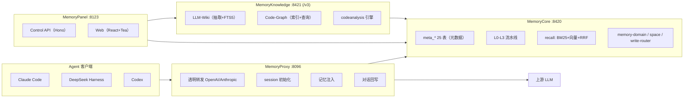
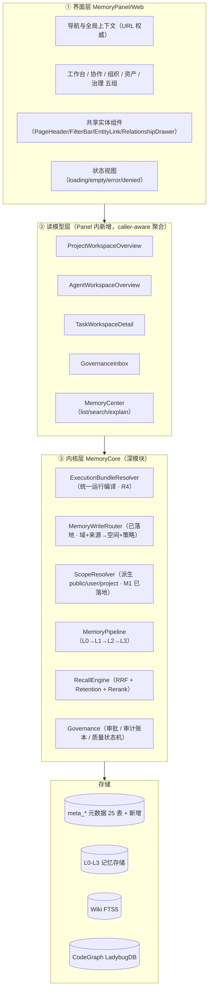
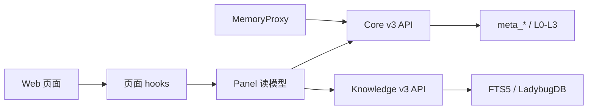
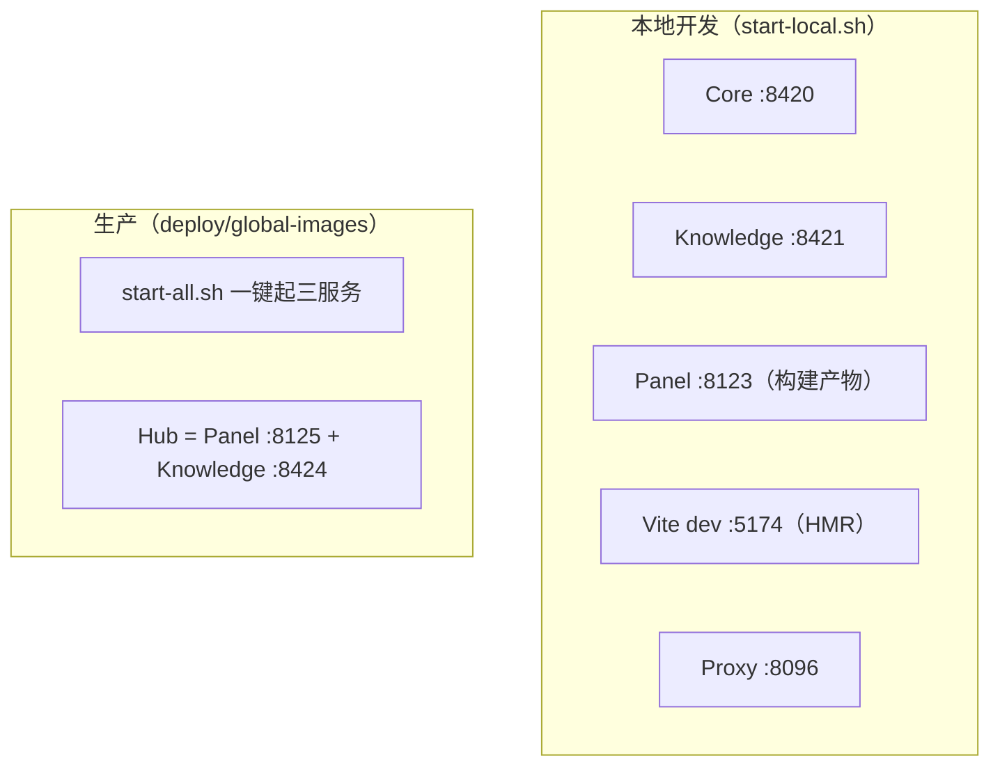

# 重设计 · 架构与技术方案

> 配套：`00-PROPOSAL.md`（诊断与路线）。本文给目标架构、模块边界、技术选型与依赖方向。

---

## 1. 现状架构（实测）

四个服务，一条链路：

| 服务 | 端口 | 职责 | 技术栈 |
|---|---|---|---|
| MemoryCore | 8420 | 记忆 + 元数据内核（25 张 meta 表 + L0–L3 + recall） | TS / Node24 / Hono |
| MemoryKnowledge | 8421 | 知识引擎（Wiki / CodeGraph / codeanalysis） | TS / Node24 |
| MemoryPanel | 8123 | 控制台（Control API + Web） | Hono / React18 / Vite / Tea |
| MemoryProxy | 8096 | 透明 LLM 代理（零代码接入） | TS / Node22 |

**现状问题**：Panel 是"薄代理"——它把请求转给 Core/Knowledge，但**没有聚合层**，导致前端为拼一个页面要发 6–N 次请求（fan-out）；同时后端能力没有"读模型"概念，前端只能各自解释字段。

---

## 2. 目标架构：三层 + 四个深模块

### 新增的三个深模块（本方案的关键结构改动）

| 模块 | 回答什么问题 | 输入 → 输出 | 为什么需要 |
|---|---|---|---|
| **ExecutionBundleResolver** | 这次 Run 到底生效了哪些资产/空间/策略/版本？ | `{agentId, teamId, projectId, taskId, userId}` → `{assets[+version+injectionMode], spaces[+policy], scenes, policies, sourceChain, configHash, resolvedAt}` | 现在"可访问/固定装配/本轮生效"三层混称"绑定"，用户分不清；也是 Run 可回放的前提 |
| **MemoryWriteRouter** | 这条记忆写到哪个空间、用什么策略？ | `{domain, source, teamId/userId/agentId/taskId/projectId}` → `{spaceId, effectivePolicy}` | ✅ 已落地（`memory-write-router.ts`），需接进 HTTP 与面板 |
| **ScopeResolver** | 这份资产谁能看？ | `{visibility, ownerUserId, projectId, teamId}` → `public / user / project` 三桶 | ✅ 已落地（`resolveMemoryScope`），需在 read model 中作为统一过滤入口 |

### Panel 读模型层（新增）

原则：**Panel 只编排 caller-aware 的 Core API，不复制权限裁决。**

| 读模型 | 解决 | 契约要点 |
|---|---|---|
| `ProjectWorkspaceOverview` | 项目首屏 fan-out（现状 6–N 请求） | `{project, viewer{role,permissions}, counts{members,agents,tasks,assets,spaces,runs,pendingApprovals}, recent, warnings[]}`；子系统失败返回 `warnings` + partial，不整页 500；**不返回未授权实体的存在性计数** |
| `AgentWorkspaceOverview` | Agent 详情是骨架 | 扩展现有 bootstrap：真实资产/空间/Run/审批计数 + Loadout 三层摘要 |
| `TaskWorkspaceDetail` | 任务链分散 | `{task, declaredAgents, actualParticipants, runs, knowledge, memories, deliverables}` |
| `GovernanceInbox` | 审批/失败 Run/审计分散 | 统一队列：`{approvals[], failedRuns[], auditEvents[]}` |
| `MemoryCenter` | 记忆浏览器/检索试调无后端 | `l1/list`、`l1/search`（带 score 拆解）、`l1/{remember,correct,forget}` |

---

## 3. 模块依赖方向（单向，禁止回环）

硬规则：
- **Web 不得直连 Core/Knowledge**（必须经 Panel 代理，保证鉴权与审计一致）
- **读模型不得内联权限判断**（一律调 Core 的 scope/resolve 能力）
- **Core 不得依赖 Panel**（内核可独立运行）
- **Proxy 不得持久化记忆**（只转发，读写全走 Core）

---

## 4. 技术选型

| 层 | 现状 | 决策 | 理由 |
|---|---|---|---|
| 前端框架 | React 18 + Vite + Tea Component | **保持** | 全站视觉体系已建立，换框架成本无收益 |
| 路由 | `createHashRouter` + 静态 `PATH_TO_PAGE` 前缀字典 | **改为路由元数据** | 前缀首匹配会误判动态详情页；动态实体页需要稳定 route id |
| 全局状态 | Zustand（只持久化 `activeTeamId`） | **URL 为权威，Zustand 只缓存默认值** | 分享链接/前进后退/刷新都可恢复；避免隐式过滤 |
| 路由风格 | Hash | **保持 Hash**（静态部署零配置） | 除非引入服务端 fallback |
| 后端框架 | Hono | **保持** | — |
| 图数据库 | LadybugDB（Cypher） | **保持** | CodeGraph 已依赖 |
| 元数据存储 | SQLite/MongoDB（适配器） | **保持** | `resolveMetadataDbName` 已支持实例隔离 |
| 向量 | 现有 + 可插拔 provider | **A6 MemoryProvider 契约**（P4） | 对标 AO 的 provider 契约，支持 store/recall/forget |
| 测试 | MemoryKnowledge 190 / Core 30 / Proxy 3 / **Panel 0** | **Panel 补 vitest 契约测试** | 后端能力无测试则无法防退化 |
| 新增 | 5 个门禁脚本 | **进 CI + pre-commit** | 防"假完成"回归 |

---

## 5. 部署与运行拓扑

> 端口在部署形态间不一致（本地 8123 / README 记 8125），重设计中统一以**配置文件为单一来源**，文档从配置生成，避免再出现文档端口与实现不符。

---

## 6. 架构级验收判据

- [ ] 任一页面首屏请求数 ≤ 3（读模型聚合生效，无 fan-out）
- [ ] 任一页面可回答「这份数据为什么对当前用户可见」（scope 可解释）
- [ ] 任一次 Run 可回答「生效了哪些资产/空间/策略/版本」（bundle 可解释）
- [ ] 未授权对象既不出现、也不以计数/错误消息泄露存在性
- [ ] Web 无直连内核的请求（全经 Panel）
- [ ] Panel 有两层测试：契约测试（读模型）+ 冒烟（真实浏览器）
