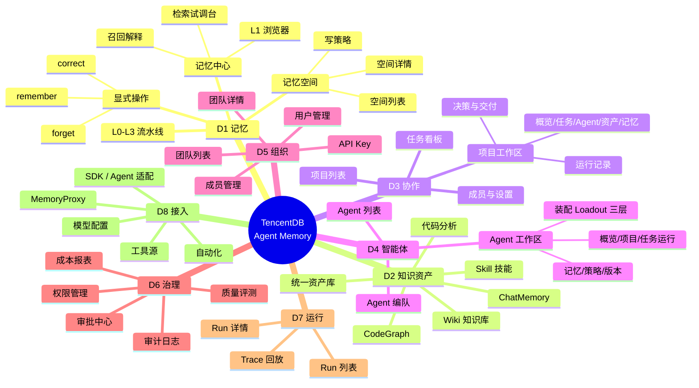

# 重设计 · 功能方案与功能图

> 配套：`00-PROPOSAL.md`、`01-ARCHITECTURE.md`。本文给功能域分解、功能全景图、功能→页面→接口映射与缺口清单。

---

## 1. 功能域分解（8 域）

把 `.specs` 的 F1–F25、backlog 的 47 条、以及现状实测，收敛为 **8 个功能域**：

| # | 功能域 | 一句话 | 现状 |
|---|---|---|---|
| D1 | **记忆** | 记忆的浏览、检索、写入、纠错、遗忘 | 🟡 流水线真、浏览/检索/显式操作**无入口** |
| D2 | **知识资产** | Wiki / CodeGraph / Skill / ChatMemory 四类资产 | 🟢 四类都有页面；CodeGraph 独立入口丢失 |
| D3 | **协作** | 项目 / 任务 / 交付物 / 决策 / OKR | 🟡 项目+任务真；交付物/决策/OKR **未建模** |
| D4 | **智能体** | Agent 的定义、装配、运行 | 🔴 Agent 详情=骨架；Loadout 只有一层 |
| D5 | **组织** | 团队、成员、用户、密钥 | 🟡 团队真；成员/Agent 独立入口被重定向 |
| D6 | **治理** | 审批、审计、权限、评测、成本 | 🔴 审批/审计后端有，入口被隐藏；评测未持久化 |
| D7 | **运行** | Run 发起、追踪、回放 | 🟡 RunTrace 表有；无 project 归属、无回放 UI |
| D8 | **接入** | Proxy 零代码接入、SDK、工具/自动化 | 🟢 Proxy 成熟；工具/自动化后端有、无入口 |

---

## 2. 功能全景图

---

## 3. 功能 → 页面 → 接口 映射（目标态）

### D1 记忆

| 功能 | 页面 | 目标接口 | 现状 |
|---|---|---|---|
| 记忆浏览/筛选/搜索 | 记忆中心 › 浏览器 | `POST /v3/memory/l1/list`（新建）+ Panel 代理 | 🔴 无端点 |
| 检索试调 + 召回解释 | 记忆中心 › 检索试调台 | `POST /v3/memory/l1/search`（带 keyword/vector 分拆 + scope 命中） | 🔴 无端点 |
| 显式 remember | 记忆中心 › 记住 | `POST /v3/memory/l1/remember`（source=explicit + 来源标注） | 🔴 无端点（仅纯函数） |
| 纠错（版本化） | 记忆中心 › 纠正 | `POST /v3/memory/l1/correct`（新版本 + 归档旧版 + lineage） | 🔴 |
| 遗忘（软删+审计） | 记忆中心 › 遗忘 | `POST /v3/memory/l1/forget` | 🔴 |
| 空间列表 | 记忆空间 | ✅ `memory/space/list` | 🟢 |
| 空间详情 + 挂载/策略 | 记忆空间详情 | `space/get`、`space/mount`、`space/unmount`、`space/update-policy`（C5） | 🔴 前端骨架 |
| 记忆写入路由 | （无 UI，内核） | ✅ `MemoryWriteRouter` | 🟢 已落地 |

### D2 知识资产

| 功能 | 页面 | 目标接口 | 现状 |
|---|---|---|---|
| Wiki 知识库 | `wiki` | ✅ `wiki/team-assets`、`wiki/list-by-agent` | 🟢 |
| Code 仓库池 | `code` | ✅ `code/team-assets`、`code/list-by-agent` | 🟢 |
| CodeGraph 图谱 | **`codegraph`（待恢复入口）** | ✅ `/code-graph/*`（Engine 代理） | 🔴 无独立路由 |
| 代码分析 | `analysis`、`analysis/:cgId` | ✅ codeanalysis 引擎 | 🟢 |
| Skill 技能 | `skills` | ✅ `skill/*` | 🟢 |
| ChatMemory | `memory` | ✅ `chat-memory/*` | 🟢 |
| 统一资产库 | 资产（新） | `asset/list-accessible`（已有）+ 类型筛选 | 🔴 无统一入口 |

### D3 协作

| 功能 | 页面 | 目标接口 | 现状 |
|---|---|---|---|
| 项目列表/创建 | `projects` | ✅ `project/*` | 🟢 |
| 项目工作区（7 子页） | `projects/:id` | `ProjectWorkspaceOverview`（C3，新建） | 🟡 只接了成员/资产/KnowledgeEntry，记忆空态 |
| 任务看板 | `workbench` / `projects/:id/tasks` | ✅ `task/*` + 筛选透传（C2 修复） | 🟡 缓存键不含筛选 |
| 交付物 review 门 | 项目 › 决策与交付 | 需 `deliverables` 建模 | 🔴 未建 |
| 决策审计留痕 | 项目 › 决策与交付 | 需 `decisions` + DecisionRecord | 🔴 未建 |
| OKR 分解 | 项目 › 决策与交付 | 需 `objectives` + `key_results` | 🔴 未建 |

### D4 智能体

| 功能 | 页面 | 目标接口 | 现状 |
|---|---|---|---|
| Agent 列表 | `team` / 一级 `agents`（待恢复） | `agent/list` | 🟡 混在团队页 |
| Agent 工作区 | `team/agents/:id` | `AgentWorkspaceOverview`（新建）+ `agent/get/update` | 🔴 **骨架页** |
| Loadout 三层 | Agent › 装配 | `execution-bundle/resolve` **V2**（C4） | 🟡 仅 spaces/sceneIds/bundleId |
| 可见性 / 执行环境 / MCP / 提供 API | Agent › 配置 | `agent/update` 扩字段 | 🔴 未建 |
| Agent 编队 | Agent 编队页 | ✅ `agent-team/*` | 🟢 无入口 |

### D5 组织

| 功能 | 页面 | 目标接口 | 现状 |
|---|---|---|---|
| 团队列表/详情 | `team`、`team/:teamId` | ✅ `team/*`、`team-member/*` | 🟢 |
| 成员管理 | **`team/members`（被重定向）** | ✅ `team-member/*` | 🟡 入口改为 /team |
| Agent 管理 | **`team/agents`（被重定向）** | ✅ `agent/*` | 🟡 入口改为 /team |
| API Key | `team/api-keys` | ✅ `user-key/*` | 🟢 |
| 用户管理 | **`admin/users`（菜单隐藏）** | ✅ `user/*` | 🟡 无入口 + 双实现 |

### D6 治理

| 功能 | 页面 | 目标接口 | 现状 |
|---|---|---|---|
| 审批中心 | 治理 › 审批 | ✅ `memory/write-approval/*` + `meta_write_approvals` | 🟡 无入口 |
| 审计日志 | 治理 › 审计 | ✅ `audit/*` + `meta_audit_logs` | 🟡 菜单隐藏 |
| 权限管理 | 治理 › 权限 | ✅ `acl/*`、`permission/*` | 🟡 菜单隐藏 |
| 质量评测 + 趋势 | 治理 › 评测 | 需 `EvalSuite/EvalCase/EvalRun`（C8） | 🔴 未持久化 |
| 成本/命中报表 | 治理 › 报表 | 需聚合 | 🔴 |
| 记忆审计账本 | 治理 › 审计 | 需 `meta_memory_audits`（C1） | 🔴 |

### D7 运行

| 功能 | 页面 | 目标接口 | 现状 |
|---|---|---|---|
| Run 列表/详情 | 治理 › 运行 | ✅ `run-trace/*` | 🟡 无 project 筛选（C7） |
| Trace 回放 | Run 详情 | ✅ + bundle 快照（C4） | 🟡 |

### D8 接入

| 功能 | 页面 | 目标接口 | 现状 |
|---|---|---|---|
| 模型配置 | **`admin/model-config`（菜单隐藏）** | ✅ `config/global/get|set`、`config/user/*` | 🟡 无入口（功能本身已验证可用） |
| 自动化 | （无入口） | ✅ `automation/*` | 🔴 表+接口有，无页面 |
| 工具源 | （无入口） | ✅ `tool-source/*` | 🔴 表+接口有，无页面 |
| 使用说明 | `guide` | — | 🟢 |

---

## 4. 缺口清单（按性质分类）

### 4.1 前端有页面、后端无契约（**假 UI 风险**）

| 页面 | 缺什么 |
|---|---|
| `AgentDetailPage` | 全部（骨架，字段占位） |
| `MemorySpaceDetailPage` | 全部（骨架，空态） |
| 项目 › 记忆 | `ProjectWorkspaceOverview` 的记忆段 |
| 治理 › 评测 | 评测持久化 |

### 4.2 后端有接口/表、前端无入口（**可用但没暴露**）

`meta_agent_spaces`、`meta_run_traces`、`meta_write_approvals`、`meta_automations`、`meta_tool_sources`、`meta_knowledge_entries`、`meta_audit_logs`、`meta_user_permissions` → 对应 8 组接口**全部已在 Panel 白名单**（除 `agent-space/`），但页面无入口或菜单隐藏。

### 4.3 实体缺关系（**结构缺口**）

`Agent↔Project` 单值、绑定散落 JSON、无统一运行编译、协作产物与记忆无关系边。

### 4.4 功能未建模（**产品缺口**）

交付物、决策、OKR、Playbook、Case Library、记忆审计账本、评测集。

---

## 5. 功能优先级（对齐 backlog 四阶段 + 本设计五阶段）

| 优先级 | 功能 | 归属阶段 |
|---|---|---|
| P0 | 恢复入口（6 隐藏页 + Agents/Members/CodeGraph）、修生键、去重复 | P0 止血 |
| P0 | 记忆浏览/检索/显式操作三件套（竞品第一能力，底座现成） | P1 契约 |
| P0 | ProjectWorkspace / AgentWorkspace / TaskWorkspace / GovernanceInbox 读模型 | P1 契约 |
| P1 | Agent↔Project 多对多、绑定关联表化、ExecutionBundle V2 | P2 关系 |
| P1 | 界面重设计（5 组导航 + 页面集） | P3 界面 |
| P2 | 治理面（审批/审计/权限/评测/报表） | P3/P4 |
| P2 | 协作产物建模（交付物/决策/OKR） | P4 |
| P3 | 算法注入（RRF/Retention/Dreaming/Feedback） | P4 |
| P3 | 生态（文档导入/迁移/SDK/Playbook/Case Library） | P4+ |
