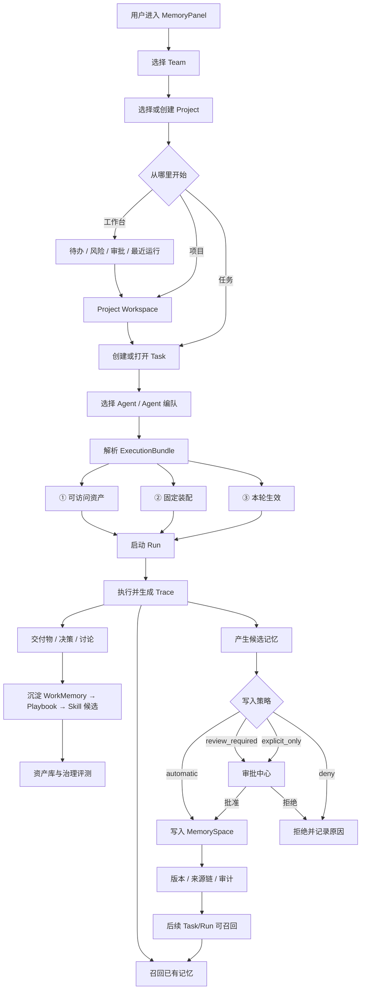
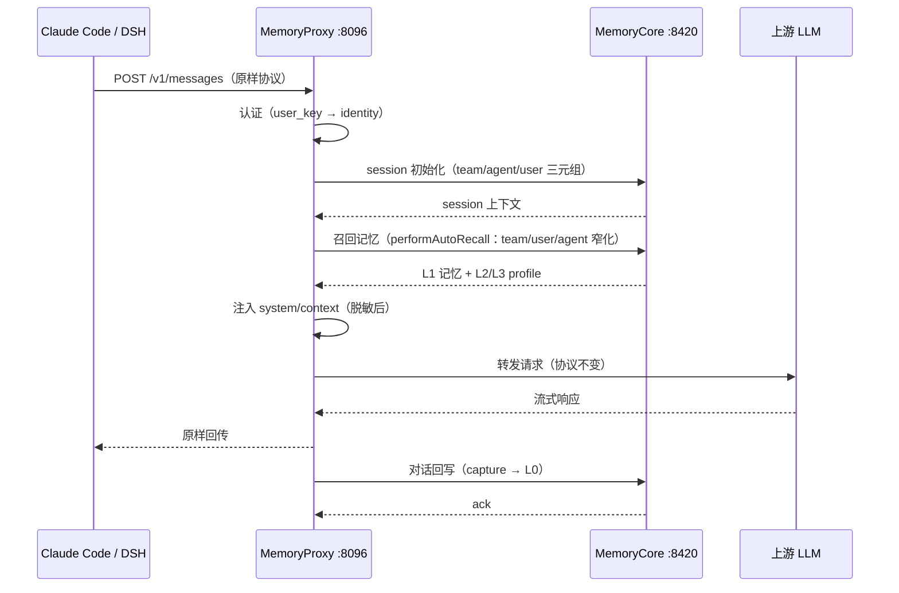
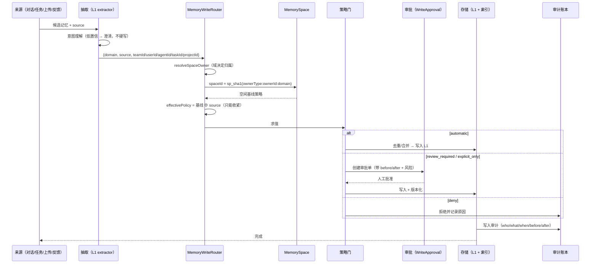
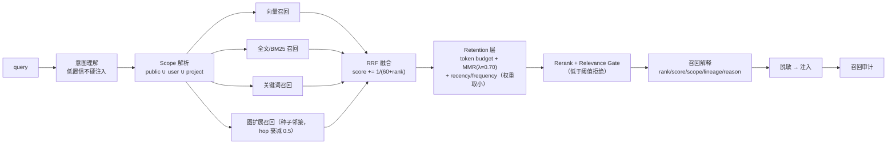
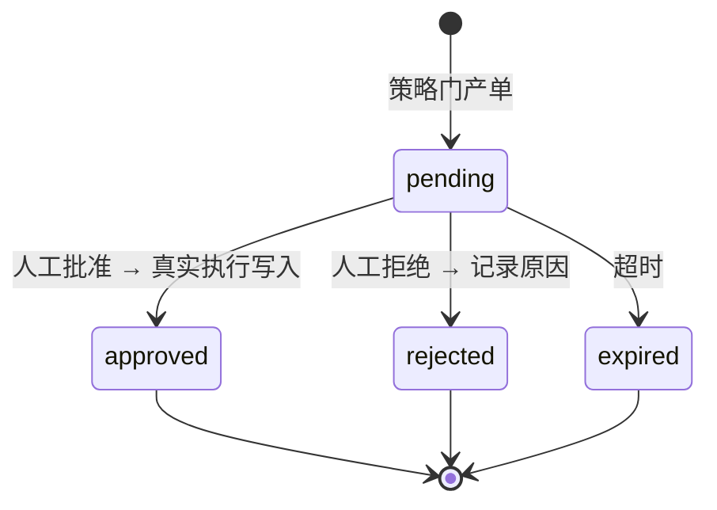
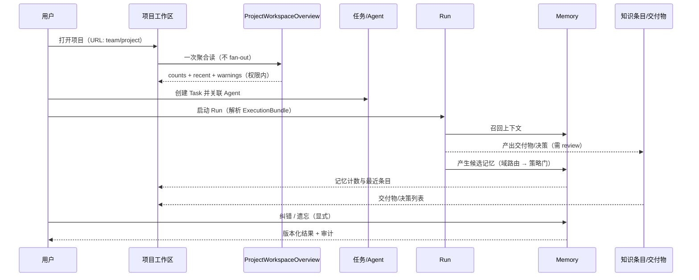
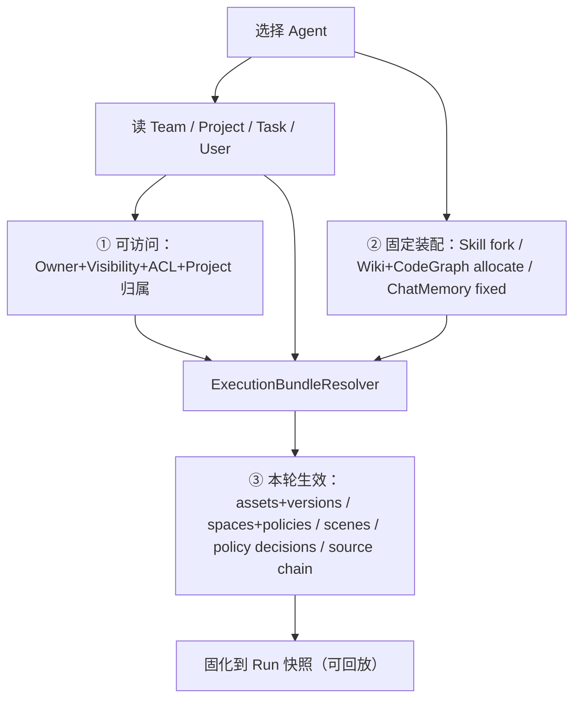
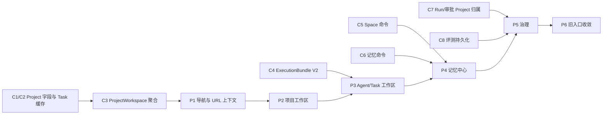

# 重设计 · 流程图与调用时序

> 配套：`00-PROPOSAL.md`、`01-ARCHITECTURE.md`、`02-FUNCTIONS.md`。
> 五条核心链路：① 接入与注入 ② 记忆写入 ③ 召回 ④ 审批 ⑤ 协作项目。

---

## 0. 系统主流程

---

## 1. 链路① 接入与注入（MemoryProxy，零代码）

要点：Proxy **不持久化**任何记忆；注入前必须过**脱敏**（backlog C7）与**策略门**（`deny` 域不注入）。

---

## 2. 链路② 记忆写入（域 → 空间 → 策略 → 审批）

**铁律**（`memory-domain.ts` 已实现）：
1. `automatic` 永不覆盖 `explicit_only`
2. 优先级 `explicit_only` > `review_required` > `automatic`；`deny` 直接拒绝
3. 调用方只能给 `domain + source + 隔离维度`，**不能自选 spaceId / write_policy**

---

## 3. 链路③ 召回（RRF → Retention → 注入）

**关键工程判断**（来自 MindMemOS）：时间/冗余/优先级**不进 RRF**，放在独立 Retention 层；`mixed-v2` = top-m 保底 + MMR，**只挑不改写**。

---

## 4. 链路④ 审批（写入治理）

审批单最小字段（`meta_write_approvals` 已有）：
`team_id / agent_id / task_id / session_id / write_policy / risk / plans_json / status / decided_by_user_id / decision_note`

**缺口**：无 `project_id`（项目归属只能经 Task/Agent 间接推导，见 C7）；无前端入口（菜单隐藏）。

---

## 5. 链路⑤ 协作项目（目标态）

---

## 6. Agent Loadout 解析流（三层，术语固定）

**术语铁律**：三层**不得统称"绑定"**；② 与 ③ 必须在 UI 上分区展示，否则用户无法判断"为什么这次没生效"。

---

## 7. UI 实施顺序（依赖契约）

