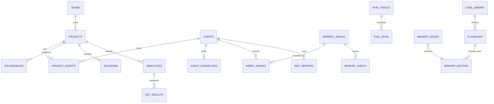

# 重设计 · 表设计（Schema）

> 配套：`00-PROPOSAL.md`、`01-ARCHITECTURE.md`。
> 原则：**只增不改、可空兼容、零回归**（现有数据 `NULL` 走旧逻辑）。
> 现状基线：`MemoryCore/src/metadata/store/sqlite-adapter.ts` 实测 **25 张 `meta_*` 表**。

---

## 1. 现状 25 张表（实测清单）

| 层 | 表 | 关键字段 |
|---|---|---|
| 身份 | `meta_users` | user_id, username, user_type(`normal`/`system_admin`), status |
| | `meta_user_keys` | key_id, user_id, key_value, is_default, status |
| | `meta_user_permissions` | user_id, permission, granted_by |
| 组织 | `meta_teams` | team_id, owner_user_id, status |
| | `meta_team_members` | team_id, user_id, role(`admin`/`member`/`reviewer`) |
| | `meta_projects` | project_id, team_id, owner_user_id, manager_user_id, visibility, default_agent_id, repo_url, git_repo_urls, path_globs |
| | `meta_project_members` | project_id, user_id, role, granted_by |
| 智能体 | `meta_agents` | agent_id, team_id, owner_user_id, **project_id(单值)**, visibility, status |
| | `meta_agent_teams` | agent_team_id, team_id, owner_user_id |
| | `meta_agent_team_members` | agent_team_id, agent_id, role |
| | `meta_agent_spaces` | id, agent_id, space_id, owner_type, owner_id, domain, write_policy |
| | `meta_agent_fixed_assets` | agent_id, asset_id, asset_type, injection_mode, priority |
| 任务 | `meta_tasks` | task_id, team_id, creator_user_id, project_id, risk_level |
| | `meta_task_agents` | task_id, agent_id, role_in_task |
| | `meta_participation_logs` | team_id, task_id, agent_id, user_id |
| 资产 | `meta_assets` | asset_id, team_id, asset_type(`skill`/`llm_wiki`/`code_graph`/`chat_memory`), owner_user_id, project_id, visibility, content_ref, version |
| | `meta_asset_acl` | asset_id, subject_type(`user`/`team_role`/`agent`), subject_id, permission, effect |
| | `meta_knowledge_entries` | entry_id, scope, scope_id, kind, title, content |
| | `meta_tool_sources` | tool_id, kind, team_id, endpoint_url, transport |
| 运行治理 | `meta_automations` | automation_id, team_id, trigger_type, action_type, target_id |
| | `meta_run_traces` | run_id, team_id, agent_id, task_id, kind, trace_json |
| | `meta_write_approvals` | approval_id, team_id, agent_id, task_id, session_id, write_policy, risk, plans_json, status, decided_by_user_id |
| 配置审计 | `meta_config_params` | scope, user_id, module, param_name, param_value |
| | `meta_instance_upstream_config` | agent_source, type, mode, base_url, api_key, model_id |
| | `meta_audit_logs` | actor_user_id, action, entity_type, entity_id, detail |

---

## 2. 新增表（按改进项编号）

### 2.1 R1 · Agent ↔ Project 多对多

```sql
CREATE TABLE IF NOT EXISTS meta_project_agents (
  project_id       TEXT NOT NULL,
  agent_id         TEXT NOT NULL,
  role             TEXT NOT NULL DEFAULT 'member',   -- leader | member
  priority         INTEGER NOT NULL DEFAULT 0,
  enabled          INTEGER NOT NULL DEFAULT 1,
  config_override  TEXT NOT NULL DEFAULT '{}',        -- JSON: prompt/model 覆盖
  created_at       TEXT NOT NULL,
  PRIMARY KEY (project_id, agent_id)
);
CREATE INDEX IF NOT EXISTS idx_project_agents_agent ON meta_project_agents(agent_id);
```

> `meta_agents.project_id` **保留但降级**为 `default_project_id` 语义（兼容旧读路径），新逻辑一律走本表。迁移期双写。

### 2.2 R3 · 绑定关联表化 + 记忆空间一等化

```sql
-- 记忆空间升为一等资源（正名：原 meta_agent_spaces 承载 5 种 ownerType，命名不符）
CREATE TABLE IF NOT EXISTS meta_memory_spaces (
  space_id      TEXT PRIMARY KEY,          -- sp_<sha1(ownerType:ownerId:domain) 前12位>
  owner_type    TEXT NOT NULL,             -- user | team | project | agent | task
  owner_id      TEXT NOT NULL,
  domain        TEXT NOT NULL,             -- 12 个 Brain 域之一
  write_policy  TEXT NOT NULL,             -- automatic | review_required | explicit_only | deny
  created_at    TEXT NOT NULL,
  updated_at    TEXT NOT NULL,
  UNIQUE (owner_type, owner_id, domain)
);

-- 原 meta_agent_spaces 收敛为纯挂载表
--   agent_id, space_id 保留；owner_type/owner_id/domain/write_policy 迁往 meta_memory_spaces

-- Skill 绑定关联表化（替代 agent 行内 JSON）
CREATE TABLE IF NOT EXISTS meta_agent_capabilities (
  agent_id     TEXT NOT NULL,
  capability_id TEXT NOT NULL,             -- skill_id / tool_id
  kind         TEXT NOT NULL,              -- skill | tool
  version      TEXT,
  created_by   TEXT NOT NULL,
  created_at   TEXT NOT NULL,
  PRIMARY KEY (agent_id, capability_id, kind)
);

-- MCP 服务器（F13）
CREATE TABLE IF NOT EXISTS meta_mcp_servers (
  mcp_id        TEXT PRIMARY KEY,
  team_id       TEXT,
  owner_user_id TEXT NOT NULL,
  name          TEXT NOT NULL,
  transport     TEXT NOT NULL,             -- stdio | sse
  endpoint      TEXT,
  auth_config_enc TEXT,                    -- AES-256-GCM 密文
  status        TEXT NOT NULL DEFAULT 'active',
  created_at    TEXT NOT NULL,
  updated_at    TEXT NOT NULL
);
```

### 2.3 D3 · 协作产物建模（交付物 / 决策 / OKR）

```sql
CREATE TABLE IF NOT EXISTS meta_deliverables (
  deliverable_id TEXT PRIMARY KEY,
  project_id     TEXT NOT NULL,
  task_id        TEXT,
  title          TEXT NOT NULL,
  content_ref    TEXT,                     -- 指向知识条目/文件
  review_status  TEXT NOT NULL DEFAULT 'pending',  -- pending | approved | rejected
  reviewer_user_id TEXT,
  created_by     TEXT NOT NULL,
  created_at     TEXT NOT NULL,
  updated_at     TEXT NOT NULL
);

CREATE TABLE IF NOT EXISTS meta_decisions (
  decision_id    TEXT PRIMARY KEY,
  project_id     TEXT NOT NULL,
  task_id        TEXT,
  context        TEXT NOT NULL,
  proposal       TEXT NOT NULL,
  outcome        TEXT,
  reviewer_user_id TEXT,
  decided_at     TEXT,
  created_at     TEXT NOT NULL
);

CREATE TABLE IF NOT EXISTS meta_objectives (
  objective_id TEXT PRIMARY KEY,
  project_id   TEXT NOT NULL,
  title        TEXT NOT NULL,
  owner_user_id TEXT,
  period       TEXT,                       -- 2026-Q3
  status       TEXT NOT NULL DEFAULT 'active',
  created_at   TEXT NOT NULL
);

CREATE TABLE IF NOT EXISTS meta_key_results (
  kr_id        TEXT PRIMARY KEY,
  objective_id TEXT NOT NULL,
  title        TEXT NOT NULL,
  target_value REAL,
  current_value REAL NOT NULL DEFAULT 0,
  unit         TEXT,
  updated_at   TEXT NOT NULL
);
```

### 2.4 A9/A15 · 沉淀链（Playbook / 案例库）

```sql
CREATE TABLE IF NOT EXISTS meta_playbooks (
  playbook_id  TEXT PRIMARY KEY,
  team_id      TEXT,
  project_id   TEXT,
  name         TEXT NOT NULL,
  steps_json   TEXT NOT NULL,
  artifacts_json TEXT NOT NULL DEFAULT '[]',
  confidence   REAL NOT NULL DEFAULT 0,
  reusable     INTEGER NOT NULL DEFAULT 0,
  source_memory_ids TEXT NOT NULL DEFAULT '[]',
  status       TEXT NOT NULL DEFAULT 'candidate',  -- candidate | verified | published
  created_at   TEXT NOT NULL,
  updated_at   TEXT NOT NULL
);

CREATE TABLE IF NOT EXISTS meta_case_library (
  case_id        TEXT PRIMARY KEY,
  problem_text   TEXT NOT NULL,
  problem_embedding BLOB,
  solution       TEXT NOT NULL,
  reuse_count    INTEGER NOT NULL DEFAULT 0,
  team_id        TEXT,
  created_at     TEXT NOT NULL
);
```

### 2.5 C1 · 记忆审计账本

```sql
CREATE TABLE IF NOT EXISTS meta_memory_audits (
  id           TEXT PRIMARY KEY,
  category     TEXT NOT NULL,              -- write | recall | govern | security
  actor_user_id TEXT,
  actor_agent_id TEXT,
  action       TEXT NOT NULL,              -- remember | correct | forget | approve | reject | recall
  target_type  TEXT NOT NULL,              -- memory | space | asset
  target_id    TEXT NOT NULL,
  scope        TEXT,                       -- public | user | project
  team_id      TEXT, project_id TEXT, task_id TEXT,
  before_json  TEXT, after_json TEXT,
  result       TEXT NOT NULL,              -- ok | denied | pending
  reason       TEXT,
  created_at   TEXT NOT NULL
);
CREATE INDEX IF NOT EXISTS idx_memory_audits_target ON meta_memory_audits(target_type, target_id);
CREATE INDEX IF NOT EXISTS idx_memory_audits_team ON meta_memory_audits(team_id, created_at);
```

### 2.6 C8 · 评测持久化

```sql
CREATE TABLE IF NOT EXISTS meta_eval_suites (
  suite_id TEXT PRIMARY KEY, name TEXT NOT NULL, kind TEXT NOT NULL,  -- retrieval | extraction | isolation
  created_at TEXT NOT NULL
);
CREATE TABLE IF NOT EXISTS meta_eval_cases (
  case_id TEXT PRIMARY KEY, suite_id TEXT NOT NULL,
  query TEXT NOT NULL, relevant_ids TEXT NOT NULL DEFAULT '[]',
  domain TEXT, created_at TEXT NOT NULL
);
CREATE TABLE IF NOT EXISTS meta_eval_runs (
  run_id TEXT PRIMARY KEY, suite_id TEXT NOT NULL,
  metrics_json TEXT NOT NULL,              -- {recall_at_k, mrr, ndcg, archived_pct, scope_leakage}
  baseline_run_id TEXT, delta_json TEXT,
  created_by TEXT, created_at TEXT NOT NULL
);
```

### 2.7 B8/R7 · 记忆实体与关系（含时间维）

```sql
CREATE TABLE IF NOT EXISTS meta_memory_entities (
  entity_id TEXT PRIMARY KEY, name TEXT NOT NULL, entity_type TEXT,
  space_id TEXT, team_id TEXT, created_at TEXT NOT NULL
);
CREATE TABLE IF NOT EXISTS meta_memory_edges (
  edge_id TEXT PRIMARY KEY,
  source_entity_id TEXT NOT NULL, predicate TEXT NOT NULL, target_entity_id TEXT NOT NULL,
  valid_from TEXT, valid_to TEXT, change_reason TEXT,   -- 时间边（A16）
  confidence REAL, provenance TEXT,
  created_at TEXT NOT NULL
);
```

---

## 3. 改造表（只加可空列 / 新增索引）

```sql
-- meta_agents：类型/角色/执行环境（F12/F15），project_id 保留兼容
ALTER TABLE meta_agents ADD COLUMN agent_type   TEXT;
ALTER TABLE meta_agents ADD COLUMN agent_role   TEXT;          -- leader | member
ALTER TABLE meta_agents ADD COLUMN network_policy TEXT;         -- offline | restricted | open
ALTER TABLE meta_agents ADD COLUMN allow_shell  INTEGER;        -- 0/1
ALTER TABLE meta_agents ADD COLUMN approval_mode TEXT;          -- never | on_failure | always
ALTER TABLE meta_agents ADD COLUMN provides_api INTEGER NOT NULL DEFAULT 0;

-- meta_run_traces：项目归属（C7）+ bundle 快照（C4 回放）
ALTER TABLE meta_run_traces ADD COLUMN project_id TEXT;
ALTER TABLE meta_run_traces ADD COLUMN bundle_snapshot_json TEXT;

-- meta_write_approvals：项目归属（C7）
ALTER TABLE meta_write_approvals ADD COLUMN project_id TEXT;

-- meta_assets：记忆空间挂载（资产维度）
ALTER TABLE meta_assets ADD COLUMN space_id TEXT;

-- 索引补齐（列表页过滤性能）
CREATE INDEX IF NOT EXISTS idx_agents_project   ON meta_agents(project_id);
CREATE INDEX IF NOT EXISTS idx_tasks_project    ON meta_tasks(project_id);
CREATE INDEX IF NOT EXISTS idx_assets_project   ON meta_assets(project_id);
CREATE INDEX IF NOT EXISTS idx_run_traces_project ON meta_run_traces(project_id);
```

---

## 4. 记忆记录侧（L1，非 meta 库）

```ts
// MemoryRecord 增量字段（向后兼容，全部可选）
{
  domain?: MemoryDomain;        // ✅ 已落地
  writePolicy?: WritePolicy;    // ✅ 已落地
  spaceId?: string;             // ✅ 已落地
  // 新增（R7 血缘 / B8 结构化 / A19 强化）
  parentIds?: string[];         // 衍生自
  rootId?: string;              // 血缘根
  derivedFrom?: 'extraction' | 'correction' | 'consolidation' | 'user_explicit';
  supersededBy?: string;        // 被谁取代
  reinforcementCount?: number;  // 重提强化计数
  entityRefs?: Array<{ name: string; type?: string; predicate?: string; value?: string }>;
}
```

---

## 5. 关系图（新增部分）



---

## 6. 迁移策略（零回归）

| 步骤 | 动作 | 回滚 |
|---|---|---|
| M0 | 建新表（纯新增，无引用） | DROP 新表 |
| M1 | 改造表加可空列 + 索引 | 列可空，不加也可运行 |
| M2 | 启动时探测式 ALTER（`pragma_table_info`），幂等 | 无副作用 |
| M3 | 数据回填：`meta_agents.project_id` → `meta_project_agents`（幂等 INSERT） | 保留旧列不清 |
| M4 | 双读期：新逻辑读新表，旧路径兼容读旧列 | 切回旧读 |
| M5 | 观测期后收敛旧列（**独立 change，不混在功能变更里**） | 保留备份 |

硬规则：
- **不删列、不改列类型、不改非空约束**
- 现有 `project_id = NULL` 的数据行为与迁移前**完全一致**
- 迁移不引入新工具（沿用现有 SQLite rawStore 迁移入口）
- `meta_agent_spaces` → `meta_memory_spaces` 的拆分单独成一个 change（涉及数据搬移）
