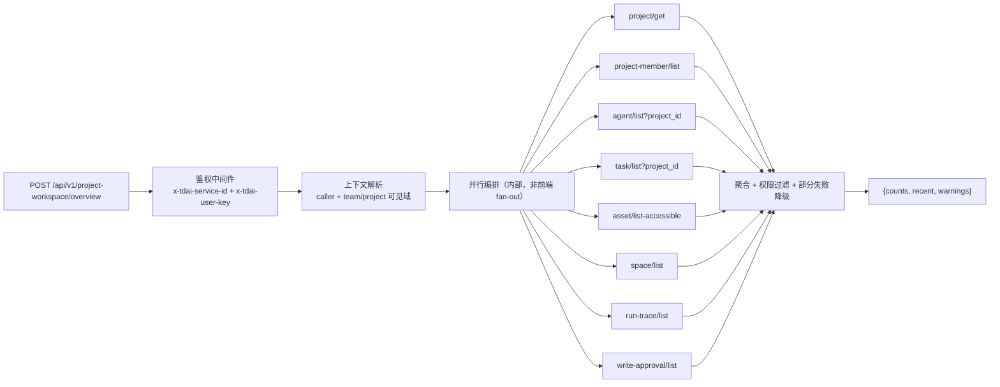

# 重设计 · 技术方案

> 配套：`00-PROPOSAL.md`（路线）、`01-ARCHITECTURE.md`（架构）、`04-SCHEMA.md`（表设计）。
> 本文给：契约设计、读模型实现、门禁脚本、测试策略、兼容与迁移、工程纪律。

---

## 1. 契约先行：三类契约

UI V2 定义的 C1–C8 是前置门禁，**当前一个都没做**。本方案把它们归为三类：

### 1.1 字段契约（最小改动，先解锁 UI）

| # | 契约 | 内容 | 落点 |
|---|---|---|---|
| C1 | Agent/Task 的 Project 字段 | `agentsApi.create/update`、`tasksApi.create` 暴露 `project_id`；前端类型补齐 | Panel 代理 + Web 类型 |
| C2 | Task 查询透传与缓存键 | `fetchTasks` 透传 `agent_id/project_id/creator_user_id`；缓存键含全部筛选 | `stores/backend.ts` |
| C7 | Run/审批 Project 归属 | 短期经 Task 聚合；长期加 `project_id` 列（见 `04-SCHEMA.md` §3）+ ADR | Core + Panel |

### 1.2 读模型契约（消除 fan-out）

| # | 读模型 | 端点 | 关键规则 |
|---|---|---|---|
| C3 | ProjectWorkspaceOverview | `POST /api/v1/project-workspace/overview` | 一次聚合；子系统失败返回 `warnings` + partial；**不泄露未授权存在性计数** |
| — | AgentWorkspaceOverview | `POST /api/v1/agent-workspace/overview` | 扩展现有 bootstrap：真实资产/空间/Run/审批 + Loadout 三层摘要 |
| — | TaskWorkspaceDetail | `POST /api/v1/task-workspace/detail` | 任务 + 声明参与者 + 实际参与者 + Run + 知识 + 记忆 |
| — | GovernanceInbox | `POST /api/v1/governance/inbox` | 审批 + 失败 Run + 审计事件统一队列 |
| — | MemoryCenter | `POST /api/v1/memory-center/{list,search,explain}` | 真实 L1 分页 + score 拆解 + scope 命中 |

`ProjectWorkspaceOverview` 契约（沿用 `CODE-SCAN.md §6`）：

```ts
interface ProjectWorkspaceOverview {
  project: Project;
  viewer: { role: string; permissions: string[] };
  counts: {
    members: number; agents: number;
    tasks: { total: number; running: number; completed: number; risky: number };
    assets: Record<'skill' | 'llm_wiki' | 'code_graph' | 'chat_memory', number>;
    spaces: number;
    runs: { total: number; failed: number };
    pendingApprovals: number;
  };
  recent: { tasks: TaskSummary[]; runs: RunSummary[]; knowledgeEntries: KnowledgeEntry[] };
  warnings: Array<{ code: string; message: string; partial: boolean }>;
}
```

### 1.3 命令契约（写操作必须可审计）

| # | 命令 | 端点 | 必备字段 |
|---|---|---|---|
| C5 | MemorySpace 管理 | `space/get`、`space/mount`、`space/unmount`、`space/update-policy` | actor / 影响预览；**放宽策略需单独授权** |
| C6 | 显式记忆命令 | `memory/l1/{remember,correct,forget}` | actor + source + scope + version + 审计 |
| C4 | ExecutionBundle V2 | `execution-bundle/resolve` | assets+version+injectionMode、spaces+source、scene version、policy decisions、source chain、resolvedAt |
| C8 | 评测持久化 | `eval/{suite,case,run}` | metrics_json + baseline + delta |

---

## 2. Panel 读模型实现规范



硬规则：
1. **Panel 只编排，不裁决权限** —— 一律调 Core 的 caller-aware 接口（传 caller 身份），由 Core 决定可见性
2. **部分失败降级**：任一子系统失败 → 记 `warnings` + 返回 partial，**不整页 500**
3. **不返回未授权对象的计数**（计数即泄露存在性）
4. **overview 不返回全量列表**（详情走分页接口）
5. 聚合在**服务端并行**，禁止把 fan-out 推给浏览器

---

## 3. 门禁脚本（`scripts/guard/`）

| 脚本 | 检查内容 | 实现要点 |
|---|---|---|
| `check-i18n.mjs` | 代码中每个 `t('key')` 在 `i18n/{zh-CN,en-US}.ts` 有定义；两语言键集合一致 | 正则提取 + 集合差集；**当前会报 52 个缺键** |
| `check-routes.mjs` | ① 每个 `routes` 条目有菜单入口或标 `__subpage__` ② 每个 `pages/*` 目录被路由引用（或标 `__shared__`） | 解析 `routes/index.tsx` + `constants/menu.tsx` + 目录列表 |
| `check-duplicates.mjs` | ① 同名 `.tsx` 与同名目录并存 ② 同文件重复路由注册 ③ 同文件重复 `interface` 声明 | 文件系统扫描 + AST/正则；**当前会报 Workbench / UserManagementPage / types.ts / app.ts / chat-memory.ts** |
| `check-skeleton.mjs` | main 分支禁止 `骨架阶段` / `待后续 change 接数据` 等标记 | 白名单 `// GUARD-ALLOW: <issue>` |
| `check-claims.mjs` | `.specs/**` 中「✅ 已落地/已完成」必须同行附证据（`path:line` / 命令 / 测试名） | 无证据 → fail |

集成：`pre-commit`（仅变更文件）+ CI 全量。首轮允许 `--baseline` 记录现存违规，之后**只减不增**。

---

## 4. 测试策略

现状：MemoryKnowledge 190 个测试文件 / MemoryCore 30 / MemoryProxy 3 / **MemoryPanel 0**。

| 层 | 测试类型 | 要求 |
|---|---|---|
| Core | 单测（已有） | 新增关系/命令必须有单测（`resolveExecutionBundle`、`space` 命令、`l1/*` 命令） |
| Panel | **契约测试（新增）** | 每个读模型：JSON schema 快照 + 权限过滤用例（含越权请求返回 partial/空） |
| Panel | 冒烟（新增） | Playwright：登录 → 五组导航可达 → 项目/Agent/记忆主流程 |
| Web | 构建门禁 | `tsc --noEmit` + `vite build` 必须过 |
| 记忆质量 | 评测（C8 后） | recall@k / MRR / nDCG + **scope leakage 必须为 0** |

---

## 5. 路由与状态迁移（避免再出现"入口丢失"）

1. **路由元数据替换** `PATH_TO_PAGE` 前缀首匹配 → 动态实体页拥有稳定 route id
2. **URL 为上下文权威**（`?team=&project=&agent=&task=`），Zustand 只缓存默认值
3. **旧路由保留 redirect 表**，能力等价后再收敛；redirect 表进回归测试
4. 每个页面必须声明：`group`（五组之一）或 `__subpage__`（二级页），**不允许 `__hidden__`**

---

## 6. 兼容与迁移纪律

| 风险 | 措施 |
|---|---|
| 一次重写过大 | 按 Project / Agent / Memory 垂直切片；旧页面保留至新页能力等价 |
| 后端关系仍单值 | UI 明确显示当前能力；多对多用适配层 + 阶段性禁用态（不假装支持） |
| 全局上下文隐式过滤 | URL 显式 + 页面顶部作用域条 + 一键清除 |
| 资产库弱化专业功能 | 统一列表做筛选，**Wiki/CodeGraph/Skill 保留专属工作台** |
| 权限/绑定/召回再次混淆 | 三层固定术语 + 独立 UI 区块，禁止复用同一个"绑定"标签 |
| 迁移破坏现有数据 | 只增不改（见 `04-SCHEMA.md` §6）；旧列保留至观测期结束 |
| 重复注册/重复实现 | `check-duplicates` 门禁 + 首轮清理 |

---

## 7. 工程纪律（来自 `RULES.md` + `LESSONS.md`）

- **DEV 前必扫 `LESSONS.md`**（规则 R1.8），命中条目必须在计划里显式声明
- **一次一个 change**，走 `CHANGE → REQUIREMENT → DESIGN → TASK → DEV → TEST → REVIEW`
- 引用历史决策用 `@路径`，禁止凭记忆复述
- 阶段切换必须产出工件（`SUMMARY.md` 等）作为后续唯一上下文
- **每个 change 的交付必须四层齐**：后端端点 + 单测、Panel 白名单 + 代理、前端 UI、curl + Playwright 端到端 —— **不交"只通接口没 UI"或"只 UI 假数据"的半成品**（这是当前骨架页的直接教训）

---

## 8. P0 止血任务清单（可立即执行）

| # | 任务 | 证据/判据 |
|---|---|---|
| 1 | 补齐 52 个 i18n 键（含 `team.deleteTeam.*`、`menu.desc.*`、`admin.*`） | `check-i18n` 通过 |
| 2 | 删除 `pages/admin/UserManagementPage/index.tsx`（死实现） | 路由仍指向 `.tsx`；删后 build 通过 |
| 3 | 合并两套 Workbench | 只剩一套；无反向 import 旧目录 |
| 4 | 去重 `lib/api/types.ts` 的 `Project`/`ProjectMember`/`Automation` | `check-duplicates` 通过 |
| 5 | 删除 `app.ts:40` 重复 `registerMemoryProxyRoutes()` | 路由注册唯一 |
| 6 | 删除 `chat-memory.ts:276` 重复 `/chat-memory/list-combined` | 路由注册唯一 |
| 7 | 6 个 `__hidden__` 页面：恢复入口或明确下线（记录 ADR） | `check-routes` 通过 |
| 8 | `AgentsPage`/`MembersPage`/`codegraph`：恢复入口或删除（记录 ADR） | 无孤儿页面 |
| 9 | 两个骨架页（AgentDetail/MemorySpaceDetail）挂 issue 或移出菜单 | `check-skeleton` 通过 |
| 10 | 建立 5 个门禁脚本 + baseline 记录 | CI 可跑，违规数只减不增 |
