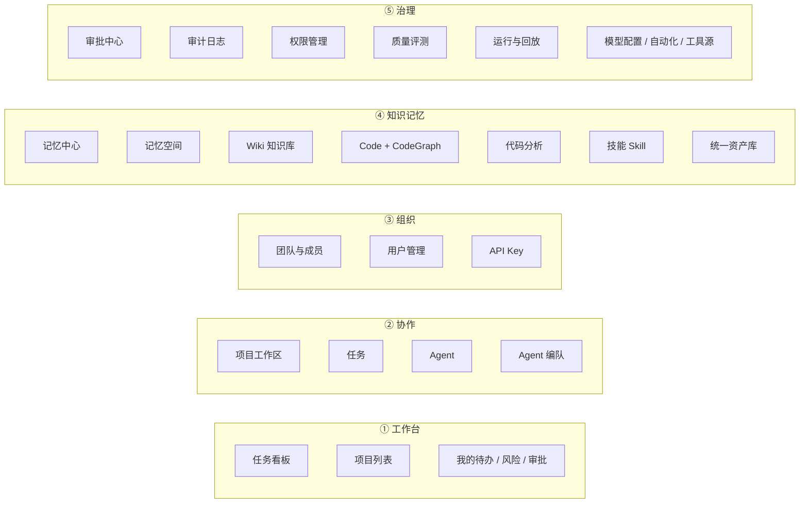
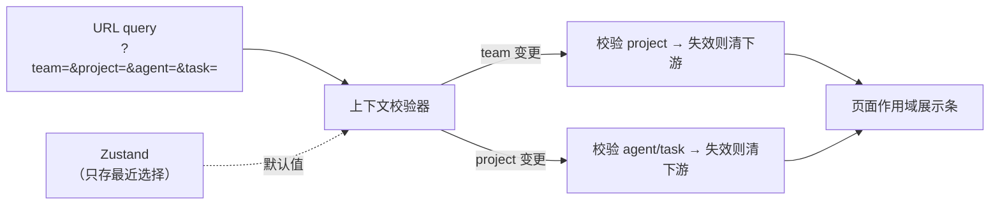

# 重设计 · UI 设计

> 配套：`00-PROPOSAL.md`、`02-FUNCTIONS.md`。
> 定位：本文给**信息架构 + 页面集 + 早期版对照 + 组件与规则**；像素级视觉稿在 P3 阶段另出（本阶段不越界）。
> 参照：`my-tencentDB-Agent-memory`（早期版功能基线）、`agent-collab-ui-redesign`（已归档的 UI 重构）、UI V2 计划。

---

## 1. 设计原则

| # | 原则 | 说明 |
|---|---|---|
| 1 | **入口直白**（学早期版） | 菜单项 = 页面，不做"藏起来的高级功能"；禁止 `__hidden__` 组承载有用户的页面 |
| 2 | **关系组织**（学 UI V2） | 一级对象是 **Project / Agent / Task**；`asset_type` 降级为筛选而非一级导航 |
| 3 | **作用域显式** | URL 是团队/项目/Agent/Task 的权威；页面顶部永远显示当前作用域并可清除 |
| 4 | **三层不混称** | 可访问 / 固定装配 / 本轮生效 —— 视觉分区，禁止统称"绑定" |
| 5 | **状态完备** | 每个数据区必须有 loading / empty / error / denied 四态；denied 不泄露存在性 |
| 6 | **无骨架合入** | 未接数据的页面不进 main（由 `check-skeleton` 门禁保证） |
| 7 | **视觉沿用** | Tea Component + 蓝色主色（`#2563eb`）+ 既有 design tokens，不换皮 |

---

## 2. 信息架构：五组导航



> 五组与 UI V2 的 T1 一致；新增的是**把治理组从隐藏状态恢复为可见一级组**。

---

## 3. 页面集（三层清单）

### 3.1 一级页面（侧边栏可达）

| 组 | 页面 | 路由 | 状态 | 备注 |
|---|---|---|---|---|
| 工作台 | 任务看板 | `/` | 🟢 | 现 Workbench（需处理双实现） |
| 工作台 | 项目列表 | `/projects` | 🟢 | — |
| 协作 | 项目工作区 | `/projects/:id` | 🟡 | 7 子页，记忆段为空 |
| 协作 | 任务 | `/tasks` | 🔴 待建 | 现在只有看板 |
| 协作 | Agent 列表 | `/agents` | 🔴 待建 | 现在混在 `/team` |
| 协作 | Agent 编队 | `/agent-teams` | 🟡 | 后端有，无入口 |
| 组织 | 团队与成员 | `/team` | 🟢 | — |
| 组织 | 成员管理 | `/team/members` | 🟡 **入口被重定向** | 恢复独立入口 |
| 组织 | Agent 管理 | `/team/agents` | 🟡 **入口被重定向** | 恢复或并入 `/agents` |
| 组织 | API Key | `/team/api-keys` | 🟢 | — |
| 组织 | 用户管理 | `/admin/users` | 🟡 **菜单隐藏 + 双实现** | 去掉死实现；**补 `AdminOnlyGuard`（唯一缺守卫的后台路由）** |
| 组织 | 默认 Agent 模板 | 团队页内 | 🟠 **UI 误删待搬回** | 后端 action（`agent/{get,set}-default-template`）与 client 都在 |
| 知识记忆 | 记忆中心 | `/memory-center` | 🔴 待建 | 合并 ChatMemory + MemorySpace |
| 知识记忆 | 记忆空间 | `/memory-spaces` | 🟢 | 详情页是骨架 |
| 知识记忆 | Wiki 知识库 | `/wiki` | 🟢 | 已恢复旧版双页签 |
| 知识记忆 | Code | `/code` | 🟢 | 已恢复旧版双页签 |
| 知识记忆 | CodeGraph | `/codegraph` | 🟡 **无独立路由** | 决定恢复或并入分析 |
| 知识记忆 | 代码分析 | `/analysis` | 🟢 | — |
| 知识记忆 | 技能 Skill | `/skills` | 🟢 | — |
| 知识记忆 | 统一资产库 | `/assets` | 🔴 待建 | 四类资产统一筛选视图 |
| 治理 | 审批中心 | `/governance/approvals` | 🟡 | 后端全套，无入口 |
| 治理 | 审计日志 | `/governance/audit` | 🟡 **菜单隐藏** | 恢复入口 |
| 治理 | 权限管理 | `/governance/permissions` | 🟡 **菜单隐藏** | 恢复入口 |
| 治理 | 质量评测 | `/governance/eval` | 🔴 待建 | 需 C8 持久化 |
| 治理 | 运行与回放 | `/governance/runs` | 🟡 | 后端有，无入口 |
| 治理 | 线上调用情况（Analytics） | `/analytics` | 🔴 **误删待搬回** | 早期版 29 文件、2 Tab（KPI/成员/模型/trace/成本/drill-down）；后端 16+16 条、i18n 151 行、client 540 行、能力 hook 全在 |
| 治理 | 模型配置 | `/admin/model-config` | 🟡 **菜单隐藏** | 功能已验证可用 |
| 治理 | 自动化 / 工具源 | `/governance/automation` | 🔴 待建 | 表和接口都有 |
| — | 使用说明 | `/guide` | 🟢 | — |

### 3.2 二级页面（详情/工作区，非菜单项）

| 页面 | 路由 | 父级 |
|---|---|---|
| 项目工作区子页 | `/projects/:id/{overview,tasks,agents,assets,memory,decisions,runs,settings}` | 项目 |
| Agent 工作区子页 | `/agents/:id/{overview,projects,tasks,loadout,memory,policy,versions}` | Agent |
| 任务详情 | `/tasks/:id` | 任务 |
| 记忆空间详情 | `/memory-spaces/:spaceId` | 记忆空间 |
| 记忆详情 | `/memory-center/:memoryId` | 记忆 |
| Run 详情 | `/governance/runs/:runId` | 运行 |
| 团队详情 | `/team/:teamId` | 团队 |
| 仓库分析详情 | `/analysis/:cgId` | 代码分析 |

### 3.3 需要处理的"孤儿"（实测）

| 项 | 问题 | 处置建议 |
|---|---|---|
| `pages/WorkbenchPage/` | 与 `pages/workbench/WorkbenchPage/` 重复 | 合并为一套，删除旧目录 |
| `pages/admin/UserManagementPage/index.tsx` | 未路由的死实现（488 行，44 个缺键） | 删除 |
| `pages/codegraph/CodeGraphPage.tsx` | 无独立路由 | 恢复 `/codegraph` 或并入 `/analysis` Tab（**待决策**） |
| `pages/team/AgentsPage`、`MembersPage` | 组件完好但被重定向 | 恢复入口或明确删除 |
| `pages/ResourcePage` | 被多处引用但无自身路由 | 确认为共享组件库后从 `pages/` 移出 |

### 3.4 误删待搬回（对账确认，详见 `07-RESTORE.md`）

> 对账硬事实：**后端一条接口都没少**（Core 173→254、Panel 67→82、meta 白名单 55→105，删除均为 0）；82 个删除路径**全部**在 `MemoryPanel/web/src/`。当前版净增 10 页，整体能力是**增强**。

| 项 | 处置 |
|---|---|
| 🔴 **AnalyticsPage 整页**（29 文件） | **直接搬回** `/analytics`：拷目录 + 注册路由 + 恢复菜单 `observability` 分组 + `ConsoleLayout` 三层可见性判定。**后端零改动** |
| 🟠 默认 Agent 模板 UI（2 组件） | 拷回并适配 `pages/team/components/`，在 AgentGrid 上方按 `isAdmin` 渲染 |
| 🟡 Chat_Memory L1「刷新」按钮（`refreshLayer`） | 从早期版 `useChatMemory.ts:589` 搬回，以 `onRefresh` 传入 |
| 🟠 8 个孤儿组件（802 行） | 接线进 `CodeGraphPage`（NexusChatPanel/ProcessesPanel/ProcessFlowModal/CodeInspector/CodeReferencesPanel/QueryFAB/NodeTypeLegend），**或**删除组件并归档 `restore-analysis-features` 避免误导 |
| 🟡 LLM 模型发现（3 条）、记忆能力（4 条） | 补 client + UI 调用点 |

---

## 4. 早期版对照（参考 `my-tencentDB-Agent-memory` 重设计）

### 4.1 早期版有什么

```
pages/：AgentsPage  AnalyticsPage  ApiKeysPage  ChatMemoryPage  CodePage
        GuidePage   MembersPage    ResourcePage  SkillsPage     WikiPage  WorkbenchPage
菜单：  工作台 · 分析 · Wiki · Code · Skills · 对话记忆 · 成员 · Agent · API Key
```

**早期版的优点**：入口直白（Agents / Members / Analytics 都是独立菜单项）、菜单完整无隐藏、页面薄而全。
**早期版的缺点**：按后端模块平铺、缺 Project/Task 一级对象、无治理面。

### 4.2 对照表

| 早期版 | 当前版 | 重设计目标 |
|---|---|---|
| `MembersPage`（独立） | 被重定向到 `/team` | **恢复独立入口**（`/team/members`），或明确并入团队详情并删除组件 |
| `AgentsPage`（独立） | 被重定向到 `/team` | **升级为一级 `/agents` 列表**（UI V2 T9） |
| `AnalyticsPage`（独立） | **整页误删**（29 文件，目录/路由/菜单全无） | **直接搬回 `/analytics`**：后端 16+16 条、i18n 151 行、client 540 行、能力探测 hook 全在，**零后端改动** |
| `ChatMemoryPage` | `pages/memory/` | 升级为**记忆中心**（T14：合并 ChatMemory + MemorySpace） |
| `CodePage` | `pages/code/` | 保留（已恢复旧版双页签） |
| `WikiPage` | `pages/wiki/` | 保留 |
| `SkillsPage` | `pages/skills/` | 保留，加入统一资产库 |
| `ApiKeysPage` | `pages/team/ApiKeysPage/` | 保留 |
| `WorkbenchPage` | 双实现 | 合并归一 |
| `GuidePage` · `ResourcePage` | 保留 | Guide 保留；ResourcePage 确认为组件库 |
| — | 新增 `projects` / `memory-space` / `admin` | 保留并接入导航 |

---

## 5. 全局上下文（导航骨架，T2）



硬规则：
- **URL 是唯一权威**；Zustand 仅缓存默认值（刷新/分享/前进后退都可恢复）
- 切换上游上下文时**级联校验并清理失效下游**，且向用户说明原因
- 页面顶部常驻"作用域条"，显示当前 Team/Project/Agent/Task 并支持清除

---

## 6. 组件体系（T3）

| 组件 | 职责 | 现状 |
|---|---|---|
| `EntityPageHeader` | 标题 + 副标题 + 作用域条 + 操作区 | 部分存在（`AssetPageHeader`） |
| `FilterBar` | 统一筛选（URL 同步） | 需新建 |
| `EntityLink` | 实体间跳转（保持上下文） | 需新建 |
| `RelationshipDrawer` | 关系下钻抽屉 | 需新建 |
| `StateView` | loading/empty/error/denied 四态统一 | 需新建 |
| `MetricsBoard` | 统计卡 | 🟢 已有 |
| `AssetPageHeader` | 资产页头（Wiki/Code 已用） | 🟢 已有 |

---

## 7. 视觉基调

- **组件库**：Tea Component（不换）
- **主色**：`#2563eb`（蓝色，ADR-001 已锁；全站紫色硬编码已替换）
- **两张图谱引擎不合并**（ADR-002）：`KnowledgeGraph`（轻量预览 ~200 节点）vs `GraphCanvas`（重型交互 ~5000 节点）
- **调性**：Developer Tool（信息密度优先，少装饰）
- 主题变量走 `theme/` + `tea-override.css`，禁止散落硬编码色值

---

## 8. UI 层门禁（配合 `00-PROPOSAL.md` §4）

- [ ] 每个路由有菜单入口或显式标 `__subpage__`（无"无入口页面"）
- [ ] 每个 `pages/*` 目录被路由引用（无孤儿页面）
- [ ] i18n 键完整率 100%（无生键）
- [ ] 无 `骨架阶段` 标记合入
- [ ] 四态齐全（loading/empty/error/denied）
- [ ] 320 / 768 / 1024 / 1440px 主布局可用；键盘可操作
- [ ] 旧路由 redirect 表 + 浏览器回归测试通过
- [ ] 首屏请求数 ≤ 3（无 fan-out）
