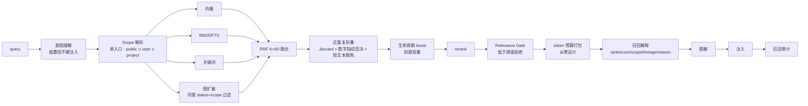

# 重设计 · 外部扫描结论与更正

> 输入：`.specs/refs/` 三份扫描报告 —— `intent-os-platform.md`（1946 行）、`mindmemos.md`（1003 行）、`page-parity-audit.md`（383 行）。
> 本文把三份报告的**结论、更正、可借鉴项**收敛为对重设计的直接影响，避免再回头翻 3300 行原文。
> 证据约定：**✅ 我亲验**（本会话内实测）／📄 扫描报告（原文带 `path:line`，为静态阅读结论）。

---

## 0. 三条最重要的结论

### 0.1 🥇 唯一生效的治理是「可执行门禁 + 证据词汇」（AO 元结论）📄

intent-os 的机械事实：

| 不变量 | 是否有门禁 | 现状 |
|---|---|---|
| 4 套 Chat API 白名单 | ✅ 有 `check_chat_route_whitelist.py` | **完好**（实跑 `exit=0`） |
| 「禁止全局流后本地过滤」（写在其 `AGENTS.md:90`） | ❌ 无门禁 | **在自家代码里被违反**（`handler.rs:1777,1801`） |

**推论**：文档、规范、分层叙事都不产生约束力，**只有可执行门禁产生约束力**。
→ 直接印证并**升级**本方案 `05-TECH-PLAN.md §3`：门禁是**第一原则**，不是配套设施；且门禁要覆盖**不变量**（架构约束、doc-fidelity 契约测试），不只是格式检查（i18n / 重复 / 骨架）。

### 0.2 🥈 读者既有采纳文档的算法公式**未经证实，不可作为实现依据** 📄✅

`.specs/intent-os-mindmemos-adoption.md` A3 的这套参数：

```
priority = 0.5·relevance + 0.25·overlap + 0.15·recency − 0.10·cost
30 天半衰期
mixed-v2 的 MMR λ = 0.70
```

**在 MindMemOS 全仓零命中**（含 `src/`、`config/`、`docs/`、`plugins/*.ts`）。MindMemOS 检索侧**只有 rerank + top_k 截断**，没有这套加权公式。

**处置**：本方案中一切引用该公式的地方**作废**，改为"从零设计"，并先建评测基线（见 §3.2）。文献级出处不明 ≠ 不可用，但**不得标为"借鉴 MindMemOS"**。

### 0.3 🥉 后端零删除，丢失 100% 在前端入口层 ✅

见 `07-RESTORE.md`：Core 路由 173→254、Panel 67→82、meta 白名单 55→105，**删除均为 0**；82 个删除路径**全部**在 `MemoryPanel/web/src/`。
→ 重设计的第一动作是**搬回**，不是重建。

---

## 1. MindMemOS（MM）结论与更正

### 1.1 实体模型：**Brain / Domain / MemorySpace / Agent 都不存在** 📄

MM 的组织维度是**扁平 scope 键**（user / app / session / agent），没有"域"这个概念。
实际实体：Account、Project、ApiKey、scope 键、Memory、MemoryType(7 类)、Entity、EntityType/EntityProperty、TemporalEntity（查询期物化视图）、Edge(8 种)、Source、Episode、AddRecord、SearchRecord、SchemaAddBuffer、ProviderBinding、SkillVersion/SkillBlob/SkillContext/SkillBinding/SkillTraceSummary、DreamingIssueGroup/ConsolidationAction、ImplicitFeedbackSignal。

**对比我们**：我们有 **12 个 Brain 域 + 5 种 `SpaceOwnerType` + 4 档 `WritePolicy`**（`memory-domain.ts` / `memory-space.ts` / `memory-write-router.ts`，✅ 代码真落地且有单测）。
→ **我们的实体模型比 MM 更细**。不要把 MM 的扁平 scope 当目标态倒推回来。

### 1.2 能力与实现落差（MM 的头号病：**配置开了但代码没跑**）📄

| 项 | 事实 |
|---|---|
| BM25 参数 | `encode_document/query` 的 `stats` 参数全仓 13 个调用点**无一传入** ⇒ `k1/b/idf` 全不生效，永远走 `log_tf` 兜底 |
| schema learning / MindMemEvolve | `EntityManager.register/update_property/save_to_file` **零生产调用方**（仅测试）；schema 是静态 preset JSON |
| higher-order 属性 | 机制**是真的**（persona preset 的 `user` 有 8 个 `order=2` 属性），但默认 preset(`schema_general`) 下**空转** → 启示：**核心能力不该藏在 preset 文件里** |
| 一批配置项 | `recall.*`(8)、`safety_gate.*`、`compaction_soft_token_budget`、`use_property_filter`、`min_scope_updates`、`scope_batch_size`、5 个 prompt、`enable_entities`、`HistoryPacker` 外部历史 —— **开了但无生效路径** |
| `default_add` | 已注册但公共 API 不可达 |
| 状态机 | 唯一真实状态机是 `SkillVersionStatus`；`MemoryStatus` 只是个 `Literal` |
| 删除 | 全部删除路径都是**软归档**（物理删除 API 零生产调用方） |

→ **对我们的门禁启示**：新增第 6 个门禁 `check-config-live`：**每个配置项必须有生效路径**（被读取且影响行为），否则 fail。这是 MM 最值得抄的"反向教训"。

### 1.3 危害级缺陷（我们要主动规避）📄

| # | 缺陷 | 对我们意味着什么 |
|---|---|---|
| 🚨 1 | **dreaming 隔离漏洞**：种子采集是**用户级**（`components/activity/collector.py:45` 的 `_SCOPE_FILTER_FIELDS` 含 `user_id`/`app_id`/`agent_id`），但**簇扩展的 Cypher 只按 `project_id` 过滤**（`pipelines/dreaming/default.py:260-287`）⇒ 同 project 下 **B 用户的记忆会被 A 触发的巩固拉进 cluster，并可能被 update/merge/archive** | MM 的模型是"project = 唯一强隔离"，所以它不算越权；**我们的模型是四轴 + RBAC，这在我们是明确越权**。→ 巩固/聚类查询**必须携带与种子相同的全部 scope 条件**，目标侧**独立校验写权限**，并加断言 **cluster 内 scope 集合 ⊆ 种子 scope 集合** |
| ⚠️ 2 | **图/向量双写不最终一致**：无 outbox/saga/2PC；`graph_pending` 无任何消费者，且**也涵盖 Qdrant 失败**（命名误导）；Neo4j 边写入用 `MATCH`，缺节点**静默丢边** | 若我们引入图侧存储，必须有 outbox 或至少失败可见；禁止静默丢边 |
| ⚠️ 3 | **dreaming 丢数据**：`fast` 一致性下"新建失败但源归档照做"**无失败短路**；LLM#1 失败仍把 scope 标 `done` ⇒ **永不重试**；LLM 异常在管道内被吞 | 我们的离线整理必须：失败短路 + 失败不标完成 + 异常不吞 |
| ⚠️ 4 | **时效只有左边界**：`validate_to` 全仓无写入点，且 `mappers/db.py:120-124` 的 `exclude_none=True` 使其**根本不落 payload** ⇒ 只能表达"从何时有效"，**不能表达"何时失效"** | 我们的 `meta_memory_edges.valid_to` 必须有真实写入点，否则同样退化成摆设；否则**明说只有左边界**，不假装双时间 |
| ⚠️ 5 | **lineage 回查是空能力**：`source="lineage_archived"` **只有消费者没有生产者** ⇒ `lineage_role` 恒 `current`、`MemoryLineage` 字段恒空、`include_patches` 描述的能力不存在 | 我们的血缘（`parentIds`/`rootId`/`supersededBy`）**必须有生产者**（纠错/合并/巩固三条路径都要写），否则又是一张空表 |
| ⚠️ 6 | **skill 发布门控失效**：只写 `observed`/`draft`，`published_head` 恒 `None` ⇒ `/v1/skills/sync` 恒 `has_update=false`；两插件硬编码 `base_version_id:""` ⇒ **纯插件场景演进停摆**；`usage=="modified"` 轨迹被排除在演进外 | 我们的 skill 版本/发布状态必须有真实状态跃迁与消费者 |
| ⚠️ 7 | 归档记忆**可被图检索召回**（图 Cypher 无 `status` 过滤） | 我们方案里 `archive` 域 `defaultRecall: false`（✅ 已实现）方向正确 —— **图扩展召回路径也必须过同一套状态/scope 过滤** |
| ⚠️ 8 | schema 路径用 `uuid4` ⇒ **消息重放产生重复** | 幂等键必须由内容派生，不能用随机 id |
| ⚠️ 9 | 未知 `entity_type` 被静默改写成 `animal` | 禁止静默改写；未知类型应拒绝或原样保留 |
| ⚠️ 10 | `RELATES_TO`(vanilla/dreaming) 与 `RELATED_TO`(schema) 是**两个常量** ⇒ 易致漏边 | 关系常量单一来源 |
| ⚠️ 11 | `sources` 的 dense 向量是**全零**且无 TEXT 索引 ⇒ 完全不可检索 | 向量写入必须校验非零 |
| ⚠️ 12 | 检索 API **无 `score` 字段** | 我们的检索试调台要出 score 拆解，MM 反而没有 |

### 1.4 MM 可借鉴（12 条中 Top 5）📄

| 序 | 借鉴项 | 为什么 |
|---|---|---|
| ★1 | **检索侧 Jaccard 近重复折叠**（放在 **rerank 之前**，带数字指纹否决 + 短文本豁免） | 最高性价比；直接提升注入质量 |
| ★2 | **两阶段 dreaming 的六个工程护栏**：共享实体聚类 / 噪声实体过滤 / **确定性归档先行** / 逐组动作 / 可验证不变量守卫 / "不可判定不动手"提示词 | 让离线整理可控、可解释、不丢数据 |
| ★3 | **写入侧预算分层 + 保头保尾的结构化压缩** | 长对话写入不丢关键首尾 |
| ★4 | **检索结果的 token 预算打包**（MM **也没有**，须**从零设计**，切勿照抄我们旧文档的 MMR 公式） | 这是 retention 层，不是 RRF 层 |
| ★5 | **schema 两段式检索 + 实体收缩**（含动态属性预算分配 + 四层时间回退） | 结构化记忆的进阶形态 |

---

## 2. intent-os-platform（AO）结论与更正

### 2.1 它的文档系统性不可靠，且它自己知道 📄

| 文档声称 | 代码事实 |
|---|---|
| `product/06_architecture_solution/` 描述 Go/Gin 微服务 + Redis + Kafka + ClickHouse + Neo4j + Jaeger | 这些在 Rust 里**零依赖** |
| 16 个 `services/*` 目录 | **13 个是零代码空壳** |
| `docs/` 下 .md 数量 | 实测 **913**（+ `product/` 下 99），非任务书说的 ~1352 |

→ **别抄它的分层叙事，抄它"约束如何被强制执行"**（即 §0.1 的门禁元结论）。

### 2.2 12 主题要点（只留对我们有用的）📄

| # | 主题 | 结论 |
|---|---|---|
| 1 | 概念实体 | **Agent 是唯一执行原子**；核心抽象是 `EntryKind(19) × RuntimeProfile(7) × AgentDefinition` 三者正交；**不存在名为 Unit 的类型** |
| 2 | 系统分层 | 真实是 `sdk→infrastructure→domain→apps→services`（`check-layering.sh` **ratchet 强制**）→ **ratchet 式门禁**值得抄（只减不增） |
| 3 | 智能体模型 | Team 是**唯一**多 Agent 子系统；四种协作模式**编译期全部塌缩为同一个 `studio.parallel@1`** → 多模式是配置幻觉 |
| 4 | 工具系统 | `ServerResolvedCallableInventory` **单一授权链** + 6 轴 closed-set `ToolDescriptor` + `#[copilot_op]` 93 处；但"同一 inventory"是**目标非现状**（六项 checklist 未完成） |
| 5 | 审批 | 无独立服务、无策略 DSL、**无多级/委托/批量审批**；三值裁决 + 12 个 typed deny reason + SSE **刻意 counts-only** + **决策面/详情面分离** + `PendingApprovalSnapshot` 崩溃恢复 → 后三点值得抄 |
| 6 | 场景与意图 | Scene 是 **40+ 字段 recipe 实体**（`evolution_state` 未实现）；`Scenario` 四大场景**零实体**；Intent/Plan 中间层**已退役**（表零写入）→ 别引入意图中间层 |
| 7 | 会话与任务 | Run 是唯一执行原子（`RunStatus` 11 值）；**三套互不相通的会话存储**（仅 `shell_sessions` 有 owner+fencing）；Task Center **刻意无状态机**（三腿 `UNION ALL` + 自由 VARCHAR + 12h 启发式 → 实测"50 条顶着执行中"）→ **反面教材**：我们方案里任务必须有真实状态机 |
| 8 | 技能 | Skill = 渐进披露 prompt + 文件包（**≠ Tool**），只注入 `name+description`，正文走 `skill_view`，靠 3 个 meta tool 桥接；DB `skill_md` 与 bundle 内 `SKILL.md` **长度不一致（9519 vs 16300 字节）是遗留双真相源** → 渐进披露值得抄；双真相源要避免 |
| 10 | 记忆（重点） | 两条能力路径（Space 工具面 / Hook 面）+ 三层存储（Brain `.md` 文件 + pgvector + 缓存）；**RRF(60) 混合检索 + 轻度生命周期 boost + `superseded_by` 关系 + recall@k/nDCG 评测 + 5 个可插拔 provider** |
| 11 | 安全 | 多层 fail-closed（未知能力即 deny、`SecretValue` 类型级防线、spawn 首条语句复校、`ExecOptions.env` 只允许 `NO_COLOR`）；**但**安全权威文档是占位、**SSRF 默认放行内网**、记忆空间绑定 SQL 存在 **public-agent 越权读路径** → 抄 fail-closed 模式，别抄它的漏洞 |
| 12 | 观测 | **关联优先零新表**（7 张账本加 trace 列 + 部分索引）+ 事件分级持久化 + **显式 `gaps`**；但传播链断、audit 只覆盖 Agent CRUD、admin-only 声明**未挂中间件** → "零新表关联"与"显式 gaps"值得抄 |

### 2.3 AO 最大风险（三个，全是"单独测都通过、只在用户处暴露"）📄

1. **记忆域三个互不重叠的读写世界共用 `memory_stream`**：
   - α 工具有 `superseded_by` 过滤
   - γ 元工具 `memory_search` **没有**（纯 ILIKE）
   - β Hook 生产**只能写 `SessionTransient`**，且 3/12 事件**必然失败**
   → **每条路径单独测都通过，可见性不一致只在用户处暴露**
2. **`RoutingMemoryProvider` 构建失败静默回退 internal** → "数据实际落在哪里"与配置不符（记忆平台是合规级问题）
3. **`MemoryWriteScope::review_durable` 零生产调用方**，`archive_stale`/`restore_archived` 也零调用方 → **无遗忘/衰减闭环**

→ 对我们的直接要求（已写入 `05-TECH-PLAN.md` §3/§7）：
- **召回可见性只允许一条路径**（单函数 + 枚举式门禁）—— 这是 AO 用自身缺陷换来的第一借鉴项
- **禁止静默回退**：provider/路由解析失败必须显式失败或显式告警，不得静默换目标
- **遗忘/衰减必须有生产调用方**（否则等于没有）

### 2.4 AO 可借鉴 Top 5 📄

| 序 | 借鉴项 | 直接解决我们什么 |
|---|---|---|
| ★1 | **`MemoryScopeKind` 类型化作用域**：4 类形状校验 + `storage_key` 由类型派生 + **写入策略 × 事件种类互斥矩阵**（非法组合返 typed error） | 我们的 `spaceId = sp_sha1(ownerType:ownerId:domain)` 已有"派生"思想，但**缺互斥矩阵**与类型级校验 |
| ★2 | **召回可见性只允许一条路径**（单函数 + 枚举式门禁） | 直接规避它的"三世界"缺陷；我们已有 `resolveMemoryScope`，需提升为**唯一入口** |
| ★3 | RRF 混合检索 + **刻意轻量**生命周期 boost + **先建 recall@k golden set 再改召回** | 定我们的 P4 顺序：**评测基线先于算法改动**（"C3 before C1"） |
| ★4 | **`superseded_by` 自引用关系**（"取代是关系不是状态"，`ON DELETE SET NULL` 使替代者被删时旧项**自动复活**） | 修正我们的 `04-SCHEMA.md`：取代用自引用关系，不用状态字段 |
| ★5 | **把不变量写成可执行门禁 + doc-fidelity 契约测试** | = §0.1，方案第一原则 |

---

## 3. 对重设计方案的直接回灌

### 3.1 门禁机制升级为第一原则（`05-TECH-PLAN.md §3`）

原 5 个脚本 → **7 个**，并加两类"不变量"门禁：

| 脚本 | 类型 | 检查 |
|---|---|---|
| `check-i18n` | 格式 | `t('key')` 必须有定义（当前 24 个真缺键，`error.` 是拼接误报） |
| `check-routes` | 结构 | 每路由有入口或标 `__subpage__`；每 `pages/*` 被引用 |
| `check-duplicates` | 格式 | 同名冲突 / 重复注册 / 重复 interface |
| `check-skeleton` | 格式 | 禁「骨架阶段」合入 main |
| `check-claims` | 证据 | `.specs` 的「✅ 已完成」须附证据 |
| **`check-config-live`（新）** | **不变量** | **每个配置项必须有生效路径**（MM 头号病） |
| **`check-invariants`（新）** | **不变量** | 架构约束：Web 不得直连内核；召回可见性单入口；禁止静默回退；遗忘/衰减有生产调用方 |

配套：**ratchet 模式**（首轮 baseline，违规只减不增）+ **doc-fidelity 契约测试**。

### 3.2 召回链路改写（`03-FLOWS.md §3`）

**作废**：MMR λ=0.70、`priority` 加权公式、30 天半衰期（§0.2 未证实）。

**改为**（顺序即优先级）：



**顺序铁律**：**先建 recall@k / nDCG golden set 评测基线，再动任何召回算法**（AO ★3）。

### 3.3 Schema 修正（`04-SCHEMA.md`）

| 项 | 修正 |
|---|---|
| 取代关系 | 用 **`superseded_by` 自引用 + `ON DELETE SET NULL`**，不用状态字段（"取代是关系不是状态"） |
| 时间边 | `meta_memory_edges` **只承诺左边界** `valid_from`；`valid_to` 必须有真实写入点，否则删掉不假装双时间 |
| 血缘 | `parentIds`/`rootId`/`supersededBy` **必须有生产者**（纠错/合并/巩固三条路径都写），否则不建 |
| 巩固聚类 | 聚类查询**必须携带与种子相同的全部 scope 条件** + 目标侧独立写权限校验 + 断言 `cluster.scope ⊆ seed.scope` |
| 幂等键 | 由内容派生，**禁止 uuid4**（消息重放会重复） |
| 关系常量 | 单一来源（避免 `RELATES_TO`/`RELATED_TO` 双常量） |
| 图侧写入 | 需 outbox 或失败可见；**禁止静默丢边**；`archive` 域在图路径同样不可召回 |

### 3.4 安全与可靠性（`05-TECH-PLAN.md`）

- **召回可见性单入口**：`resolveMemoryScope` 提升为唯一门禁（枚举式，非 if 散落）
- **禁止静默回退**：provider / 路由解析失败 → 显式失败或显式告警
- **遗忘/衰减必须有生产调用方**（AO 的 `archive_stale`/`restore_archived` 零调用方 = 没有该能力）
- **审计覆盖面**：AO 的 audit 只覆盖 Agent CRUD、admin-only 声明未挂中间件 → 我们的审计账本（C1）必须覆盖**四类事件**且与鉴权中间件同源
- **配置项必须有生效路径**（`check-config-live`）

### 3.5 新增风险登记（进 `05-TECH-PLAN.md §6`）

| 风险 | 来源 | 措施 |
|---|---|---|
| 三个读写世界致可见性不一致 | AO 实测 | 召回/写入各**只允许一条路径** + 枚举式门禁 |
| 静默回退致"数据落在哪"与配置不符 | AO 实测 | 解析失败显式失败 |
| 配置开了但代码没跑 | MM 实测（BM25/recall/safety_gate 等一批） | `check-config-live` 门禁 |
| 巩固越权（跨用户拉进 cluster） | MM 实测 | scope 断言 + 目标侧写权限校验 |
| 离线整理丢数据 | MM 实测 | 失败短路 + 失败不标完成 + 不吞异常 |
| 血缘/时效退化成空能力 | MM 实测 | 有生产者才建字段；否则不建 |
| 任务无状态机导致状态失真 | AO 实测（"50 条顶着执行中"） | 我们的任务必须有真实状态机 |

### 3.6 对外集成发现（D8 接入域）📄

**intent-os 已内置 `TencentDbProvider` 适配器**（`intent-memory/src/provider/tencentdb.rs`），但 **wire 契约已失效**：

| 它调用 | 真实 Hermes 网关 | 结论 |
|---|---|---|
| `POST /v1/messages` | 不存在 | 无此端点 |
| `POST /tools/tdai_memory_search` | 不存在 | **它把 LLM tool 名当成了 HTTP 路径**；该名已废弃（现名 `memory_tencentdb_memory_search`） |
| — | 实际有 `/recall`、`/capture`、`/search/memories`、`/search/conversations`、`/session/end`、`/seed`、`/health` | 应以此对齐 |

另：它的 `store()` 收 `_ctx: &MemoryCtx` **完全不用**，**六维隔离降成一维 `agent_id`**；`forget`/`list` 明确 `Unsupported`。

→ 列为**对外集成待办**（非本重设计阻塞项）：要么修 provider 对齐真实端点并恢复多维隔离，要么在对接文档中明确"不支持该 provider"。

---

## 4. 更正记录（对既有 `.specs` 文档）

| 文档 | 原陈述 | 更正 |
|---|---|---|
| `intent-os-mindmemos-adoption.md` A3 | `priority=0.5·rel+0.25·overlap+0.15·recency−0.10·cost`、30 天半衰期、MMR λ=0.70「借鉴 MindMemOS」 | **MM 全仓零命中**，不是 MindMemOS 的做法；降级为"待设计的候选方案"，不得作实现依据 |
| `intent-os-mindmemos-adoption.md` 整体 | 以 MM 为算法蓝本 | MM 检索侧**只有 rerank + top_k**；其"算法优势"多为未落地配置或空转 preset |
| `memory-platform-backlog.md` B8 | 「固定 7 类 → 加 entity/property/edge」 | MM 的 entity/schema 学习**零生产调用方**；我们加入前必须先定**生产者**，否则同为空表 |
| `CONTEXT.md` 技术债 | 「无测试框架/无测试文件」 | 实测 MemoryKnowledge 190 / Core 30 / Proxy 3 测试文件（Panel 0） |
| `v3-api-memorycore-doc.md` | 自称 108 个接口 | 实现 **254 条** → **104 条未文档化**；且该文档两版 md5 相同 ⇒ **文档不能作为能力变更证据** |
| `panel-api-doc.md` | 未记 `/analytics/*`、`/memory/*`、`engine/*`、`gitnexus/*` 等 | 同样严重滞后 |
