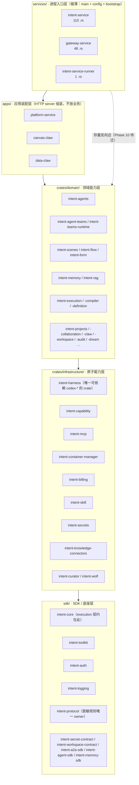
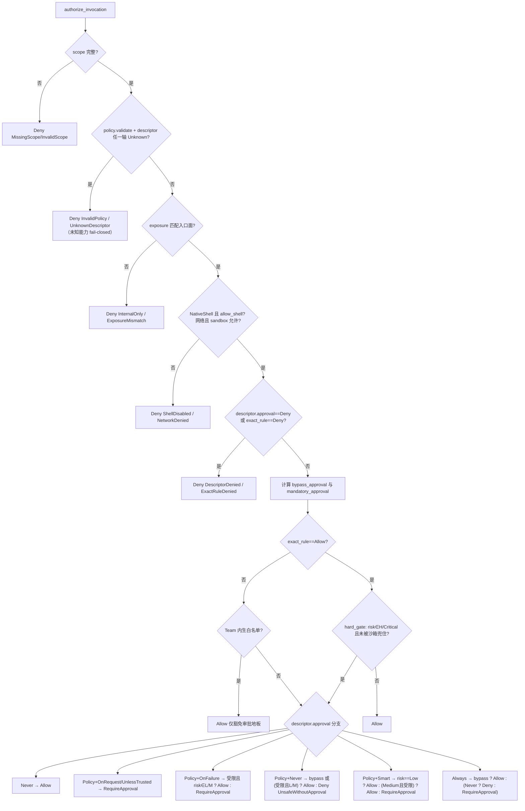
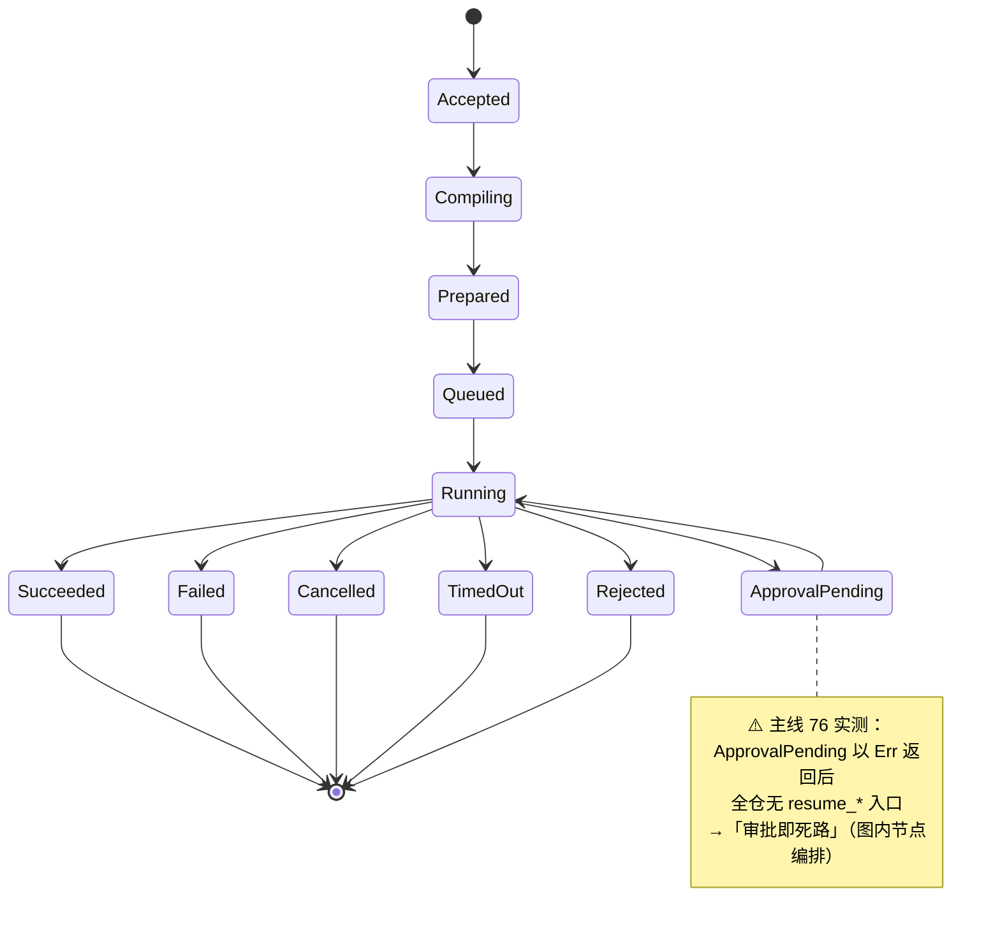
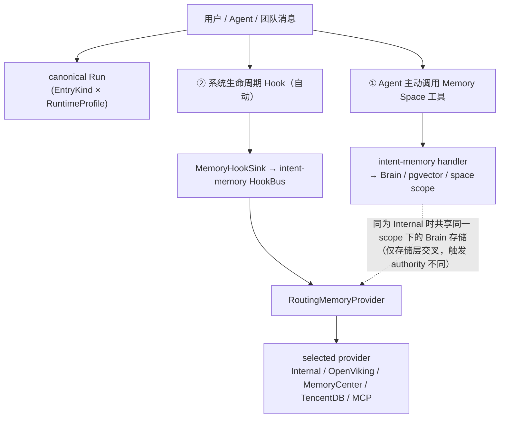
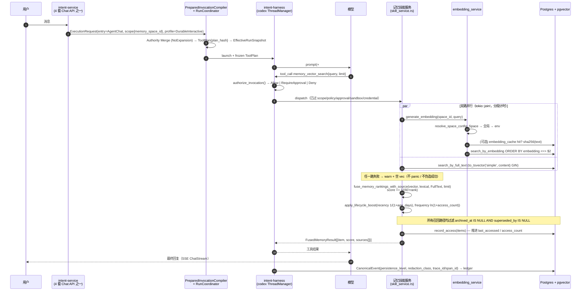
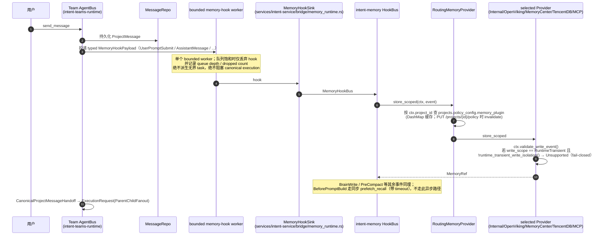
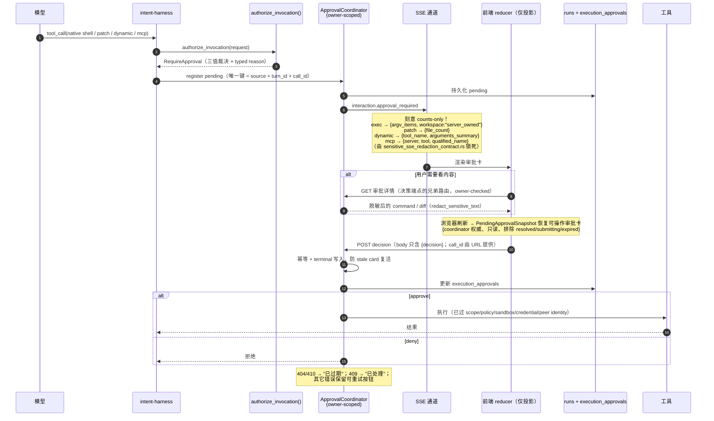

# intent-os-platform 架构与概念总结

> 面向「借鉴」的批判性设计参考。研究对象：`/home/malizhi/project/intent-os-platform`（自称 Agent OS / 智能体操作系统）。
> 读取基数：`docs/` 913 个 `.md` + `product/` 99 个 = **1012 份文档**；另核验 `sdk/`、`crates/`、`services/`、`apps/` 源码与 214 个 SQL migration。
> 阅读约定：每条结论标注来源路径，并标注 **【代码已落地】/【文档声称】/【两者冲突】**。凡冲突，以源码 + `AGENTS.md` + 各主线 `01_authoritative.md` 为准。

---

## 0. 一句话定位

**一个以「Agent 为唯一执行原子」、以「七类 Runtime Profile + 单一编译链」收敛所有入口的场景驱动型 Agent 执行平台**；它把自己叫 Agent OS，但项目自己的评估文档承认当时的实质是「**Workflow Engine + Scene Library**，执行引擎超规格交付，认知中枢几乎全缺」（`product/09_agent_os_evolution/README.md`，2026-06-09，自评与 ECOS Agent OS 11 层对齐度约 45%）。

判断：**它的价值不在"操作系统"这个定位，而在执行内核的工程纪律**——统一编译链、fail-closed 授权、审批决策面/详情面分离、事件分级持久化、以及一套成熟到罕见的"可记忆本体"（Brain 文件 + pgvector + 知识图谱 + 4 路召回 + 5 个可插拔记忆后端）。记忆平台应该借的是这些，而不是它的分层叙事。

---

## 1. 概念与功能实体总表

| 实体 | 定义 | 关键字段 / 枚举 | 落地位置 | 证据 |
|---|---|---|---|---|
| **Agent（Atomic Agent）** | 唯一的自主执行原子；Team/Scene/Workflow/Workbench 只引用其 id+revision，不复制其定义 | `origin`、`catalog_class`、`management_mode`、`purpose_key`（内部 Agent 分类轴，**独立于 visibility**） | `sdk/intent-core/src/execution/agent.rs`、migration `163_atomic_agent_registry.sql`、`173/174_internal_agent_full_access` | 代码已落地 |
| **AgentBinding** | 把 Agent 绑定到消费方（agent/team/memory space/…），可钉 revision 并收紧权限 | `binding_id`、`consumer_kind`、`consumer_id`、`role`、`agent_id`、`revision_policy`、`field_locks[]`、`tightening_overlay` | `sdk/intent-core/src/execution/agent.rs:801`；`AgentRevisionPolicy{Pin,FollowStable,FollowStaged}` | 代码已落地 |
| **EntryKind（入口类型）** | "请求从哪来"的正交分类，共 **19 个变体** | `DirectLlm, TaskCenter, AgentChat, Workbench, ProjectMessage, SceneChat, SceneRun, SceneClaw, MemoryConversation, MemoryManagement, Shell, Onboarding, FlowNode, FormTurn, AutomationFire, InternalJob, ExternalApi, CognitiveStage, A2aMessage` | `sdk/intent-core/src/execution/contracts.rs:11-37` | 代码已落地 |
| **RuntimeProfile（运行模式）** | "这次执行的生命周期剖面"，共 **7 类** | `EphemeralInteractive, DurableInteractive, ScopedSingleton, WorkspaceInteractive, ParentChildFanout, WorkflowJob, EphemeralStructured` | `sdk/intent-core/src/execution/contracts.rs:492-500` | 代码已落地 |
| **ExecutionRequest** | 所有入口的唯一请求契约（不可变意图） | `request_id, entry, scope, input, session, output, tool_budget, overlay, requested_profile, idempotency_key, trace_context` | `contracts.rs:705-731` | 代码已落地 |
| **ResourceScope（工作范围）** | 六套 authority 之一的"调用范围"；可序列化为稳定 `scope_id` | `owner_id, organization_id, project_id, team_id, scene_id, agent_id, task_id, memory_space_id, workspace_id, workflow_id, workflow_node_id, builder_entity, parent_scope_id` | `contracts.rs:75-105`；`to_scope_id()/from_scope_id()` 带 `v1:` 版本前缀 + hex | 代码已落地 |
| **Run（执行实例）** | 每次真实执行的事实记录；**含 `EphemeralStructured`（只是不建 chat session）** | `run_id, parent_run_id, business_session_id, owner_id, scope_id, entry_kind, runtime_profile, snapshot_hash, status, current_attempt, terminal_reason, build_provenance` | `sdk/intent-core/src/execution/event.rs:36`；migration `161_unified_execution_kernel.sql` | 代码已落地 |
| **ExecutionAttempt** | Run 下的一次尝试，重试即新增 attempt | `AttemptKind{Initial,BackendRetry,SchemaRepair,ResumeFallback,WorkflowRetry,InfrastructureRetry}` | `event.rs:79-104` | 代码已落地 |
| **ToolPlan** | **冻结的授权制品**（不是建议）：hash 覆盖工具 allow/deny、MCP 绑定、沙箱、审批、刷新策略 | `allowed_tools, denied_tools, mcp_bindings, sandbox_policy, approval_policy, refresh_policy, plan_hash` | `sdk/intent-core/src/execution/policy.rs:392-403` | 代码已落地 |
| **ServerResolvedCallableInventory** | 服务端解析出的"可调用项清单"，是工具授权唯一真相 | `revision`（callables×provenance 的稳定 hash）、`authorization_provenance`、`callables[]` | `policy.rs:298`；`freeze()` 做排序/去重/identity 三重校验；`validate_revision()` 可随时查漂移 | 代码已落地 |
| **ToolDescriptor** | 工具的六轴分类，全部 server-owned、closed set | `category`(23+)、`backend`、`effect`、`risk`、`approval`、`exposure`（+ `idempotency`） | `sdk/intent-toolkit/src/registry.rs` | 代码已落地 |
| **Skill** | **渐进披露的提示词+文件包**（≠ Tool） | `SKILL.md` frontmatter `name/description`；`SkillStoreEntry{skill_id,name,description,tags,version,author,blob_path,published_at,downloads,status,visibility,owner_id,is_owner}` | `crates/infrastructure/intent-skill/`；`skills/intentos-knowledge/SKILL.md` | 代码已落地 |
| **Scene（场景）** | 「静态计划库」的核心实体，可 fork、有 release | `scene_id, risk_level(L0-L4), scene_type, interaction_mode, ui_shell, evolution_state, forked_from, status, usage_count, success_rate, capabilities_json, knowledge_refs_json` | migration `001_init.sql:26`；`crates/domain/intent-scenes/src/domain/scene.rs:6` | 代码已落地 |
| **SceneStep / SceneParam / SceneRelease / SceneSession** | 场景的步骤、参数、发布版本、运行会话 | step: `step_order, instruction, capability_type, capability_id, params_json, depends_on[], timeout_seconds, retry_count` | migration `001_init.sql:53,69`；`scene_releases`/`scene_favorites`/`scene_shares`/`scene_sessions` | 代码已落地 |
| **Project / Team / TaskRecord** | 协作域；Task 是项目内任务卡 | `TaskRecord{task_id, project_id, title, status, priority, assigned_to, objective_id, dependencies, blocker_reason, token_cost, is_primary}` | `crates/domain/intent-projects/src/domain/task.rs:6`；`projects`、`agent_teams`、`project_agents` | 代码已落地 |
| **MemorySpace（记忆空间）** | 用户/Agent 可见的记忆与知识工作面 | `memory_space_id, name, description, owner_id, visibility, persona_prompt, summary, summary_prompt, chunk_size_bytes, chunk_overlap_bytes, embedding_config, supports_parallel_tool_calls` | `crates/domain/intent-memory/src/domain.rs:51`；migration `020/022/049/137/151` | 代码已落地 |
| **Memory item（记忆条目）** | 一条可召回的向量化记忆；**现代码已有生命周期与取代关系** | `memory_item_id, memory_space_id, agent_id, content, embedding, importance_score, memory_type, metadata_json, last_accessed, access_count, archived_at, superseded_by, superseded_at` | `domain.rs:180`；migration `199_memory_stream_lifecycle.sql`、`200_memory_stream_supersede.sql` | 代码已落地 |
| **MemoryProvider（记忆后端）** | 可插拔记忆后端接口；**5 个实现** | `PluginId{Internal, Openviking, Memorycenter, Tencentdb, Mcp}`；`ProviderCapabilities{semantic_search, full_text_search, time_filter, session_aware, native_embedding, forget_by_scope, layered_extraction}` | `crates/domain/intent-memory/src/provider/{mod,factory,routing,internal,openviking,memorycenter,tencentdb,mcp_provider}.rs` | 代码已落地 |
| **Execution Definition / Revision / Publication** | 主线 55 的不可变静态定义三层（可视化编排） | `ExecutionDefinition`、`DefinitionRevision`、`DefinitionPublication`、`SubjectPublication`、`ExecutionSubjectKind{Agent,AgentTeam,AgentFlow,Unknown}` | `crates/domain/intent-execution-definition/src/lib.rs:131,169,517,570`；migration `165-171` | 代码已落地 |
| **AutomationTemplate / AutomationFire** | 定时/触发式执行 | `AutomationDefinitionProjection`、`AutomationFireRuntimeRefs`、`AutomationFireStartAuthorization`、`AutomationFireReconcileReport` | `crates/domain/intent-automation/src/{types,execution_definition,service}.rs` | 代码已落地（主线 34 REOPENED/PARTIAL） |
| **WorkspaceFiles** | 统一工作空间文件（一个前端面 / 一个后端 contract / 多 scope adapter） | `WorkspaceBinding, WorkspaceScope, WorkspaceRootKind, WorkspaceRevision, WorkspaceFileMetadata, WorkspaceFileKind, WorkspaceFileEvent` | `sdk/intent-workspace-contract/src/`；主线 73 CLOSED 18/18 | 代码已落地 |
| **CanonicalEvent** | 执行的唯一事件账本条目，带分级持久化与脱敏等级 | `sequence, class, event_type, persistence_level, trace_id/span_id/parent_span_id, span_kind, trace_surface, source_component, redaction_class` | `event.rs:143`；`PersistenceLevel{Critical,Operational,Transient}`、`RedactionClass{Public,Internal,Sensitive,SecretReference}` | 代码已落地 |
| **Approval（审批）** | 一次工具调用的调用时裁决 + owner-scoped pending | `ApprovalRequestKind{Exec,Patch,Dynamic,Mcp}`、`ApprovalDecision{Approve,Deny}`、`PendingApprovalSnapshot` | `crates/infrastructure/intent-harness/src/approval.rs:150-224` | 代码已落地 |
| **Secret** | 统一凭据引用与解析（唯一解析口） | `SecretResolver`、`SecretValue`（无 Serialize/Display，Drop zeroize）、`${secret:NAME}` | `sdk/intent-secret-contract/src/lib.rs:86-175` | 代码已落地 |
| **A2A Agent Card / Peer** | 外部 Agent 互操作（v1.0） | `A2aAgentCard`、per-peer Bearer、`SsrfPolicy` | `sdk/intent-a2a-sdk/src/`、`crates/infrastructure/intent-a2a/src/security/` | 代码已落地（默认关闭） |
| **Intent / Plan（已退役）** | **作为持久化中间业务层已退役且不恢复**；仅存 410 路由与未 DROP 的表 | `/api/v1/intents*`、`/api/v1/plans*` → `410 Gone`，`code=LEGACY_INTENT_PLAN_RETIRED` | `services/intent-service/src/handler/{intent,plan}.rs`；`intents/plans` 表仍在 `001_init.sql:81,96` | 代码已落地（退役） |

**不存在的东西（避免按名字推断）**：没有名为 `Unit` 的类型；`services/` 下 16 个目录中 **13 个是零 Rust 代码的空壳**（仅 `README.md` + 0 字节 `.gitkeep`），但仍在"权威架构文档"里被描述成 Go 微服务。

---

## 2. 系统分层

### 2.1 代码分层（真实、有门禁强制）

`crates/README.md` 定义四层单向依赖，由 `scripts/arch/check-layering.sh` 从 `cargo metadata` 计算禁止边并 ratchet 强制（**只减不增**，排掉的边必须同批删除，否则算 stale 报错）：



**门禁强制的硬规则**（`scripts/arch/check-layering.sh`）：
- A1 `intent-core/toolkit/auth/logging` 零内部依赖；
- A2 点名禁止 `intent-memory → intent-agent-teams`（层反转）与 `intent-billing → intent-agent-sdk`；
- A3 **任何东西都不得依赖 `apps/platform-service`**（它是应用宿主）；
- C **只有 `intent-harness` 可依赖 `codex-*`**（内核可替换性）；
- B `apps/`、`services/` 只能依赖 SDK/L1/L0，两个 Phase 10 入口进程例外。

### 2.2 功能分层（目标态，63% 未达成）

项目用 ECOS Agent OS 的 **11 层**给自己对账（`product/09_agent_os_evolution/01_capability_gap_analysis.md`，2026-06-09）：

| 层 | 能力 | 当时覆盖度 | 现状核对（2026-09） |
|---|---|---|---|
| 1 Intent | Parser/Router/Disambiguator/History | 🔴 0% | **部分补齐**：`EntryKind::CognitiveStage` + 主线 67 CLOSED（意图解析/澄清/复盘） |
| 2 Planning | Scene Library/Dynamic Planner/Validator | 🟡 25% | 仍静态 Scene 单轨；主线 76 四拓扑未兑现 |
| 3 Agent | Registry/Runtime/Team/Bus | 🟢 75% | Agent Hub + Atomic Agent registry 已落地 |
| 4 Orchestration | Workflow/Coordination Patterns | 🟡 50% | `DefinitionProgramExecutor` 有，但无 checkpoint/resume |
| 5 Execution | Runtime/Container/Harness | 🟢 90% | 主线 54 统一内核已集成 |
| 6 Memory | 5 层分层 + 统一检索 | 🟡 30% | **显著超出该评估**：Brain+pgvector+图+RRF+生命周期+取代+5 后端 |
| 7 Capability | Registry/MCP/Adapter | 🟢 80% | `CapabilityKind` 4 值（不含 MCP） |
| 8 Decision | Policy/Self-Reflection/Feedback | 🔴 0% | 部分补齐：`intent-curator`、`intent-dream`、review session |
| 9 Observability | Tracing/Metrics/Replay | 🔴 10% | 部分补齐：`TraceSpanKind` 12 值、canonical event、主线 66 |
| 10 Governance | Auth/Quota/Billing/Audit | 🟡 50% | `intent-audit`、`intent-billing` 已落地 |
| 11 Interface | HTTP/SSE/WS/gRPC/SDK | 🟢 85% | 收敛为 4 套 Chat API |

### 2.3 ⚠️ 两套架构叙事并存（最重要的分层陷阱）

| 叙事 | 来源 | 真实性 |
|---|---|---|
| `services → apps → crates/domain → crates/infrastructure → sdk` | `crates/README.md`、`AGENTS.md §3` | ✅ **对应真实源码** |
| Phase A 单体（Go+Gin）→ B 服务拆分 → C 微服务（ClickHouse/Neo4j），含 `intent-service(Go)`、`planner-service`、`run-service`、`approval-service` | `product/06_architecture_solution/01_system_architecture_v2.md` §3–§4（v3.30，却声明"状态：已确认"） | ❌ **历史正文未清理**；`services/README.md` 自认这些目录"并非当前主实现" |

**该文档是本仓库最危险的文档陷阱**：标题与版本号是当前的（顶部 changelog 到 v3.30 / 2026-08-08），正文 §4.3–4.5 却是 Phase A 的 Go 设计，描述的三个服务只有 `README.md`。**只读"权威架构文档"会得出与源码相反的结论。**

---

## 3. 智能体模型

### 3.1 定义性结论

**Agent 不是"一个类"，而是三件正交东西的组合**：`EntryKind`（19 种入口来源）× `RuntimeProfile`（7 种生命周期）× `AgentDefinition`（owner-aware 配置）。"Direct / Workbench / Team / Claw / Scene AI"只是 `EntryKind` 的产品投影，**不构成独立执行体系**（`docs/diagrams/17-agent-types-analysis.html` §01，2026-08-24）。

### 3.2 要点

| 结论 | 来源 | 证据 |
|---|---|---|
| Agent 是唯一执行原子；Team/Scene/Workflow 只引用 id+revision+binding | `AGENTS.md:84`；主线 54 authority:30；主线 55 A55-13:51 | 代码已落地（`CompileError::NoExpansion`） |
| Team member 复用同一 owner-aware resolver，只追加服务端 canonical overlay | 主线 12 DONE；`intent-agent-teams/src/execution_definition.rs:139` | 代码已落地 |
| **Team overlay 不得扩权** | `AGENTS.md:89`；主线 54 D8 | 代码已落地（`ensure_tool_subset`，`intent-core/src/execution/runtime.rs:1265`） |
| 三类 entry adapter（不是三类 Agent）：`AgentSession`+`HarnessAdapter` / `SingleTurnEngine`+`AiSceneService` / 团队会话执行器+`ToolHandler` | `17-agent-types-analysis.html` §03 | 代码已落地 |
| Conversation Policy（声明式数据合同）与 Runtime Hook（执行机制）分层 | 主线 49 authority:44-100 | 代码已落地（`conversation_policy.rs`、`runtime_hooks.rs`） |
| Runtime Hook **7 阶段固定顺序**：`BeforeTurn / BeforeSessionStart / BeforeToolAdvertise / BeforeUserTurnSubmit / OnRuntimeEvent / OnToolCall / AfterTurn` | `crates/domain/intent-agents/src/runtime_hooks.rs:56-64` | 代码已落地（主线 49 authority 只列 6 个，**以代码为准**） |
| Team 内核 `intent-teams-runtime` 只依赖 `intent-core`+`intent-protocol` | `intent-teams-runtime/Cargo.toml:6-7` | 代码已落地 |
| 平台 Chat 收敛为 **4 套 API**，第 5 套被门禁阻断 | `docs/architecture/chat-api-boundaries.md`；`scripts/arch/check_chat_route_whitelist.py`；主线 72 CLOSED | 代码已落地 |
| A2A 是独立垂直模块，默认关闭 + `internal_only + private discovery` | `product/06/01:31-35`（v3.26）；主线 62 | 代码已落地（migration 178/179/182/184/202） |
| **`intent-dispatch` 不是 Agent 调度**，是 runner 容器 gRPC 消息路由 | `crates/domain/intent-dispatch/src/lib.rs:1-16`；`docs/runner-network-topology.md` | 代码已落地 |
| 团队四种协调模式真正生效 | 主线 76 authority | **未落地**（见 3.4） |
| AgentOSWork Desktop 与 intent-service 收敛 | 主线 64 | **仅规划，未实施** |

### 3.3 四套 Chat API（由白名单脚本强制，`scripts/arch/check_chat_route_whitelist.py`）

| 套 | 面 | 路由 |
|---|---|---|
| 套 1 | 通用助手 | `NEST /api/v1/chat` + `ROUTE /api/v1/chat/`；`/api/v1/workbench/invoke` |
| 套 2 | Agent 直连 | `/api/v1/agents/{agent_id}/chat/`、`/api/v1/agents/{agent_id}/invoke` |
| 套 3 | 工作区对话（Claw） | `/api/v1/scenes/{id}/claw/invoke` |
| 套 4 | 团队协作 | `/api/v1/agent-teams*`、`/api/v1/projects/{project_id}/chat-events` |
| 迁移例外 | 410 退役壳 | `/api/v1/scenes/{id}/chat/turn`、`/api/v1/spaces/{space_id}/chat` → 指往 `/api/v1/agents/system.memory.*/chat/*` |
| 独立产品 | canvas-claw / data-claw | `/api/v1/canvas/chat`、`/api/v2/chat` |

**这 4 套 API 的收敛是真实成果**（前端 11 个对话入口 → 后端 4 套），且**由静态门禁而非纪律维持**——这是一个值得抄的模式。

### 3.4 冲突：团队编排的"数据模型唯一真相、执行层未兑现"

主线 76（`docs/planning/76_team-coordination-model-orthogonalization/01_authoritative.md`，状态：规划冻结/待动土）用 15 条逐条源码核实自证四层断裂：

1. **编译层**：`projection.rs:785-794` 把 `agent_team.{hierarchical,pipeline,parallel,freeform,broadcast}@1` **五个模式 marker 全部映射为同一个 `studio.parallel@1`**；`agent_team.reducer@1` 错配到 `studio.condition@1`。
2. **执行层**：`DefinitionProgramExecutor` 的 `data_state` 在**内存**、wave 是**编译期静态**、超额 `return Err` 而非排队、`ApprovalPending` 以 `Err` 返回导致栈丢失。
3. **最致命**：`post_team_run` 返回的 `"run_id"` 其实是 `msg.message_id`（`team_handler.rs:216`）——**"团队运行"根本不是 canonical Run**。
4. **模型层**：76 提出的 `TeamCoordinationAxes` / `Topology{Star,Chain,FanOut,Mesh}` / `axes_from_preset` **全仓 grep 零命中**。

**对记忆平台的直接含义**：不要把"多源/多步记忆编排"建在"一次调用 = 一个 Run"的假设上，也不要用互斥 enum 表达"拓扑 + 治理"的组合语义。

### 3.5 副产品教训：心跳事件把库撑爆

`STATUS.md`（2026-08-17）记录：`status` 类心跳事件（`llm_activity` / `agent_status` / `token_count` / `compact_started` / `compact_finished`）在两库合计 **203 万条**，agentoswork 库 **828M → 17M**、ecoswork **309M → 22M**。修复方式是把这类事件改 `Ephemeral`（`seq=-1` 不落库），而非清理。**任何做事件流的记忆平台应在设计第一天就做事件分级。**

---

## 4. 工具系统

### 4.1 定义性结论

工具被统一收敛为一条 **server-resolved callable inventory** 主链：service 层一次性解析 owner/visibility/binding/scope/runtime policy，冻结为 `ServerResolvedCallableInventory`（授权真相）+ `EffectiveCallableInventory`（direct/deferred/catalog 投影），下游 session/harness/dispatch **只允许消费、不得重建**。工具来源四轨：builtin spec（`sdk/intent-toolkit/src/built_in/`，**20 个模块**）、平台 dynamic tool（外部 REST extension + Copilot route）、MCP（**codex 原生 host，不进平台 dynamic_tools**）、meta deferred（`tool_search`/`tool_describe`/`tool_call`）。

### 4.2 要点

| 结论 | 来源 | 证据 |
|---|---|---|
| `ToolRegistry` + 六轴 `ToolDescriptor{category,backend,effect,risk,approval,exposure}` 真实存在；注册对 spec/source/descriptor/injected-args 漂移 fail-closed | `sdk/intent-toolkit/src/registry.rs:242-315,373-413` | 代码已落地 |
| 六轴全为 closed set：`ToolBackendKind`(8)、`ToolCategory`(23+)、`ToolEffect`(5)、`ToolRisk`(5)、`ToolApprovalRequirement{Never,Policy,Always,Deny}`、`ToolExposure{Agent,Team,AgentAndTeam,Internal}`、`ToolIdempotency` | `registry.rs` | 代码已落地 |
| **注入型参数（隐藏字段）**：注册时从 `input_schema` 摘除，handler 调用前由 `InvokeContext` 填充，模型不可见 | `registry.rs:317-322` | 代码已落地 |
| Copilot 工具不再手写表：`#[copilot_op]` 宏 + `linkme::distributed_slice` 链接期收集，descriptor 与真实路由由 wiring 测试对锁 | `sdk/intent-copilot-ops-macros/src/lib.rs:382-580`、`sdk/intent-copilot-ops/src/lib.rs:240` | 代码已落地 |
| 全仓 `#[copilot_op(` 标注 **93 处**（文档声称"32 操作"） | 全仓 grep 实测 93 | 代码已落地且**超出文档** |
| MCP 唯一 host 在 codex 原生层：`resolve_session_mcp_servers` → `inject_resolved_mcp_servers`，以 `mcp__<server>__<tool>` 命名空间存在 | `intent-harness/src/session.rs:417,3640,3889`；主线 68 authority:15,45-47 | 代码已落地 |
| deferred catalog 已类型化：`DeferredToolMetadata` / `DeferredToolCatalog` / `stable_deferred_catalog_revision_with_inputs` + `CatalogRevisionInputs`（closed + `deny_unknown_fields`） | `sdk/intent-core/src/execution/deferred_catalog.rs:14,122,138,170,261` | 代码已落地 |
| 历史"双注册表"（registry + dynamic_registry）已合并，`dynamic_registry.rs` 全仓 0 命中 | 全仓 glob | 代码已落地 |
| 并行工具配置贯通三方（MCP / REST toolset / MemorySpace），默认 `false` | migration `147_supports_parallel_tool_calls.sql`、`151_memory_space_parallel_tool_calls.sql`；主线 48 DONE | 代码已落地 |
| `CapabilityKind` 只有 4 值 `BuiltinTool/GatewayExtension/SkillPackage/DynamicTool`——**不含 MCP** | `crates/infrastructure/intent-capability/src/domain.rs:10-16` | 代码已落地（与 `crates/README.md:38` 冲突） |
| Gateway/外部扩展走 `executor-sdk` 动态库插件（`create_plugin` + `declare_plugin!` + `sdk_version` 强校验） | `executor-sdk/README.md:1-40`；`services/gateway-service/` 48 .rs | 代码已落地 |

### 4.3 双轨收缩（主线 68）

- **REST 轨**用 `force_defer` 显式开关，**不依赖** `deferred_tokens ≥ 10% context_window` 启发式阈值——论证是"单个 REST operation schema 只有几 KB，阈值永远不触发"（68 D2）。
- **MCP 轨**走 **vendor overlay**：Chat 线把 `ToolSpec::ToolSearch` 降级为 `type:"function" name:"tool_search"`，返回**扁平名** `mcp__<server>__<tool>` 作为唯一调用身份。
- 配置落 `execution_config.tools.tool_contraction = {mode: off|rest_only|mcp_only|all, rest:{scope}, mcp:{scope}}`，零新列（沿用 migration 162 JSONB），默认 `off`。

### 4.4 ⚠️ "同一 inventory"是目标而非现状

`AGENTS.md:88` 把这个不变量写成硬约束，但主线 68 自己的 `02_checklist.md:108,120,126-131` 明确写：T4.4 / T4.9 / T4.13 / T4.14 / T4.15 / T4.16 全为 `[ ]`；"仍需后续把授权 inventory 彻底收敛为单一 server-resolved plan"；"service → harness 的一等 `api_id/toolset_revision` inventory 传递仍待完成，legacy marker 暂作迁移 fallback"。主线 70 也写"当前仍保留迁移期 sidecar/marker 和跨层投影计算"。

**引这一个设计时，必须同时引 68/70 的剩余项，否则会把"目标"当"现状"抄走。**

---

## 5. 审批机制

### 5.1 定义性结论

审批**不是独立服务，也没有独立策略引擎**，而是"一次工具调用的调用时裁决"：`authorize_invocation()` 产出三值 `AuthorizationVerdict{Allow, RequireApproval, Deny(reason)}`；需要审批时进入 harness `ApprovalCoordinator` 的 owner-scoped pending 记录，由 canonical HTTP endpoint 接收**仅含 `{decision}`** 的最小 typed decision。**审批人是人类（HITL），没有自动审批引擎或跨人升级流**；`runs + execution_approvals` 是持久权威，前端 reducer 只是投影。

### 5.2 要点

| 结论 | 来源 | 证据 |
|---|---|---|
| `PlatformApprovalPolicy` 五值：`UnlessTrusted / OnFailure / OnRequest(默认) / Never / Smart` | `sdk/intent-protocol/src/lib.rs:587-598` | 代码已落地 |
| 四类审批请求：`ApprovalRequestKind{Exec,Patch,Dynamic,Mcp}` | `intent-harness/src/approval.rs:150-161` | 代码已落地 |
| `ApprovalDecision{Approve,Deny}`；动态侧 `DynamicApprovalResolution{Approved,Denied,Cancelled,Expired}` | `approval.rs:205-224` | 代码已落地 |
| 刷新恢复读模型 `PendingApprovalSnapshot{session_id,call_id,agent_id,project_id,team_id,request_kind,turn_id,tool_name,detail,expires_in_ms}`；coordinator 权威、只读、排除 resolved/submitting/expired | `approval.rs:163-183` | 代码已落地 |
| decision body **只接受 `{decision}`**，未知字段/客户端自填 request_type 被拒 | `intent-agents/src/chat/types.rs:405-408,461-478` | 代码已落地 |
| 持久权威 = `runs + execution_approvals` | migration `161`、`180`、`188` | 代码已落地 |
| "智能审批"`Smart` 已从 deny-by-default **反转为 default-allow + 黑名单例外** | 主线 24 authority:84-101（D6，2026-07-16 用户拍板）；`intent-toolkit/src/authorization.rs:561-575` | 代码已落地 |
| Team 内生协作工具免审批白名单（12 个 `team_*` 工具） | `authorization.rs:414-437` | 代码已落地 |
| "本次会话全部审批"按钮已移除（后端只有 call 级决策） | 主线 38 authority:124 | 文档声称（与代码一致） |
| 会话级 "always allow" 学习 | 主线 24 DONE（T5.4 ⊘） | **未实施，显式延后** |
| 浏览器 golden-flow 审批 UX 验收 | 主线 24 DONE | **未跑，负责人批准延后** |

### 5.3 裁决顺序（`sdk/intent-toolkit/src/authorization.rs:443-640`）



- `AuthorizationDenyReason` **12 个 typed 值**：`MissingScope, InvalidScope, InvalidPolicy, UnknownDescriptor, InconsistentDescriptor, InternalOnly, ExposureMismatch, ShellDisabled, NetworkDenied, DescriptorDenied, ExactRuleDenied, UnsafeWithoutApproval`
- wire 形态：`#[serde(tag="verdict", content="reason")]` → `{"verdict":"deny","reason":"network_denied"}`
- `is_effectively_restricted` = `boundary == CodexSandboxed && sandbox_policy != DangerFullAccess`

### 5.4 ★ 关键设计：审批"决策面 / 详情面"分离

**这是全套系统里工程质量最高、最可直接借鉴的一块。**

| 面 | 内容 | 保障 |
|---|---|---|
| SSE 通知面 | **刻意 counts-only**：exec → `{argv_items, workspace:"server_owned"}`；patch → `{file_count}`；dynamic → `{tool_name, arguments_summary}`；mcp → `{server, tool, qualified_name}` | 由 `crates/domain/intent-agents/tests/sensitive_sse_redaction_contract.rs:26-62` 断言锁死 |
| 详情面 | 要显示 command/diff 必须走**新增的已鉴权 GET detail 路由**（决策端点的兄弟），对 secret 施加 `redact_sensitive_text` | 契约零改动，SSE 不泄漏 |
| 决策面 | body 只接受 `{decision}`；`call_id` 只由 URL/envelope 提供一次 | 最小 typed decision |
| 崩溃恢复 | `PendingApprovalSnapshot` 让浏览器刷新后仍能恢复可操作审批卡 | coordinator 权威、前端仅投影 |
| 时间/终态 | `404/410` → "已过期"；`409` → "已处理"；terminal 写 reducer 防 stale card 复活 | —— |

**通用模式：`register-before-emit` + owner-scoped pending snapshot + 独立鉴权 detail 路由。** 记忆平台的破坏性操作（批量删除、导出、权限变更）在浏览器刷新后必须仍可决策，否则用户会遇到"审批卡消失了但 run 还挂着"。

### 5.5 冲突与破口

1. **审批路由三套并存**：主线 16 定 `/api/v1/chat/sessions/{sid}/approvals/{call_id}/decision`；主线 38 加 Project-scoped `/api/v1/projects/{pid}/approvals/{sid}/{call_id}/decision`；主线 54 又定 canonical `/api/v1/executions/{run_id}/approvals/{call_id}/decision`。**三条同时存在于代码**（`handler.rs:79-87`）。"canonical"这个词在这个仓库里指三种不同 URL。
2. **`Never + DangerFullAccess` 是显式旁路**：`bypass_approval` 让所有审批闸失效（仅保留硬 deny），连 `Critical` 风险的 `Always` 描述符也放行（`authorization.rs:503-514`）。主线 16 §10 的措辞会让读者以为不存在这个组合。
3. **可用性逼出的不变量破口**：`TEAM_INTERNAL_APPROVAL_EXEMPT_TOOLS` 的注释直接写明 2026-08-29 实测"模型重试一次委派，3.5 分钟后才降级自答，团队协作机制事实不可用"，因此加了 12 工具白名单。**这类豁免是设计债，应显式记录而非写成不变量。**
4. **文档自证可信度已被本仓库自己证伪一次**：主线 24 §1.5 揭露主线 22 的"runtime SSE 含 `payload.command`"是**核验陈述幻影**——版本对象真实存在，但内容与 redaction 契约测试矛盾。**同类"已完成"声明不能直接采信。**
5. **`services/approval-service/README.md` 承诺的 `approval/escalate`、`approval.escalated`、超时升级、钉钉/企微通知在代码中一行都不存在**（该目录 0 个 `.rs`），但 `product/06/01:1131-1136` 仍把它描述为"Go + Gin，审批流转、超时升级，集成 IM"。

---

## 6. 场景与意图

### 6.1 场景（Scene）——真实存在的实体

Scene 是"静态计划库"的核心，有 **fork、release、favorite、share、session** 五套附属表，是产品差异化的落脚点。

| 维度 | 内容 | 来源 |
|---|---|---|
| 实体字段 | `scene_id, name, description, icon, category, tags, risk_level(L0-L4), scene_type, interaction_mode, ui_shell, capabilities_json, knowledge_refs_json, step_count, usage_count, success_rate, evolution_state, forked_from, created_by, status` | migration `001_init.sql:26-51` |
| v4.0 Shells 扩展 | `persona, repositories_json, tools_whitelist_json, constraints_json, accessible_envs_json, form_fields_json, output_type, config_blocks_json, config_version` | `crates/domain/intent-scenes/src/domain/scene.rs:6-45` |
| 步骤 | `step_order, instruction, capability_type, capability_id, params_json, depends_on[], timeout_seconds, retry_count` | `001_init.sql:53` |
| 生命周期 | `status`(draft…)、`evolution_state`(emerging…)、`usage_count`/`success_rate` 反哺 | `001_init.sql:26` |
| 执行入口 | `SceneRun`/`SceneChat`/`SceneClaw` 三种 `EntryKind` | `contracts.rs:11-37` |
| 业务场景文档 | `docs/scenarios/` 仅 5 个 md：dev-intelligence / hive-intelligence / ops-intelligence / delegation-intelligence 四类产品需求 | `docs/scenarios/README.md` |

**注意**：`docs/scenarios/` 是**业务场景需求目录**，与 `Scene` 实体不是一回事（同名不同物）。真正的 Scene 领域能力在 `crates/domain/intent-scenes/`。

### 6.2 意图（Intent）——存废之争的裁决

**裁决：Intent 作为"持久化中间业务层"已退役且不恢复。**

| 主张方 | 内容 | 判定 |
|---|---|---|
| `AGENTS.md:83`；主线 `04:59`、`64:38`、`33:104`(R8) | "Scene → Run 直链；不恢复 Intent/Plan 中间业务层" | ✅ **当前有效不变量** |
| `handler/{intent,plan}.rs` | 路由仍注册，返回 `410 Gone` + `LEGACY_INTENT_PLAN_RETIRED` | ✅ **退役但保留壳**（符合 `AGENTS.md §3`"退役路由默认保留并返回 410 Gone"） |
| `001_init.sql:81,96,135` | `intents`/`plans`/`plan_steps` 表存在且**从未 DROP**；migration `113` 还在改 `plans.scene_id` | ⚠️ **历史包袱表，不是"层"** |
| `product/06/01_system_architecture_v2.md` §4.4 | phantom `planner-service` 生成 Plan/依赖分析/风险评估 | ❌ **描述不存在的服务** |
| 主线 14（归档）、主线 30（CLOSED） | Plan 是 session 级 UI 进度清单 | ⚠️ **真实但被重新定位**；30 自写"对齐 claude TodoWrite / codex update_plan，**非执行 Plan Mode**" |
| 主线 67（CLOSED）、69（冻结） | Intent = 认知阶段 | ⚠️ **同词不同义** |
| `32/01_authoritative.md:151` | "Plan 只作为交互和运行策略，**不新增持久化中间层**" | ✅ 最佳措辞 |
| `docs/audit/ARCHITECTURE_REVIEW.md:91`(API-01) | 指出 intents/plans 路由与规范冲突，建议移除或标注下线日期 | ✅ **该审计结论至今未执行** |

**410 的原文（可直接引用）**：
```
code    = LEGACY_INTENT_PLAN_RETIRED
message = "legacy Intent/Plan API is retired; use Scene -> Run or
           /api/v1/agents/{agent_id}/chat/*"
```
注册但恒返 410 的路由：`POST /api/v1/intents`、`/api/v1/intents/submit`、`/api/v1/plans`（`handler/intent.rs:7-40`、`handler/plan.rs:13-30`、`routes.rs:854,1855`）。**`INSERT INTO intents|plans` 全仓 0 命中**——表在、列在、FK 在，但零写入。

**⚠️ 四个"权威源"互相打架，判决如下**（这是"不能靠静态优先级，要按问题取事实"的实例）：

| 来源 | 它说什么 | 为什么不能采信 |
|---|---|---|
| `67/01_authoritative.md:3` | 头部状态写"规划态/未实施" | **同目录 `DONE.md` 已 CLOSED（2026-08-15）**——同一主线自相矛盾 |
| `docs/planning/README.md:25`（2026-09-03） | 69"规划冻结/未实施" | 69 的 checklist 实为 **0/16 integrated · 11/16 tested**，且 M1/M2 代码已落地（§6.3） |
| `STATUS.md`（快照日 2026-08-30） | 全文 **0 次**出现"认知/意图" | portfolio 级**漏登**，不构成反证 |
| `product/06/01_system_architecture_v2.md:637-784` | 仍保留"4.3 intent-service（意图服务，Go+Gin）"、"4.4 planner-service" | 与 `AGENTS.md §3` 直接冲突，是 target 设计残留 |

**判决：以"各主线自己的 `02_checklist.md` + 源码"为准。`01_authoritative.md` 的头部状态行与两个 portfolio 索引都不可信。**

### 6.3 "Intent" 今天的真实含义：`CognitiveStage`

```rust
// sdk/intent-core/src/execution/contracts.rs:29-32
/// Cognitive enhancement stages (mainline 67): intent parse / reflection /
/// scene-candidate proposals. Tool-free, stateless EphemeralStructured
/// runs owned by the platform, never by a user session.
CognitiveStage,
```

主线 67（CLOSED 2026-08-15，8 轮浏览器开/关对比验证）的三个阶段：
1. **执行前意图解析**（≤20s，tool-free）；
2. 低置信度 → **澄清 / force 确认中断**；
3. **turn 终态后复盘**（含 `tool_call_ledger` 防幻觉）；
4. 全链路 **fail-open**，关闭零开销。
5. 开关矩阵：per-Agent（`off`/`auto`/`force`）+ Team defaults + Admin 平台默认 + per-key locked（migration `189_agent_cognitive_policy.sql`、`190_team_cognitive_defaults.sql`）。

**这是"意图"在当代码里的全部含义**：一个 tool-free、无状态、platform-owned 的 `EphemeralStructured` 认知阶段，**不是业务层**。主线 69（把它从"闸门"升级为"理解层"）**规划冻结、未实施**。

**代码级细节**：
- 开关类型是 `IntentRecognitionMode{Off, Auto(默认), Force}`（`sdk/intent-protocol/src/lib.rs:896-910`）。
- **迁移只加一列 JSONB，零新表**：`189_agent_cognitive_policy.sql`（`agents.cognitive_policy JSONB NOT NULL DEFAULT '{}'`）+ `190_team_cognitive_defaults.sql`。
- **运行期强制点在 chat turn 内**：`Off` 或输入以 `/` 开头 → 直接跳过识别；`Force` → 写 `intent.confirm` 事件并置 awaiting 让用户回复"确认"（`intent-agents/src/chat/service.rs:1351,1461-1490`）。
- 主线 69 的 M1/M2 **其实已在代码里**（注释直标 `Mainline 69 T1.1/T2.1`）：parse 注入最近 N 轮 + 能力摘要、`slots/intent_label/rationale` schema v2、`intent_labels` 可配置（`service.rs:1359-1400,1440-1465`）。即"规划冻结"的说法与代码不符（见 6.5）。
- 认知读 API + Admin 面板存在，且**加了** `require_admin_middleware`（`GET /api/v1/agent-chat/cognitive/events|stats`）——**注意这恰好与 §12 的 trace 路由形成对照：同一处代码里 cognitive 路由加了 admin 中间件，trace 路由没加。**

### 6.4 `Scenario`（四大场景）**零实体**；Scene 的"进化"未实现

| 结论 | 事实 | 来源 |
|---|---|---|
| **`Scenario` 完全没有实体** | 全仓无 `Scenario` struct / 表 / 枚举 / API。`docs/scenarios/` 只有 4 个 `product_requirements.md`，是**业务垂直分类文本**（研发/ Hive / 运维 / 委派智能化），每篇建议维护"目标、主路径、验真规则、门禁策略、失败恢复机制" | `docs/scenarios/README.md:1-17`；`dev-intelligence/product_requirements.md`（39 行） |
| **Scene 生命周期只有两态** | 默认 `draft` → `publish_scene` 置 `status='active'` + `published_at` + `config_version+1`；`delete_scene` 是**物理 DELETE**；**从不写 `archived`** | `intent-scenes/src/repository/scene_repo.rs:701-711,930`；migration `001_init.sql:46` |
| **`evolution_state` 未实现** | 文档里郑重的 emerging/mature/deprecated + `scene.evolution_detected` 事件，代码里只是一个 **nullable text 列**，唯一写入是 scene_builder 的默认 `"emerging"` | `intent-scenes/src/domain/scene.rs:57,117`；`service/scene_builder.rs:404-406` |
| **`Scenario` vs `Scene` 同名不同物** | 前者是业务需求分类（无实体），后者是 recipe 聚合根（有 40+ 字段、step/param/release 三附属表） | §6.1 |

> **给记忆平台的结论**：**不要把"场景/意图分类体系"当作第一批交付物。** intent-os 在"场景"上投入了 40+ 字段、`scene_type CHECK`、`visibility CHECK`、`risk_level`、`evolution_state`、`forked_from`、`config_version` 与一整套"场景进化分析 + 事件"，而 `evolution_state` 最终是一个没人写的 nullable text、`Scenario` 四大场景零实体。**这是"概念先行、实体落空"的教科书案例。**

### 6.5 遗留死代码与文档过期（两处需要特别标注）

**（1）harness 里有一整套被遗弃的意图路由实现，全仓零调用方**：`analyze_intent`（单轮 LLM 分类 A→B/C/D 四路径）、`find_best_matching_scene`、`generate_plan`（返回 `scene_type/ui_shell/needs_new_capability/steps`）（`crates/infrastructure/intent-harness/src/harness/intent_routing.rs:14-170`）。**这正是"退役功能但不删代码"的残留**——它比 Intent/Plan 的表和路由更难发现，因为没有 410 壳提醒你。

**（2）自动化（主线 34）代码超前于文档**——这是一个与仓库主基调相反的罕见案例：

| | 文档说 | 代码事实 |
|---|---|---|
| 类型 | — | `TriggerSpec{Cron{cron_expr,timezone}, Interval{interval_seconds}, Once{run_at}, Manual}`、`AutomationStatus{Draft,Enabled,Disabled,Archived}`、`FireStatus{Pending,Leased,Skipped,Running,WaitingApproval,Completed,Failed,Cancelled}`（`intent-automation/src/types.rs:20-33,204-330`） |
| 生产消费者 | `08_acceptance_report.json` 的 `status=partial`，missing 首条即"**process_fire 生产调用方**" | `services/intent-service/src/setup.rs:144-155,347` **已启动 scheduler + lease recovery，且 `:347` 有 `adapter.process_fire` 生产消费者** |
| 迁移一致性 | 文件 `134_automation_templates.sql`，**内文写 "Migration 133"**；SQL 注释把 trigger_kind 列为 `cron\|interval\|manual` | 代码还有 `Once` 变体 |

**（3）`Plan` 不是持久对象，`Goal` 也不是**：`plan_write`/`plan_item_update`/`plan_view`/`plan_clear` 是 meta tool，落在 **`chat_sessions.metadata.agent_plan`**；goal 落 **`metadata.goal`**——**零迁移**（`intent-agents/src/plan_state_backend.rs:1-14`；`chat/types.rs:177-186`；`sdk/intent-prompt/src/context.rs:1350`）。

> **可借鉴**：把"计划/目标"做成 **turn 内 meta-tool + session `metadata` JSONB 投影**，而不是新建 DB 业务对象。记忆平台的"记忆整理计划 / 召回计划"应照此建模，**避免第二次 Intent/Plan 覆辙**（§16 借鉴项与 §17 第 3 条）。

**（4）Intent 退役的完整时间线（可作为"如何退役一个业务层"的记录）**：
- 2026-07-03：架构重构 Phase 5 T5.2（commit `8bce98f5c`）把 `Intent`/`Plan` struct + `IntentRepo` 迁出 L0；
- 2026-07-09：`9585d16cc` 引入 410；
- 2026-08-05：`ca6d1603a` 把 handler 搬到 `services/intent-service`。
- **结论：只退役了功能，没退役 schema / 路由字面量 / 空目录**——`intents`/`plans` 表仍在、`runs.intent_id` FK 仍在（migration 004 只改可空）、`INSERT INTO intents|plans` 全仓 **0 命中**（零写入），12 个 `services/*-service/` 空目录仍占位。**这是一个"退役不彻底"的完整案例**。

---

## 7. 会话和任务

### 7.1 会话五层拆分（主线 54 D5）

| 层 | 含义 |
|---|---|
| 业务会话（business session） | 用户/产品语义的会话（如 `AgentChat` session、`a2a:v1:*` session） |
| runtime thread | 模型执行引擎的线程（codex `ThreadManager`） |
| **Run** | canonical 执行事实，`subscribe_run(run_id)` 的订阅单元 |
| provider session | 后端（Codex / Copilot CLI 等）的会话 |
| projection state | 前端 reducer 状态（**只是投影**） |

**两个正交的会话策略枚举**（代码级，这就是 RuntimeProfile 三元组里的前两元）：

```rust
// contracts.rs:520-537  —— 7 个变体
pub enum SessionPolicy {
    None,                                            // 不建立任何会话
    Ephemeral,                                       // 单次，不跨 turn 保持
    DurableConversation,                             // 可恢复的多轮会话
    ScopedSingleton { scope_key: String },           // 每 scope 一个（如 per memory_space / per agent）
    Workspace { workspace_id: String },              // 绑定工作空间
    WorkflowContinuation { workflow_id: String },    // 工作流续跑
    ParentChild { parent_run_id: Option<String> },   // 父子 fanout
}

// contracts.rs:562-569  —— 6 个变体
pub enum PersistencePolicy {
    RunAuditOnly,        // 只留运行审计
    DurableConversation, // 对话全程落库
    ScopedAudit,         // 按 scope 审计
    WorkspaceState,      // 工作空间状态
    ParentChild,         // 父子链路
    Workflow,            // 工作流状态
}
```

**注意量纲**：`SessionPolicy` 有 7 个变体、`PersistencePolicy` 只有 6 个，**两者不是一一对应**（`SessionPolicy::None` 与 `Ephemeral` 都映射到 `PersistencePolicy::RunAuditOnly`）。这是有意的——"会不会话"与"落多少库"是独立的两个问题。

### 7.2 Run 状态机（`sdk/intent-core/src/execution/event.rs:11-23`，代码级）



`is_terminal()` = `Succeeded | Failed | Cancelled | TimedOut | Rejected`。

**Attempt 重试语义**：`AttemptKind{Initial, BackendRetry, SchemaRepair, ResumeFallback, WorkflowRetry, InfrastructureRetry}`，每次重试新增一条 attempt，`current_attempt` 递增。

### 7.3 事件账本（canonical event）

| 字段 | 作用 |
|---|---|
| `sequence: u64` | **canonical cursor**，服务端所有 live 流与 durable replay 共用 |
| `persistence_level` | `Critical / Operational / Transient` —— **事件分级持久化** |
| `redaction_class` | `Public / Internal / Sensitive / SecretReference` |
| `trace_id / span_id / parent_span_id / span_kind / trace_surface` | 轻量 trace 关联（主线 66） |
| `source_component`、`payload_version` | 溯源与契约演进 |

**实时流不变量**（`product/06/01` v3.30）：canonical live event 按 `run_id` 物理隔离 sender/receiver；业务热路径必须用 `subscribe_run(run_id)`，**禁止订阅进程级全局流后本地过滤**；订阅建立后先从 durable ledger 补齐 enqueue/subscribe 竞态窗口；terminal 投递后**必须删除 run sender registry**，晚到订阅只获得 closed ephemeral receiver 并转向 durable replay。

### 7.4 断流恢复：`detached` 而非销毁

`product/06/01` v3.24：SSE/WS/IM 通道关闭或 `AGENT_NEXT_EVENT_TIMEOUT_SECS` 无事件超时时，**只中断当前 turn 并把 runtime session 标记为 `detached`，不立即销毁会话**。新提交必须重新激活同一 owner-scoped session；detached 会话仅在 `AGENT_DETACHED_SESSION_TTL_SECS` 到期后由后台 reaper 销毁。IM bridge 收到结构化 `SessionNotFound` 时按原 owner/agent 重建外部会话并**只重试一次**；已有工具副作用或非 NotFound 错误不得自动重放。

**代码级参数**（`intent-harness/src/session.rs:44-83`、`harness/mod.rs:203,326-336,371-378,1528-1545`）：`DetachedSessions{session_id → Instant}` 内存表，**TTL 默认 3600s**，**60s 扫描**；detach 只停当前 turn，下次 submit 触发 `activate`。

**设计动机**：避免断连与并发提交之间产生永久 `session not found`。**实现成本极低**（一个 `HashMap` + 定时扫描 + submit 时激活），收益是消灭一整类故障——记忆平台的长 embedding/检索请求断线后若直接销毁上游会话，会导致重复扣费与重复写入。

### 7.5 任务（Task）

| 实体 | 来源 |
|---|---|
| `TaskRecord`：`task_id, project_id, title, status, priority, assigned_to, objective_id, dependencies, result, blocker_reason, token_cost, is_primary` | `crates/domain/intent-projects/src/domain/task.rs:6` |
| Task Center | 主线 32（beta）、主线 60（live 缺口台账） |
| 会话事件落库（桌面端） | `~/.agentoswork/sessions.db` / `~/.ecoswork/sessions.db`（SQLite） |
| 轮身份与终态 | `agent_messages.root_message_id`（migration `211`、`212`）、`RoundSlotRegistry` |

### 7.6 ⚠️ 会话与任务的真实形状：三套存储 + 无状态机

**（1）"会话"不是统一实体，而是三套互不相通的存储**（与 §7.1 的五层理论模型对照）：

| 存储 | 使用者 | 是否带 owner/fencing |
|---|---|---|
| `chat_sessions` | AgentChat / Workbench / 通用助手 | ❌ 无 |
| `scene_sessions` | Claw / Scene | ❌ 无 |
| `shell_sessions` | Shell / PTY | ✅ **唯一带 owner + generation fencing** |

**`shell_sessions` 是全仓库会话治理做得最好的一个**，反而值得单独研究：租约四元组联合 `CHECK` + `generation > 0`，**30s TTL / 10s heartbeat**（migration `164_shell_session_registry.sql:22-57`；`intent-shell/src/shell_actor.rs:50-88`）。即：**凡是"会长时间存活、且可能被并发夺权"的会话，它给了 fencing；凡是交互式对话，它都没有**——这是一个明确的取舍，而不是疏漏。

**（2）`chat_sessions.status` 是一个"没人维护的自由列"**：**无 Rust enum、无 DB CHECK**，全仓仅 2 处写入（删 Agent 时置 `archived`；workbench 的 `COALESCE($5,status)`）（migration `047_unified_chat_sessions.sql:2-11`；`intent-teams-runtime/src/agent_repo.rs:322`；`intent-agents/src/workbench_chat.rs:404`）。前端注释甚至断言"全仓没有任何语句改过 `chat_sessions.status`"——**这句话是错的**（有 2 处），是一个典型的"文档/注释与现实脱钩"。

**（3）全仓库唯一有注释化状态机的会话子机是队列**：`agent_chat_queue` 的 `queued→running→done|failed`、`queued→cancelled`（migration `205_agent_chat_queue.sql:6-8`；`chat/queue.rs:237-311`）。

**（4）⚠️ 名字陷阱**：名为 `SessionStatus` 的枚举**与业务状态无关**，其实是健康诊断 `Healthy/Degraded/Unresponsive`（`intent-harness/src/health.rs:95-99`）。

**（5）Task Center 刻意没有 canonical 状态机**：后端只有 **2 条路由**（`GET /api/v1/task-center/items`、`POST /api/v1/task-center/items/{id}/{action}`，`action ∈ cancel|retry|approve`），实现是对 `board_tasks` / `agent_messages` / `runs` **三腿的 `UNION ALL` 读模型**，状态是**自由 `VARCHAR`**，前端再派生一个 6 值 TS 联合类型 `running|waiting_approval|failed|completed|idle|draft`（`task_center_handler.rs:113-215,347-400`；`frontend/src/pages/TaskCenterBeta/types.ts:13-22`）。为了补救，它加了一条**启发式派生规则**：

```sql
raw_status IN ('in_progress','running') AND created_at < NOW() - INTERVAL '12 hours' → 'timed_out'
```

**代价是实测可见的**：前端注释自承"左栏 100 条里 50 条顶着执行中、最久静置 7 小时"（`taskViewAdapter.ts:105-112`）。主线 32 的 checklist 反复声明"**禁止新建 canonical Task state**"——这是**刻意的取舍，不是范式**。

> **给记忆平台的直接结论**：如果你需要"任务状态可查询、可审计"，**必须用显式 enum + DB CHECK**（像 `agent_chat_queue` 或 `shell_sessions` 那样），不要效仿 `chat_sessions.status` / Task Center 的自由 VARCHAR。intent-os 用"12 小时启发式"补状态机缺失，正是这种设计必然要还的债。

### 7.7 ⚠️ 本仓库违反了自己的不变量（已复核）

`AGENTS.md:90` 明文禁止"**订阅进程级全局流后本地过滤**"，`product/06/01` v3.30 也把"canonical live event 按 `run_id` 物理隔离 sender/receiver"写成硬约束。

**实测违反**：Run Console 的 SSE 用 `state.coordinator.subscribe()`（全局广播）后再用 `event.run_id == stream_run_id` **本地过滤**（`services/intent-service/src/execution/handler.rs:1777,1801`）。

**但要给出公平的判词**：① 分区实现（`subscribe_run`）**确实存在**，且 AgentChat 热路径**正确使用了它**（`agent_chat_runtime.rs:953`），只有 Run Console 这一处没用；② 它先按 `after_sequence` 回放 durable ledger 并以 `HashSet<event_id>` 去重，所以**结果正确**——这是**模式违规而非正确性缺陷**。

**为什么这条要写进报告**：它是"**不可执行的不变量一定会漂移**"的现场证据。同一个仓库里，有可执行门禁的不变量（4 套 Chat API，见 §3.3）保持完好；没有门禁的不变量（run_id 订阅）在自家代码里就破了。**这是本报告最重要的一条元结论**（见 §15.1 第 3 条与 §16 借鉴项 8）。

### 7.8 Run 流 API 契约（可直接对照实现）

```
GET /api/v1/executions/{run_id}/events?after_sequence=N&limit=200&follow=true
    # limit clamp 1..=1000；lag 时下发 event: stream_lagged {missed}；15s keep-alive
GET /api/v1/executions/{run_id}/history?direction=older|newer&cursor=seq:<n>
```
来源：`services/intent-service/src/execution/handler.rs:1043-1045,1771-1815`。

**durable ledger 补齐机制**：`get_events(run_id, after_sequence, limit.min(1000))` + 表级 `UNIQUE(run_id, sequence_no)`；前端按 `AGENT_CHAT_REPLAY_PAGE_SIZE=256` 分页，并**检测"无 sequence 进展"即报错**（`coordinator_runtime.rs:2620-2629`；migration `161:36-56`；`bridge/agent_chat/agent_chat_runtime.rs:689-745`）。**"检测无进展即报错"这个细节值得抄**——它把"静默丢事件"变成显式失败。

**terminal reconciliation**：`reconcile_orphan_runs` 给重启遗留的 run 盖 `ORPHAN_AFTER_RESTART`，`Queued → Cancelled`、其余 `→ Failed`，**保留事件与快照**；有两处防误杀（executor lease、`ApprovalPending` 让位），并带 2026-08-29/08-30 实测事故记录（`coordinator_runtime.rs:2642-2720`）。**"重启后给孤儿 run 盖显式标记而不是静默丢弃"是可靠性的关键。**

### 7.9 会话层的两个"双真相源"气味

1. **`GoalStatus{Active, Complete, Blocked}` 在 crate 边界被复制两份**，靠双向映射函数维持（`intent-agents/src/chat/types.rs:171-175`、`goal_state_backend.rs:183-205`）。
2. **`EntryKind` 有两份同名不同义的枚举**：canonical 层 19 值（`sdk/intent-core/src/execution/contracts.rs:11-37`），而 **envelope 层另有 8 值**（`sdk/intent-core/src/session/envelope.rs:20-30`）。**同名不同义是最难查的一类缺陷**，记忆平台定义枚举时应保证全局唯一或名字可区分。

---

## 8. 技能系统

### 8.1 定义性结论

**Skill 是一份"渐进披露的提示词 + 文件包"；Tool 是一个"进入 server-resolved callable inventory 的可调用项"。两者不是同一层的东西。**

Skill 的唯一 canonical owner 是 `crates/infrastructure/intent-skill`（`AGENTS.md:116` 明确"Skill management canonical 在 `intent-skill`，agents 仅兼容 facade"）。正文（`skill_md`）与元数据存 DB（`capabilities` 表），支撑文件存外置 blob（`workspace_root/skill_blobs/{capability_id}`）；注入 Agent 上下文时**只放 name + description**，全文由模型自己调 `skill_view` 拉取。

### 8.2 要点

| 结论 | 来源 | 证据 |
|---|---|---|
| Skill = `SKILL.md`（YAML frontmatter `name`/`description`）+ 可选 bundle（zip/tar.gz）含 `scripts/`、`references/`、`config/` | `skill_bundle.rs`；`skills/intentos-knowledge/` | 代码已落地 |
| **双权威分工**：DB `skill_md` 是**正文**权威；外置 blob 是**支撑文件**权威 | 主线 58 authority:59,110；`fs_blob_store.rs:9` | 代码已落地 |
| 版本：bundle 发布固定 `"1.0.0"`，更新时 `increment_skill_version` 自动递增 | `skill_store.rs:230,1505` | 代码已落地 |
| 可见性默认 **public**（与 Agent / MemorySpace 默认 private **相反**）——必须显式传 `private` | `skill_store.rs:211-213,261-263` | 代码已落地 |
| 注入链：`AgentConfigResolver::resolve_skills` → `SkillMount` → `intent-harness::prepare_skill_mounts` | `sdk/intent-core/src/session/types.rs:124-143`；`intent-harness/src/skills.rs:71` | 代码已落地 |
| Prompt 只输出 name+description，全文走 `skill_view(skill_name)` | `intent-harness/src/skills.rs:19-29` | 代码已落地 |
| Harness meta tools：`skill_view` / `skill_asset_list` / `skill_file_read` 在 `CORE_TOOLS`（不 defer） | `intent-harness/src/constants.rs:93-96,100-103` | 代码已落地 |
| 安全边界：archive traversal 检查、单顶层目录剥离、UTF-8、单文件 256 KiB、canonical-root 检查 | 主线 58 authority:40,74；`skills.rs` | 代码已落地 |
| 并发安全：mount root 可能是**共享** workspace（`agent-teams/{project_id}`），故原子发布 + fingerprint 复用 | `intent-harness/src/skills.rs:53-70` | 代码已落地 |
| Skill flywheel：`SkillPatch` / `SkillRecommendation` / `Pending\|Approved\|Rejected` / fingerprint / provenance / telemetry | `crates/infrastructure/intent-skill/src/flywheel.rs:47-140` | 代码已落地 |
| `skills/` 根目录**只有 1 个 Skill**（`intentos-knowledge`，Python 脚本封装记忆空间 HTTP API） | `skills/intentos-knowledge/SKILL.md`（113 行） | 代码已落地 |
| Extension 是**另一条完全不同的链路**：`manifest.json` + `backend/*.so` + `frontend/dist` | `extensions/EXTENSION_DEV_GUIDE.md:7-22` | 代码已落地 |
| Plugin System (Server-Authorized Catalog) | 主线 35 README:1-3 | **REOPENED / PARTIAL：生产 API=404、runtime/UI/E2E 未完成** |

### 8.3 Skill vs Tool 的精确边界

| 维度 | Skill | Tool |
|---|---|---|
| 本质 | 提示词 + 文件包（渐进披露） | 可调用项（schema + handler） |
| 进 prompt | 只进 name+description（`## Available Skills` 段） | 进 tool schema / deferred catalog / dispatch allowlist |
| 授权 | 绑定即挂载（`toolkit_bindings kind='skill'`），**无 per-call 审批** | 每 call 过 `authorize_invocation` + approval/sandbox |
| 存储权威 | `intent-skill`（DB `skill_md` + fs blob） | `intent-toolkit` `ToolRegistry` + server-resolved inventory |
| 中间桥 | `skill_view` / `skill_asset_list` / `skill_file_read` **本身是 3 个 CORE_TOOL** | —— |

**关键洞察**：Skill 通过"3 个 meta tool + 1 段 prompt"桥接到 Tool 世界，所以 **Skill 不污染 callable inventory，也不参与 approval/sandbox 判定**（它只是文件 + 文本）。

### 8.4 冲突

1. `crates/README.md:51` 列的 `intent-skills`（domain 层）**不存在**；canonical 是 `crates/infrastructure/intent-skill`。
2. **双真相源隐患仍在**：主线 58 §2.1 实测 DB `skill_md` 9519 字节 vs archive 内 `SKILL.md` 16300 字节，58 只保证"`skill_view` 正文仍用 DB 版本（R3）"，**未解释差异来源**。
3. `skills/` 根目录只有 1 个 Skill；"onboarding skill packs"的实际形态是 onboarding **运行时生成** Skill（`skill_bundle_upload` + `validate_skill_bundle_archive`），不是仓库里的静态 packs。
4. 主线 35 的 `DONE.md` 已被 2026-07-26 复核 supersede，与 `README.md` 直接冲突——**以 README 为准**。

---

## 9. 计划与单元

### 9.1 定义性结论

**"Unit" 在代码里不是类型名。** 三个可能被叫"单元"的概念各有真名：

| 候选 | 真名 | 位置 |
|---|---|---|
| 执行单元（生命周期） | **Runtime Profile**（7 类，决定 session/persistence/output） | `contracts.rs:492` |
| 运行记录单元 | **Run / Attempt**（child 以 `parent_run_id` 关联） | `contracts.rs:540-552`；migration `161` |
| 产品选择 / 版本治理单位 | **Execution Subject**（`Agent \| AgentTeam \| AgentFlow`） | `intent-execution-definition/src/lib.rs:570` |

### 9.2 七类 Runtime Profile（代码级完整定义）

| Profile | 入口 | `SessionPolicy` | `PersistencePolicy` | 默认 `OutputContract` |
|---|---|---|---|---|
| `EphemeralInteractive` | 无 session 直聊 / Fast Path / SceneRun 窄兼容 / **fallback `_`** | `None` | `RunAuditOnly` | `ChatStream` |
| `DurableInteractive` | `AgentChat`/`Workbench`/`TaskCenter`/`MemoryConversation`/`Onboarding`/普通 `SceneChat` | `DurableConversation` | `DurableConversation` | `ChatStream` |
| `ScopedSingleton` | `MemoryManagement` | `ScopedSingleton{scope_key = memory_space_id \|\| agent_id}`（缺失 fail） | `ScopedAudit` | `ChatStream` |
| `WorkspaceInteractive` | `SceneClaw`/`Shell` | `Workspace{workspace_id}`（缺失 fail） | `WorkspaceState` | `ChatStream` |
| `ParentChildFanout` | `ProjectMessage`（Project/Team、Team Automation、IM→AgentBus） | `ParentChild{parent_run_id}` | `ParentChild` | `ChatStream` |
| `WorkflowJob` | `FlowNode`/`FormTurn`/`AutomationFire` | `WorkflowContinuation{workflow_id}`（缺失 fail） | `Workflow` | `ChatStream` |
| `EphemeralStructured` | `InternalJob`；Builder Copilot / summary / repair / AI generate / internal routing / cognitive stage | `None` | `RunAuditOnly` | `StructuredJson{StrictJsonSchema, repair max_attempts=1, failure_code=OUTPUT_SCHEMA_VALIDATION_FAILED}` |

来源：`sdk/intent-core/src/execution/contracts.rs:492`（枚举）+ `services/intent-service/src/execution/provider.rs:5369-5386`（EntryKind→Profile）+ `:5388-5453`（Profile→Policy）。

**配套硬约束（代码级）**：
- 仅 `DurableInteractive` 有 `history_included=true` + `compaction_enabled=true`（`provider.rs:5516-5518`）。
- `EphemeralInteractive` / `EphemeralStructured` **没有可恢复 approval session** → shell/apply_patch 需要审批时必须在形成 snapshot **之前** fail-closed（`provider.rs:5704-5720`；`product/06/01:117-120` v3.10）。**不得自动改成 Durable、不得静默弱化审批。**
- `EphemeralStructured` + tools **必须 fail-closed**（`crates/domain/intent-execution/tests/capability_safety_matrix.rs:393`）。
- `EphemeralStructured` 禁止 remote pre-token Agent hook（`provider.rs:4596-4601`）。

### 9.3 唯一编译链（主线 54 的"计划"在哪里）

```
Transport / Domain Trigger
  → ExecutionAdapter → ExecutionRequest
       = EntryContext + ResourceScope + InputContract
         + SessionBindingHint + OutputContractHint + InvocationOverlay
  → PreparedInvocationCompiler                    ← 唯一编译入口
       → ConfigProvider → Authority Merge (NoExpansion) → RuntimeProfile
       → Session/Persistence Policy → PolicySnapshot
       → Tool/MCP/Sandbox/Approval Plan → Backend Capability Negotiation
       → HookPlan → Snapshot Freeze
  → PreparedInvocation + EffectiveRunSnapshot
  → RunCoordinator → Run/Attempt/Parent-Child → Runtime Hooks
       → RuntimeAdapter + BackendStrategy → Approval/Cancel/Timeout → Artifact Commit
  → CanonicalEvent → bounded broadcast → async ledger → domain projection
```

`ToolPlan` 在这个链上是 **frozen authorization artifact**：其 hash 覆盖 tool allow/deny、MCP binding、sandbox、approval 与 refresh policy，并在 **Run create、tool dispatch、Harness launch 三个副作用边界重校验**（`product/06/01` v3.14）。

### 9.4 静态定义链：主线 55 的不可变三层

```
Visual Studio / Builder / SDK / API / GitOps / GraphPatch
  → ExecutionDefinition + VisualGraphView
  → immutable DefinitionRevision
  → static validate + DefinitionCompiler（intent-execution-compiler）
  → ExecutionProgram + Capability/Resource/Effect Requirements
  → EvaluationSuite / ReleaseGate
  → DefinitionPublication + SubjectPublication（原子绑定 tuple）
  → StartExecutionCommand
  → Plan54 prepare/explain + short-lived AuthorizationGrant/Lease
  → EffectiveRunSnapshot + EffectiveToolPlan → RunCoordinator → CanonicalEvent
```

**最关键的设计**：`intent-execution-compiler` **只做无副作用静态编译**，输出 requirements，**不得**生成 final inventory / ToolPlan / approval / sandbox / credential / runtime grant（`crates/domain/intent-execution-compiler/src/lib.rs:1-6`；`product/06/01:79-82` v3.17）。L54 是 runtime authority，L55 只出 requirements——**单向不可反转**。

### 9.5 ⚠️ "Plan" 的残存物清单（避免误判）

| 残存物 | 位置 | 性质 |
|---|---|---|
| `/api/v1/plans`、`/api/v1/intents` | `services/intent-service/src/routes.rs:721,854,1737,1855` | 410 兼容壳 |
| `intents`/`plans`/`plan_steps` 表 | `001_init.sql:81,96,135` | **从未 DROP**，无业务写入 |
| `plan_write`/`plan_item_update`/`plan_view`/`plan_clear` | `intent-harness/src/constants.rs:104-107` | **session-scoped UI 进度清单**（非实体） |
| codex builtin `update_plan` | `constants.rs:44,69`；`config.rs:1188-1204,1240` | canonical 启用时被退役（**补丁式互斥**） |
| `DbPlanStateSink` | `intent-agents/src/plan_state_backend.rs:23` | UI 投影 DB sink |
| `services/{planner,run,scene}-service/` 等 12 个目录 | 各仅 1 个 README，无 `Cargo.toml` | **Phase A 空占位** |

### 9.6 ⚠️ 最严重的现存缺口：图内编排"审批即死路"

主线 76 自证 + 源码实测：`DefinitionProgramExecutor` 的 `data_state` 在**内存**、wave 是**编译期静态**、超额 `return Err` 而非排队、`ApprovalPending` 以 `Err` 返回后**全仓无 `resume_*` 入口**（实测：无 `resume_definition_program`、无 `execution_program_checkpoints` 表；migration 165–214 无此表）。

**含义**：暂停点 durable 但**无法续跑**。主线 54 §4 的 canonical approval 端点对**图内节点审批并不适用**。

---

## 10. 记忆与知识（重点）

### 10.1 域划分：**两条能力路径，不是两套执行内核**

来源：`docs/diagrams/memoryspace-memoryplugin-analyse.md`（复核 2026-08-24，最权威的记忆文档）+ 源码实测。



| 对比点 | **Memory Space**（域能力） | **Memory Plugin**（系统事件提供方） |
|---|---|---|
| 谁触发 | Agent / 用户**显式操作** | 系统**生命周期 Hook** |
| authority | Space / Agent Hub binding、scope 与 memory domain | Project policy → **server-resolved** provider |
| 用途 | 当前推理的召回、知识节点、文档与 Brain 操作 | 对话/工具/会话生命周期的自动存储或召回 |
| API surface | `/api/v1/spaces/*` 及 chat/history/search/brain/documents/tool-call 子路由 | **无 HTTP surface**；Project policy + HookBus + provider contract |
| 可替换性 | 领域能力与 scope 固定 | Provider 可**按 project policy** 选择 |
| 事件流 | 作为 canonical Run 的工具/业务事件 | bounded、**非权威**的异步 Hook；**不能替代 Run ledger** |
| 执行 profile | `ScopedSingleton`（管理）/ `DurableInteractive`（对话） | 不在 Memory crate 复制执行内核 |

**重要边界**：旧的 `/api/v1/memory-plugin/{store,recall,forget,list}` ad-hoc HTTP surface **已退役**（空间记忆 chat legacy 面返回 410，指往 `/api/v1/agents/system.memory.*/chat/*`）。

### 10.2 ★ 写入路径 A：Memory Space 工具面（当前 17 个工具）

`memory-architecture.md` 记录的 8/4 工具清单**已过时**。源码 `crates/domain/intent-memory/src/service/skill_service.rs:260-308` 的**实际 dispatch 表**：

| 类别 | 工具名 | 内部方法 |
|---|---|---|
| 向量写 | `memory_vector_store` | `tool_memory_vector_store`（自动生成 embedding，失败则无 embedding 降级存储） |
| Brain 文件写 | `brain_write` | `tool_brain_write` |
| 治理规则写 | `memory_important_rules_upsert` | `tool_governance_write`（Brain + DB 双写） |
| 图写 | `memory_graph_upsert` | `tool_extract_and_link_concept` |
| 摘要写 | `update_memory_space_summary` | `tool_update_memory_space_summary` |
| 压缩 | `brain_compact` | `tool_brain_compact`（归档后写浓缩版） |
| **原子摄入** | **`memory_commit`** | `tool_memory_commit`（一次写多条 brain_ops + concept_ops + relation_ops） |
| Brain 读/搜 | `brain_search` / `brain_read` | `tool_brain_search` / `tool_brain_read` |
| 向量搜 | `memory_vector_search` | `tool_memory_vector_search`（**现已改为 hybrid**） |
| 图搜 | `memory_graph_search` | `tool_concept_search` |
| 规则读 | `memory_important_rules_list` | `tool_important_rules_list` |
| 原始文件 | `memory_raw_ls` / `memory_raw_search` | 同 |
| 文档生命周期 | `register_extracted_files` / `update_document_progress` / `batch_update_document_progress` / `list_docs` / `update_doc_status` | 同 |

`memory_commit` 的请求形态（一次原子写入多条）：

```jsonc
{
  "summary": "...",
  "brain_ops":    [{ "op": "append_to_section", "domain": "...", "section": "...", "content": "..." }],
  "concept_ops":  [{ "op": "upsert", "name": "...", "type": "CONCEPT", "description": "..." }],
  "relation_ops": [{ "op": "create", "source": "A", "target": "B", "relation_type": "BELONGS_TO" }]
}
```
执行步骤：brain_ops → 写 `.md` → `update_index()` 刷新 `_index.md` → concept_ops → `create_knowledge_node`（`ON CONFLICT DO UPDATE`）→ relation_ops（先按 name 查 node id 再建边）→ 返回 `brain_ops_written / concepts_written / relations_written`。

### 10.3 ★ 写入路径 B：MemoryPlugin 的 11 + 1 生命周期事件

来源：`crates/domain/intent-memory/src/hook/mod.rs:4-97`（代码级）+ `product/05_detailed_design/10_memory_plugin.md:180-250`。

```
//! v2 expands the hook surface from 7 → 11 lifecycle events + 1 BrainWrite
//! `prefetch_recall` is the synchronous recall path used by `BeforePromptBuild`.
```

| # | 事件 | 语义 |
|---|---|---|
| 1 | `SessionStart` | 会话开启（`session_open`） |
| 2 | `SessionEnd` | 会话关闭（`session_close`）；**触发 `POST /session/end`** |
| 3 | `UserPromptSubmit` | 用户提交 → `store` |
| 4 | `AssistantMessage` | 助手输出 → `store` |
| 5 | `BeforePromptBuild` | **同步召回路径**（走 `prefetch_recall`，带 timeout），不是异步 store |
| 6 | `AfterPromptBuild` | `audit_prompt`（默认 no-op） |
| 7 | `ToolCallStart` | 工具调用开始 |
| 8 | `ToolCallResult` | 工具结果 |
| 9 | `PreCompact` | 上下文压缩前 |
| 10 | `SubagentStart` | 子 Agent 开始 |
| 11 | `SubagentStop` | 子 Agent 结束 |
| +1 | `BrainWrite` | 平台内部直写通道 |

**接线与背压**（`product/06/01` v3.28 + 记忆分析文档）：
```
ProjectMessage → AgentBus::send_message
  ├─ MessageRepo 持久化
  ├─ bounded memory-hook worker → MemoryHookSink
  │      └─ services/intent-service/bridge/memory_runtime.rs
  │             → intent-memory::MemoryHookBus
  │                    → RoutingMemoryProvider → provider.store(...)
  └─ CanonicalProjectMessageHandoff → ExecutionRequest(ParentChildFanout)
```

**关键纪律**："Memory hook 是**非权威副作用**，只能通过单个 bounded worker 投递；饱和时**仅丢弃 hook** 并记录 queue depth/dropped count，**不能为每个 hook 派生无界 task**，也不能阻塞 Team canonical execution。"（`product/06/01` v3.28）

### 10.4 ★ 存储分层（三层）

| Tier | 内容 | 位置/表 |
|---|---|---|
| **A · Brain 2.0 文件系统** | `general.md`(兜底域)、`governance.md`、`concepts.md`、`observations.md`/`daily_log`(append-only，读只取尾部 20KB)、`{domain}.md`(LLM 路由产生)、`_index.md`(每次写后刷新)、`_archive/{domain}_YYYYMMDD_HHMMSS.md` | `workspace_root/spaces/{space_id}/brain/`，`service/brain_manager.rs`（97KB） |
| **B · 业务库 15 + pgvector** | 见 10.5 数据模型 | migration `020/022/049/137/151/177/198/199/200/214` |
| **C · 缓存/元数据** | `embedding_cache`：`sha256(text) → vector` + `hit_count`；`system_config['global_embedding_config']` | 同库 |

**Brain 写入语义（5 种 op）**：`append`（末尾追加）、`append_to_section`（找 `## Section` 后追加，未找到则新建）、`update_section`（整段替换并**自动归档原文**）、`write_deduplicated`（按 `key_identifier` 文本匹配去重，**无 embedding**）、`replace_with_condensed`（`brain_compact` 调用，归档后写浓缩版）。

**阈值/上限**：超过 **50KB** 触发 compact；日志类 domain 读取强制 `tail_read(20KB)`。

### 10.5 数据模型（真实表名与字段）

| 表 | 关键字段 | 来源 |
|---|---|---|
| `memory_spaces` | `memory_space_id, name, description, owner_id, visibility, persona_prompt, summary, summary_prompt, chunk_size_bytes, chunk_overlap_bytes, embedding_config(JSONB), supports_parallel_tool_calls` | `domain.rs:51`；migration `020/022/049/137/151` |
| **`memory_stream`** | `memory_item_id, memory_space_id, agent_id, content, embedding vector(N), importance_score, memory_type, metadata_json, created_at, updated_at, **last_accessed, access_count, archived_at, superseded_by, superseded_at**` | `domain.rs:180`；migration `199`、`200` |
| `knowledge_nodes` | 图节点（name/description/type + embedding） | `domain.rs:131` |
| `concept_edges` / `temporal_edges` / `memory_links` | 图边、时序边（`valid_from`/`valid_to`）、跨条目关联 | `domain.rs:154,232,279` |
| `governance_rules` | 治理/规则条目 + embedding | `domain.rs:164` |
| `reflection_nodes` | LLM 反思结论（注入 Space Overview） | `domain.rs:198` |
| `case_library` | 案例归纳（`reuse_count` 排序） | `domain.rs:248` |
| `critique_buffer` | 自纠错循环 | `domain.rs:264` |
| `knowledge_items` | `problem_signature → solution` 精确匹配 | `domain.rs:219` |
| `knowledge_snapshots` / `script_concepts` / `inspection_log` | 快照 / 脚本概念 / 巡检日志 | `domain.rs:293,144,209` |
| `embedding_cache` | `sha256(text)` key + `hit_count` | `domain.rs:306` |
| `space_documents` | 文档生命周期 + `extracted_files` | `domain.rs:358` |
| `memory_space_sessions` / `memory_session_messages` / `conversation_history` | 会话恢复 / 一轮任务落库 | `domain.rs:71,84,374` |
| `preprocess_tasks` / `preprocessing_results` | 文档预处理流水线 | `domain.rs:387,406` |
| `hive_tables` / `hive_scripts` / `lineage_edges` | 数据资产元数据与血缘 | `domain.rs:97,107,121` |
| `agent_memory_spaces` | Agent ↔ Space 绑定 | migration |
| `external_knowledge_connections` / `_collections` | 外部知识库连接器 | migration |

**注**：`memory-architecture.md` 说"`domain.rs` 中 26+ 类型"，实测 **49 个** `pub struct/enum`。文档描述的类型清单整体正确，但已明显滞后于 Plan 74 的新增字段。

### 10.6 ★★ 召回（Recall）：从"瀑布降级"升级为"并行 + RRF 融合"

**这是该平台对记忆平台最有价值的一块，且是最新的（Plan 74，2026-08-20 起）。**

`memory-architecture.md` 描述的旧行为是"**vector-first waterfall** + ILIKE fallback"（正式确认："C1 is waterfall — confirmed — service returns vector hits before invoking entity fallback"，`docs/planning/74_system-gap-remediation/01_authoritative.md:94`）。**现在不是了。**

**当前实现**（`crates/domain/intent-memory/src/service/skill_service.rs:670-740` + `retrieval.rs`）：

```rust
// 双路并行（tokio::join!），分段计时以定位长杆
// （注释记录：向量检索延迟波动大，观测 1.9s → 12.4s）
let ((embed_elapsed, vector_elapsed, vector_result),
     (lexical_elapsed, full_text_result)) = tokio::join!(vector_future, full_text_future);
// 任一路失败 → warn + 空 vec，不 panic、不伪造成功（surviving route returns safely）
// → fuse_memory_rankings_with_source(vector_results, lexical_results, RetrievalSource::FullText, limit)
```

**RRF 融合**（`crates/domain/intent-memory/src/retrieval.rs`，231 行，纯函数、provider-independent）：

```rust
pub const RRF_K: f64 = 60.0;

pub enum RetrievalSource { Vector, FullText, Keyword }

// score += 1.0 / (RRF_K + rank)   —— rank 从 1 开始，同一路内按 memory_item_id 去重
// 结果确定性：score 降序，再 memory_item_id 升序
// truncate(limit)
```

**生命周期加权（轻量、后置）**：
```rust
pub fn apply_lifecycle_boost(results, now, recency_weight, frequency_weight) {
    let age_days = (now - last_accessed).whole_seconds().max(0) as f64 / 86_400.0;
    let recency_signal   = 1.0 / (1.0 + age_days);
    let frequency_signal = (access_count.max(0) as f64 + 1.0).ln();
    score += recency_weight.max(0.0) * recency_signal
           + frequency_weight.max(0.0) * frequency_signal;
}
```
设计注释明写"**deliberately mild**"——recency 有界、frequency 取 log，使任一信号**不能压倒**语义/词法 rank 证据。

**四类召回路径**：

| 路径 | 入口 | 实现 |
|---|---|---|
| 1. 关键词 | `brain_search(query, top_k)` | query 切 unigram+bigram 小写；遍历 domain `.md`；`content.to_lowercase().contains(kw)` 计分；高分 domain 截 300 字符 excerpt；**完全本地、无 LLM、无 embedding、只命中字面** |
| 2. 向量+词法 hybrid | `memory_vector_search(query, limit)` | `tokio::join!` 双路 → **RRF**；向量路 `ORDER BY embedding <=> $2`（pgvector 余弦）；词法路 expression GIN：`to_tsvector('simple', content)`（migration `198`） |
| 3. 知识图谱 | `memory_graph_search(query, node_type?, limit)` | `knowledge_nodes` ILIKE 匹配 name/description → `find_edges_for_node` 拉邻接 → 返回 `{name, type, description, relations[]}` |
| 4. 精确实体兜底 | `search_by_entity` | ILIKE on `memory_stream.content`；**不是独立工具**，是词法路失败时的降级来源（`RetrievalSource::Keyword`） |

**Embedding 三级配置解析**（`embedding_service.rs`）：① Space 级 `memory_spaces.embedding_config` JSONB → ② 全局 `system_config['global_embedding_config']` → ③ 环境变量兜底。按 `provider` 分派：`"local"` → `fastembed` BGE-Small-EN-v1.5（feature gated，384 维）；`"remote"` → `POST {endpoint}/embeddings` OpenAI 兼容（1536 维默认）。`embedding_cache` 以 `sha256(text)` 为 key，命中 `hit_count += 1`。

### 10.7 ★★ 生命周期与冲突消解：`superseded_by` 关系（Plan 74 G9）

**这是记忆平台最该抄的一个具体设计。** migration `200_memory_stream_supersede.sql` 的设计注释原文：

> 此前 `memory_stream` 只有「陈旧」（`archive_stale` 按 `last_accessed`/`access_count`）这一种退场理由，没有「被取代」。**一条已被新事实推翻的记忆，只要还在被读，就永远不会陈旧，于是和取代它的新记忆同权进入上下文——越用越吵。**
>
> **取代是关系不是状态**，所以用自引用外键而不是布尔位：
> - 能回答「被什么取代」，用户/审计可追到替代者；
> - `ON DELETE SET NULL`：替代者被删时旧项**自动复活**，而不是留下悬空指针指着不存在的行、还继续被压着不出现。

```sql
ALTER TABLE memory_stream
  ADD COLUMN superseded_by BIGINT REFERENCES memory_stream(memory_item_id) ON DELETE SET NULL,
  ADD COLUMN superseded_at TIMESTAMPTZ;

-- 召回一律加 `superseded_by IS NULL`，与既有 archived_at 过滤同层
CREATE INDEX idx_memory_stream_recallable
  ON memory_stream(memory_space_id, memory_item_id)
  WHERE archived_at IS NULL AND superseded_by IS NULL;

CREATE INDEX idx_memory_stream_superseded_by
  ON memory_stream(superseded_by) WHERE superseded_by IS NOT NULL;
```

**代码落地且被测试锁死**：`memory_item_repo.rs` 的 `record_access`(:287)、`archive_stale`(:312)、`supersede_near_duplicates`(:364)；所有召回路径均过滤 `superseded_by IS NULL`（:52, :82, :103, :116, :590）；单测 `every_recall_path_filters_out_superseded_items`(:921) 甚至**读取 migration 文件本身**断言契约（:903-914），并断言"supersede 必须是自引用关系，布尔位会把旧项永久搁浅"。

**诚实的边界声明**（`74/02_checklist.md:144`，B74-10 partial）：
> "只抑制了'同一事实多版本'，措辞迥异却互斥的真矛盾仍同权——**需 NLI 级判定，属独立能力，本主线不覆盖**。"

**已知负向耦合**（`74/02_checklist.md:154`）：
> "C1 的 RRF 融合提升召回后，同一事实的新旧矛盾版本更容易被**同时**召回且分数相当（如'偏好 Go'与'偏好 Rust'）。即 **C1 的收益会被 G9 的缺失部分抵消**。G9 最大过度杀伤风险：相似但**不矛盾**的记忆（'喜欢 Go' vs '用 Go 写过 CLI'）不得被误合并——验收必须含反向用例。"

### 10.8 ★ 召回质量评测（Plan 74 C3）

`crates/domain/intent-memory/src/evaluation.rs`（63 行）+ `retrieval.rs` 单测：**确定性** `recall@k`、`nDCG@k`、`MRR` 报告；`load_default_golden_set()` / `load_default_sample_rankings()`；证据 `docs/planning/74_system-gap-remediation/evidence/c3-report.json`。

设计纪律（`74/01_authoritative.md:115`）：
> "**C3 is first because C1/C2 cannot claim improvement without a falsifiable baseline.**"

以及决策记录：「**no reranker in C1 v1** — prove RRF without new model/provider」（:228）——先用纯 RRF 证明收益，再考虑外部 reranker。**这是"先建度量、再改召回"的正确顺序**，且明确否决了"看起来更好了"式的主张。KB 侧（`intent-knowledge-connectors`）当时**零** recall@k/nDCG 文件（:94），两侧不对称，已列为 B74-12。

### 10.9 ★ 可插拔记忆后端（`MemoryProvider` port）

**这是记忆平台直接可对标的接口设计。**

```rust
pub trait MemoryProvider: Send + Sync {
    fn id(&self) -> &'static str;              // internal | openviking | memorycenter | tencentdb
    fn capabilities(&self) -> ProviderCapabilities;

    // 默认 NONE —— 新增 provider 不能静默放宽召回边界
    async fn recall_isolation_capability(&self, ctx) -> RecallIsolationCapability { NONE }

    // 默认 false —— 外部 provider 在证明之前一律被拒
    async fn runtime_transient_write_isolation(&self, ctx) -> bool { false }

    async fn store(&self, ctx, event) -> Result<MemoryRef, ProviderError>;

    /// 必须走 server-owned write-scope gate；runtime hook 调用方只能用这个
    async fn store_scoped(&self, ctx, event) -> Result<MemoryRef, ProviderError> { /* 见下 */ }

    async fn recall(&self, ctx, query) -> Result<RecallResponse, ProviderError>;

    async fn recall_scoped(&self, ctx, query, requirement) -> Result<RecallResponse, ProviderError>;
    // ... forget / list / health
}
```

**`store_scoped` 的 fail-closed 逻辑**（`provider/mod.rs:784-802`）：
```rust
ctx.validate_write_event(&event)?;
if ctx.write_scope.policy() == MemoryWritePolicy::RuntimeTransient
   && !self.runtime_transient_write_isolation(ctx).await {
    return Err(ProviderError::Unsupported(format!(
        "provider '{}' cannot guarantee physically transient runtime writes", self.id())));
}
```

**能力矩阵**（`ProviderCapabilities`）：`semantic_search / full_text_search / time_filter / session_aware / native_embedding / forget_by_scope / layered_extraction` —— 记忆平台可**逐项声明**自己支持什么。

**隔离要求**（`RecallIsolationRequirement`）：`owner / agent / project / team / session / multiple_scopes` 六维；注释明确："**Opaque storage keys in `RecallQuery::scope` are deliberately not evidence that a provider can enforce any of these boundaries**"（即：不能因为传了个 scope 字符串就认为 provider 真能隔离）。记忆平台若要"证明自己支持多租户隔离"，这六维就是现成的验收面。

**路由**（`provider/routing.rs`）：`RoutingMemoryProvider` 读 `projects.policy_config.memory_plugin` JSONB，按 `project_id` 缓存（`DashMap`），`PUT /projects/{id}/policy` 时 `invalidate`。`PluginId{Internal, Openviking, Memorycenter, Tencentdb, Mcp}`（`factory.rs:10-18`）。

**⚠️ 两个必须知道的缺陷**：
1. **路由失败静默回退 internal**（`routing.rs:92-109`）：provider 构建失败 → warn + `self.internal.clone()`；policy 解析失败 → 同样回退。**后果是"数据归属静默分裂"**——用户以为记忆存在腾讯云后端，实际写进了本地 pgvector，且没有任何错误返回。**对记忆平台这是合规级问题（数据在哪里是法律问题），不是可用性问题。** 迁移时必须改成 **fail-closed + 显式错误**，或至少在响应/审计里带 `provider_fallback: true`。
2. **能力位是手写常量，未经运行时验证**。`openviking.rs`（684 行）/`memorycenter.rs`（282 行）/`tencentdb.rs`（218 行）都声明 `semantic_search`/`native_embedding`/`layered_extraction` 等能力，但这些是开发者填的布尔值，**没有任何契约测试证明对应后端真能做到**（见 10.10 的实测反例）。**抄这套 port 时，能力位必须由可执行契约测试背书。**

### 10.10 🔴 关键交叉发现：intent-os 已内置 TencentDB 适配器，但其 wire 契约已失效

**`crates/domain/intent-memory/src/provider/tencentdb.rs`（218 行）的文件头注释直说**：

```rust
//! TencentDbProvider — adapts TencentDB-Agent-Memory via Hermes Gateway HTTP API.
```

配置与调用：

| 操作 | 当前代码调用 | Bearer 鉴权 |
|---|---|---|
| `store` | `POST {hermes_endpoint}/v1/messages`，body `{agent_id, role, content, metadata}` → 期望 `{message_id}` | ✅ |
| `recall` | `POST {hermes_endpoint}/tools/tdai_memory_search`，body `{agent_id, query, limit, strategy:"hybrid"}` → 期望 `{matches:[{id,score,content,metadata}]}` | ✅ |
| `forget` | 显式 `ProviderError::Unsupported("Hermes Gateway does not expose forget")` | —— |
| `list` | 显式 `ProviderError::Unsupported` | —— |
| `health` | `GET /health` | —— |

```rust
pub struct TencentDbConfig {
    pub hermes_endpoint: String,
    pub api_key: String,
    pub agent_id: String,
    pub store_backend: String,      // default "sqlite"
    pub recall_strategy: String,    // default "hybrid"
    pub recall_max_results: usize,  // default 5
    pub timeout_ms: u64,            // default 30_000
}
```
其声明的能力：`semantic_search=true, full_text_search=true, time_filter=false, session_aware=true, native_embedding=true, forget_by_scope=false, layered_extraction=true`。

**🔴 多租户隔离在这一层是断的。** `store()` 的签名接收 `_ctx: &MemoryCtx`——**下划线前缀表示它根本没被使用**。实际发出的 body 只有 `{agent_id, role, content, metadata}`：**`owner` / `project` / `team` / `session` 四个维度全部被丢弃**。`recall()` 同样忽略 `RecallQuery.since/until/scope_filters`，并把 `level` **硬编码为 2**。

即：intent-os 的 `MemoryProvider` 契约设计了**六维隔离要求**（`owner/agent/project/team/session/multiple_scopes`）与运行时校验（§10.11），但这个 provider **在实现层面把六维降成了一维**，而 `capabilities()` 没有任何字段会暴露这个事实。**这是"接口声明与实现能力脱钩"的教科书案例**，也是本报告反复强调"能力位必须有契约测试"的原因。

**⚠️ 但本仓库实测（对照 TencentDB-Agent-Memory 当前 checkout）这两个端点都不存在：**

| 事实 | 来源 |
|---|---|
| Hermes / TDAI Gateway **实际暴露的 HTTP 路由只有**：`GET /health`、`POST /recall`、`POST /capture`、`POST /search/memories`、`POST /search/conversations`、`POST /session/end`、`POST /seed` | `TencentDB-Agent-Memory/MemoryCore/src/gateway/server.ts:1-14` 与 `:1179-1189` 的 switch 分派 |
| **无 `/v1/messages`** | 全仓（`MemoryCore/src`、`hermes-plugin`）grep `/v1/messages` 命中仅在 `MemoryProxy` 的 LLM 代理语义中，与记忆网关无关 |
| **无 `/tools/tdai_memory_search`**，且该名字已被明确废弃 | `MemoryCore/hermes-plugin/memory/memory_tencentdb/README.md:259`：「These are the **only** tool names registered with the LLM. The old `tdai_memory_search` / `tdai_conversation_search` names are **not served** by this provider — if older transcripts reference them, `handle_tool_call` will return an "Unknown tool" error.」当前名字是 `memory_tencentdb_memory_search` / `memory_tencentdb_conversation_search`，且它们是 **LLM tool schema**，不是 HTTP 路由 |
| `strategy` 字段在目标侧 `POST /search/memories` 的请求契约里不存在（目标侧是 `MemorySearchRequest`） | `MemoryCore/src/gateway/{server,types}.ts` |

**结论（双向含义）**：
1. **对父 agent 的立即可行动信息**：`TencentDB-Agent-Memory` 不需要设计"如何被 Agent OS 接入"——**对方已经写好了适配器**，接口契约（六维隔离要求、七项能力位、`store`/`recall`/`forget`/`list`/`health` 五方法）**已被对方定义**。反向对齐即可。
2. **但对方这份适配器是"按想象中的契约写的"，不是按真实网关写的**。它把目标项目的 **LLM tool 名**当成了 **HTTP 路径**（`/tools/tdai_memory_search`），并把一个已废弃的名字写死。它调用的两个端点在本仓库当前的 TencentDB checkout 上都会 404 / Unknown tool。
3. **对读者的机会**：这是一个**明确、可验证、成本极低的"服务端契约对齐"任务** —— 要么本平台按真实网关（`/capture`、`/search/memories`、`/recall`、`/session/end`）实现一个兼容层，要么向 intent-os 侧提 PR 修正适配器。**同时这是一个反面教材：对外暴露能力时，`capabilities()` 这样的"能力位"应由可执行的契约测试强制，而不是由实现者手写。**

### 10.11 ★ 记忆作用域的**类型化形状校验**（隔离的基础设施，非策略）

来源：`crates/domain/intent-memory/src/provider/mod.rs:161-551`（`MemoryScopeKind` / `MemoryScopeFilter` / `MemoryWritePolicy` / `MemoryWriteScope` / `validate_write_event` / `validate_scope_shape` / `encode_scope_key`）。

四个封闭的 scope 类型，**每个类型强制一组身份字段的出现/缺失**：

| `MemoryScopeKind` | `owner` | `agent` | `project` | `team` | `session` | 语义 |
|---|---|---|---|---|---|---|
| `Owner` | ✅ | 必须 None | 必须 None | 必须 None | 必须 None | 只按所有者隔离 |
| `AgentPrivate` | ✅ | **必须** | 必须 None | 必须 None | 必须 None | 按 owner + agent |
| `ProjectShared` | ✅ | 必须 None | **必须** | **必须** | 必须 None | 按 owner + project + team 共享 |
| `SessionTransient` | ✅ | **必须** | 同真同假 | 同真同假 | **必须** | 会话态临时记忆 |

形状违规 → `Err("typed memory scope has an invalid identity shape")`。
`storage_key` **由类型化身份编码**（`encode_scope_key`），而 `from_authorized_parts` 会**再编码并比对**传入的 key，不一致即拒 → `"memory scope storage key does not match its typed identity"`。
`validate_context()` 把 scope 的每个身份与**受信任运行时上下文**逐项比对，任一不符即拒 → `"memory scope identity does not match trusted runtime context"`；缺失必填身份时用 `require_runtime_identity` **拒绝而非跳过**。

**写入策略 × 事件种类互斥矩阵**（`validate_write_event`，4 组合只 2 合法）：

| policy \ event | 运行时事件（`Message`/`ToolIntent`/`ToolResult`） | 非运行时事件（如 `BrainWrite`） |
|---|---|---|
| `RuntimeTransient` | ✅（必须 `SessionTransient` + session 三方一致） | ❌ `"ordinary runtime cannot elevate a transient write to durable memory"` |
| `ReviewDurable` | ❌ `"runtime message/tool events cannot use a durable review write scope"` | ✅（**不得** `SessionTransient`） |

**这套东西的本质是"隔离的形状正确性"，不是"隔离策略"。** 它保证"你以为你在写 owner+agent 作用域，就真的只有这两个维度"——但它不保证 owner 有权限写 agent 的数据（那是上游授权的事）。**这个职责边界划得非常干净，是它最值得学的地方。**

**⚠️ 与本平台直接相关的现状缺口**：`MemoryWriteScope::review_durable`（对应"审核后才落库的持久记忆"）在 Plan 74 证据中被明确记录为**零生产调用方**（只有 3 个测试用它，见 `docs/planning/74_system-gap-remediation/evidence/` 的 G8 shared-blackboard 记录）。**即：这套严格的写入策略矩阵设计得很好，但"持久审核写入"这条路径在 intent-os 自己那里没有接通。** 借鉴它时应把"矩阵设计"与"这条路径是否真有人用"分开评估。

### 10.12 🔴🔴 最重要的结构性发现：**三个互不重叠的读写世界**（本报告的核心警示）

**intent-os 的记忆域不是一套系统，而是三个各写各读的"世界"，共用同一张 `memory_stream` 表，却没有一致性与可见性保证。**

| | 世界 α · Memory Space 工具面 | 世界 β · Memory Plugin Hook 面 | 世界 γ · AgentChat 元工具 |
|---|---|---|---|
| 触发 | LLM/用户**主动工具调用** | **运行时生命周期 Hook**（自动） | AgentChat 的 CORE 元工具 `memory_search` |
| 写入 | ✅ **唯一能写 durable 生产记忆的路径** | ⚠️ **生产侧只能写 `SessionTransient`** | 只读 |
| 读实现 | 向量+全文并行 → **RRF 融合** → 生命周期 boost → ILIKE 降级 | 由 provider 决定 | **纯 `ILIKE`，无向量、无 FTS、无 RRF** |
| `superseded_by IS NULL` 过滤 | ✅ 有 | 取决于 provider | ❌ **没有** |
| 主要入口 | `memory_commit` / `memory_vector_store` / `memory_vector_search` | `UserPromptSubmit` / `AssistantMessage` / `ToolCallResult` … | AgentChat |
| 代码位置 | `service/skill_service.rs:246-308` | `hook/mod.rs:21-103` + `services/intent-service/src/bridge/memory_runtime.rs:17-39` | `intent-agents/src/memory_search_backend.rs:74-84` |

**三条已核实的后果**：

1. **同一份记忆，经 α 查会过滤被取代项，经 γ 查不会。** γ 的 SQL 只有 `archived_at IS NULL`（`memory_search_backend.rs:74-84`），**缺 `superseded_by IS NULL`**——即"已被新事实推翻的旧记忆"会从 AgentChat 这条路径继续被召回，**正是 §10.7 那个设计要消灭的"越用越吵"**。而 Plan 74 为 α 路径专门刻了一个测试枚举所有召回函数（`every_recall_path_filters_out_superseded_items`）——**这个测试的存在恰恰是它暴露 γ 漏过滤的原因**。
2. **Hook 路径（β）的会话生命周期方法在生产必然报 `Unsupported`。** 因为 `session_open_scoped` / `session_close_scoped` / `commit_archive_scoped`（即 `SessionStart`/`SessionEnd`/`PreCompact` 三个 Hook 的实际动作）**全部要求 durable review scope**（`provider/mod.rs:407-428`），而桥接层只构造 `RuntimeTransient`。**即：12 个 Hook 里有 3 个在生产环境下必然失败。**
3. **Hook 枚举有 12 个，团队运行时只投递 6 个。** `MemoryHookPayload`（teams 侧）只有 `SessionStart`/`SessionEnd`/`UserPromptSubmit`/`AssistantMessage`/`ToolCallResult` 五类，映射到 hook 枚举的 6 个变体；**`ToolCallStart`、`BeforePromptBuild`、`AfterPromptBuild`、`PreCompact`、`Subagent*`、`BrainWrite` 在团队链路根本不会被触发**（`memory_runtime.rs:41-90`）。

**这对本平台的直接含义（最重要的一条建议）**：
> **在动手之前，先把"哪条路径写什么、哪条路径读什么"做成一张单一真相表，并用可执行门禁钉住它。**
> intent-os 的失败模式不是"某个功能没做"，而是**同一份数据在不同入口下呈现不同可见性**——用户从 AgentChat 看到的记忆和从 Memory Space 看到的记忆**不一致**，而且没有任何报错。这种缺陷在测试里很难发现（每条路径单独测都通过），却直接摧毁用户对"记忆"的信任。
> 具体可操作的三条：① 召回层只允许**一个**函数（`superseded_by` 过滤写在它内部，任何路径都不得绕过）；② Hook 的写入能力要么真正接通 durable，要么从枚举里删掉那 3 个必然失败的事件（**不要留着"能调但必失败"的 API**）；③ 为一个 Hook 事件建立"哪些入口会投递它"的对照表，有测试断言这个表完整。

### 10.13 Knowledge Context：五路并发只读召回 + 显式预算（一个真正接线了的子系统）

来源：`crates/domain/intent-agents/src/knowledge_context.rs:1-750`；接线在 `services/intent-service/src/bridge/knowledge_context.rs:257`、`setup.rs:1596`、`agent_chat_execution.rs:688-719`。

**五路并发召回**（AgentChat turn 级注入，只读投影、不落库）：

| 路 | 默认 chars | token 上界 | hits | 单 hit chars | 超时 |
|---|---|---|---|---|---|
| `ImportantRules` | 1000 | 250 | 3 | 200 | 500ms |
| `AgentPrivateMemory` | 1200 | 300 | 4 | 200 | 500ms |
| `AgentBrainNotes` | 1000 | 250 | 3 | 200 | 500ms |
| `ProjectSharedContext` | 1000 | 250 | 3 | 200 | 500ms |
| `RelevantOpenWolfLessons` | 1600 | 400 | 5 | 200 | 500ms |
| **总预算** | **4 800** | **1 200** | **12** | —— | —— |

**四个值得借鉴的设计点**：
1. **预算是一等公民**：每路都有 chars/token/hits/chars-per-hit/超时**五个上限**，总预算另有上限。**"召回多少"是配置而不是涌现行为**——这是防止上下文被召回内容挤爆的关键，也是记忆平台最容易忽略的一件事。
2. **逐路超时 500ms + 总预算裁剪**，任一路超时记为观测码 `RecallTimedOut`，失败记 `RecallFailed`——**降级是显式的、可观测的**。
3. **授权 fail-closed 且带专用日志码**：`KnowledgeContextBridge::resolve_direct` 先经 `AgentConfigResolver::resolve_authorized_memory_spaces_for_agent_chat`，**失败即返回空**（不是降级到"全部空间"），日志 `KNOWLEDGE_AGENT_UNAUTHORIZED` / `KNOWLEDGE_AUTH_LOOKUP_FAILED`（`bridge/knowledge_context.rs:97-140`）。
4. **注入位置与开关独立**：由 `config.knowledge_context_prompt_enabled` 门控，顺序由 `agent_turn_prompt_composition_order`（默认 `["knowledge_context","goal_plan"]`）控制——**召回内容与 prompt 组装解耦**，可单独关闭与重排。
5. **命中带 provenance**：每个 hit 含 `source_id` / `locator` / `content` / `relevance(0-1000)`，并有 `KnowledgeContextHitError::SensitiveContent` 校验拒绝敏感内容。

**⚠️ 风险**：`KnowledgeTotalBudget` 的 4 800 chars ↔ 1 200 token 比例是**硬编码 4 chars/token 的英文经验值**（`knowledge_context.rs:244-256`）。**中文场景会严重低估 token 占用**（中文约 1–1.5 chars/token），即实际注入的 token 可能是预算的 3–4 倍。**这是中文记忆平台直接抄这套预算表时最可能踩的坑。**

### 10.14 文档承诺 vs 代码事实：`platform-capabilities/memory/` 三能力是空壳

`docs/platform-capabilities/memory/` 下有 `space-create.md` / `space-search.md` / `space-learn.md`，声明了 `memory.space_create` / `memory.space_search` / `memory.space_learn` 三个 Gateway 能力。

**实测：服务端零注册。** `grep -rn "space_create\|space_search\|space_learn"` 在 `services/`、`apps/`、`frontend/`、`sdk/` 下只命中**无关的同名 team 工具** `space_search_project_memory`（`crates/domain/intent-teams-runtime/src/project_space_tool_handler.rs:73`）。唯一真实存在的是 Python SDK 侧的包装器 `sdks/python/intentos_gateway/domains.py:109-227`。唯一真实注册的 Gateway 能力域是 `dispatch.*` 与 `api_gateway.*`。

**而且文档承诺的参数与真实 DTO 全面不符**：

| 文档声明 | 代码事实 |
|---|---|
| `visibility: "private" \| "team"` | 代码只有 `"private"` / `"public"`（`domain.rs:436,474`） |
| `embedding_model` 参数 | `MemorySpaceCreateRequest` **无此字段**（`domain.rs:428-442`） |
| `space_search` 的 `threshold`(0–1, 默认 0.5) | `memory_vector_search` **无 threshold 参数** |
| `space_search` 的 `filter` 元数据过滤 | **无 filter 参数** |
| `space_search` 的 `limit` max 50 | 实际 clamp 是 **`[1,30]`** |
| `space_learn` 返回 `indexed` 字段 | 返回 `{status, memory_item_id, memory_type}`，**无 `indexed`** |
| `space_learn` 的 1MB/item 上限、自动 chunk | **均不存在**；且 embedding 失败**仍落库** |
| `space_learn` 的 `source` 参数 | **不存在** |

**含义**：这恰好是**最像"Agent 记忆平台对外 API"的三个词**，却是完全空壳。**对读者的机会**：如果你们的平台要做 capability 风格的对外 API，这里是一块**空白可占位**——但**参数面必须自己从真实实现定义**，不能抄这三份文档（它们和实现没有任何对应关系）。反过来，**真正可复用的对外面是 26 条 `/api/v1/spaces/*` REST 路由 + 20 个 memory 工具 schema**，而不是这 3 个 capability。

### 10.15 记忆域"已接线 / 悬空"逐项清单（抄之前必须逐条核对）

**这一节是本报告里最应该被单独打印出来贴在墙上的东西**——它区分了"设计存在且被使用"与"设计存在但没人调"。

**✅ 真实接线（可放心参考）**

| 能力 | 证据 |
|---|---|
| Space 工具面 20 个工具（含 `memory_commit` 原子批量写） | `skill_service.rs:259-307` 的 dispatch 表 |
| hybrid 召回（并行 + RRF + 生命周期 boost + ILIKE 降级） | `skill_service.rs:654-830` |
| 近重复取代（`memory_commit` 每条写入后立即触发） | `skill_service.rs:18-46` + `memory_item_repo.rs:349-404`；阈值 `SUPERSEDE_MAX_COSINE_DISTANCE = 0.08`、单次 ≤8 条 |
| 文档摄入状态机 + ZIP 自动展开 + `content_hash` 去重 | `document_service.rs:159-190`、`doc_tool_handlers.rs:233,248` |
| Knowledge Context 五路召回（含预算与授权 fail-closed） | §10.13 |
| 外部知识连接器（RAGFlow/WeKnora，9 route()/12 handler） | `intent-knowledge-connectors/src/handler.rs:22-64` |
| 检索质量评测（`intent_core::retrieval_eval` 在 L0，两侧共用） | `intent-memory/evaluation.rs` + `fixtures/retrieval_golden.json`（20 case） |
| 12 个 Hook 的枚举与分发 | `hook/mod.rs:21-103` |
| 作用域类型化 + 形状校验 + 写入策略矩阵 | §10.11 |

**❌ 悬空（设计在、代码在、但零生产调用方或语义不成立）**

| # | 悬空项 | 事实 | 证据 |
|---|---|---|---|
| 1 | **遗忘 / 衰减闭环** | `archive_stale`（按 `last_accessed` + `access_count` 归档）与 `restore_archived` **全仓零生产调用方**——只有定义 + 单测，**无 scheduler、无 internal job 挂载**。全 crate **无 TTL、无 decay**。 | `memory_item_repo.rs:312-347,410+`；Plan 74 独立确认 |
| 2 | **`review_durable` 写入路径** | §10.11；零生产调用方 → Hook 的 `SessionStart`/`SessionEnd`/`PreCompact` **必然 `Unsupported`** | `provider/mod.rs:335-345,407-428` |
| 3 | **`knowledge_nodes.embedding`** | **永远为 NULL**——`memory_commit` 的 concept 分支不生成 embedding | `skill_service.rs:1405` |
| 4 | **`concept_ops` 的 `op:"delete"`** | **被静默 `continue`**——模型发 delete 会得到成功响应，但什么都没删 | `skill_service.rs:1387-1389` |
| 5 | **`brain_rename`** | 有工具 schema、有 5 处 prompt/tool 清单条目，但 `dispatch_tool` 与 `execute_memskill` **都没有对应 arm** → 调用必返回 `unknown memskill` | `tool_handlers.rs:112-141`、`skill_service.rs:259-307`；`sdk/intent-toolkit/src/built_in/memory.rs:419` |
| 6 | **`prompt_pack_id`** | migration 163 写入 `"memory-conversation"` / `"memory-management"` + `system_prompt_mode:"prompt_pack"`，**Rust 全仓零消费者**，无 prompt-pack 表 | migration `163:88-106`；`docs/planning/72/.../t2-memory-migration-blueprint.md:18,48` |
| 7 | **`case_library.user_feedback`** | 死字段（无写点、无消费点） | `domain.rs:257` |
| 8 | **二进制格式解析** | `intent-rag` 只支持 `PlainText`/`Html`/`Csv`；注释说 PDF/DOCX/PPTX 由 "format worker（T2.14 **Docling**）"处理，但**全仓无 Docling 依赖或实现** | `intent-rag/src/lib.rs:1-17` |
| 9 | **自动记忆提取** | **无**。`memory_commit`/`memory_vector_store` 全部是 LLM 主动 tool call。旧文档的 `brain_route`/`split_and_store`/`ingest_brain_write`/`ingest_log` **代码 0 命中** | 全仓 grep |
| 10 | **Dream / Curator 参与记忆** | **都不参与**。`intent-dream` 只写 working mode/convention，**零 `memory_stream` 写点**；`intent-curator` 是 **skill** 去重器，仅与记忆域**共用 `embedding_cache` 表** | `intent-dream/src/service/dream_service.rs`；`intent-curator/src/lib.rs:20-31`（`grep -c memory` = 0，仅 tests 2 处） |
| 11 | **冲突检测 / 语义矛盾消解** | **无**。只有向量近重复取代；写前无矛盾判定 | §10.7 |
| 12 | **`chunk_text` 双实现** | `intent-rag::chunk_text`（按 char）与 `skill_service.rs:1941-1958` 内联实现（按 char）语义相同、代码重复 | 两处 |
| 13 | **`preprocess_tasks` 的 chunk 列** | 有 `chunk_mode`/`chunk_size_bytes`/`chunk_overlap_bytes`/`custom_prompt` 列，但**没有对应的 chunk 产物表**——chunk 只存在于 `memory_stream` 行里 | migration `020:328-344` |
| 14 | **`memory_search` 元工具** | CORE 工具，纯 `ILIKE`、**缺 `superseded_by` 过滤**（见 §10.12 世界 γ） | `memory_search_backend.rs:74-84` |
| 15 | **`embedding_cache` 的唯一键** | 唯一键**只有 `text_hash`，不含 `provider` / `model`** → **换 embedding 模型后旧向量仍会命中，跨 provider 串味** | migration `020:246-257`（`text_hash VARCHAR(64) UNIQUE`） |

**第 15 条是"抄设计但必须修 bug"的典型**：`embedding_cache` 用 `sha256(text)` 做幂等键是好设计（remote embedding 是外部计费调用，同 query 反复召回命中即 0 成本，且**跨域共用**说明它是平台级缓存），**但唯一键必须是 `(text_hash, provider, model)`**。另外该表**无 TTL、无容量上限**（只记 `hit_count`/`last_accessed`，无淘汰）→ 长期膨胀；向量列宽固定 `VECTOR(1536)` 而本地模型是 384 维，**维度变更需要 migration**。

**另附两条"字段级"陷阱**：
- **`access_mode` 有四种写法散落**：`migrations/177:146` 写 `"read_only"`；`migrations/214:41` 与 `intent-projects/src/domain/project.rs:384` 写 `"readonly"`；`intent-projects/src/execution_definition.rs:2397` 写 `"read_write"`；另有 `"read"`。**同一字段多种拼写会导致解析失败。**
- **`visibility` 枚举文档与代码冲突**：`docs/platform-capabilities/memory/space-create.md` 写 `"team"`，代码只有 `"private"`/`"public"`（`domain.rs:436,474`）。

---

## 11. 安全模型

### 11.1 定义性结论

安全姿态是**多层 fail-closed、默认拒绝**，不依赖任何单一边界：未知能力元数据即 deny、sandbox 与 network 由 `PlatformSandboxPolicy` 映射到 codex 内核强制、subprocess backend 用 server-owned `SubprocessExecutionAuthorization` 在 spawn 前**第一条语句**复校、secret 只经 `SecretResolver` 且 `SecretValue` 无 `Serialize`/`Display` + `zeroize` on Drop、redaction 由 `intent-protocol::sensitive` 单点拥有且内置凭据规则不可关闭。

**隔离被拆成六个正交面**：进程 / 容器 / 沙箱 / 凭据 / 网络 / 身份。

### 11.2 要点

| 结论 | 来源 | 证据 |
|---|---|---|
| 未知能力 fail-closed：`category/backend/effect/risk` 任一 `Unknown` → `Deny(UnknownDescriptor)` | `intent-toolkit/src/authorization.rs:458-464` | 代码已落地 |
| `SandboxLevel{ReadOnly,WorkspaceWrite,DangerFullAccess}`（intent-core）+ `PlatformSandboxPolicy{ReadOnly{network_access}, WorkspaceWrite{writable_roots,network_access}, DangerFullAccess, ExternalSandbox{network_access}}` | `policy.rs:23-27`；`authorization.rs:666-676` | 代码已落地 |
| **网络策略是 sandbox policy 的组成部分，不是第二个布尔源** | 主线 16 §3.1 | 代码已落地 |
| **Subprocess 隔离超文档**：process group（`process_group(0)`）+ 三段式 kill（SIGTERM→grace→SIGKILL，`libc::kill(-pgid, SIGKILL)`） | `intent-agent-backend/src/session.rs:88-107,174,199-204` | 代码已落地 |
| per-turn config 隔离：`CLAUDE_CONFIG_DIR` / `XDG_CONFIG_HOME` 指向 per-turn 临时目录 | `subprocess_backend_impl.rs:358-412` | 代码已落地 |
| **`ExecOptions.env` 只允许大小写不敏感的 `NO_COLOR`**；PATH/HOME/provider/base/proxy/loader/config 全部 fail-closed；凭据只能来自 server-owned `BackendConfig.env` | `intent-agent-backend/src/types.rs:292-296` | 代码已落地（**文档未提**） |
| `SubprocessExecutionAuthorization`（冻结 runtime policy + config identity + scope + freshness validator）+ `approval_broker`（未配置必须 fail-closed）+ `disabled_dynamic_tool_names` + `approval_timeout` | `types.rs:297-312,320-360` | 代码已落地（**文档未提**） |
| subprocess backend 只能承载显式 unrestricted policy；execute **首条语句**重复校验（"避免任何调用方遗漏中央 spawn gate"） | `types.rs:300-308` | 代码已落地 |
| `SecretValue(Vec<u8>)` **无 `Serialize` / 无 `Display`**，`Debug` → `SecretValue([REDACTED])`，`Drop` → `zeroize` | `sdk/intent-secret-contract/src/lib.rs:86-112` | 代码已落地 |
| `SecretResolutionError{InvalidReference, NotFound, PolicyDenied, Provider, Expired}` —— **注意：没有 `Revoked` 变体** | `lib.rs:73-84` | 代码已落地 |
| `${secret:NAME}` + `is_valid_secret_name([A-Z_][A-Z0-9_]{0,63})` + `substitute_secret_refs`（未知/畸形占位符**原样保留**，不静默吞） | `lib.rs:127-175` | 代码已落地 |
| revoked fail-closed **有测试即证据**：`revoked_connection_secret_fails_closed_before_upstream` 断言 0 次 upstream 调用 | `intent-knowledge-connectors/tests/postgres_contract.rs:388-405,467-493` | 代码已落地 |
| 动态脱敏：`RedactionLevel{Strict, Balanced(默认), CredentialOnly}`，key `security.redaction_policy` | `intent-protocol/src/sensitive.rs:34-53`；主线 56 authority:47-64 | 代码已落地 |
| 内置凭据脱敏**不可关闭**；admin 只能追加规则 | 主线 56 authority:37-39 | 文档声称 + 代码 |
| A2A SSRF：`SsrfPolicy` / `SsrfUrlGuard` / `IpCidr` / `ResolvedEgressUrl`（含 `localhost_exception`） | `intent-a2a/src/security/ssrf.rs:16-245` | 代码已落地 |
| REST 侧 `safe_http::is_always_blocked`：**metadata IP 永封，但 loopback/private 默认放行** | `intent-rest-api/src/safe_http.rs:94`；主线 70 F9 | 代码已落地 |
| A2A per-peer Bearer：`PeerBearerCredentialVerifier` 绑定单一 peer；rotation 先 revoke 旧凭据 | `intent-a2a/src/security/credential.rs:104-231` | 代码已落地 |
| 六套不同 authority：owner/visibility、invocation scope、overlay、runtime policy、conversation policy、hook —— **overlay/hook 不得扩权** | `AGENTS.md:89`；主线 54 D27 | 代码已落地 |
| Blast-radius：P54-FU-07 做了 Run snapshot 凭据隔离、DB firewall、历史 snapshot 脱敏、本机日志清理（dev DB 目标前缀命中 1107→0） | 主线 54 checklist:32 | 文档声称 |

### 11.3 脱敏的单点所有权链

```
admin PUT /api/v1/admin/settings/global-configs/security.redaction_policy
  → global_config_overrides + admin_setting_audit_events(仅 value_sha256)
  → local reload + pg_notify → 每个 GlobalConfigService 实例 reconcile
  → validate typed RedactionPolicy → intent_protocol::install_redaction_policy(Arc snapshot)
  → Toolkit / AgentChat SSE / event ledger / Team / Harness 每次 redaction 只读一次 snapshot
```

**不变量**：单 payload 只读一次 snapshot（防混版输出）；无效 override 保持 **last-known-good**；preview 最大 8 KiB、纯内存、不持久化、不写审计正文；审计只记 `key/version/actor/action/hash/time`；**明确禁止在 vendored codex 里重新加回第二套 `redact_sensitive_text`**（`56/01_authoritative.md:16`）。

### 11.4 冲突与破口

1. **安全架构"权威文档"基本是空的**：`product/06_architecture_solution/04_security_reliability_architecture_v2.md` 正文（第 16–66 行）明写"**本文档为占位文档…待补充完整内容**"，只在末尾追加了 §8 动态脱敏 8 条。**真实安全模型只能从源码读。**
2. **`docs/architecture/subprocess-isolation-authoritative.md`（2026-07-06）与代码已显著漂移**：文档说 `ExecOptions` 需新增 `env` 字段、D1/D2/D3 待拍板；代码里 `env` 已存在但**语义比文档更严**（只允许 `NO_COLOR`），且 `SubprocessExecutionAuthorization` / `approval_broker` / `disabled_dynamic_tool_names` 是文档**完全没有的第四层防线**。
3. **网络安全默认值对多租户是反的**：`safe_http` 默认放行 loopback/private（仅封 metadata IP），A2A `SsrfPolicy` 还带 `localhost_exception`。这为"平台自身调用内部服务"设计，**对多租户记忆平台是 SSRF 高危**。
4. **安全基线被有意放宽过一次**：主线 56 把默认脱敏从"所有绝对路径均隐藏"改为 `balanced`（普通绝对路径可见），理由是**可诊断性**。这是正确取舍，但意味着"默认安全"在此有明确边界。
5. **`revoked fail-closed` 是策略断言而非类型保证**：`sdk/intent-secret-contract` 本身只有 `Expired` 而没有 `Revoked` 变体；代码证据集中在 `intent-knowledge-connectors` 与 `intent-a2a` 两个连接器路径。**各 connector 必须各自实现。**
6. **记忆管理 Agent 默认 `DangerFullAccess`**：因运行镜像未编 `CODEX_BWRAP_ENABLE_FFI=1` 时 `WorkspaceWrite` 会 panic（`vendored_bwrap.rs:53`），故默认最宽 + `INTENT_SPACE_EXEC_SANDBOX=workspace` 可切回。**这是一个真实的"为镜像缺陷放宽安全边界"的设计。**
7. 🔴 **记忆空间绑定的授权 SQL 存在一条"public agent 放行任意私有空间"的路径**（本报告发现的最具体的安全缺陷）。`crates/domain/intent-agents/src/agent_component_loader.rs:28-55` 的 `AUTHORIZED_AGENT_MEMORY_SPACES_SQL` 对 `memory_spaces` 的可见性判定是：

```sql
INNER JOIN memory_spaces ms ON tb.target_id = ms.memory_space_id
   AND ( ms.owner_id = $2
      OR ms.visibility = 'public'
      OR agent.visibility = 'public'      -- ← 关键：public 的 Agent 使【任意】私有空间可读
      OR ( ms.memory_space_id LIKE 'proj\_proj\_%' AND EXISTS(...owner 匹配...) ) )
WHERE tb.entity_type='agent' AND tb.entity_id=$1 AND tb.kind='memory_space'
ORDER BY tb.id ASC LIMIT 32
```

`agent.visibility = 'public'` 这一项意味着：**只要一个 Agent 被设为 public，通过它就能读到它被绑定到的任何 private `memory_spaces`**——`ms.visibility` 这个字段在此分支下**完全不参与判定**。对记忆平台这是直接的越权读路径（且它是 SQL 里的一个 `OR`，不会报错、不会记审计）。**同时注意 `LIMIT 32`**：一个 Agent 最多只能绑定 32 个记忆空间，超出会被**静默截断**。

**正确做法**：可见性判定应只有"我是 owner"与"空间本身是 public"两条，**不得由 Agent 的可见性继承**；若确实需要"public agent 共享其空间"，应是**显式的空间级发布动作**，而不是 Agent 属性的副作用。

8. **记忆空间访问的 404-而非-403 选择是对的方向，但需注意它的含义**：`SpaceService::authorize_space_access` 对无权限返回 **`MemorySpaceNotFound`（404）而非 403**，理由是**防空间枚举**（`space_service.rs:214-234`）。这是正确的安全设计；但 `allow_public && visibility == "public"` 分支返回 **`Ok(false)`**（"public-read 但非 owner"），意味着**读权限与写权限由同一个 bool 承载**——调用方必须自己记得区分。**记忆平台如果也要区分"可读"与"可写"，应直接返回权限枚举而不是 bool。**
9. **`tool_invocation_events` 的反例价值**（见 §12.2）：这张工具遥测表 `category` 六值封闭集、`outcome` 四值封闭集、**参数与结果完全不入库**——它证明 intent-os 内部**存在**"只记元数据不记内容"的模式，只是没用在 canonical event 的工具 payload 上（§12.4）。

---

## 12. 观测与可追踪

### 12.1 定义性结论

观测由三件互相咬合的东西构成：**canonical event ledger（业务事实）+ TraceContext（链路关联）+ 分级持久化/脱敏等级（成本与安全）**；再往上叠 `intent-audit`（审计）、`intent-billing`（用量计费）、以及一套**极其罕见的"证据/溯源词汇表"**（项目自己区分 `implemented / tested / integrated / isolated-runtime-verified / release-blocked / production-signed`）。

**设计基调是"关联优先（correlation-first）"而非"采集优先"**：首期不加原始 trace transcript 表，只在既有持久边界表上补 `trace_id` 关联列，把已有账本 join 成端到端时间线——**先问"已有的表能不能连起来"，而不是"再建一套 tracing 存储"**。这个取舍对本报告读者（记忆平台）尤其重要，因为记忆平台很容易滑向"把所有东西都 trace 一份"。

**但必须同时指出一条内部张力**（详见 12.4）：同一个仓库里，`CanonicalEvent` 有测试**禁止**出现 `raw_tool_args` / `raw_tool_output`，而 `chat_events` 却按 2026-08-13 决策**默认存原始工具 I/O 且不脱敏**。**"我们有脱敏契约"这句话在这类系统里必须追问"在哪一层、哪张表"。**

### 12.2 轻量 trace 模型（代码级）

**设计口号是"关联优先（correlation-first）"**——首期**不引入原始 trace transcript 表**，只在缺失的现有持久边界表上补 trace 关联列，用 `trace_id` 把已有账本 join 成端到端时间线（`docs/planning/66_lightweight-trace-correlation/01_authoritative.md` §1、§4）。

**目标 span 树**（同文档 §3）：
```text
Trace
  request span
    entry span: single_agent | team | task_center | automation | scene
      session span
        turn span
          canonical run span(s)
            tool call span(s)
            approval wait span(s)
            llm usage span(s)
            billing observation span(s)
```

**已有 trace 关联列的持久边界表**：`chat_sessions` / `chat_messages` / `chat_events`（Single Agent）、`projects` / `project_agents` / `agent_messages` / `project_chat_events`（Team）、`runs` / `execution_attempts` / `execution_events` / `execution_approvals` / `execution_artifacts` / `backend_session_bindings`（canonical）、`billing.llm_usage_event` / `billing.tool_call_event`（计费）。

**工具侧观测表**（migration `142_admin_governance_settings_usage.sql:48`）——一个值得参考的"轻量工具遥测" schema，字段很少但够用：
```sql
CREATE TABLE tool_invocation_events (
    event_id      VARCHAR(160) PRIMARY KEY,
    category      VARCHAR(32) NOT NULL CHECK (category IN
                    ('skill','mcp','rest_api','knowledge_base','web_search','external_capability')),
    resource_type VARCHAR(64)  NOT NULL,
    resource_id   VARCHAR(256) NOT NULL,
    tool_name     VARCHAR(256) NOT NULL,
    actor_user_id VARCHAR(128) REFERENCES users(user_id) ON DELETE SET NULL,
    session_id    VARCHAR(160),
    turn_id       VARCHAR(160),
    outcome       VARCHAR(16)  NOT NULL CHECK (outcome IN ('success','failure','error','timeout')),
    latency_ms    BIGINT NOT NULL DEFAULT 0 CHECK (latency_ms >= 0),
    occurred_at   TIMESTAMPTZ NOT NULL,
    metadata_json JSONB NOT NULL DEFAULT '{}'::JSONB
);
-- 三个复合索引：(category, occurred_at DESC)、(resource_type, resource_id, occurred_at DESC)、(actor_user_id, occurred_at DESC)
```
**注意它的取舍**：`category` 是**六值封闭集**（含 `knowledge_base`——记忆平台可直接复用这个名字），`outcome` 是**四值封闭集**（把 `failure` 与 `error` 分开是有意义的：前者是业务失败，后者是系统错误），而**参数与结果完全不进这张表**（只有 `metadata_json`）。**这正是 12.4 节那条决策的对立面，也是更安全的默认。**

```rust
pub enum TraceSpanKind {
    Request, Session, Turn, Run, Tool, Approval, LlmUsage, Billing, Artifact, Runtime,
    /// Mainline 69: cognitive-stage spans (intent parse / clarify / confirm / handoff / reflection)
    Cognitive,
}

pub enum TraceSurface { SingleAgent, AgentChat, AgentTeam, TaskCenter, Scene, Automation, ExternalApi, Unknown }

pub enum TraceSpanStatus { Started, Completed, Failed, Cancelled, Denied, Dropped }

pub struct TraceContext {
    pub trace_id: Option<String>,   // "trace_{uuid}"
    pub span_id: Option<String>,    // "span_{uuid}"
    pub parent_span_id: Option<String>,
    pub span_kind: Option<TraceSpanKind>,
    pub surface: Option<TraceSurface>,
    pub baggage: BTreeMap<String, String>,
}
// root(span_kind, surface) / child_span(span_kind) / with_baggage(k,v)
```
来源：`sdk/intent-core/src/execution/contracts.rs:579-704`。可选 `trace_spans` 投影表的字段设计也已冻结（同文档 §4），并明确规定它"必须是**纯投影、纯元数据**"，且"只有在实测 join 性能或 API 形状需要时才添加"。

**trace 与事件账本的关系**：`CanonicalEvent` 内联携带 `trace_id / span_id / parent_span_id / span_kind / trace_surface`（`event.rs:143-167`），因此**事件回放自带链路关联，无需第二个 trace 存储**。

**有一个强断言测试值得抄**（`event.rs` 单测 `canonical_event_serializes_safe_trace_identity_without_payload_fields`）：它断言序列化后的 canonical event **不含**以下字段：

```rust
for forbidden in ["raw_prompt", "reasoning_text", "raw_tool_args", "raw_tool_output",
                  "provider_payload", "sse_delta", "token_text"] {
    assert!(!value.get(forbidden).is_some(), "forbidden trace field: {forbidden}");
}
```

**"用测试锁死日志里不许出现什么"比"在规范里写不许出现"有效得多。**

**运维读 API**（同文档 §7）：
```
GET /api/v1/traces/{trace_id}
GET /api/v1/traces?session_id=&order=&limit=          （已实现）
GET /api/v1/traces/sessions?order=&page=&page_size=   （已实现）
```
响应必须是**关联优先 + 脱敏**，并**显式报告 `gaps`**：缺失 join、被丢弃的运维事件、脱敏遗漏、不可用账本都要报出来——**"显式 gaps"这个设计比"静默返回不完整结果"好得多**，值得直接抄。

**性能纪律**（§6）：trace 写入不得阻塞 live 流式或正常回合；异步有界队列 + 批量写入；低优先级运维 span 在背压下**可丢弃**；只有关键锚点（root、turn terminal、approval requested/resolved、带 `call_id` 的 tool terminal、run terminal）必须可靠；**失败与审批 trace 永远保留，只有成功 trace 才可采样**。

**零新表的落地方式**（migration `188_lightweight_trace_correlation.sql:5-77`）：给 **7 张既有账本表**加 `trace_id / span_id / parent_span_id / span_kind / trace_surface` 五个 nullable 列 + `WHERE trace_id IS NOT NULL` 部分索引：

| 表 | 索引 |
|---|---|
| `chat_events` | `idx_chat_events_trace_sequence`、`idx_chat_events_session_occurred_trace`（由 migration `192` 建） |
| `project_chat_events` | —— |
| `execution_events` | —— |
| `execution_approvals` | `idx_execution_approvals_trace` |
| `tool_invocation_events` | `idx_tool_invocation_trace_time` |
| `billing.llm_usage_event` | `idx_billing_llm_usage_trace_time` |
| `billing.tool_call_event` | `idx_billing_tool_call_trace_time` |

**写入放大权衡的一个好例子**：migration `193` **主动 DROP** 了只服务于 `INSERT ... RETURNING` 的 `call_id`/`span_id` 索引。**"为写路径建的索引在确认无用后主动删掉"** 是高频写入表（`memory_stream` 正是此类）可直接复用的经验。

**★ 子 span_id 是确定性派生的，不是随机 UUID**：
```rust
span_id = format!("span_{}", &sha256(session_id ‖ turn_id ‖ subject ‖ kind)[..16])
```
根 `trace_id = trace_{uuid_v4_simple}`，根 `span_id = span_{uuid}`（`contracts.rs:696-702`；`intent-agents/src/chat/event_ledger.rs:520-536`）。**为什么要抄**：记忆写入天然需要幂等键——**同一公式让重试落回同一个 span，从而自然去重**。随机 UUID 做不到这一点。

### 12.2b 🔴 trace 传播链是断的：只活在 DB 账本 + Admin 读 API，不在实时流上

这是"**类型与单测齐全、链路为零**"的典型案例，值得完整记录：

| 环节 | 事实 | 来源 |
|---|---|---|
| **HTTP header** | 前端**每个** authedFetch 都在发 `traceparent: 00-<32hex>-<16hex>-01` + `X-Request-ID`；但**后端对 `traceparent` 零消费者**（`crates/`、`services/`、`sdk/` 命中 **0**） | `frontend/src/services/apiClient.ts:130-135` vs 全仓 grep |
| **gRPC metadata** | 也不是传播通道 | —— |
| **SSE envelope** | `UnifiedChatEventEnvelope{trace_id, span_id, parent_span_id, span_kind, trace_surface}` **结构上有 5 个 trace 字段**，但**唯一的构造点 `to_envelope` 恒填 `None`**（`sdk/intent-core/src/chat/events.rs:141-162`；`intent-agents/src/unified_chat_events.rs:748-752`） | 代码已落地 |
| **单测** | 有，但测的是**手工构造体**——所以绿灯不代表链路通了 | 同上 |
| **第二套 scheme** | 桌面端 `crates/agentoswork-runtime/src/tool_handler/ecos.rs` 自造哈希式 `X-Trace-Id`——**与主链路互不互操作** | 代码已落地 |

**含义**：**trace 只活在 DB 账本（按 `trace_id` join 7 张表）+ Admin 读 API 里，实时流上完全缺席。**

> **对本平台的直接教训**：如果记忆平台要在流式接口暴露 memory trace，**必须自己写真实的构造点**，否则会精确复刻"类型和单测齐全、链路为零"的假证据模式。**这也是该仓库 checklist 反复状态漂移的机制性原因**：单测覆盖的是类型，而不是链路。

**另附两条可观测性栈的真相**：
- `intent-logging` 是纯 tracing-subscriber 双路输出（stdout + 按天文件、10MB 滚动、7 天清理），**没有任何脱敏 layer**——脱敏真正发生在 SSE/wire 边界，策略 owner 是 `sdk/intent-protocol/src/sensitive.rs`。**不要把"日志组件"误当"脱敏组件"。**
- OTLP 导出是 **feature `otel` + `OTEL_EXPORTER_OTLP_ENDPOINT` 双重条件**才生效，默认零行为变化，且**仓库内无部署证据表明被启用**。Prometheus 也只有 `render_tool_runtime_metrics_prometheus()` 手写文本渲染（`intent-harness/src/tool_trace.rs:322`）——**没有 exporter 依赖**。即：**"可观测性技术栈"（Prometheus/Grafana/Jaeger/ClickHouse/Loki）在代码中不存在，只存在于 `product/06` 的目标设计里。**

### 12.3 事件分级持久化（成本控制的核心机制）

| 层 | 值 | 语义 |
|---|---|---|
| 持久化 | `Critical` / `Operational` / `Transient` | 只有 Critical 进 durable ledger（带 worker acknowledgement）；Transient 不落库 |
| 脱敏 | `Public` / `Internal` / `Sensitive` / `SecretReference` | 决定该条事件在投影/审计/replay 各面的可见形态 |

**实战验证的教训**：`STATUS.md`（2026-08-17）记录 `status` 类心跳事件（`llm_activity`/`agent_status`/`token_count`/`compact_started`/`compact_finished`）在两库合计 **203 万条**，agentoswork **828M → 17M**、ecoswork **309M → 22M**；修复方式是把这类事件从 Persist 改为 **Ephemeral（`seq=-1` 不落库）**，并把无订阅者事件降为逐事件 `DEBUG`、只保留按 Project 限频的 `WARN`。

**事件投递可靠性链**（`product/06/01` v3.14/v3.30）：
- Event Ledger worker **不是 self-owning task**；shutdown 先拒绝新 publication，再关闭 bounded critical/operational receiver，优先持久化并 drain 已接受的 Critical，最后在有界 timeout 内 join（timeout 返回显式失败）。
- durable event 使用 **worker acknowledgement**，避免 direct write 绕过 drain 生命周期。
- projection worker 与 Run terminal authority **解耦**：projection 只按持久 checkpoint 消费 canonical sequence，**应用失败不得回滚成功 Run**；失败记录仅含脱敏 identity/sequence/reason code/error digest。

### 12.4 🔴 关键安全取舍：原始工具 I/O **默认落库**（2026-08-13 用户决策）

**这是与本报告 12.2 节的"禁字段测试"直接冲突、且必须让读者知道的一条。**

`docs/planning/66_lightweight-trace-correlation/01_authoritative.md` §5 明确记录：

> **2026-08-13 用户决策 — 工具 I/O 原文**：原始工具参数和原始工具输出**会**存储（新默认 `ToolPayloadRetention::Full`），并在 admin-only trace 页**原样展示、不截断不脱敏**，因为 trace 页是运维排障面，必须看到 agent 实际发送和接收的内容。范围：仅 `chat_events` 上的工具 payload。不变的：reasoning、prompt、token 文本和 provider payload 不入库；**密钥可能出现在工具 payload 中（接受）**；读 API 保持 admin-only（`require_admin` + `is_admin` 双重检查）作为安全边界。

**载体机制**（2026-08-14）：harness canonical `TOOL_CALL_RESULT` payload 用专门的 `output` 字段承载原始工具输出，仅受 `CHAT_TOOL_OUTPUT_MAX_CHARS`（默认 10 000 字符，不脱敏、无 200 字节展示上限）约束；`summary` 保留短展示形态。统一 `tool.call_result` 事件**并列存两个字段**：`output`（原文，进 ledger）与 `output_preview`（脱敏，给聊天页）。**SSE wire 完全丢弃 `output`**；非 Full 保留策略在 ledger 阶段剥离它。范围覆盖 dynamic/平台工具、`exec_command`（stdout **+ stderr**，成功和失败——"失败 stderr 是主要排障 payload"）与 MCP 工具。trace 读模型按 `output` → `result` → `output_preview` 顺序取。

**为什么这是本报告要重点标红的一条**：
1. **它证明"禁字段测试"不是全局不变量，而只是 canonical 事件层的不变量。** 同一个仓库里，`CanonicalEvent` 有测试断言不许出现 `raw_tool_args` / `raw_tool_output`，而 `chat_events` 里**默认存原始工具 I/O 且不脱敏**。**"我们有脱敏契约"这句话在这类系统里必须追问"在哪一层"。**
2. **它的风险等级由"运维可诊断性"论证而成，而这是承接方最难拒绝的论证**——"看不到 agent 实际发了什么就没法排障"是真的。但**对记忆/知识平台而言，这个论证会输**：记忆平台工具调用的参数与输出里几乎必然包含用户私有记忆内容、他人空间内容、导出的对话文本。把"密钥可能出现在 payload 中（接受）"写成明示决策，在记忆平台是不可接受的。
3. **它是"决策必须留痕"的好例子**：带日期、带决策人、带接受的风险、带不变的部分、带范围限定、带读 API 的鉴权边界。**这种记录方式本身值得抄，即使你不接受它的结论。**

**给记忆平台的替代设计**：保留 `output`/`output_preview` 的双字段结构（这是好的），但把默认值翻转为**结构保留 + 内容脱敏**（存 tool name / 参数**键名**与形状 / 长度 / hash / 错误码，不存值），并提供**按需、带审计、带过期**的原文提升通道（而不是默认 Full）。同时"失败 stderr 是主要排障 payload"这个观察是对的——建议对失败路径单独放宽，而不是对全量调用放宽。

### 12.5 审计（`intent-audit`）

`crates/domain/intent-audit/src/`：`audit_domain.rs` / `audit_repo.rs` / `audit_service.rs` + `agent_audit_{domain,repo,service}.rs` + `handler.rs`（合计约 496 行）。**DB-backed**，从 `intent-core` 拆出。两张表：`audit_logs`、`agent_audit`。

`ExplainReport`（`event.rs:243`）是"一次运行为什么长这样"的安全投影：`source/merge/tool/backend/hook/attempt/build` 七类 provenance，并对完整 typed report 复用共享 `security.redaction_policy`。

**🔴 但审计的实际覆盖面极窄——不要把它当访问审计来抄**：

| 事实 | 证据 |
|---|---|
| `action` 是**自由字符串**（`VARCHAR(64)`），**无枚举、无 CHECK** | migration `021_add_audit_logs.sql`、`131_agent_audit.sql` |
| **全仓唯一写入点**：`agent_service.audit_config_change` | `intent-projects/src/service/agent_service.rs:59-88` |
| 实际覆盖**仅 Agent CRUD**，全仓 action 字面量只有 6 个：`agent_created` / `agent_updated` / `agent_deleted` / `agent_create_denied` / `agent_update_denied` / `agent_delete_denied` | 同上 |
| `client_ip` **写死 `"n/a"` 占位** | 同上 |

> **含义**：记忆平台若要回答"**谁在何时读了哪条记忆**"（这在记忆/知识平台是刚需，也是合规要求），**这套 audit 完全不能复用**——它既无枚举约束、也无主体真实性（`client_ip` 是假的），且不记录任何读操作。**必须自建**，并且要一开始就把 `action` 做成闭集枚举、把主体身份做成真实字段。

### 12.6 用量与计费（`intent-billing`）

`crates/infrastructure/intent-billing/src/`：`recorder.rs`（实时记录）、`pricing.rs` + `pricing_resolver.rs`（定价）、`aggregator.rs`（多副本安全聚合）、`budget/`、`project_attribution.rs`、`query.rs`、`handler.rs`、`tap.rs`。数据流见 `docs/diagrams/12-token-billing-flow.svg`。

`agent_audit` 也覆盖 Agent 变更审计（主线 74 G12）。

### 12.7 ★ 证据与溯源词汇表（管理方法论，比技术更值得抄）

`AGENTS.md §7` 要求**状态分开记录**，禁止把中间状态写成"完成"：

| 状态 | 含义 |
|---|---|
| `implemented` | 代码写了 |
| `tested` | 有测试 |
| `integrated` | 集成进主链 |
| `isolated-runtime-verified` | 在隔离运行时上验证过 |
| `release-blocked` | 卡在发布门禁 |
| `production-signed` | 生产签发 |

并且：
- "**`implemented/integrated` 不等于受益已达成**；未达成不得写成无条件完成或推进 production signoff。"（`AGENTS.md:43`）
- "证据规则：同一输入快照的成功门禁不重复；代码、lockfile、build、Docker、migration、路由或配置变化只使相关证据失效；**失败先修根因，不用无关全量套件掩盖**。"（`AGENTS.md:193`）
- 部署验证必须做 **source → artifact → runtime provenance**（`scripts/dev-compose.ps1` 注入 commit/tree/snapshot + image label 校验）；脚本失败/健康检查失败/image label 不匹配时，结论必须记为 `blocked`，**不得只用宿主机单元测试替代**。
- Benefit Review 模板：`预期 → 实测 → 证据 → 结论 (achieved / partial / not-achieved / contradicted)`。

**这套词汇表是该仓库最有价值的"管理产物"**，直接解决"AI/工程协作里进度虚报"的问题。

### 12.8 冲突

1. **`STATUS.md` 自身失序**：文件是倒序变更日志，但顶部是 2026-08-19 条目，而 2026-08-20 的条目在第 529 行、2026-09-03/09-05 的内容埋得更深；git HEAD 已是 2026-09-07。**它不是"当前状态"的可靠入口**，与文件名的承诺不符。另：`STATUS.md` 对主线 67/69（认知意图）**全文零登记**（§6.2）。
2. **主线 77 自认文档对外的可用性极低**："`docs/` 下 1044 个文件中约 **990 个是内部计划与证据链不可对外**"，且"系统此前**无任何对外文档**"。这同时解释了为什么本报告需要大量回源码核验。
3. **生成的 OpenAPI 有 3 处悬空 `$ref`**（`definitions` 块被投影丢弃），站点以可见警告补偿（主线 77 已知产品缺陷）。
4. 🔴 **"trace 读 API 是 admin-only"这个安全声明不成立**：`66/01_authoritative.md:86` 说读 API 保持 `require_admin` + `is_admin` 双重检查；**实际 `trace_routes` 未挂 `require_admin_middleware`**（`services/intent-service/src/routes.rs:573,1633`），门禁退化为 handler 级 `is_admin || user_can_access_trace`——**普通用户可读自己的 trace**。**而同一处代码的 `cognitive_routes` 反而加了该中间件**（§6.3）。即：不是"平台没有这个能力"，而是"**这个能力被漏挂在一个路由上**"。
5. **错误码漂移**：对外文档写 403 `TRACE_ADMIN_REQUIRED`（`frontend/src/pages/ReleaseNotes/AgentHubApiDocs.tsx:239`），代码返回 **`TRACE_FORBIDDEN`**，全仓**无** `TRACE_ADMIN_REQUIRED` 定义。
6. **同一文件内自相矛盾（工具原文）**：`execution/handler.rs:2882-2885`、`:3127-3129` 的注释声称读模型"绝不出现 tool arguments/output"，而 `:3214-3217`、`:4245-4266` 把 `payload.output` 原文返回给 `tool_output`。migration `188` 的头部注释（"no … raw tool output"）同样过时——**真正生效的是 2026-08-13 的 owner 决策**（§12.4）。**"注释与实现互相矛盾"本身就是这条决策留下的直接代价。**
7. **usage 表名与文档不符**：`43/01_authoritative.md:108,165` 声称"独立 append-only usage event + 独立 usage schema"，实际**直接聚合 `tool_invocation_events`**（migration `142:48`；`intent-platform-admin/src/usage.rs:299`），`agent_id` 直到 migration `209` 才补上。
8. **`traceparent` 是死代码**：前端在发、后端无消费者（§12.2b）。
9. **架构文档的观测方案与自家红线冲突**：`product/06/01_system_architecture_v2.md:1928-1935` 的 OTel 示例把 `attribute.String("input.text", text)` 写进 span，**直接违反 `AGENTS.md §6`"结构化 tracing 禁止 raw prompt"**。
10. **自己承认过状态漂移**：`66/02_checklist.md:42-45` 记载 T14/T12 原记 not-started 实为已实施、T17 已 runtime-probed；证据文件用**实测行数**（execution 107 / chat 66 / billing 21 / tool 15）推翻旧"全 0"前提。**"用实测行数推翻文档结论"是这套证据纪律真正在起作用的证明。**

---

## 13. 实体关系图

```mermaid
erDiagram
    USER ||--o{ AGENT : owns
    USER ||--o{ MEMORY_SPACE : owns
    USER ||--o{ SKILL : publishes
    USER ||--o{ PROJECT : creates

    AGENT ||--o{ AGENT_BINDING : "bound via"
    AGENT ||--o{ SCENE : "acts as executor"
    AGENT ||--o{ MEMORY_SPACE : "agent_memory_spaces"

    AGENT_BINDING }o--|| TOOL : "grants"
    AGENT_BINDING }o--|| SKILL : "mounts"
    AGENT_BINDING }o--|| MEMORY_SPACE : "scopes"
    AGENT_BINDING }o--|| MCP_SERVER : "binds"

    SCENE ||--o{ SCENE_STEP : contains
    SCENE ||--o{ SCENE_PARAM : declares
    SCENE ||--o{ SCENE_RELEASE : versioned_by
    SCENE ||--o{ SCENE_SESSION : runs

    PROJECT ||--o{ PROJECT_AGENT : has
    PROJECT ||--o{ TASK : contains
    PROJECT ||--o| AGENT_TEAM : "team_id"
    PROJECT ||--o{ MEMORY_SPACE : "proj_* private space"
    AGENT_TEAM ||--o{ PROJECT_AGENT : "leader + members"

    EXECUTION_REQUEST ||--|| PREPARED_INVOCATION : compiles_to
    PREPARED_INVOCATION ||--|| TOOL_PLAN : freezes
    PREPARED_INVOCATION ||--|| EFFECTIVE_RUN_SNAPSHOT : freezes
    EXECUTION_REQUEST ||--o| RUN : "creates (via coordinator)"
    RUN ||--o{ EXECUTION_ATTEMPT : retries
    RUN ||--o{ CANONICAL_EVENT : emits
    RUN ||--o{ APPROVAL : "may require"
    RUN ||--o{ ARTIFACT : commits
    RUN ||--o| RUN : "parent_run_id (fanout)"
    RUN }o--|| RUNTIME_PROFILE : "classified by"
    RUN }o--|| ENTRY_KIND : "originated from"

    EXECUTION_DEFINITION ||--o{ DEFINITION_REVISION : versions
    DEFINITION_REVISION ||--o{ DEFINITION_PUBLICATION : publishes
    DEFINITION_PUBLICATION ||--o{ SUBJECT_PUBLICATION : "atomic tuple"

    MEMORY_SPACE ||--o{ MEMORY_STREAM : stores
    MEMORY_SPACE ||--o{ KNOWLEDGE_NODE : graphs
    MEMORY_SPACE ||--o{ GOVERNANCE_RULE : governs
    MEMORY_SPACE ||--o{ REFLECTION_NODE : reflects
    MEMORY_SPACE ||--o{ SPACE_DOCUMENT : ingests
    MEMORY_SPACE ||--o{ MEMORY_SPACE_SESSION : "chat session"
    MEMORY_STREAM ||--o| MEMORY_STREAM : "superseded_by (self-ref FK, ON DELETE SET NULL)"
    KNOWLEDGE_NODE ||--o{ CONCEPT_EDGE : "source/target"
    MEMORY_STREAM ||--o{ MEMORY_LINK : links
    MEMORY_STREAM }o--|| EMBEDDING_CACHE : "sha256(text) → vector"

    MEMORY_SPACE_SESSION ||--o{ MEMORY_SESSION_MESSAGE : contains

    SKILL ||--o{ SKILL_BLOB : "fs blob (支撑文件)"
    SKILL ||--o{ SKILL_PATCH : "flywheel"
    SKILL_RECOMMENDATION }o--|| SKILL : recommends

    AUTOMATION_TEMPLATE ||--o{ AUTOMATION_FIRE : fires
    AUTOMATION_FIRE ||--o| RUN : "canonical Run"

    WORKSPACE ||--o{ WORKSPACE_FILE : contains

    SECRET ||--o{ AGENT_BINDING : "resolved via SecretResolver"
    A2A_PEER ||--o{ A2A_AGENT_CARD : exposes
    A2A_MESSAGE ||--o| RUN : "EntryKind::A2aMessage"

    RUN ||--o{ AUDIT_EVENT : audited_by
    RUN ||--o{ TOKEN_USAGE : bills
```



**读图要点**：
- **`MEMORY_STREAM` 的自引用 `superseded_by`** 是图中唯一的自反关系，也是记忆平台最该移植的一条（第 10.7 节）。
- **`RUN` 是唯一的执行事实汇聚点**（除团队编排的已知破口，见 3.4）。
- **`AGENT_BINDING` 是权限收窄的唯一接缝**（工具/技能/记忆空间/MCP 四类资源都通过它授权）。

---

## 14. 关键调用时序图

### 14.1 链路 A：一次记忆召回（Agent 主动调用，hybrid RRF）



### 14.2 链路 B：一次生命周期 Hook 自动写入（Memory Plugin）



### 14.3 链路 C：一次受审批保护的工具调用（含刷新恢复）



---

## 15. 总体架构评价

### 15.1 真实强项（证据充分）

1. **统一执行内核（主线 54）是全仓库最有价值的资产。** `ExecutionRequest → PreparedInvocationCompiler → PreparedInvocation + EffectiveRunSnapshot → RunCoordinator → CanonicalEvent` 是**单一编译链**，七类 `RuntimeProfile` 把"入口"与"生命周期"解耦，`ToolPlan` 作为 frozen authorization artifact 在**三个副作用边界重校验**。这套设计让"新增一个入口"变成填 7 个 profile 之一的填空题，而不是复制一套执行逻辑。
2. **fail-closed 授权的密度惊人。** 12 个 typed deny reason、未知能力即 deny、`ensure_tool_subset` 不扩权、`SubprocessExecutionAuthorization` 在 spawn 首条语句复校、`store_scoped` 的 transient write 校验、六维 `RecallIsolationRequirement`。**它是"默认拒绝"而不是"默认允许 + 黑名单"。**
3. **架构不变量用门禁脚本强制，不靠纪律——而且它自己提供了这条原则的反证。** `check-layering.sh`（ratchet，只减不增，stale 也报错）、`check_chat_route_whitelist.py`（第 5 套 Chat API 直接 fail；本次调研实跑 `exit=0`）、`check-compile-closure.sh`、`check-phase10-g1.sh`、`check-a2a-dependencies.py`。
   **★ 关键反证（本报告最重要的一条元结论）**：同一个仓库里，
   - 有可执行门禁的不变量 → **完好**："平台对话入口收敛为 4 套 API"由静态门禁守住，19 条登记、含带 `until="T6/T7"` 过期标记的迁移例外；
   - **没有**门禁的不变量 → **在自家代码里就破了**：`AGENTS.md:90`「禁止订阅全局流后本地过滤」被 Run Console SSE 违反（`coordinator.subscribe()` + 本地比对 `run_id`，`execution/handler.rs:1777,1801`）——而 `subscribe_run` 分区实现是存在的、AgentChat 热路径也正确用了它，**只有这一处没用**。
   **结论：文档里的不变量会漂移，只有能失败的门禁不会。** 这是本仓库最可复制、也最需要被记住的方法论（详见 §16 借鉴项 8）。
4. **记忆子系统的成熟度被自己的评估文件严重低估。** 2026-06 的评估说 Memory 覆盖 30%（"单层 vector"），但实测已有：Brain 2.0 文件记忆 + pgvector + 知识图谱 + 治理规则 + 反思 + 案例库 + 时序边 + **RRF hybrid 检索** + **生命周期归档列** + **取代关系** + **recall@k/nDCG 评测** + **可插拔 provider 抽象**。这是全套系统里**最接近"可借鉴"状态**的子系统（但接口与实现有脱钩，见 §10.9/§10.10；生命周期闭环未接通，见 §10.15）。
5. **证据/溯源词汇表（`implemented/tested/integrated/isolated-runtime-verified/release-blocked/production-signed`）是一等管理产物。** 配合 Benefit Review 模板与"implemented ≠ 受益达成"，直接对着工程/协作中的进度虚报问题。**而且它在真实起作用**：主线 66 的 checklist 曾用**实测行数**（execution 107 / chat 66 / billing 21 / tool 15）推翻自己旧的"全 0"前提。
6. **审批"决策面/详情面分离 + 崩溃恢复"是工程细节上的高水准。**
7. **"关联优先、零新表"的可观测性设计**：给 7 张既有账本表加 5 个 nullable trace 列 + 部分索引，就能把一次执行 join 成端到端时间线，**不建 `trace_spans` 表**；读模型**显式上报 10 类 join `gaps`**；子 span id **确定性派生**（可做幂等）。这套取舍的成本/收益比很漂亮（但传播链是断的，见 §12.2b）。

### 15.2 真实弱项（同样证据充分）

1. **文档与现状的偏离是系统性的，而且它自己知道却不清理。** 1012 份文档中：13/16 个 `services/*` 目录是零代码空壳却在"权威架构文档"里被描述成 Go 微服务；`crates/README.md` 的依赖方向写反；`intent-skills` crate 不存在；`docs/design/` 两个文档用的全是已消亡的名字；`docs/audit/ARCHITECTURE_REVIEW.md` 的行号指向已删除的文件。**主线 77 自认 990/1044 份文档不可对外。**
2. **"认知中枢"确实是弱项，且 2026-06 的判断基本仍成立。** Intent 只到 `CognitiveStage`（tool-free 单轮解析）；Planning 只有静态 Scene 单轨，无 Dynamic Planner / Validator / Replanner；Decision 层的 Policy Engine / 自反思 / 反馈闭环只在 curator/dream 上有雏形；**Observability 无 Replay**。
3. **图内编排（主线 55）"审批即死路"**：`ApprovalPending` 以 `Err` 返回 + 全仓无 `resume_*` 入口 + 无 checkpoint 表。**这是最严重的功能缺口**，且是对外宣称"可视化执行编排 Studio"的直接反证（主线 55 自身状态是 `release-blocked`）。
4. **团队编排的文档承诺与实现差距最大**：五个协作模式编译期塌缩为同一个 `studio.parallel@1`；`post_team_run` 返回的 `run_id` 不是 canonical Run。
5. **外部接入面重复建设**：A2A（62）/ IM（40）/ Desktop（64）三套同时在建，加上 4 套 chat API + 3 个独立 app 白名单 + 3 条并存的审批 URL。
6. **安全架构没有权威文档**（`04_security_reliability_architecture_v2.md` 是占位），真实模型只能从源码逆向。
7. **`Product/06` 这类"权威文档"整体不可信**，与它自身声明的"事实优先级"第 2 级地位矛盾。更具体地说：它描述的 **Redis / Kafka / ClickHouse / Neo4j / Jaeger / Prometheus / Loki / Grafana 在 Rust 代码里零依赖**——`Cargo.toml` 无 `redis`，全仓 `use redis` 0 命中，无 kafka/rdkafka/outbox/EventBus，无 ClickHouse/Neo4j 客户端。**这套技术栈不是"未完成"，而是"从未存在"。**
8. 🔴 **记忆域有"三个互不重叠的读写世界"，同一份 `memory_stream` 在不同入口下可见性不一致**（§10.12）：α 工具面有 `superseded_by` 过滤、γ 元工具 `memory_search` 没有（纯 ILIKE）、β Hook 面生产只能写 `SessionTransient`。**每条路径单独测试都通过，缺陷只在用户处暴露**——这是比"某个功能没做"更危险的一类问题。
9. **接口声明与实现能力脱钩**：`ProviderCapabilities` 是手写布尔常量、无契约测试背书；`tencentdb.rs` 的 `store()` 接收 `_ctx: &MemoryCtx` 却**完全不使用**，把六维隔离降成一维 `agent_id`（§10.10）；`RoutingMemoryProvider` 构建失败**静默回退 internal**，导致"数据实际落在哪里"与配置不符（§10.9）。
10. **可观测性的传播链是断的**：后端对 `traceparent` 零消费；SSE envelope 的 5 个 trace 字段唯一构造点恒填 `None`；trace 只活在 DB 账本 + 读 API；`intent-logging` 无脱敏 layer；OTLP 默认关闭；Prometheus 只有手写文本渲染（§12.2b）。**"类型齐全 + 单测绿灯"不等于链路可用。**
11. **审计不足以支撑访问审计**：`action` 无枚举、全仓 1 个写入点、只覆盖 Agent CRUD、`client_ip` 写死 `"n/a"`（§12.5）。**"谁读了哪条记忆"在这个系统里答不出来。**
12. **安全声明与实现不一致**："trace 读 API 是 admin-only"在实际路由上**未挂** `require_admin_middleware`（而同一处的 cognitive 路由挂了）；记忆空间绑定 SQL 里有一条 `agent.visibility='public'` **使任意私有空间可读**的路径（§11.4 第 7 条）。
13. **最能体现"概念先行"的两处**：`docs/platform-capabilities/memory/` 三个 capability（`space_create`/`space_search`/`space_learn`）是**服务端零注册的空壳**，而文档承诺的参数（`visibility:"team"`、`embedding_model`、`threshold`、`filter`、`source`、`indexed`）**代码里一个都没有**（§10.14）；Scene 的 `evolution_state` 与整套"场景进化分析"最终只是一个没人写的 nullable text（§6.4）。

### 15.3 一句话总评

> **这是一个"执行内核工程水准远高于其产品叙事与文档治理水准"的项目。** 它的可借鉴价值集中在三处：① 统一执行内核的抽象与 fail-closed 纪律；② 记忆子系统的召回 / 取代 / 作用域类型化设计；③ 把架构约束、进度词汇、证据分级写成**可执行门禁与模板**的方法论。**应当借鉴它的"约束如何被强制执行"，而不是它的"分层叙事"或"Agent OS 定位"。**

**三条最重要的元结论（比任何单项技术都重要）**：

1. **在这个仓库里，唯一真正生效的治理机制是"可执行门禁 + 证据词汇"，而不是文档里的不变量。** 最硬的证据是一组对照：有门禁的不变量（4 套 Chat API，`check_chat_route_whitelist.py`，实跑 `exit=0`）**完好**；没有门禁的不变量（`AGENTS.md:90` 禁止全局流后本地过滤）**在自家代码里被违反**（`execution/handler.rs:1777,1801`）。→ **把不变量写成脚本，把状态写成从证据派生的词表。**
2. **"接口声明"与"实现能力"极其容易脱钩，且脱钩后没有任何东西会报错。** 三处实例：`ProviderCapabilities` 是手写布尔常量无契约测试；`tencentdb.rs` 的 `store()` 收了 `_ctx` 却完全不用（六维隔离降成一维）；`RoutingMemoryProvider` 构建失败静默回退 internal（数据落在哪里与配置不符）。→ **能力位必须由可执行契约测试背书；降级必须显式、可审计，不得静默。**
3. **同一份数据有多个入口时，"每条路径各自实现"会必然导致可见性不一致，而单测发现不了。** 记忆域的 α/β/γ 三个世界共用 `memory_stream`，γ 路径漏掉 `superseded_by` 过滤——每条路径单独测都通过，缺陷只在用户处暴露。→ **凡"可见性/过滤"类判定，必须收敛到单一函数并被门禁钉死（§16 借鉴项 5）。**

**还有一条方法论上的提醒**：本报告反复出现"文档说 A、代码是 B"的模式，而这些偏差**大量集中在"最像对外接口"的地方**（capability 三能力、space-create 参数表、安全架构文档、trace admin-only 声明）。**这不是巧合：越是对外的部分，越容易被写成"想成为的样子"。** 承接任何外部系统时，**优先核验对外面，而不是内部实现。**

---

## 16. 可借鉴清单（★ 按价值排序）

> 排序依据：对"Agent 记忆与知识管理平台"的**直接可用度 × 迁移成本倒数 × 风险可控度**。

### ★★★★★ 1. MemoryHookBus：11 + 1 生命周期事件的写入触发分类法

- **借鉴什么**：把"记忆何时被写入/召回"标准化为固定的 11 个生命周期事件 + 1 个直写通道，并**区分同步召回路径（`BeforePromptBuild` → `prefetch_recall`，带 timeout）与异步写入路径（其余 10 个 + `BrainWrite`，bounded worker 投递、饱和即丢弃）**。
- **为什么它这么做**：记忆写入的触发点散落在 Agent 生命周期的各个角落。不标准化 → 每个调用点各自决定"要不要写、写什么、失败怎么办"→ 重复实现 + 无界资源消耗。intent-os 的实证教训是"为每个 hook 派生无界 task"会让非权威副作用反向阻塞权威执行链。
- **迁移改动**：定义你的 `MemoryHook` 枚举（建议保留 `SessionStart/End`、`UserPromptSubmit`、`AssistantMessage`、`BeforePromptBuild`、`AfterPromptBuild`、`ToolCallStart/Result`、`PreCompact`、`SubagentStart/Stop` 这 11 个语义位——它们跨框架通用）；实现一个 **bounded worker + 丢弃计数器**；把"同步召回"单独开一条带 timeout 的路，**不要混进异步队列**。
- **风险**：① 丢弃策略会让"记忆丢失"静默发生——必须有 `dropped_count` 指标 + 告警阈值，否则调试极难；② `BeforePromptBuild` 同步召回会**直接加在延迟热路径**上（intent-os 实测向量检索延迟波动 1.9s→12.4s，因此专门加了分段计时）——必须设硬 timeout 与降级返回空。

### ★★★★★ 2. `MemoryProvider` port：能力位 + 六维隔离要求 + `store_scoped` fail-closed

- **借鉴什么**：把记忆后端抽象为 port，用 **`ProviderCapabilities`（7 个布尔能力位）** 声明"支持什么"，用 **`RecallIsolationRequirement`（owner/agent/project/team/session/multiple_scopes 六维）** 声明"必须保证什么隔离"，并让 `store_scoped` / `recall_scoped` 在**不满足时 fail-closed**。
- **为什么它这么做**：可插拔后端的最大风险是"新增一个 provider 静默放宽了边界"。intent-os 的答案是**默认 `NONE` / 默认 `false`**——"Defaults to none so adding a provider cannot silently widen recall"、"External providers are denied by default until they prove this property"。这是"可扩展性"与"安全性"矛盾的正确解法：**扩展点默认最严，由实现者显式声明能力**。
- **迁移改动**：定义 `MemoryProvider` trait（`store/recall/forget/list/health` + `capabilities()` + 隔离能力查询）；**把 `capabilities()` 变成可执行契约测试**——每个能力位都要有对应的正/负测试；`recall` 入口强制走 `recall_scoped`，把"传了 scope 字符串"与"真能强制隔离"明确区分开（intent-os 源码注释专门警告了这个混淆）。
- **风险**：① **能力位会被实现者手写谎报**——intent-os 自己的 TencentDB provider 就声明了 `full_text_search=true` / `semantic_search=true`，而其调用的端点根本不存在（见 10.10）。必须用契约测试锁死，不能靠文档；② 六维隔离若 provider 不支持，**必须在选择阶段就拒绝，而不是召回后过滤**（后者会泄漏到日志/缓存）。

### ★★★★★ 3. RRF hybrid 检索 + 生命周期轻量加权 + 先建度量后改召回

- **借鉴什么**：三条一起抄：① **向量路与词法路 `tokio::join!` 并行**，用 **RRF（`score += 1/(60+rank)`）** 融合，任一路失败只 warn + 空 vec（不 panic、不伪造成功）；② 融合**之后**再叠加**刻意轻量**的生命周期加权（recency `1/(1+age_days)`、frequency `ln(1+access_count)`，注释明写"deliberately mild"，让信号不能压倒 rank 证据）；③ **先落 `recall@k` / `nDCG@k` / `MRR` 的确定性 golden set 评测，再改召回**。
- **为什么它这么做**：intent-os 的原始实现是 **vector-first waterfall**（"service returns vector hits before invoking entity fallback"，主线 74 authority:94），问题有二：向量会漏"X 没有 Y"这类否定/缺失模式；瀑布降级意味着词法路只在向量为空时才跑，**牺牲了本可并行的延迟**。RRF 的价值在于它**只用 rank 不用分数**，从而避免跨路分数不可比的问题——这对"向量余弦 + BM25/ts_rank"这种量纲完全不同的组合是必需的正确选择。
- **迁移改动**：在 repository 层暴露**独立的** vector / full-text 查询（intent-os 明确把 `RRF/lifecycle score math` 放在纯函数模块，不让 DB 参与排序数学）；service 层负责编排与融合；为词法路建 expression GIN 索引（`to_tsvector('simple', content)`——`simple` 而非语言相关配置，使索引表达式跨部署稳定，且**代码标识符可被当作 token 搜到**，这对知识平台很关键）；用一个**确定性 tie-break**（intent-os 用 `memory_item_id` 升序）保证结果可复现。
- **风险**：① **RRF 会放大"同一事实多版本同时被召回"的问题**——intent-os 自己承认"C1 的收益会被 G9 的缺失部分抵消"，即**必须与取代机制配套上线**，否则"越用越吵"；② 生命周期加权若权重不当会退化成"最近/最常读的胜出"，把召回变成 popularity 排序——intent-os 用"轻量 + log + 有界"三招压制，抄的时候别把权重调大；③ golden set 需要真实语料与 id 映射（intent-os 的 B74-12 就因为"原以为不需要灌语料"的前提被证伪而 blocked）。

### ★★★★★ 4. `MemoryScopeKind`：给记忆作用域一个**有形状的类型**，而不是一堆可选 ID

- **借鉴什么**：把"这条记忆属于谁"建模为 **4 个封闭类型**，每个类型对"哪些身份字段必须有 / 必须没有"做**形状校验**；`storage_key` 由类型化身份派生（不可手填）；写入策略与事件种类做**互斥矩阵**。来源：`crates/domain/intent-memory/src/provider/mod.rs:161-551`。

```rust
pub enum MemoryScopeKind { Owner, AgentPrivate, ProjectShared, SessionTransient }

// 形状校验：每个 kind 强制一组字段出现/缺失
Owner            => agent/project/team/session 全部必须 None
AgentPrivate     => agent 必须有；project/team/session 必须 None
ProjectShared    => project 与 team 必须都有；agent/session 必须 None
SessionTransient => agent 与 session 必须有；project/team 同真同假
// 违反 → Err("typed memory scope has an invalid identity shape")

// storage_key 由 canonical(...) 从类型化身份编码；
// from_authorized_parts(...) 会复核传入的 storage_key 是否与再编码结果一致：
//   不一致 → Err("memory scope storage key does not match its typed identity")
```

**写入策略 × 事件种类的互斥矩阵**（`validate_write_event`，4 种组合里只有 2 种合法）：

| write policy \ event kind | 运行时事件（`Message`/`ToolIntent`/`ToolResult`） | 非运行时事件（如 `BrainWrite`） |
|---|---|---|
| `RuntimeTransient` | ✅ 且必须是 `SessionTransient` scope + session 三方一致 | ❌ `"ordinary runtime cannot elevate a transient write to durable memory"` |
| `ReviewDurable` | ❌ `"runtime message/tool events cannot use a durable review write scope"` | ✅ 且**不得**是 `SessionTransient` scope |

再加一层：`validate_context()` 把写入 scope 的每个身份字段与**受信任的运行时上下文**（`ctx.user_id` / `agent_id` / `project_id` / `team_id` / `session_id`）逐项比对，任一不一致即拒（`"memory scope identity does not match trusted runtime context"`）；且必需身份缺失时用 `require_runtime_identity` **拒绝而非跳过**。

- **为什么它这么做**：这是"**不可能用错**"的设计。用 `Option<String>` 表示作用域时，`None` 既可能表示"不属于任何项目"也可能表示"忘了传"，而这两种情况的安全含义完全相反。把形状做成类型后，**"忘了传 project_id"从运行时静默降级变成构造期硬错误**；`storage_key` 与类型化身份双向绑定，则消灭了"用一个 key 读到另一个 scope 数据"这一类越权。互斥矩阵则堵死了"普通运行时把临时记忆提升为持久记忆"和"用持久审核 scope 写运行时消息"两条提权路径。
- **迁移改动**：**建议优先于本清单其他项落地。** 定义你的 `MemoryScopeKind`（可直接映射 `Owner / AgentPrivate / ProjectShared / SessionTransient`，或换成你的租户模型）；写死形状校验表；让 storage key **只能由类型化身份派生**并在读路径复核；为"写入策略 × 事件种类"建立显式合法性矩阵，**非法组合一律返回 typed error 而非静默降级或打日志**。
- **风险**：① **形状校验对"新增维度"不友好**——每加一个身份维度（`tenant_id`、`workspace_id`）都要改 4 个分支 + 所有调用点；intent-os 的缓解方式是 `SessionTransient` 用 `project_id.is_some() == team_id.is_some()`（同真同假）表达相对约束，**这种相对约束比绝对枚举更容易扩展**；② `storage_key` 复核必须在**每个读路径**都做，只做写路径等于没做（`from_authorized_parts` 正是为了让读路径复用同一构造器）——需要门禁保证没有旁路构造；③ 这套设计**不解决授权**，只解决"scope 是否自洽"。它假定上游已正确解析出受信任身份——**`MemoryCtx` 必须只能由服务端构造**，否则整条链失效。

### ★★★★★ 5. 召回可见性只允许**一条路径**（单一真相函数 + 门禁）—— ⚠️ 这条是**反面教材转正**

- **借鉴什么**：把"哪些记忆可被召回"的判定**收敛到一个函数内部**，任何召回路径都不得自行拼 SQL；并用一条**枚举所有召回函数**的测试把它钉死。配套：对每个"写入触发点"建立"它到底能写哪一级（transient/durable）"的对照表，并让**不可能成功的路径在类型上不存在**，而不是留一个必然报错的 API。
- **为什么它这么做（其实是它没做到才暴露了价值）**：intent-os 的记忆域有**三个互不重叠的读写世界**（§10.12），共用同一张 `memory_stream`：
  - 世界 α（Memory Space 工具面）：召回走向量+全文并行 → RRF → 生命周期 boost，**有 `superseded_by IS NULL` 过滤**；
  - 世界 β（Hook 面）：生产**只能写 `SessionTransient`**，且 12 个 Hook 事件里 3 个（`SessionStart`/`SessionEnd`/`PreCompact`）因要求 durable scope 而**必然 `Unsupported`**，团队链路还只投递 6/12 个事件；
  - 世界 γ（AgentChat 元工具 `memory_search`）：**纯 `ILIKE`，缺 `superseded_by` 过滤**（`memory_search_backend.rs:74-84`）。
  **后果：同一份记忆，从 Memory Space 查会过滤被取代项，从 AgentChat 查不会**——即 §10.7 那个设计明确要消灭的"越用越吵"在 γ 路径上照样发生，而且不报错。
  值得注意的是：α 路径**恰好有一个测试**（`every_recall_path_filters_out_superseded_items`）去枚举所有召回 SQL——**正是这个测试的存在，才让 γ 的漏过滤被发现**。这反证了"把契约写成枚举式测试"的价值。
- **迁移改动**：① 召回层只暴露**一个**入口函数，`superseded_by` / `archived_at` / scope 过滤写在它内部，**不允许任何路径绕过**；② 写一条测试**枚举所有**查询 `memory_stream` 的函数并断言过滤条件齐备（静态扫描或 `information_schema` 都行——intent-os 用 `include_str!` + 断言 migration 文本，虽然脆弱但有效）；③ 建"写入触发点 × 可写级别"对照表，**能写的才暴露**；④ 对每个 Hook 事件建"哪些入口会投递它"的对照表并测试其完整性。
- **风险**：① **单一路径会牺牲特化性能**——γ 用 `ILIKE` 很可能是为了"极低延迟、零 embedding 成本"；收口后应提供"快速降级模式"参数，而不是让调用方另写 SQL；② 枚举式测试容易退化成"断言源码包含某字符串"的脆弱形式（intent-os 的 `include_str!` + `contains()` 就是），重构时大面积爆红最终被人为绕过——**优先断言行为而非源码文本**；③ 这条建议会增加前期设计成本，但 intent-os 的教训是：不做这件事的代价是"同一份数据在不同入口下可见性不一致"，而这种缺陷**每条路径单独测都通过**，只会在用户那里暴露。

### ★★★★★ 6. `superseded_by`：把"记忆被取代"建模为**关系**而非状态

- **借鉴什么**：用**自引用外键** `superseded_by BIGINT REFERENCES memory_stream(id) ON DELETE SET NULL` + `superseded_at`，而不是布尔位；所有召回路径统一过滤 `archived_at IS NULL AND superseded_by IS NULL`，并用**只覆盖可召回行**的部分索引。
- **为什么它这么做**（原文极有说服力）："一条已被新事实推翻的记忆，只要还在被读，就永远不会陈旧，于是和取代它的新记忆同权进入上下文——**越用越吵**。" 而选关系而非状态的理由是：① 能回答"被什么取代"，用户/审计可追到替代者；② `ON DELETE SET NULL` 让**替代者被删时旧项自动复活**，而不是留下悬空指针"指着不存在的行、还继续被压着不出现"。
- **迁移改动**：加两列 + 两个部分索引；在**所有**召回 SQL 里加过滤（intent-os 为此刻了单测 `every_recall_path_filters_out_superseded_items`，甚至**读取 migration 文件本身**断言"supersede 必须是自引用关系，布尔位会把旧项永久搁浅"——这个"用测试锁契约"的手法值得一起抄）；写入时对"同一 agent 的近重复旧项"做取代判定；保留管理列表可见性（取代 ≠ 删除）。
- **风险**：① **语义矛盾来不及覆盖**——intent-os 明确标注 `partial`："只抑制了'同一事实多版本'，措辞迥异却互斥的真矛盾仍同权——需 NLI 级判定，属独立能力"；② **过度杀伤**：相似但不矛盾的记忆（"喜欢 Go" vs "用 Go 写过 CLI"）**不得被误合并**——验收必须包含反向用例；③ 取代判定若用相似度阈值，会产生"用一次错一次"的连锁误取代——**必须有撤销路径**（这正是 `ON DELETE SET NULL` 提供的）。

### ★★★★☆ 7. 渐进披露（Progressive Disclosure）应用于记忆/知识注入

- **借鉴什么**：intent-os 的 Skill 模型——**prompt 里只放 `name + description`，正文由模型自己调 `skill_view` 按需拉取，支撑文件由 `skill_asset_list` / `skill_file_read` 枚举读取**（UTF-8、单文件 ≤256KiB、canonical-root 检查、traversal 拒绝）。
- **为什么它这么做**：Skill 通过"3 个 meta tool + 1 段 prompt"桥接到 Tool 世界，因此**不污染 callable inventory、不参与 approval/sandbox 判定**（它只是文件 + 文本）。代价是模型需要多一轮工具调用；收益是 prompt 有界、可容纳任意多的知识包。
- **迁移改动**：把"知识卡片/记忆条目"按同一模型暴露——prompt 只放**数量 + 摘要索引**，正文按需检索。DTO 可参考 `SkillMount{skill_id, bundle, skill_md, runtime, source_path, mounted_path, files[]}`。**双权威分工**也值得抄：元数据在 DB（可查询、可授权）、原文在对象存储（低成本、大容量），且**缺失时 best-effort 不伪造**——intent-os 的 R6 明确"blob 缺失不得猜测或回显路径内容；保留正文可用并记录结构化 warning，但**不得虚构 supporting files**"。
- **风险**：① **多一轮工具调用 = 多一轮 LLM 成本与延迟**，对"每次对话都要召回"的场景可能不划算——建议只对"大块知识"用渐进披露，高频小记忆走直接注入；② intent-os 的 `skills/` 根目录**只有 1 个 Skill**，说明这个模型在"海量小知识条目"上未被验证过——**不要假设它在大规模下依然成立**。

### ★★★★☆ 8. 把架构约束写成**可执行门禁**（而非文档纪律）

- **借鉴什么**：`check-layering.sh` 的 **ratchet 模式**——从 `cargo metadata` 计算禁止依赖边，与已知违规清单比对，**"Exit 1 = 新增违规 OR 清单里有 stale 条目"**，即**只减不增，排掉的边必须同批删除，否则 stale 也算错**。以及 `check_chat_route_whitelist.py`：任何含 `chat`/`invoke` 的路由字面量必须精确匹配白名单一条，第 5 套对话入口直接 fail。
- **为什么它这么做**：文档里的架构约束会腐烂；只有能失败的检查才会被遵守。"stale 也算错"这个细节是精髓——它防止清单变成垃圾场。
- **迁移改动**：为记忆平台的**不可协商项**写门禁：如"任何 SQL 查询 `memory_stream` 必须包含 `superseded_by IS NULL`"、"任何新 provider 必须通过能力位契约测试"、"任何召回路径必须经过 `recall_scoped`"。用静态扫描（grep/AST）而非运行时断言，使其能进 CI。
- **风险**：① 门禁本身会腐烂——intent-os 的门禁是健康的，但它的**文档**没跟上，说明"只加门禁不清理文档"仍会留下陷阱；② 白名单式门禁会诱导"往白名单里加一行"而非重新设计——需要配套的**新增条目审批**。

**★ 附带一个极好用的子模式：把"文档承诺"变成可执行断言（doc-fidelity contract tests）。** intent-os 有若干条这样的测试，值得逐条照搬思路：
- `#[copilot_op(schema="CreateMemorySpaceParams")]` 广告的参数表**必须与 DTO 字段一一对应**，由 `doc_fidelity_contract_tests` 钉死（`intent-memory/src/domain.rs:422-427`）。
- `memory_item_repo.rs:903-999` 断言 migration 文件里**必须含** `superseded_by`、必须含 `WHERE archived_at IS NULL AND superseded_by IS NULL`，并**逐个枚举所有召回 SQL** 断言含 `superseded_by IS NULL`。
- `memory_runtime.rs:129-139` 断言两个 deployable 都**恰好调用一次** `wire_agent_team_memory_runtime(`，且源码里**不出现**内联 scope 映射。
- `handler/mod.rs:70-82` 断言退役的 memory-plugin 路由**不再被导出**。

**为什么这条值得单独强调**：本报告 §10.14 里几乎每一条"文档说了代码没有"（capability 三能力零注册、8 个参数不存在），**都是因为缺这类测试**——`docs/platform-capabilities/memory/` 那 3 个文件**从来没被任何测试读过**。intent-os 有这套机制，却仍有大面积空洞，恰恰说明：**契约测试只能覆盖你想到要覆盖的地方。**

**但要注意它的失败模式**：intent-os 的实现风格是 `include_str!` + `contains()`——**断言源码文本而非行为**。这类测试在重构时会大面积爆红，最终被人为绕过或删除。**应优先断言行为（跑一个真实查询、验一个真实 DTO 序列化结果），而不是断言源码里有没有某个字符串。**

### ★★★★☆ 9. 三值裁决 + typed deny reason + 审批"决策面/详情面"分离

- **借鉴什么**：① `Allow | RequireApproval | Deny(reason)` **三值**（而非 bool），配 **12 个 typed deny reason** 与 `#[serde(tag="verdict", content="reason")]` 的 wire 形态；② SSE **只发计数字段**，要看内容走**独立的 owner-checked GET detail 路由**；③ `PendingApprovalSnapshot` 让浏览器刷新后仍能恢复可操作审批卡；④ decision body **只含 `{decision}`**，`call_id` 由 URL 提供一次；⑤ 持久权威在 `runs + execution_approvals`，前端 reducer **只是投影**。
- **为什么它这么做**："审批要看到内容"与"SSE 不得外泄"是正面冲突。intent-os 的解法是**把通知面与详情面拆成两条通道**，于是 redaction 契约测试可以保持绿而 UX 不受损。`404/410 → 已过期`、`409 → 已处理` 的语义映射也很实用。
- **迁移改动**：把记忆平台的破坏性操作（批量删除、导出、跨空间合并、权限变更）走同一套；`reason` 枚举按你的领域重写（如 `CrossOwnerMergeDenied`、`ExportScopeTooBroad`）。
- **风险**：① **intent-os 没有多级/委托/批量审批、没有 escalation、没有审批策略 DSL**——若你需要"共享记忆给团队需两级审批"或"按数据敏感度分级审批"，**这里没有任何可抄的东西**，得从零设计；② 三条审批 URL 并存的现状说明"canonical"这个词在架构演进中很容易分裂——**一开始就只允许一条**。

### ★★★★☆ 10. `SecretValue` 的类型级防线 + 脱敏单点 owner

- **借鉴什么**：`SecretValue(Vec<u8>)` **不实现 `Serialize`、不实现 `Display`**，`Debug` 输出 `SecretValue([REDACTED])`，`Drop` 时 `zeroize`；`SecretResolver` 是唯一解析口；`${secret:NAME}` 严格名称校验（`[A-Z_][A-Z0-9_]{0,63}`）；`substitute_secret_refs` 对**未知/畸形占位符原样保留**（而不是静默替换成空）。
- **为什么它这么做**：让"不小心把密钥写进日志/DTO/事件"在**类型层面不可能**，比任何 review 规程都可靠。脱敏规则由 `intent-protocol::sensitive` 单点拥有，**内置凭据规则不可关闭**，管理员只能追加；配置热更新用 **last-known-good + 单 payload 单 snapshot**，防止"管理员误配置导致全系统泄漏"和"并发热更新导致混版输出"。
- **迁移改动**：记忆平台处理用户对话，secret 出现频率极高——**优先抄这四条类型约束**，它们是零成本的；脱敏单点 owner 次之（需要一点架构克制）。
- **风险**：① **"revoked fail-closed" 在 intent-os 是策略断言而非 SDK 类型保证**（`intent-secret-contract` 只有 `Expired` 没有 `Revoked`，证据分散在两个 connector 的测试里）——你若需要撤销语义，**必须在类型里加 `Revoked` 变体**，否则会重演"每个 connector 各自实现"；② 脱敏单点 owner 会成为热路径上的全局锁/快照读取点，需要注意性能（intent-os 用 `Arc<snapshot>` + 单 payload 单读解决）。

### ★★★☆☆ 11. `RuntimeProfile`：把"生命周期剖面"做成闭包

- **借鉴什么**：每类入口钉死三元组 **(SessionPolicy, PersistencePolicy, OutputContract)**，新建入口时被迫回答"要不要会话 / 要不要审计 / 输出是流还是结构化 JSON"。
- **为什么它这么做**：防止"每个入口各自决定要不要落库"，也防止新增入口时漏掉审计或压缩配置。`ScopedSingleton{scope_key = memory_space_id || agent_id}` 且 scope_key **缺失即 fail-closed** 的设计，正好是"per-space 单例管理会话"所需。
- **迁移改动**：给记忆平台定义 profile 映射：`MemoryIngest→WorkflowJob`、`MemoryRecall→EphemeralInteractive`（无 session 检索）或 `DurableInteractive`（对话召回）、`MemoryManage→ScopedSingleton`、`MemoryExtract→EphemeralStructured`（JSON schema + 有界 repair）。
- **风险**：① ⚠️ **intent-os 的 fallback 是 `_ => EphemeralInteractive`，即"未知入口默认无 session、无历史、无压缩"**（`provider.rs:5384`）。对记忆平台这个默认方向是**反的**——记忆丢失比多建 session 严重得多，**必须翻转这个默认**；② 七类 profile 已经偏多，如果你们的入口语义不丰富，先做 3-4 类即可。

### ★★★☆☆ 12. 事件分级持久化（`PersistenceLevel`）

- **借鉴什么**：`Critical / Operational / Transient` 三级 + `RedactionClass{Public,Internal,Sensitive,SecretReference}` 四档，并把"心跳/状态类事件"明确划为 Ephemeral（`seq=-1` 不落库）。
- **为什么它这么做**：intent-os 用**203 万条无用心跳事件**把库从 828M 撑到 17M（清理后）才学到这一课；随后又把无订阅者事件降为逐事件 `DEBUG`、只保留按项目限频的 `WARN`。
- **迁移改动**：在你的 ingestion/召回日志上**第一天就分级**；给 `Transient` 级事件一个"不落库"的实现路径（而不是"落库但定期删"）。
- **风险**：分级判错方向会导致**审计缺失**（把该留的划成 Transient）——需要一个"哪些事件必须 Critical"的白名单 + 契约测试。

### ★★★☆☆ 13. Brain 2.0 的"文件 + DB 双写"与归档式压缩

- **借鉴什么**：`.md` 文件给人/LLM 读（`general.md` 兜底、`{domain}.md` LLM 路由、`_index.md` 每次写后刷新），DB 给程序结构化查询；5 种写入 op（`append` / `append_to_section` / `update_section`（**自动归档原文**）/ `write_deduplicated`（文本去重，无 embedding）/ `replace_with_condensed`）；超 50KB 触发 compact；日志域**强制 tail_read(20KB)**；归档放 `_archive/{domain}_YYYYMMDD_HHMMSS.md` **而非删除**。
- **为什么它这么做**：文件对 LLM 更"通顺"（可直接读、可 diff、可 git 化），DB 对程序更"可查询"。`_archive` 而非删除让 compact 不丢历史、可按时间戳审计。
- **迁移改动**：若你的记忆需要"人类可读 + Agent 可读"双通道，这个结构可直接用；`tail_read` 的日志域特例是防止单文件无限增长的关键。
- **风险**：① **双写引入第二真相源**——intent-os 的 Skill 就吃过这个亏（DB `skill_md` 9519 字节 vs archive 16300 字节，至今未解释差异来源）；若做双写，**必须定义谁是权威、不一致时怎么办**；② `write_deduplicated` 用**文本匹配而非 embedding**，对语义重复无效——别把它当去重方案。

### ★★★☆☆ 14. 召回注入必须有**显式预算表**（chars / token / hits / per-hit / 超时五上限）

- **借鉴什么**：给每条召回路径一组**五个数值上限**，并另设总预算——而不是让"召回多少内容"成为涌现行为。来源：`crates/domain/intent-agents/src/knowledge_context.rs:244-256`。

| 路 | chars | token 上界 | hits | 单 hit chars | 超时 |
|---|---|---|---|---|---|
| `ImportantRules` | 1000 | 250 | 3 | 200 | 500ms |
| `AgentPrivateMemory` | 1200 | 300 | 4 | 200 | 500ms |
| `AgentBrainNotes` | 1000 | 250 | 3 | 200 | 500ms |
| `ProjectSharedContext` | 1000 | 250 | 3 | 200 | 500ms |
| `RelevantOpenWolfLessons` | 1600 | 400 | 5 | 200 | 500ms |
| **总预算** | **4800** | **1200** | **12** | —— | —— |

配套的三个设计：① **逐路 500ms 超时**，超时记观测码 `RecallTimedOut`、失败记 `RecallFailed`（降级显式可观测）；② **授权 fail-closed**——先经 `resolve_authorized_memory_spaces_for_agent_chat`，**失败即返回空**（而不是降级到"全部空间"），并带专用日志码 `KNOWLEDGE_AGENT_UNAUTHORIZED` / `KNOWLEDGE_AUTH_LOOKUP_FAILED`；③ **注入位置与开关独立**（`knowledge_context_prompt_enabled` 门控 + `agent_turn_prompt_composition_order` 排序），召回内容与 prompt 组装解耦，可单独关闭与重排。每个 hit 带 `source_id` / `locator` / `content` / `relevance(0-1000)`，并有 `SensitiveContent` 校验。

- **为什么它这么做**：记忆/知识平台的召回是**成本中心**——不设上限时，一次检索可能注入几十条记忆把上下文挤爆，且不同路径的膨胀互不知情。把预算写成**表**（而不是散落的常量）让"每路多少"成为可评审、可调参、可回归的对象。
- **迁移改动**：为每条召回路径定义五元上限 + 总预算；逐路超时；**授权失败返回空而不是返回全部**；把预算表放在配置而非代码里。**并且按你的语言重标 chars↔token 比例（见风险）。**
- **风险**：① ⚠️ **intent-os 的 4800 chars ↔ 1200 token 是硬编码 4 chars/token 的英文经验值**（`knowledge_context.rs:244-256`）。**中文约 1–1.5 chars/token，实际注入 token 可能是预算的 3–4 倍**——中文记忆平台直接抄这张表会严重超预算。**必须按语言重标，或直接用 tokenizer 计数而非 chars。** ② 逐路 500ms 超时对本地向量检索偏紧、对远程 embedding 偏松，需按你的 P99 调整；③ `MAX_RECALL_SCOPE_FILTERS = 4` 这类硬上限会限制"跨空间联合召回"，若你的场景需要多空间聚合要提前放宽。

### ★★☆☆☆ 15. `#[copilot_op]` 路由元数据驱动 + 编译期注册

- **借鉴什么**：一份路由元数据（`route`/`method`/`input_schema`/`response_schema`/`error_schema`/`read_only`/`exposure`）**同时驱动** Copilot 工具、平台 API 工具集、OpenAPI + Markdown 文档三消费面；用 proc-macro + `linkme` 做链接期收集，`read_only` 从 HTTP method 自动推导，保留名在**编译期**校验。
- **为什么它这么做**：记忆平台大概率要"REST 给前端 / 同一份 schema 给 agent 当工具 / 同一份元数据生成文档"——这正是接口漂移的根源。intent-os 的教训是"API 参考只能由生成器产出禁止手写（operation 数 4 天内 417→603，手写当天过期）"。
- **迁移改动**：成本约一个 proc-macro crate + schemars。
- **风险**：① intent-os **93 处 `#[copilot_op(` 但文档声称"32 操作"**，且主线 70 自承"约 100 条前端在用端点尚未进入 canonical registry"——说明"元数据驱动"落地后**元数据本身也会漂移**，需要 drift 检测门禁；② 保留名用**字符串**（`agent_id`/`space_id`）匹配很脆弱，建议用类型。

### ★★☆☆☆ 16. 不可变 `Definition / Revision / Publication` 三层发布

- **借鉴什么**：静态声明编译（可评估、可 GitOps、可 GraphPatch）与动态授权解析严格分离，**单向不可反转**；`DefinitionPublication`（定义发布）与 `SubjectPublication`（主体发布）分离，禁止双 latest pointer。
- **为什么它这么做**：让"改了模板"可评估、可回滚、可灰度，而不是"改了就生效"。
- **迁移改动**：若你的记忆平台要版本化"抽取模板 / 召回策略 / 知识库 schema"，这是比自增 `version` 字段正确得多的模型。
- **风险**：① **成本高**（intent-os 用了 `intent-execution-definition` 整个 crate + migration 165–171 + 一个 Visual Studio）；② **intent-os 的这套东西在图内编排上是 release-blocked 的**（审批即死路），说明静态定义链的成熟度不代表运行时编排的成熟度；③ 别抄它的 `Skill` 版本号（固定 `"1.0.0"` + 自增，弱语义，无 revision 表）。

### ★★☆☆☆ 17. `EntryKind × RuntimeProfile` 正交分解

- **借鉴什么**：把"入口来源"（`EntryKind`，19 种）与"生命周期"（`RuntimeProfile`，7 种）**正交拆开**，而不是做一棵继承树或一个互斥 enum。
- **为什么它这么做**：入口会持续增加，生命周期是稳定的少数几类。正交分解让新增入口变成"选一个 profile"而不是"新增一套执行路径"。
- **迁移改动**：记忆平台可定义 `MemoryIngest / MemoryRecall / MemoryManage / MemoryConsolidate / MemoryExport` 作为 EntryKind。
- **风险**：① **19 个 EntryKind 已经接近失控**，且 intent-os 团队编排的教训证明"用互斥 enum 表达组合语义（拓扑 + 治理）"会塌缩——**不要用 enum 表达两个正交维度**；② 记住 `EntryKind` 与 `RuntimeProfile` 是 1:N 的（`provider.rs:5369-5386`），别做成 1:1 映射表。

### ★★☆☆☆ 18. 运维读模型必须**显式报告 `gaps`**

- **借鉴什么**：trace/可观测读 API 的响应里，**必须显式列出"缺失 join、被丢弃的运维事件、脱敏遗漏、不可用账本"**，而不是静默返回一个看起来完整的结果（主线 66 authority §7）。配套的是采样纪律："**失败和审批 trace 永远保留，只有成功 trace 可采样**"（§6）。
- **为什么它这么做**：可观测系统最危险的失败模式不是"没有数据"，而是"**有看起来完整但缺了几块的数据**"——排障者会基于残缺时间线得出错误结论。把 `gaps` 变成响应的一等字段，等于让"我不确定"成为可传递的信息。
- **迁移改动**：在记忆平台的召回/写入可观测面（如"这条记忆为什么被召回""这次 ingestion 为什么漏了文件"）返回时，显式带上 `gaps`：哪些 route 失败了、哪些 hook 被 dropped、哪些 embedding 缺失、哪些 provider 未响应。配合**丢弃计数器**（对应借鉴项 1）。
- **风险**：① `gaps` 需要**上游各环节都上报"我没数据"**，否则它自己也会静默为空——必须在契约层强制（缺失即报 gap，而不是默认无 gap）；② 采样策略若做错（对失败也采样）会丢失最需要的证据——intent-os 的"失败与审批永不采样"是硬规则，直接抄。

---

## 17. 不建议借鉴 / 明显过设计的部分

| # | 部分 | 为什么不建议 | 证据 |
|---|---|---|---|
| 1 | **"Agent OS / 智能体操作系统"这个定位与配套的 11 层能力叙事** | 项目自己的评估就是最严厉的判词："现在的 intent-os 是「Workflow Engine + Scene Library」，不是 Agent OS。执行引擎超规格交付，认知中枢几乎全缺"；5 项必补能力（Intent Parser / Dynamic Planner / Memory 分层 / Self-Reflection / Observability）中，Intent 只到 tool-free 单轮 `CognitiveStage`、Planning 仍静态单轨、无 Replay。**借它的"操作系统"叙事会把资源投到没有对应实现的抽象层。** | `product/09_agent_os_evolution/README.md`（2026-06-09）；`01_capability_gap_analysis.md` |
| 2 | **Phase A/B/C 微服务演进叙事与 12 个空壳 `services/*-service/` 目录** | 13/16 个 `services/` 目录是零 Rust 代码，却在"权威架构文档"里被描述为 "Go + Gin"、"审批流转、超时升级、集成钉钉/企微"、"ClickHouse append-only"。**这是纯粹的历史包袱，不是架构路线。** | `ls services/*/` 计数；`services/README.md` 自认"占位目录"；`product/06/01:1124-1155`；`product/09/03_module_realignment.md:104-122` |
| 3 | **`intents` / `plans` 表 + 410 路由的"退役但不断根"做法** | 退役声明写在 `AGENTS.md`（不变量级），但表从未 DROP、路由仍注册、`plans.scene_id` 到 migration 113 还在改。自己的审计（2026-07-22 `API-01`）已点出建议"移除或标注下线日期"，**到 2026-09 仍未执行**。记忆平台应一次删干净并留 ADR。 | `001_init.sql:81,96,135`；`113_scene_fk_cascade.sql:16-17`；`docs/audit/ARCHITECTURE_REVIEW.md:91` |
| 4 | **codex-rs vendor + overlay 方案（改上游内核）** | intent-os 为"工具延迟发现"要改 vendored codex 的 `ToolSpec::ToolSearch`，并维护 `.upstream-provenance.json` + hash + overlay allowlist。**这是一笔持续负债**（主线 48 的"用户授权改 vendor"、主线 21 的 40/40 legacy patches reconciliation 都印证了维护成本）。**记忆平台若自带 tool loop，应把 discovery/describe/call 做成一等原生协议，而不是事后给已有协议打补丁。** | 主线 68 D14/D15；`AGENTS.md §9` |
| 5 | **`DefinitionProgramExecutor` 的多步编排（无 checkpoint/resume）** | `data_state` 在内存、wave 编译期静态、超额 `return Err` 而非排队、`ApprovalPending` 以 `Err` 返回且**全仓无 `resume_*` 入口**。**这是"审批即死路"的负面教材。** 若你要做"多步抽取 / 多源 fan-out + 中途人工确认"，**必须先设计 checkpoint + resume + 动态 ready-queue**，否则会精确复现此缺陷。 | `intent-execution/src/definition_program.rs:499,508,520-531,566,578`；主线 76 自证；实测无 `execution_program_checkpoints` 表 |
| 6 | **团队四方协作模式（hierarchical / pipeline / parallel / freeform）与 `TeamCoordinationAxes`** | 五个模式 marker 在编译期**全部塌缩为同一个 `studio.parallel@1`**；`post_team_run` 返回的 `run_id` **不是 canonical Run**；76 提出的轴模型全仓 grep 零命中。**现在抄它 = 抄一个未兑现的设计。** | `projection.rs:785-794`；`team_handler.rs:216`；主线 76（状态：规划冻结） |
| 7 | **`AgentBinding.field_locks` 这类字符串数组式字段锁** | 用 `Vec<String>` 表达"哪些字段被锁定"，是 intent-os 自己都要靠额外文档解释的弱类型设计（`revision_policy` / `field_locks` / `tightening_overlay` 三件套）。记忆平台的权限模型应该用类型而非字符串。 | `sdk/intent-core/src/execution/agent.rs:801-812` |
| 8 | **`Skill` 的自增版本号作为版本治理** | bundle 发布固定 `"1.0.0"` + `increment_skill_version` 自增；**无 revision 表、无 immutable revision、无 publication**。真正有这套的是 `ExecutionDefinition`。若要版本化记忆模式，抄后者而非前者。 | `skill_store.rs:230,1505` |
| 9 | **Skill 的"DB 正文 + bundle 内 SKILL.md"双存正文** | 主线 58 实测 DB 9519 字节 vs archive 16300 字节，**至今未解释差异来源**，只保证 `skill_view` 用 DB 版本。这是真实的双真相源。 | 主线 58 §2.1、R3 |
| 10 | **`ToolRisk` 作为风险模型** | `catalog_risk(tool_name, effect)` 的规则是"`Execute`/`External` 或破坏性工具 → High"。**无法表达记忆平台真正的风险轴**："读取他人私有记忆空间"、"导出全部对话历史"、"跨 owner 合并 memory"——`effect=Read` 会被判 Low，在 `Smart` 策略下**直接 Allow**。这是记忆场景的致命误判。**必须引入独立的数据分类轴（data classification / sensitivity），不能复用 effect 推导。** | `intent-toolkit/src/registry.rs:830-865`；主线 24 authority:38 |
| 11 | **`Never + DangerFullAccess` 的审批旁路组合** | `bypass_approval` 让所有审批闸失效（仅保留硬 deny），连 `Critical` 风险的 `Always` 描述符也放行。虽然是有意的用户显式选择，但会让"审批必过"的假设失效。 | `authorization.rs:503-514` |
| 12 | **`safe_http` / A2A SSRF 的默认值** | 默认**放行 loopback/private**（仅封 metadata IP），A2A `SsrfPolicy` 还带 `localhost_exception`。这是为"平台自身调用内部服务"设计的；**对多租户记忆平台是 SSRF 高危**——knowledge connector 会抓取用户提供的任意 URL。必须默认拒绝 RFC1918 / RFC6598 / link-local / loopback，并显式白名单内部目标。 | `intent-rest-api/src/safe_http.rs:94`；主线 70 F9；`intent-a2a/src/security/ssrf.rs:16-245` |
| 13 | **记忆管理 Agent 默认 `DangerFullAccess`** | 为规避"镜像未编 `CODEX_BWRAP_ENABLE_FFI=1` 时 `WorkspaceWrite` 会 panic"而**默认最宽**，靠 env 切回。**为镜像缺陷放宽安全边界是错误方向的取舍。** | `vendored_bwrap.rs:53`；`17-agent-types-analysis.html` §11 |
| 13b | **原始工具 I/O 默认落库（`ToolPayloadRetention::Full`，不脱敏、不截断）** | 2026-08-13 决策把原始工具参数与输出（含 `exec_command` 的 stdout/stderr、MCP 结果）**默认存原文**，admin-only trace 页原样展示，并**明示接受"密钥可能出现在工具 payload 中"**。它的论证是"运维排障必须看到 agent 实际发了什么"——**这个论证对记忆平台会输**：记忆工具的参数与输出几乎必然含用户私有记忆、他人空间内容、导出对话文本。且它与同仓库 `CanonicalEvent` 的"禁字段测试"（不许出现 `raw_tool_args`/`raw_tool_output`）**共存**，说明"我们有脱敏契约"必须追问"在哪一层"。**替代方案：翻转默认值为"结构保留 + 内容脱敏"（存键名/形状/长度/hash/错误码，不存值），原文提升改为按需 + 带审计 + 带过期；失败路径可单独放宽而非全量放宽。** | 主线 66 authority §5（2026-08-13 决策、2026-08-14 载体机制） |
| 14 | **心跳/状态事件落库（已由 intent-os 自己修正）** | 203 万条无用事件把库撑到 828M。**它们已经改成 Ephemeral 了**——所以要抄的是"修正后的分级"，不要抄"落库后清理"。 | `STATUS.md` 2026-08-17 |
| 15 | **`STATUS.md` 作为"当前状态"入口** | 143KB 倒序变更日志，但条目**失序**（顶部 2026-08-19，08-20 在第 529 行，09-03/09-05 埋得更深），git HEAD 已 2026-09-07。**文件名承诺的内容它不提供。** 记忆平台应让 STATE/CONTEXT 只有一份、单调、机器可生成。 | `STATUS.md` 结构实测 |
| 16 | **`product/06_architecture_solution/01_system_architecture_v2.md` 作为权威** | 标题写"v3.30 状态：已确认"，正文 §4.3–4.5 是 Phase A 的 Go 设计，描述三个只有 `README.md` 的服务。**这是本仓库最危险的文档陷阱。** 记忆平台若做"权威文档"，需要一条"changelog 更新则正文必须同批复核"的门禁，否则必然重演。 | `product/06/01` §3–§4 vs `ls services/` |
| 17 | **A2A / IM / Desktop 三套外部接入面同时建设** | 结果是 4 套 chat API + 3 个独立 app 白名单 + 3 条并存的审批 URL + 一个必须靠白名单脚本拦截的"第 5 套"。**外部接入面应一次收口。** | `check_chat_route_whitelist.py`；`handler.rs:79-87` |
| 18 | **"同一张记忆表 + 多条召回路径各自为政"**（§10.12） | 三个读写世界共用 `memory_stream`：α 有 `superseded_by` 过滤、γ 元工具 `memory_search` 没有（纯 ILIKE）、β Hook 面只能写 `SessionTransient` 且 3/12 事件生产必然失败、团队链路只投递 6/12 事件。**后果是同一份记忆在不同入口下可见性不一致，且每条路径单独测都通过。** 抄它的任何局部设计前，必须先建立"哪条路径写什么、哪条路径读什么"的单一真相表 + 门禁。 | `memory_search_backend.rs:74-84`；`memory_runtime.rs:17-39,41-90`；`provider/mod.rs:407-428` |
| 19 | **用"自由 VARCHAR + 前端派生 + 12 小时启发式"代替任务状态机** | `chat_sessions.status` 无 enum 无 CHECK；Task Center 无 canonical 状态机（三腿 `UNION ALL` + 前端 6 值 TS 联合 + `raw_status IN ('in_progress','running') AND created_at < NOW()-12h → 'timed_out'`）。代价是实测可见的"左栏 100 条里 50 条顶着执行中、最久静置 7 小时"。**这是刻意取舍而非范式；需要可查询/可审计状态时必须用 enum + DB CHECK。** | migration `047`、`205`；`task_center_handler.rs:113-215,347-400`；`taskViewAdapter.ts:105-112` |
| 20 | **把 trace 传播做成"类型齐全、恒填 `None`"** | SSE envelope 有 5 个 trace 字段但唯一构造点恒填 `None`；后端对 `traceparent` 零消费者（前端一直在发）；单测测的是手工构造体。**"类型 + 单测绿灯"制造了链路可用的假证据**，这是该仓库 checklist 反复状态漂移的机制性原因。**要在流式面暴露 trace，必须自己写真实构造点并端到端验证。** | `chat/events.rs:141-162`；`unified_chat_events.rs:748-752`；`apiClient.ts:130-135` |
| 21 | **把"能力清单/对外 API 文档"当成能力基线** | `docs/platform-capabilities/memory/` 的 `space_create`/`space_search`/`space_learn` **服务端零注册**，且文档承诺的 8 个参数（`visibility:"team"`、`embedding_model`、`threshold`、`filter`、`source`、`indexed`、1MB 上限、自动 chunk）**代码里一个都没有**；这三个文件**从未被任何测试读过**。**对外能力声明必须由服务端注册表派生 + 有 CI 对账，不能手写。** | 全仓 grep；`docs/platform-capabilities/memory/*.md`；`domain.rs:428-442` |
| 22 | **把"权威架构文档"当作参考实现来抄** | `product/06_architecture_solution/01_system_architecture_v2.md` 描述的 Go+Gin 微服务、Redis、Kafka、ClickHouse、Neo4j、Jaeger、Prometheus 在 Rust 代码里**零依赖**——不是"未完成"，而是"从未存在"。**只能当"他们想去的方向"读，不能当参考实现抄**；任何"文档说 X"都必须回到 `migrations/` 与 `crates/` 找落地痕迹。 | §0、§2.3、§15.2 第 7 条 |

---

## 附：本报告的核验方法与可信度声明

| 项 | 说明 |
|---|---|
| 文档基数 | `docs/` **913** 个 `.md`（任务描述的 ~1352 未能复现：实测 `docs/` 913 + `product/` 99 = **1012**；1352 可能含 `website/`、其他子目录或统计口径差异） |
| 调研方式 | 4 条并行只读研究线（工具/审批/安全、智能体/技能/计划、会话/场景/可观测、记忆与知识深潜）+ 主线综合分析；**所有承重结论均回源码 / SQL migration 复核**，关键分歧由综合分析侧二次验证 |
| 实际精读 | 约 60 份文档 + 直接阅读 50+ 个 Rust 源文件、25+ 个 SQL migration、3 个门禁脚本；实跑 `check_chat_route_whitelist.py`（`exit=0`） |
| 未精读 | `docs/planning/` 688 个文件中的绝大多数（按索引与 checklist 抽样）；前端 TS（仅按注释与类型定义引用）；`vendor/codex-rs/`（仅按文档与调用点引用） |
| 最可信来源 | **源码 + migration + 门禁脚本** > `AGENTS.md §3/§5` > 各主线 `02_checklist.md` / `DONE.md` > `01_authoritative.md` 正文 > `docs/diagrams/*`（2026-08-24 后刷新者）> `docs/planning/README.md` > 其余 |
| 明确不可信 | `product/06_architecture_solution/` 正文（§4.3–4.6、§5.2、§6.3、§9 为 Phase A/B/C 目标设计）；`crates/README.md` 的依赖方向与 crate 清单；`docs/design/architecture-guide.md`；`docs/design/team-architecture.md`；`STATUS.md`（作为"当前状态"入口）；`services/*-service/README.md`；`01_authoritative.md` 的**头部状态行**；`docs/platform-capabilities/memory/*.md` |
| 已知未核 | 真实 provider / DB 集成 / soak / rollback / 镜像 provenance（intent-os 自己把这些标为 `release-blocked`）；410 的真实 HTTP 返回；detached/reaper 的实际触发；`subscribe_run` 与全局流在真实 SSE 下的行为差异；`docs/planning/{32,60,72,73}` 的 evidence JSON 未逐项打开；A2A 生产项（P4/T15 未触发） |

**本报告的性质**：只读静态分析，**未编译、未跑测试、未连数据库、未修改目标项目任何文件**。凡结论均附 `文件:行` 或路径；凡"文档声称"与"代码事实"不一致者均已显式标注。读者若只采信本报告的一条内容，建议采信 §15.3 的三条元结论与 §16 借鉴项 5——它们是跨项目迁移价值最高、且最不容易在别处读到的部分。
