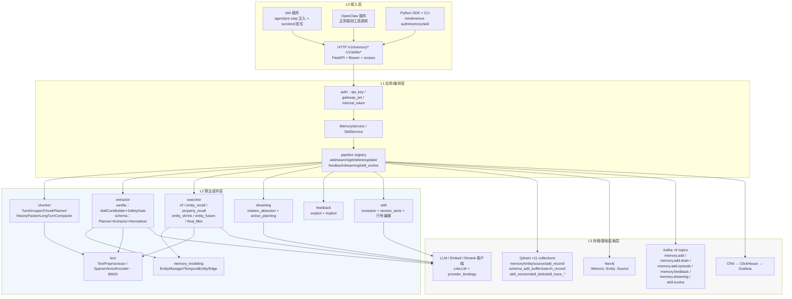
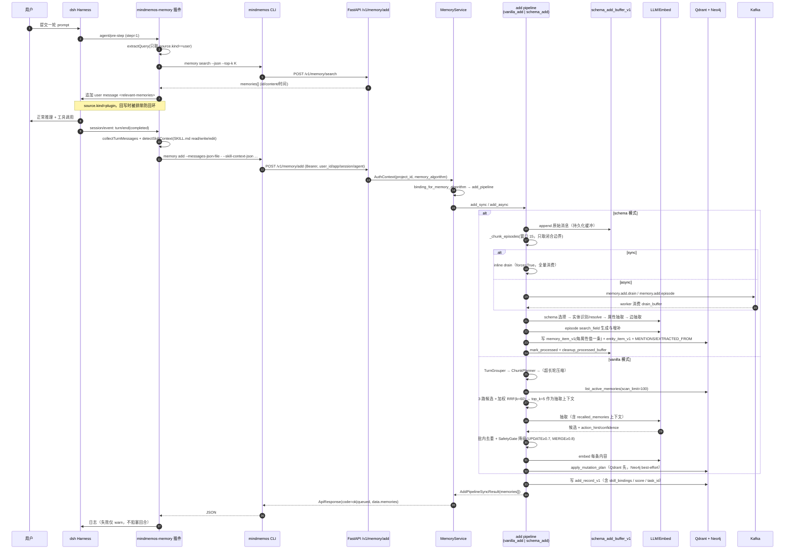
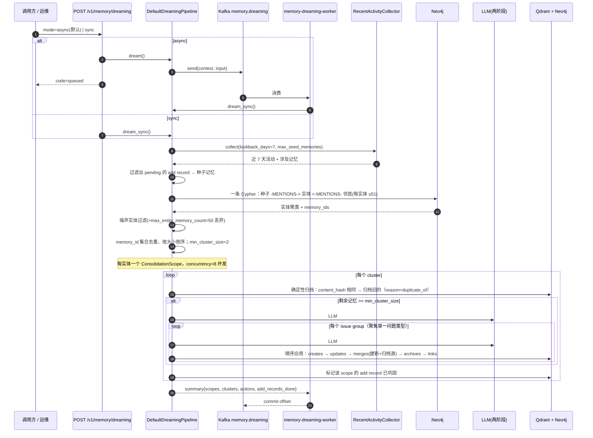
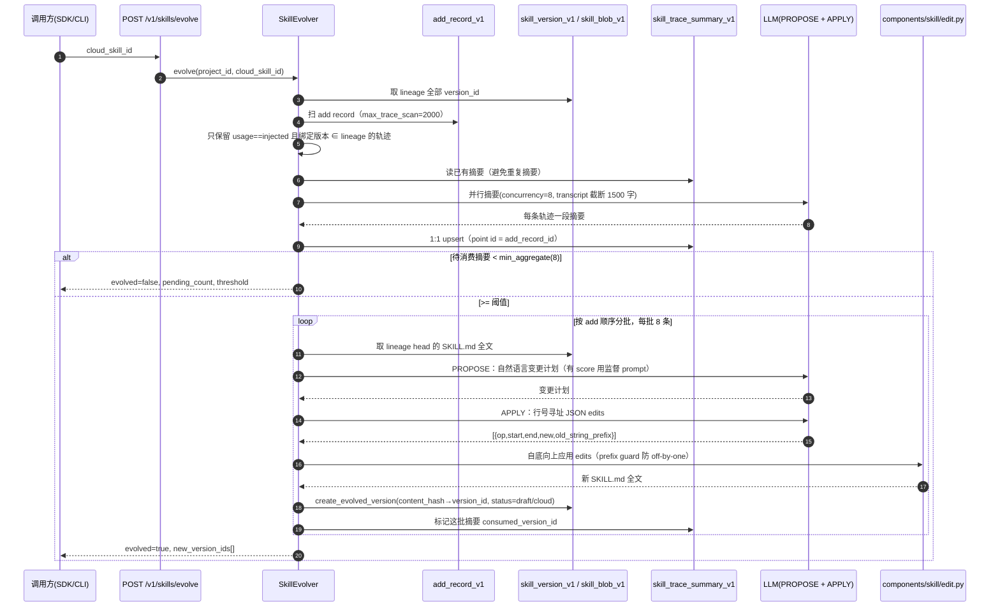

# MindMemOS 概念、架构与借鉴点

> 扫描对象：`/home/malizhi/project/MindMemOS`（git `c1befcb` = `develop` 最新，`pyproject.toml` version `0.1.0`，MIT）。
> 扫描方式：源码静态通读（`src/mindmemos/` 内核 + `src/mindmemos_sdk/` + `src/mindmemos_eval/` + `plugins/` + `config/presets/` + `config/algo/*`），**未运行服务**。
> 引用约定：不带前缀的路径均相对仓库根；`文件:行号` 为实证位置。
> 本文**不重复** `MindMemOS-能力与算法评估.md` 的清单式罗列，重点是①实体/关系/时序的系统建模 ②"文档声称 vs 代码落地"的核验 ③面向 TencentDB-Agent-Memory 的可迁移性判断。
> **重要前提**：本文所有"不存在"结论仅对本 checkout 成立（云端 `mindmemos.cn` 可能包含未开源能力）。

---

## 0. 一句话定位

**MindMemOS 是"面向 Agent 的记忆操作层（Memory Operating Layer）"**：以「实体(Entity) — 属性(Property) — 时间轴(Timeline)」统一结构建模开放世界信息，用 **Qdrant（dense + sparse/BM25 双向量）+ Neo4j（图）+ Kafka（异步任务）** 三件套承载，对上层暴露 9 类记忆 HTTP 能力（add / get / list / scroll / search / delete / update / feedback / dreaming）与一套 git-like 的 Skill 版本库；靠**离线 dreaming 巩固**与**隐式 feedback 纠错**让记忆质量自收敛，靠插件（dsh / OpenClaw）实现"跨 Agent 可迁移"。

**但它的成熟度是分层的，不能整体照抄**：

| 层 | 真实成熟度 | 判据 |
|---|---|---|
| 写入（vanilla/schema）、检索、巩固 dreaming、隐式反馈 | **工程级**，有重试/预算/降级/状态机 | `pipelines/`、`components/` 约 30 个模块。但**有一部分配置项与运行时并未接线**（详见 §8.6，如 `recall.*`、`safety_gate.*`、`use_property_filter`） |
| 时间轴实体 + 图/向量双写 + 轨迹记录（add_record/search_record） | **工程级，但双写无事务、无补偿** | Neo4j 失败在 `fast` 一致性下被吞掉（`pipelines/memory_db/writer.py:428-438`）；无 outbox/2PC；`graph_pending` 无任何消费者 |
| Skill 自演进（版本库 + 行号寻址编辑 + pending rebind） | **半个工程**：闭环能跑，但生命周期只剩 2 态、发布门控失效 | `typing/skill.py:34-56` 定义 6 态，代码只写 `observed`/`draft` |
| **schema 自演化（论文的 MindMemEvolve / README 的 schema learning）** | **未落地** | 全仓无任何 schema 演化代码；`EntityManager.register/update_property/save_to_file`（`components/memory_modeling/schema/entity_manager.py:107,158,249`）**零生产调用方**；schema 是静态 JSON（`config/presets/schema_general.json`），由 `entity_modeling_path` 选文件 |
| 检索结果的 token-budget 保留（MMR / recency 衰减 / 成本项） | **本 checkout 不存在** | 全仓无 `memory_retention` / `mmr` / `half_life` / `cost_ratio`；检索输出层只有 rerank + `top_k` 截断（`components/searcher/final_filter.py`） |

> 这条分层判断是本文最重要的结论：**读者项目已有的评估文档把"论文声称"与"代码落地"混在同一张清单里**，其中至少 3 条（schema learning、token-budget MMR、经验→skill_candidate）在本 checkout 无对应实现。详见 §6.3。

---

## 1. 概念与功能实体总表

> 关键判断先行：**MindMemOS 没有 `Brain` / `Domain` / `MemorySpace` / `Agent` 这几类一等实体**（全仓 grep：`brain`、`memory_space` 命中 0；`domain` 只出现在 `config/algo/common.py:10` 的注释和 prompt 文案里）。它的"组织维度"是**扁平的 scope 键**（account/project/user/app/session/agent），不是实体图。这是与"Memory OS"直觉最大的落差，也是读者项目**不值得学**的地方（见 §8.1）。

### 1.1 隔离与身份类

| 实体 | 定义 | 关键字段 | 落地位置 |
|---|---|---|---|
| **Account** | 账号级隔离单元 | `account_id` | `typing/memory.py:82`；Qdrant payload |
| **Project** | **记忆库最小隔离单元**；一个 api key 绑定一个 project，project 决定用哪套算法 | `project_id`；`memory_algorithm ∈ {vanilla, schema}` | `config/mindmemos/api_keys.yaml`；`api/algorithm.py:18-21` |
| **ApiKey** | 凭证 + 算法 + scope 的载体 | `key_id`/`api_key`/`project_id`/`memory_algorithm`/`scopes`/`enabled` | `api/schemas.py:44` `ResolvedKey`；`api/deps.py` |
| **Scope 键（非实体）** | `user_id`/`app_id`/`session_id`/`agent_id` 只是 payload 过滤键，**没有实体表、没有生命周期、没有归属校验** | 四字段均为可空 KEYWORD | `typing/memory.py:86-89`；`build_tenant_conditions` `:374-392` |
| **ProviderBinding** | 按 project 动态绑定 LLM/Embed 端点 | `provider_binding_v1` 集合 | `infra/db/schema.py:28` |

### 1.2 记忆与知识类

| 实体 | 定义 | 关键字段 | 落地位置 |
|---|---|---|---|
| **Memory** | 最小记忆单元。**在 schema 模式下它同时是"一个属性值"**（靠 `property_name`/`entity_id` 挂到实体时间轴上） | `memory_id`、`content`、`mem_type`、`mem_extract_type/version`、`status`、`validate_from/to`、`reinforcement_count`、`parent_ids/root_id`、`property_name`、`entity_id`、`entity_type`、`metadata` | `typing/memory.py:420-451` `MemoryWrite`；Qdrant `memory_item_v1` |
| **MemoryType** | 7 类语义标签：`profile`/`fact`/`experience`/`episodic`/`tool_trace`/`skill_candidate`/`file_knowledge` | — | `typing/memory.py:41` |
| **Entity** | schema 模式的实体节点（人/组织/物/动物/地点/`episodes`） | `entity_id`、`entity_name`、`entity_type`、`description`、`schema_version`、`metadata.search_fields[]` | `typing/memory.py:454-479`；Qdrant `entity_item_v1`；Neo4j `:Entity` |
| **EntityType / EntityProperty（Schema 定义）** | 实体类型及其**静态属性 / 动态属性**模板；属性带 `order`（1=一阶，≥2=高阶）与置信语义 | `entity_type`、`entity_description`、`entity_instruction`、`search_weight`、`static_property{}`、`dynamic_property{type,desc,example,order}` | `components/memory_modeling/schema/entity_manager.py:38-71`；`config/presets/schema_general.json` |
| **TemporalEntity** | **查询期物化视图**（不是存储结构！）：把落在同一 `entity_id` 上的多条 Memory 按 `property_name` + 时间戳装配成时间轴 | `_properties: {prop: [PropertyEntry(timestamp,value,uid)]}`、`edges`、`_latest_cache` | `components/memory_modeling/schema/temporal_entity.py:29-70`、`apply_memory :399-422`、`from_views :571` |
| **Edge（图关系）** | 8 种边类型，集中定义 | `RELATES_TO` / `RELATED_TO` / `MENTIONS` / `EXTRACTED_FROM` / `MENTIONED_IN_SOURCE` / `DERIVED_FROM` / `HAS_PROPERTY_MEMORY` / `NEXT_IN_PROPERTY_TIMELINE` | `typing/memory.py:49-56`；Neo4j；`GraphRelationship` `:562-579` || **Source** | 记忆来源（文件 / URL / 消息），承载溯源 | `source_id`、`source_type`、`file_path`/`uri`、`content_hash`、`is_parsed`、`persist_payload`（message 源只存图节点不存向量） | `typing/memory.py:482-523`；Qdrant `source_item_v1`；Neo4j `:Source` |
| **Episode** | 一次对话切片，用 `episodes` 实体承载（静态属性 `detail` + `input_messages`），并有 LLM 生成/增补的 `search_fields` | `episode_id`、`detail`、`input_messages`、`search_fields`（≤10 + 增补 ≤4） | `config/algo/add/schema/chunker.py`；`components/extractor/schema/search_field.py`；`schema_add.py:700-793` |
| **AddRecord** | 一次 add 请求的**轨迹**（不是记忆），是 dreaming/skill evolve 的输入账本 | `add_record_id`、status、`skill_bindings[]`、`score`、`task_id` | Qdrant `add_record_v1`；`typing/skill.py:120-150` |
| **SearchRecord** | 一次 search 的轨迹 | 请求/响应/耗时 | Qdrant `search_record_v1` |
| **SchemaAddBuffer** | schema 模式的**持久化写入缓冲**（episode 切分与生成的解耦点） | `schema_buffer_record_id`、episode_id、`split_attempted`、failed 标记 | Qdrant `schema_add_buffer_v1`；`infra/db/collections/schema_add_buffer.py` |

### 1.3 Skill / 演进类

| 实体 | 定义 | 关键字段 | 落地位置 |
|---|---|---|---|
| **SkillVersion**（"commit"） | 一个技能版本的元数据；`version_id` 是权威主键 | `version_id`、`project_id`、`cloud_skill_id`、`skill_name`、`content_hash`、`parent_version_id`、`version_label`、`status`、`origin` | `typing/skill.py:67-92`；Qdrant `skill_version_v1` |
| **SkillBlob**（"blob"） | 按 `(project_id, content_hash)` 去重的规范化 bundle 文本 | `content_hash`、`content` | `typing/skill.py:95-108`；Qdrant `skill_blob_v1` |
| **SkillContext** | **单轮**引用到的技能（由宿主插件从 SKILL.md 的 read/write/edit 工具调用探测） | `name`、`content_hash`、`base_version_id`、`version_label`、`usage ∈ {injected, modified}` | `typing/skill.py:110-131`；`plugins/*/src/index.ts` `detectSkillContext` |
| **SkillBinding** | 落在 add trace 上的解析后绑定；未注册时挂 `skill_trace_pending_v1`，注册后 rebind | `name`、`content_hash`、`version_id`（可空） | `typing/skill.py:133-150`；`pipelines/skill/version_store.py:293-431` |
| **SkillTraceSummary** | 轨迹摘要（演进输入），与 add trace **1:1**（point id = add_record_id） | `summary_id`、`summary`、`consumed_version_id`、`score`、`task_id` | `typing/skill.py:153-180`；Qdrant `skill_trace_summary_v1` |
| **`cloud_skill_id`**（"repo"） | 按 lineage 分组的技能家族 id（根为 uuid4，子继承） | — | `pipelines/skill/version_store.py:285-291` |

### 1.4 巩固 / 反馈的中间产物（不进主存储，是 LLM 契约）

| 实体 | 定义 | 关键字段 | 落地位置 |
|---|---|---|---|
| **DreamingIssueGroup** | 第一阶段 LLM 的产出：一个"问题组" | `issue_type ∈ {conflict, duplicate, near_duplicate, complementary, low_value, ambiguous, other}`、`memory_ids[]`、`subject_hint`/`predicate_hint`/`value_hints`、`confidence`、`reason` | `components/dreaming/relation_detection.py:33-60` |
| **ConsolidationAction** | 第二阶段 LLM 的产出：五类显式动作 | `creates[]` / `updates[]` / `merges[]` / `archives[]` / `links[]` | `typing/algo.py:230-327` |
| **ImplicitFeedbackSignal** | 隐式反馈信号（无用户文本） | `round_index`、`category ∈ {task_temporary, scenario_specific, long_term}`、`reason` | `typing/algo.py:97-132` |
| **FeedbackAction（explicit）** | 显式反馈的动作 DTO | Add/Update/Delete/Noop 四类 | `typing/service.py:390-471` |

> ⚠️ **两个极易混淆的常量**：`RELATES_TO`（`typing/memory.py:51`）与 `RELATED_TO`（`:52`）**是两个不同的关系类型**，且分工严格——**schema 模式用 `RELATED_TO`**（`memory_modeling/schema/edge.py:43`、`_schema_utils.py:422`），**vanilla 与 dreaming 用 `RELATES_TO`**（`memory_modeling/vanilla/edges.py:112`、`pipelines/dreaming/default.py:889`）。另外 `EXTRACTED_FROM` **只由 vanilla 产生**（`memory_modeling/vanilla/edges.py:60`），schema 模式只产 `HAS_PROPERTY_MEMORY` / `MENTIONS` / `RELATED_TO`。读者若照搬这套边类型，务必先合并这两个同义词（否则图查询会漏一半边）。

---

## 2. 实体关系图

```mermaid
graph TB
  subgraph 隔离层["隔离层（扁平 scope 键，非实体图）"]
    ACC[Account] --> PRJ[Project 记忆库]
    KEY[ApiKey<br/>memory_algorithm=vanilla|schema] --> PRJ
    PRJ -.payload 过滤键.-> USR[user_id]
    PRJ -.-> APP[app_id]
    PRJ -.-> SES[session_id]
    PRJ -.-> AGT[agent_id]
  end

  subgraph 内容层["内容层（Qdrant + Neo4j）"]
    MEM[Memory<br/>事实/属性值]
    ENT[Entity<br/>实体节点]
    SRC[Source<br/>来源]
    EPT[Episode<br/>episodes 实体]
    SCHEMA[EntityType/EntityProperty<br/>静态属性+动态属性 schema]
  end

  subgraph 图关系["Neo4j 边"]
    R1[MENTIONS]
    R2[EXTRACTED_FROM<br/>MENTIONED_IN_SOURCE]
    R3[RELATES_TO / RELATED_TO]
    R4[HAS_PROPERTY_MEMORY<br/>NEXT_IN_PROPERTY_TIMELINE]
    R5[DERIVED_FROM]
  end

  subgraph 轨迹层["轨迹层"]
    ADR[AddRecord<br/>dsh/openclaw 每轮]
    SRC2[SearchRecord]
    BUF[SchemaAddBuffer]
  end

  subgraph 技能层["技能层"]
    SC[SkillContext] --> SB[SkillBinding]
    SV[SkillVersion<br/>commit] --> BL[SkillBlob<br/>content_hash]
    SV -->|parent_version_id| SV
    SV -->|cloud_skill_id 家族| SV
    TS[SkillTraceSummary<br/>1:1 add_record_id] -->|evolution 消费| SV2[新 SkillVersion<br/>status=draft]
  end

  MEM -->|MENTIONS| R1 --> ENT
  MEM -->|EXTRACTED_FROM| R2 --> SRC
  MEM -->|RELATES_TO| R3
  ENT -->|HAS_PROPERTY_MEMORY| R4 --> MEM
  MEM -->|DERIVED_FROM 血缘| R5 --> MEM
  EPT -.是一种.-> ENT
  EPT -->|detail/input_messages 引用| SRC
  SCHEMA -.定义模板.-> ENT
  SCHEMA -.约束属性名.-> MEM
  ADR --> BUF
  BUF -->|切分 episode| EPT
  EPT -->|生成| MEM
  ADR -->|skill_context| SB
  ADR --> TS
  MEM -.查询期按 entity_id+property_name+时间戳装配.-> TE[TemporalEntity<br/>时间轴物化视图]
  ENT -.-> TE

  style 隔离层 fill:#fff4e6
  style 技能层 fill:#e8f4ff
```

**读图要点**

1. **Memory 是双身份实体**：vanilla 模式下它是"一条事实"；schema 模式下它是"某实体某属性的一个时间戳取值"（`property_name` + `entity_id` + `validate_from`）。**时间轴不是存储结构，而是查询期按 `entity_id + property_name` 聚合后的内存视图**（`temporal_entity.py:571 from_views` → `:399 apply_memory`）。这一点决定了"时间轴"的可迁移性很高（不需要新存储），但也意味着**任何直接按 Qdrant 检索的路径都拿不到时间轴语义**。
2. **Episode 是 entities 之一**（`entity_type == "episodes"`），在 schema search 里被特殊对待：不参与 property shrink（`_entity_shrink.py:108 skip_shrink`）、检索配额单列（episode 0.7 / non-episode 0.3，`schema_search_entity_weights.py:14-19`）。
3. **skill_candidate 是孤岛**：它只是抽取 prompt 的一个 `mem_type` 标签（`typing/memory.py:41`、`prompts/EN/add/vanilla.py:29`），**全仓无任何消费者**；真实的技能演进输入是插件探测出来的 `skill_context`。README 的"经验记忆沉淀为 skill candidates"在代码里不成立。

---

## 3. 总体架构

### 3.1 分层组件图



### 3.2 模块与职责

| 模块 | 职责 | 位置 |
|---|---|---|
| `api/` | FastAPI 路由、Bearer 鉴权、scope 校验、请求↔pipeline DTO 映射 | `api/routes.py`（9 个记忆端点）、`api/skill_routes.py`（8 个技能端点）、`api/internal_routes.py` |
| `pipelines/` | 9 类 pipeline 的注册与实现，是唯一的编排入口 | `pipelines/registry.py:11-16`，`_VALID_PIPELINE_TYPES` |
| `components/chunker/` | 消息→轮次→分块→历史打包→超长轮压缩 | `components/chunker/vanilla/{chunk_planner,history_packer,compactor,summarizer}.py` |
| `components/extractor/` | 两条抽取链：vanilla（扁平事实）/ schema（实体-属性-边） | `extractor/vanilla/add_builder.py`（1167 行）、`extractor/schema/schema_planner.py`（1496 行） |
| `components/memory_modeling/` | schema 加载、TemporalEntity 时间轴、边 | `memory_modeling/schema/` |
| `components/searcher/` | RRF 融合、实体/属性召回、实体收缩、融合、最终过滤 | `searcher/{rrf,entity_recall}.py`、`searcher/schema/{_entity_shrink,_entity_fusion,_ranker}.py` |
| `components/dreaming/` | 两阶段巩固的 LLM 契约与解析 | `dreaming/{relation_detection,action_planning}.py` |
| `components/text/` | 归一化、语种判定、jieba/spaCy 分词、BM25 稀疏编码、token 估算 | `config/algo/text_processing.py` 为全部参数源 |
| `infra/db/` | Qdrant/Neo4j 客户端、11 个 collection 规格、payload 索引、`apply_mutation_plan` | `infra/db/schema.py`、`pipelines/memory_db/writer.py` |
| `infra/kafka/` | producer/consumer/dispatcher、topic 自动创建、全局并发信号量 | `infra/kafka/registry.py` |
| `workers/` | 6 个消费者：add / dreaming / feedback / schema drain / schema episode / skill evolve | `workers/__init__.py:11-32` |
| `config/algo/` | **全部算法参数的唯一真相源**（dataclass，可 YAML 覆盖 + `validation.py` 校验） | `config/algo/{root,dreaming,search,add,skill,text_processing}.py` |

### 3.3 存储布局

**Qdrant 11 个 collection**（`infra/db/schema.py:17-28`）：

| collection | 向量 | 用途 |
|---|---|---|
| `memory_item_v1` | dense + sparse | 记忆主表（也是"属性值"表） |
| `entity_item_v1` | dense + sparse | 实体表（含 `search_fields[]` 伪多向量：一个实体多条 search_field point） |
| `source_item_v1` | dense only | 文件/URL 来源 |
| `add_record_v1` / `search_record_v1` | 无向量 | 轨迹账本（也是 dreaming/evolve 的进度账本） |
| `schema_add_buffer_v1` | 无向量 | schema 写入缓冲 |
| `skill_version_v1` / `skill_blob_v1` | 无向量 | 技能版本元数据 / 内容去重 |
| `skill_trace_pending_v1` / `skill_trace_summary_v1` | 无向量 | 未注册绑定暂存 / 轨迹摘要 |
| `provider_binding_v1` | 无向量 | 按 project 的动态模型端点绑定 |

**Neo4j**：节点 `:Memory` / `:Entity` / `:Source`（`infra/db/neo4j.py:102,115,134`），全部按 `project_id` 分片；边见 §1.2 的 8 种。**图是向量的镜像，不是源**——写入顺序是先 Qdrant 再 Neo4j（best-effort），`fast` 一致性下图写失败只告警不抛（`pipelines/memory_db/writer.py:428-438`、`:366-374`）。

**图节点比 Qdrant payload 薄得多（实测）**：

| 节点 | Neo4j 上实际只有这些属性 | 缺失（只存在于 Qdrant payload） |
|---|---|---|
| `:Memory` | `content`、`status`（归档时加 `status_changed_at`/`delete_reason`） | `mem_type`、`validate_from/to`、`property_name`、`entity_id`、`entity_type`、`metadata.*`、`reinforcement_count` |
| `:Entity` | `entity_name`、`description`、`entity_type` | `metadata.search_fields[]`、`schema_version` |
| `:Source` | `parsed_content_path` | `source_type`、`file_path/uri`、`content_hash` |

证据：`infra/db/neo4j.py:104-112`（Memory）、`:118-132`（Entity）、`:136-145`（Source）。

> **含义**：图**只能做拓扑**（谁连谁、共享什么实体），**不能做语义或时间过滤**——"某人在 2023 年的位置"这类查询必须回到 Qdrant 取属性值，再在内存里装配时间轴（§1.2 的 `TemporalEntity`）。另外边的 `metadata`/`extraction_position` 落库时被 `_normalize_properties` 转成 `*_json` **字符串**（`neo4j.py:449-460`），Cypher 里 `r.metadata.foo` 拿不到值；关系写入用 `MATCH` 端点，任一节点缺失就**静默丢边**（`neo4j.py:407-409`）。

**`source_item_v1` 存在可检索性空洞（实测）**：`to_source_point` 不传向量（`mappers/db.py:323-324`），而 `_dense_point` 在向量缺失时**填零向量**（`infra/db/collections/base.py:323-328`），同时该 collection `enable_sparse=False`（`infra/db/schema.py:72`）且 payload 索引里没有 `content` TEXT 索引。**结论：Source 既不能语义检索也不能全文检索**，目前只是"来源节点 + 解析产物路径"的记账。


**Kafka 6 个 topic**：`memory.add`、`memory.add.drain`、`memory.add.episode`、`memory.feedback`、`memory.dreaming`、`skill.evolve`（`workers/*.py` 的 `TOPIC` 常量 + `config/mindmemos/dev.example.yaml:305-320`）。**没有定时调度器**：dreaming 完全靠外部/调用方调 `POST /v1/memory/dreaming` 触发，服务端只做"入队 → worker 消费"。

---

## 4. 记忆算法细节

### 4.1 两套并存的算法（关键设计选择）

| 维度 | **vanilla** | **schema** |
|---|---|---|
| 选择方式 | api key 的 `memory_algorithm` 字段，**请求级不可覆盖** | 同左 |
| 绑定 | `add_pipeline=vanilla_add`，`search_pipeline=vanilla` | `add_pipeline=schema_add`，`search_pipeline=schema` |
| 写入单元 | 扁平 `MemoryItem`（事实句） | 实体 + 属性值记忆 + 边 + episode |
| 写入是否缓冲 | **否**，同步直接落库 | **是**，先落 `schema_add_buffer_v1`，再切 episode、再生成 |
| 参数源 | `config/algo/add/vanilla/vanilla.py` | `config/algo/add/schema/*.py` |
| 位置 | `api/algorithm.py:18-21`、`pipelines/add/{vanilla,schema}/` | 同左 |

> 两条链路**互不复用**：`DefaultAddPipeline`（更早的简单实现，`pipelines/add/default.py`）与 `VanillaAddPipeline` 是平级注册、各自继承同一 mixin，`_attach_search_fields` 这种 helper 各写一份（`pipelines/add/default.py:258` vs `components/extractor/vanilla/add_builder.py:164`）。**同一能力三份实现**是这份代码里最明显的结构债。

### 4.2 抽取与写入（vanilla 链路）

阶段：`分块(group→plan→compact) → 预处理 → 召回 → LLM 抽取 → 批内去重 → 安全门规划 → 向量化 → 落库`（`components/extractor/vanilla/add_builder.py`）

| 环节 | 机制 | 参数（默认） | 位置 |
|---|---|---|---|
| 轮次分组 | 同角色消息按时间间隔切分 | `time_gap_threshold_seconds=1800` | `config/algo/add/vanilla/vanilla.py:131` |
| 分块 | 按 token 预算打包轮次；**预算逐层扣减** template/output/recall/history | soft `26000` / hard `32000`；派生 soft_extractable `17000` / extractable `21000` | `vanilla.py:98,101,134,137,140`；`chunk_planner.py:27-48` |
| 超长轮压缩 | 保头 `4000` + 保尾 `4000`，中部走**结构化 map-reduce 摘要**（输出固定 7 字段） | `turn_hard_token_budget=16000`；摘要输入上限 `200000`、输出 `8000` | `vanilla.py:104,119,122,125,128`；`chunker/vanilla/{compactor,summarizer}.py` |
| 跨块历史 | 完整轮次向后打包 | soft `2000` / hard `4000` / 最少 `1` 轮 | `vanilla.py:107,110,113` |
| **写前召回** | 3 路候选 + **加权 RRF**，作为抽取 prompt 的上下文，让 LLM 自己决定 `action_hint`/`target_memory_id` | `top_k=5`、`scan_limit=100`、`k=60`；权重 semantic 1.5 / bm25 1.0 / entity 1.2 / recent 0.5 / schema_property 2.0 | `components/extractor/vanilla/add_recall.py:27-48,173-205` |
| 抽取 | LLM 输出候选 + `action_hint`；解析失败走确定性 fallback（confidence 按边界类型 1.0/0.9/0.7/0.5） | — | `extractor/vanilla/memory.py:114-211,305-318` |
| 批内去重 | 按 `(content_hash 或 content, mem_type)` 精确分组，同组取 confidence 最高者，实体/来源/关联做并集 | **无相似度阈值** | `extractor/vanilla/_dedup.py:40-102` |
| **安全门** | 确定性规则把 LLM 的 action 降级：`UPDATE` 需 confidence ≥ `0.7`，`MERGE` 需 ≥ `0.8` 且目标 ≥2 条，否则降为 `ADD` | `min_content_chars=1` | `extractor/vanilla/_safety_gate.py:39-42,141`；配置**未接线**（见 §8） |
| 落库 | `MemoryDbWritePlan` → `apply_mutation_plan`（Qdrant + Neo4j） | `default_consistency=fast` | `pipelines/memory_db/writer.py` |

**冲突语义（重要）**：

| 动作 | 语义 | 是否留版本链 |
|---|---|---|
| `ADD` | 新建，`root_id=[memory_id]` | — |
| `UPDATE` | **原地覆盖** content + 重算向量 + 同步图内容 | ❌ 无版本链，仅 metadata 打点 |
| `MERGE` | **新建一条** + 旧条 `status=archived`（`archived_reason="merged"`） | 部分（`parent_ids`/`root_id`） |
| `REINFORCE` | 只 `reinforcement_count += 1` + metadata 打点（有 `dedup_metadata_key` 幂等键） | — |
| `SKIP` | 不写 | — |

> 位置：`extractor/vanilla/{_update_commands.py:16-87}`、`add_builder.py:815-1068`。**`UPDATE` 没有幂等键而 `REINFORCE` 有**（`_update_commands.py:33` vs `:49-64`），是不对称缺陷。

### 4.3 抽取与写入（schema 链路，本文重点）


| 机制 | 参数（默认） | 位置 |
|---|---|---|
| episode 边界 | `split_mode=llm`（可选 `rule`）；`max_episode_length=15`、`max_minutes_from_first=30`、`split_on_user_speaker=True`、`streaming_window_size=15`、缓冲上限 `1000` | `config/algo/add/schema/chunker.py:9-27`；`components/chunker/episodes_chunker.py:29-204` |
| 两种切分模式 | `rule`：纯确定性，`if/elif` 优先级 = 达 `max_messages` → 遇 user 说话人 → 距首条 >30 分钟；`llm`：`CONV_BOUNDARY_DETECTION_PROMPT`，`force` 时补一条到尾的边界。**共同收尾**：超长边界走 `CONV_FORCED_RESPLIT_PROMPT` 二次切，LLM 失败则机械等分 | `episodes_chunker.py:104-134,77-102,136-204` |
| 流式窗口切分 | 非末窗口只接受"不触碰窗口尾部"的边界，剩下消息留到下轮；`force` 时全消费 | `pipelines/add/schema/schema_add.py:700-793` |
| schema 选择降本 | `enable_schema_selection=True`：LLM 从全量实体 schema 挑子集，**失败回退全量** | `config/algo/add/schema/extraction.py:9-10` |
| 实体 merge 决策 | `entity_recall_top_k=15`、`max_merge_retries=8`、次级按实体名兜底搜索 `secondary_search_limit=30` + 3 次指数退避（base 0.2s，max 5s） | `config/algo/add/schema/merge.py` |
| 扇出上限 | 每会话实体 ≤ `200`，每实体属性 ≤ `15`（每属性独立 embedding + 落库；**超出直接丢弃**），实体 resolve 并发 `10` | `extraction.py:29-40` |
| 属性值形态 | 属性值必须是**含时间/地点/因果的完整句子**（prompt 强制），避免碎片化日后无法独立理解 | `config/presets/schema_general.json` 的 `entity_instruction` |
| search_field | episode 属性值转 search_field，上限 `10`，LLM 再增补 ≤ `4` | `extraction.py:13-20` |
| drain 可靠性 | episode 生成 3 次重试，指数退避 base 1s / max 30s + jitter；成功清理缓冲，失败 `mark_failed` | `config/algo/add/schema/drain.py`；`schema_add.py:893-976` |
| **id 幂等性** | ⚠️ **两条链路的幂等性不一致**：`components/id.py` 用 `uuid5(NAMESPACE_URL, key)` 派生出**确定性 id**（`id.py:32,39,50`），但 **schema 路径直接 `uuid4()`**（`schema_planner.py:1323` entity_id、`:1410` memory_id）⇒ **同一条消息重放会产生重复实体/重复记忆**，而 vanilla 路径的 uuid5 可以幂等去重 | `components/id.py:9,32,39,50` vs `components/extractor/schema/schema_planner.py:11,1323,1410` |

> **schema 的真实成熟度**：`config/presets/schema_general.json` 是**手写**的 6 个实体类型（person / organization / item / animal / place / episodes），其中 `person` 有 **42 个动态属性**（`location_event`、`position_event`、`health_event`、`mood_event`、`plan_event`、`recommendation_given`、`endorsement_deal`、`room_decoration`…）+ 2 个静态属性。这是一个**为 LoCoMo/PersonaMem 基准调出来的、高度场景化的枚举表**，不是从数据里学出来的（见 §8.2）。

> **三个"参数写了但不生效"的细节（实测）**：①`min_episode_length=1`（默认）在 chunker 内部**根本不被使用**，只在 `schema_add.py:713,754` 做"条目数 < 1 就返回"的判断 —— 默认值下等于 no-op；②`streaming_window_size` 被 `EpisodesChunker` 构造时校验（`episodes_chunker.py:44-45`）却在 chunker 内部**不使用**，真正用它的是 `schema_add.py:722,729`；③**异步路径 + 公共 API 时 `force_generation` 恒为 `False`** —— 它只存在于内部 DTO `AddPipelineInput.force_generation`（`typing/service.py:163`），**没有暴露在 HTTP `AddRequest` 上**，于是末尾不足一个窗口的消息会**留在 buffer 里等后续轮次**（`schema_add.py:449,730-731`）。

### 4.4 去重（三处，语义完全不同）

| 位置 | 判据 | 阈值 | 用途 |
|---|---|---|---|
| add 侧判重 | `content_hash` **完全相等** | 无阈值 | 决定 `duplicate` → fallback 升级为 REINFORCE |
| add 侧批内 | `(content_hash 或 content, mem_type)` **精确分组** | 无阈值 | 同一批候选合并 |
| **检索侧折叠** | **token-set Jaccard** + 数字指纹否决 + 短文本豁免 | `dedup_threshold=0.6`；`max_candidates=128` | **召回池在 rerank/截断之前折叠近似重复**，把 k 个槽位还给不同记忆 |

检索侧折叠的实现质量明显高于另外两处（`components/searcher/vanilla/_dedup.py:81-161`）：

- token 化：`[0-9a-z]{2,}` 或**单个 CJK 字符**，上限 512 token（`:29,38`）；
- **数字指纹否决**：两侧 `\d+(?:[.,:/\-]\d+)*` 集合不同则**绝不折叠**——防止 "2 cats" vs "3 cats" 被 Jaccard≈0.86 误折（`:52-54,137-141`）；
- **短文本豁免**：英文 <5 token / 中文 <10 汉字不参与近似折叠（`:36-37,57-62`）；
- 精确重复（大小写+空白归一后相等）永远折叠，且不受 `max_candidates` 窗口限制。

### 4.5 召回与排序

**vanilla search**（`config/algo/search/vanilla/vanilla.py`）：

| 步骤 | 参数 |
|---|---|
| dense + sparse **服务端 RRF** | **融合在 Qdrant 内部完成**：两个 `Prefetch`（sparse 在前、dense 在后）各取 `max(limit*3, 30)`，`query=FusionQuery(Fusion.RRF)`，一次拿回融合结果（`infra/db/collections/memory.py:109-149`）。`recall_size=20` × `hybrid_prefetch_factor=3`（下限 30 / 上限 300） |
| 近似重复折叠 | `dedup_threshold=0.6`，窗口 128，按 `(user_id, lineage_role)` 分组（**在 rerank 之前**） |
| 图扩展 | dataclass 默认 `graph_enabled=False` / `shared_entity_graph_enabled=False`，但**随仓库发布的 `config/mindmemos/dev.example.yaml:232-233` 把两者都设为 `true`** → 实际部署中图扩展是**开启**的。参数：`graph_seed_memory_limit=5`、`graph_related_per_seed=3`、`graph_decay=0.5`、`graph_score=0.01` |
| 最终过滤 | 可选 rerank（`use_reranker=True`）+ `score_threshold` + `top_k` 截断；rerank 不可用/异常 → 静默退化为截断（`searcher/final_filter.py:60-73`） |

> ⚠️ **`multi_hop` 是"假多跳"**：`config/algo/search/schema/schema_search_config.py:22` 的 `multi_hop=2` 与 agentic 的 `num_hops=2` **从不进入 Cypher**——`infra/db/neo4j.py:146-187` 严格一跳，多跳是在 Python 里反复调一跳、每跳 `limit` 恒 20；且 `vanilla + agentic` 组合下 `num_hops` 被引擎直接忽略（`pipelines/search/vanilla/engine.py:116-121`）。
> ⚠️ **公开 API 拿不到分数**：`MemorySearchItem`（`typing/service.py:103-133`）**没有 score 字段**，相关性分数在 pipeline 边界被丢弃；`score_threshold` 只作用于 rerank 分数。`MemoryDbSearchQuery` 的 `mode`/`ranking` 是**死字段**（`typing/memory_db.py:352-353`，`reader.py:576-685` 从不读）。
> ⚠️ **归档记忆可被图召回**：三条图检索 Cypher **没有 `status` 过滤**，而向量侧强制 `status=active`——也就是说被 archival 的记忆仍可能通过图扩展回到结果里。

**schema search**：两段式"宽召回 → 收窄"，且**双路径并行**（实体路径 + 属性路径），带类型权重与配额：

| 阶段 | 实体路径 | 属性路径 | 双路径（compact 版） |
|---|---|---|---|
| 召回 | `recall_size=800`（vector/BM25 各一路） | 每实体 `recall_size=45` | `property_recall_size=300` |
| RRF | `rrf_k=80` → `top_k=40` | `rrf_k=60` → `top_k=20` | `property_rrf_k=80` → `property_top_k=80` |
| rerank | `use_reranker=True`，`max_rerank_candidates=100` | — | → `property_top_n=25` |
| 收窄 | `top_n=16` | `top_n=16`（动态配额 `alloc_min_factor=0.5` / `alloc_max_factor=1.5`） | — |
| 后处理 | 实体类型权重 `search_weight` 乘分（`_entity_weights.py:26-31`）；episode/non-episode 配额 0.7/0.3 | 时间上下文扩展 `extension_step=3`；高阶属性预算比 `higher_order_ratio=0.4` | — |
| 图扩展 | `multi_hop=2`；边过滤 `top_k=2`、邻居上限 20、rerank 阈值 `min_relevance_score=0.1` | — | — |

位置：`config/algo/search/schema/*`、`components/searcher/schema/{_entity_shrink,_entity_fusion,_ranker}.py`。

**时间维度检索**：`TemporalEntity.get_property_at_time` / `get_property_in_range` 用 `bisect` 在**内存时间轴**上二分（`temporal_entity.py:193-212`）；`get_properties_in_range` 支持 snapshot/range；**没有**把时间条件下推到 Qdrant 的路径（时间语义只在装配出 TemporalEntity 之后才存在）。

**agentic search**（`search_strategy="agentic"`）：`max_rounds=3`、每轮 `top_k_per_round=10` / `top_n_per_round=5`、`num_hops=2`；每轮后 LLM 做 **sufficiency 判定**（是否够了 + 缺什么），不够则由 planner 生成下一轮查询；第 ≥2 轮时**追加"放宽时间窗"的查询**（`min_time_window_days=30`）；最后可选 LLM relevance 过滤。位置：`pipelines/search/agentic/{loop,sufficiency,planner}.py`、`config/algo/search/agentic/agentic_search_config.py`。

**上下文注入的量控**：**止于 `top_k` 条**，`request_top_k_max=100`（`config/algo/search/root.py:14`）。**没有 token 预算打包**——插件把结果拼成 `<relevant-memories>` 文本直接塞进一条 user message（`plugins/deepseek-harness-plugin/src/index.ts:222-236`），没有任何字符/token 上限。

### 4.6 巩固（dreaming）

**触发**：`POST /v1/memory/dreaming`（默认 `mode=async` → Kafka `memory.dreaming`；`sync` 内联执行）。**无定时器、无自动触发**。

**范围选择（确定性，先于任何 LLM）**：
1. `RecentActivityCollector` 拉近 `lookback_days=7` 天的活动，取其中"尚未巩固"（pending）的 add record 对应的记忆作为**种子**；
2. **一条 Cypher**：种子 → `MENTIONS` → 实体 → 反向 `MENTIONS` → 邻居记忆（每实体 limit `max_entity_memory_count + 1 = 51`，按 `update_at` 倒序）；
3. **噪声实体过滤**：关联记忆数 `> max_entity_memory_count=50` 的实体被丢弃（"巨型实体不是巩固对象，是噪音"）；
4. 相同 memory_id 集合的聚类去重（按聚类大小倒序保留）；
5. 每实体一个 `ConsolidationScope`；`min_cluster_size=2` 以下跳过。

位置：`pipelines/dreaming/default.py:215-347`。

**两阶段 LLM + 一段确定性**：

| 阶段 | 做什么 | 输出契约 | 位置 |
|---|---|---|---|
| **确定性** | `content_hash` 完全相同的组，保留最新一条，其余归档（reason `duplicate_of:<id>`） | 无需 LLM | `dreaming/default.py:408-439` |
| **LLM #1 关系检测** | 把一个 cluster 的记忆交给 LLM，**按问题类型分组**（conflict / duplicate / near_duplicate / complementary / low_value / ambiguous / other），并对每个 memory_id 生成 `value_hints` | `DetectedRelationBatch`（兼容旧版 pair-only 输出，自动回填为 `ambiguous` 组） | `components/dreaming/relation_detection.py:33-93` |
| **LLM #2 动作规划** | **对每个 issue group 单独调用一次**（"聚焦单一问题类型"），产出五类动作 | `ConsolidationAction{creates,updates,merges,archives,links}` | `typing/algo.py:230-327`；`dreaming/default.py:186-200` |
| 应用动作 | 先批量 `creates` → `updates` → `merges`（新建目标 + 归档源）→ `archives` → `links`；已归档 id 全程去重避免二次操作 | — | `dreaming/default.py:678-756` |

**资源控制**：`concurrency=8`（cluster 级信号量）、`max_memories_per_scope=40`、`max_scopes_per_run=None`、`scope_batch_size=2000`（Neo4j 批量）。**所有归档 = 软删**（`status=archived` + `delete_reason`），不物理删除。

### 4.7 遗忘与生命周期

| 机制 | 实现 |
|---|---|
| 状态机 | `status ∈ {active, archived, delete}`（`typing/memory.py:39`），但**代码只会写 `active`/`archived`**；`delete` 字面量无写入点 |
| 软删 | `delete` 命令 = `status=archived` + `metadata.delete_reason` + Neo4j `archive_memory_node`（`pipelines/memory_db/writer.py:407-440`） |
| 时效 | `validate_from` **有写入点**，但 `validate_to` **全仓没有任何写入点**，且 `mappers/db.py:120-124` 用 `exclude_none=True` ⇒ **该键根本不会落到 Qdrant payload**。所谓"双时间"因此只有**左边界**：只能表达"从何时起有效"，无法表达"何时失效"。也没有 TTL/衰减/淘汰（`ttl`/`retention`/`half_life`/`prune` 全仓零命中，唯一的"衰减"是图扩展的 `graph_decay=0.5` 分乘子） |
| 血缘 | `parent_ids` / `root_id` + `DERIVED_FROM` 边；检索结果带 `MemoryLineage{role, derived_from_memory_ids, derived_to_memory_ids}` 回查被取代版本（`typing/service.py:90-101`） |
| 强化 | `reinforcement_count` 单调累加（`writer.py:340-342`），**不参与任何排序**；唯一自动递增点是 add 遇到重复内容（`_update_commands.py:20-32`，带 `dedup_metadata_key` 幂等）。dreaming 的两个 prompt **从不提及该字段**，update API 也不暴露它 |
| 检索行为 | 向量侧默认强制 `status=active` 过滤（**但图检索的 Cypher 没有这个过滤**，见 §4.5）；archived 版本理论上靠 lineage 回查 |
| **复活** | `POST /v1/memory/update` + `status="active"` 可以把 archived 记忆**复活**（`pipelines/update/default.py:34-49` 的守卫是 `if memory.status != "active" and inp.status != "active"`，archived→active 正好放行）。**归档不是终态**，且复活时**不校验它是否已被 merge 替换掉** |

> **没有真正的"遗忘曲线"**：无时间衰减、无重要度评分、无容量上限淘汰、无 TTL 清理任务。所谓"遗忘"= LLM 判定 `low_value` 后归档，或精确重复归档。
>
> **也没有任何"召回频率"信号**：全仓 grep **不存在** `recall_count` / `access_count` / `hit_count`——检索命中不写回任何计数。因此"按召回频率衰减/淘汰"这类策略**在参照物里连数据基础都没有**，读者若要做必须自己先埋点。

> ⚠️ **"lineage 回查"是文档能力，实际不产生数据**：`vanilla search` 里判断 `hit.source == "lineage_archived"` 来决定 `role`/`lineage_role`（`pipelines/search/vanilla/engine.py:462,472`），但**全仓没有任何代码产生 `source="lineage_archived"` 的命中**——它只有消费者、没有生产者。后果：`lineage_role` 恒为 `"current"`、`MemoryLineage.derived_to_memory_ids` 恒空、`GetPipelineInput.include_patches`（`typing/service.py:235` docstring 声称"vanilla search owns archived-version lineage recall"）描述的能力**不存在**、评测里的 `[历史版本]` 标注（`personamem_evo/env.py:424`）**永不触发**。读者若照搬 `MemoryLineage` 这个 DTO，会继承一组永远为空的字段。

> 同一份代码还有两处"归档即终结"的隐性假设被打破：①**实体/来源/关系的删除根本没实现**——`writer.py:150-159` 把它们计入 `unsupported_count` 写进 `errors`（`typing/memory_db.py:178-188` 注释也承认是"structural command slot until implemented"）；②Neo4j 节点 upsert **无条件写 `status="active"`**（`neo4j.py:108`），而"复活"路径只更新 Qdrant → **两库状态会分叉**，而 dreaming 的聚类判的正是 Neo4j（`dreaming/default.py:264,270`）。

### 4.8 反馈

| 类型 | 触发 | 流程 |
|---|---|---|
| **explicit** | `POST /v1/memory/feedback` 带 `feedback` 文本 + 上下文 + `recalled_memories` | LLM action planner → Add/Update/Delete/Noop 四类动作 → executor（`pipelines/feedback/{explicit,executor}.py`） |
| **implicit** | 同端点但 **不带 `feedback` 文本** | 收集近期会话轮次（去掉 tool call 的"紧凑轮"）→ LLM **探测负面信号**并分类为 `task_temporary`/`scenario_specific`/`long_term` → **query rewrite** 补召回更多记忆 → action planner → 执行（`pipelines/feedback/implicit.py`、`typing/algo.py:97-161`） |

### 4.9 Skill 自演进

```mermaid
graph LR
  A["宿主插件每轮探测 SKILL.md<br/>read/write/edit"] --> B["SkillContext<br/>name+content_hash+usage"]
  B --> C["/v1/memory/add 携带 skill_context"]
  C --> D{"content_hash 已注册?"}
  D -->|是| E["SkillBinding.version_id 落 add trace"]
  D -->|否| F["skill_trace_pending_v1 暂存"]
  F -->|后续 register| G["_rebind_pending 批量回填"]
  G --> E
  E --> H["POST /v1/skills/evolve"]
  H --> I["筛 usage==injected 且 version_id ∈ lineage<br/>的 trace"]
  I --> J["阈值 min_aggregate=8"]
  J --> K["并行 LLM 摘要（concurrency=8）<br/>1:1 写 skill_trace_summary_v1"]
  K --> L["按 add 顺序分批"]
  L --> M["LLM PROPOSE：自然语言变更计划"]
  M --> N["LLM APPLY：行号寻址 JSON edits<br/>{op,start,end,new,old_string_prefix}"]
  N --> O["代码自底向上确定性应用 patch"]
  O --> P["mint 新 SkillVersion<br/>status=draft/cloud"]
```



| 机制 | 说明 | 位置 |
|---|---|---|
| 版本标识 | `content_hash` = SHA256(白名单 `SKILL.md` 的规范化 JSON)（"tree"）；`version_id` = `uuid5("version\|proj\|hash\|parent")`（"commit"，确定性 → 幂等）；`cloud_skill_id` = lineage 家族（"repo"）；`version_label` = 展示用 tag（"tag"） | `components/skill/bundle.py:26,72,131`；`mappers/skill.py:36`；`version_store.py:285-291` |
| 摘要幂等 | 摘要 point id = `add_record_id`（1:1，重复摘要覆盖而非重复）；`consumed_version_id` 标记已消费 | `typing/skill.py:153-180` |
| patch 协议 | **不是文本 diff，也不是全量重写**：模型只输出行号锚定的结构化编辑，代码确定性应用，靠 `old_string_prefix` 做 off-by-one 守卫 | `components/skill/edit.py:1-42,96`；`prompts/EN/skills/skill_patch.py:40,110` |
| 分批 | `min_aggregate=max_aggregate=8`；超出阈值的积压按 add 顺序串行铸版，每版消费 8 条，余数留下轮 | `config/algo/skill/evolve.py:15-20`；`evolution.py:451-465` |
| 生命周期状态机 | 定义 6 态 `observed → draft → evaluating → published → superseded \| rolled_back`，**代码只写 `observed`（register）与 `draft`（evolve）** | `typing/skill.py:34-56` |
| 版本操作 | 服务端**只有 8 个路由**（register/list/get/versions/content/delete/sync/evolve）；`rollback`/`history`/`diff`/`unregister` 仅存在于 SDK/CLI 本地，回滚 = 本地 checkout + 改 base 指针，**不改云端状态** | `api/skill_routes.py:46-124`；SDK `skills/manager.py:525,428,532,547` |

### 4.10 插件（跨 Agent 可移植性的真实形态）

| 维度 | dsh 插件 | OpenClaw 插件 |
|---|---|---|
| 召回注入点 | `agent/pre-step`（waterfall，step==1，`prepend: true`） | 回合前钩子 |
| 注入格式 | `<relevant-memories>` + `N. [id] content (when)` | 同左 |
| 回写点 | `session/event` 的 `turn/end(reason=completed)` | `agent_end` |
| 防回存 | 注入消息带 `source.kind === "plugin"`，回写时排除（`index.ts:263`） | `isInternalMemoryMessage` 过滤（`index.ts:534`） |
| 技能探测 | **结构化 tool call** 遍历 + `read` 结果按 callId 配对 + 从 base content **重建 edit 后全文**（`index.ts:354,461`） | 正则解析扁平文本，`edit` 只取现成 content（`index.ts:206,279`） |
| 与内核的关系 | **完全 shell out CLI**（`mindmemos memory search/add --json`），内核无任何宿主感知代码 | 同左（两个插件的 `mindmemos-cli.ts` 字节完全相同） |
| 超时 | **无**（`spawnFileJson`/`spawnFileOk` 无 timeout / AbortSignal） | **无** |

---

## 5. 关键调用时序图

### 5.1 链路一：一次对话写入（dsh 插件 → schema/vanilla add → 落库）



**要点**：①插件侧 `add` 是**fire-and-forget**（`void addConversation(...).catch(warn)`），写失败不影响用户回合；②schema 模式的写入是**缓冲 + 切分 + 生成**三段解耦，同步模式仍然走 `_ensure_drain_and_wait`；③vanilla 模式的"写前召回"是**给 LLM 看的上下文**，真正判重是 hash 精确相等。

### 5.2 链路二：一次召回（fast / agentic / schema）

```mermaid
sequenceDiagram
  autonumber
  participant C as 调用方(SDK/插件/HTTP)
  participant API as /v1/memory/search
  participant SP as SearchPipelineImpl
  participant E as 引擎<br/>default|vanilla|schema
  participant QD as Qdrant
  participant NEO as Neo4j
  participant RR as Reranker
  participant FF as SearchFinalFilter
  participant LOOP as AgenticLoop

  C->>API: query, top_k, filters, search_strategy, rerank
  API->>SP: SearchPipelineInput(search_pipeline 由 api key 决定)
  SP->>SP: _engine(search_pipeline)
  alt search_strategy == agentic
    SP->>LOOP: run(inp, ctx, engine)
    loop round = 1..max_rounds(3)
      LOOP->>E: search_candidates(本轮查询集)
      E->>QD: dense + sparse 召回
      alt vanilla
        QD-->>E: 融合 RRF(k=60) → 近似重复折叠(0.6, 窗口 128)
        opt graph_enabled
          E->>NEO: 一跳拓邻(shared entity / RELATES_TO)，分数 × graph_decay=0.5
        end
      else schema
        par 实体路径
          E->>QD: recall_size=800 → RRF(k=80) → top_k=40
        and 属性路径（双路径并行）
          E->>QD: property_recall_size=300 → RRF(k=80) → top_k=80
        end
        E->>RR: 实体 max_rerank_candidates=100
        E->>E: 类型权重 × search_weight；episode/non-episode 配额 0.7/0.3
        E->>NEO: multi_hop=2 边扩展（top_k=2，阈值 0.1）
        E->>E: 装配 TemporalEntity 时间轴 → property shrink top_n=16
      end
      LOOP->>LOOP: sufficiency 判定（够了？缺什么？）
      opt 不够且还有轮次
        LOOP->>LOOP: planner 生成下一轮查询
        opt round >= 2 且有原始时间窗
          LOOP->>LOOP: 追加"放宽时间窗"查询(min_time_window_days=30)
        end
      end
    end
    LOOP->>LOOP: 可选 LLM relevance 过滤 + 跨实体合并去重
  else fast 单轮
    SP->>E: search_candidates(inp, ctx)
    E-->>SP: candidates
  end
  SP->>FF: apply(query, candidates, top_k, rerank, score_threshold)
  alt rerank 客户端可用
    FF->>RR: 批量重排（batch 20，timeout 5s，query 截断 100 字）
    RR-->>FF: 排序索引 / 分数
  else 不可用或异常
    FF->>FF: 静默退化为截断（只 warn 日志）
  end
  FF-->>SP: memories[:top_k]
  SP->>QD: 记录 search_record_v1
  SP-->>API: SearchPipelineResult
  API-->>C: ApiResponse(data.memories)
```

**要点**：①rerank 是"可选增强"，任何异常都静默降级为 `top_k` 截断（`searcher/final_filter.py:60-73`）；②`final_filter` 只做 rerank + 截断，**没有任何 token 预算/MMR/去冗余**（§0 表）；③schema 检索的"时间轴"是**装配出来的**，不是查出来的。

### 5.3 链路三：一次记忆巩固（dreaming）



**要点**：①"热点"不是时间衰减算出来的，而是**"近 7 天内写过、且尚未被巩固"的 add record**；②聚类键是**共享实体**，不是向量相似度——这是它与"向量聚类式巩固"的本质区别，也是它成本可控的原因（每 cluster 2 次 LLM，而非 O(n²) 两两比较）；③**噪声实体过滤**（关联记忆 >50 的实体直接跳过）是防止 "episodes"/"person" 这类超级节点把巩固拖垮的关键护栏；④dreaming 的 `creates` 会为新记忆补三类边：`HAS_PROPERTY_MEMORY`、与同 `(entity_id, property_name)` 簇内最新记忆的 `NEXT_IN_PROPERTY_TIMELINE`、以及**证据边 `RELATES_TO{relation_type="dreaming_evidence"}`**（`dreaming/default.py:854-894`）。

> ⚠️ **血缘断链（重要）**：证据边用的是 `RELATES_TO + relation_type="dreaming_evidence"`，**不是 `DERIVED_FROM`**。而检索期的 lineage 回查**只走 `DERIVED_FROM`**（`pipelines/memory_db/reader.py:559-573` → `infra/db/neo4j.py:263-281`），`DERIVED_FROM` 的唯一写入者是 **feedback 的版本更新**（`pipelines/feedback/executor.py:161`）。因此：**dreaming 产生的"谁衍生了谁"在召回结果里查不到**，`MemoryLineage` 对巩固产物是空的。同样，`parent_ids`/`root_id` 这两个字段在检索期**完全不被读取**（只被 dreaming 自身和 prompt 使用），属于"只写不读的谱系"。

> ⚠️ **`replacement_memory_id` 没有结构化落地**：它只是 DTO 字段（`typing/algo.py:293`），实际被拼进 reason 字符串 `f"{reason};replacement:{id}"`（`dreaming/default.py:738-739`）→ 最终只存在于 `metadata.delete_reason` 文本里，**不可检索、不可回溯**（只能人肉解析字符串）。

### 5.4 链路四：一次技能演进（skill evolve）



**要点**：①演进输入**不是"经验记忆"**，而是宿主插件探测到的 SKILL.md 工具调用轨迹——也就是说**没有插件（或插件不报 skill_context）就没有演进**；②`usage=="modified"` 的轨迹**完全不参与演进**（`evolution.py:290`）；③两个官方插件都硬编码 `base_version_id: ""`，导致一次 evolve 之后新轨迹通常绑不上演进版本（`version_store.py:336-350` 只认 lineage），**纯插件场景演进会停摆**（详见 §8.5）。

---

## 6. 与读者项目（TencentDB-Agent-Memory）的关键差异

### 6.1 一句话对比

| 维度 | MindMemOS | TencentDB-Agent-Memory（据 `.specs/CONTEXT.md`） |
|---|---|---|
| 定位 | **通用记忆操作层**（Agent 无关，跨 harness 可迁移） | **团队知识管理系统**（ChatMemory/CodeGraph/Skills/Wiki/Workbench 五能力） |
| 组织模型 | **扁平 scope 键**：account / project / user / app / session / agent，project = 隔离单元 | **四轴正交**：team（归属）× project（协作）× user × harness，project = 隔离真相源 |
| 共享/权限 | **无 visibility / ACL / RBAC**；同 project 即可见 | `private/team/restricted` + 规则式 RBAC（R1–R5）+ 白名单注入 |
| 记忆分层 | 无 L0–L3；用 `mem_type` 7 类 + schema/vanilla 两模式区分 | L0 原始对话 → L1 事实 → L2 场景 → L3 画像 |
| 时间建模 | 属性值带时间戳，查询期装配 timeline，支持 `at_time`/`in_range` | 覆盖写为主（据既有评估），缺时点回溯 |
| 关键存储 | Qdrant（11 collection）+ Neo4j + Kafka | LadybugDB（Cypher 图）+ SQLite（session） |
| 抽取驱动 | 记忆是**通用事实**，schema 由实体类型枚举约束 | 资产是**团队协作产物**（wiki/code-graph/skill/chat_memory/agent/代码分析） |
| 巩固 | dreaming（离线两阶段，显式五动作） | 已有 dreaming（据既有评估） |
| 技能 | git-like 版本库 + 轨迹驱动 patch | Skills 治理（分发/演化/合成，规划中） |

### 6.2 结构性差异（会直接影响迁移方案的）

1. **隔离模型完全不同**：MindMemOS 的 project 是"一条 api key 一个库"，**没有"同一份记忆多种可见性"的概念**。读者的"一份记忆只挂一个 project + 跨项目共享用 restricted+grant"在 MindMemOS 里没有对应物。**任何 MindMemOS 的算法想搬进读者项目，都必须先过 `scope` 字段这一关**（读者 CONTEXT.md 已自认"proxy 读写链路目前只有 session 级 team_id/user_id，无每条记忆的 scope"）。
2. **记忆的"所有权"语义不同**：MindMemOS 的 Memory 挂在 `project_id + 可选 user/app/session/agent` 上，**没有 owner**、没有 creator、没有删除权概念（`delete` 只按 memory_id，靠 project 隔离兜底）。读者项目需要 owner/manager/creator 的删除权模型。
3. **"时间轴"在两侧的实现成本不对称**：MindMemOS 的时间轴是**查询期视图**，零额外存储；读者项目若用 LadybugDB，反而更适合把时间轴做成**图中一等结构**（属性节点 + `NEXT_IN_PROPERTY_TIMELINE` 边）。这是读者项目**可能做得比参照物更好**的地方。
4. **规模假设不同**：MindMemOS 的默认参数（`entity.recall_size=800`、`property_recall_size=300`、`max_rerank_candidates=100`、`concurrency=8`）是为**单用户长对话基准**调的。读者项目是"十几个 team、二十几人、几十个项目"的团队场景，**单 project 记忆量级与 QPS 假设完全不同**，这些数字不能直接搬。

### 6.3 ⚠️ 对读者**已有评估文档**的核验结果（最重要的一节）

读者项目已有 `MindMemOS-能力与算法评估.md` 与 `.specs/intent-os-mindmemos-adoption.md`（A1–A13 算法表）。本次逐条核验，**有 4 条与代码不符，需要更正**：

| 评估文档的说法 | 本次核验 | 证据 |
|---|---|---|
| "**记忆类型七类 … `skill_candidate`**"，并且"经验记忆沉淀为 skill_candidate → 注入 SKILL.md → 聚合 patch → 新版本" | ⚠️ **半错**。`skill_candidate` 只是抽取 prompt 的一个 `mem_type` 标签，**全仓无消费者**；真实演进输入是宿主插件探测的 `skill_context`（SKILL.md 的 read/write/edit） | `typing/memory.py:41`、`prompts/EN/add/vanilla.py:29`；演进入口 `pipelines/skill/evolution.py:241,287` |
| "**schema learning**：自动学习高频记忆点" / README"scenario-adaptive memory modeling" / 论文"MindMemEvolve: validation-driven evolutionary search to optimize memory schemas" | ❌ **本 checkout 未实现**。零 schema 演化代码；`EntityManager.register/update_property/save_to_file` 无生产调用方；schema 是静态 preset JSON | `components/memory_modeling/schema/entity_manager.py:107,158,249`（grep 无调用方）；`config/algo/add/schema/config.py:26` |
| A3 / 能力清单 #4："**token-budget 保留**：`priority = 0.5·relevance + 0.25·query_overlap + 0.15·recency − 0.10·cost_ratio`；recency 指数衰减半衰期 30 天；`mixed-v2`=top-m + MMR(λ=0.70)" | ❌ **本 checkout 不存在**。全仓（含 `src/`、`config/`、`docs/`、`plugins/`、`*.md`、`*.ts`）grep `token_budget`（检索语义）/ `memory_retention` / `mmr` / `half_life` / `cost_ratio` / `query_overlap` / `mixed-v*` **全部零命中**；检索输出层只有 rerank + `top_k` 截断 | `components/searcher/final_filter.py:44-82`；唯一的 token 预算在 **add 侧 chunker**（`config/algo/add/vanilla/vanilla.py:98-128`），`token_estimator`（`components/text/token_estimator.py`）也只被 chunker 调用 |
| "图扩展召回 … 分数按 hop 衰减 `graph_decay=0.5`"（被列为可直接引入的能力） | ⚠️ **参数存在，但语义要打折**：dataclass 默认关闭，**发布用示例配置 `dev.example.yaml:232-233` 打开**；且是**假多跳**（`hop`/`num_hops` 从不进 Cypher，`neo4j.py:146-187` 严格一跳，Python 循环重复一跳且 `limit` 恒 20）；三条图 Cypher **无 `status` 过滤**，归档记忆可被召回 | `config/algo/search/vanilla/vanilla.py:51-68`；`config/mindmemos/dev.example.yaml:232-233` |
| "混合检索 sparse：BM25（k1=1.5、b=0.75、porter、spaCy 词形还原）" | ⚠️ **参数是真的，但全部不生效**：`encode_document/encode_query` 需调用方传 `CorpusStats` 才走 IDF/长度归一化，而**全仓 13 个调用点无一传参** → 实际永远是 `log_tf` 兜底；`PersistentCorpusStatsProvider`（docstring 声称）不存在，只有测试用的 `InMemoryCorpusStatsProvider` | `components/text/sparse.py:71,97,14,30` |
| "Agentic 检索：多轮循环 … 跨实体合并去重" | ⚠️ **有多轮，但没有跨轮融合与重排**：最终结果顺序 = **首次出现顺序**（`agentic/loop.py:56-91,138-150`）；sufficiency 是纯 LLM 判定，**异常时默认"不充足"**继续下一轮（会放大会话成本） | `pipelines/search/agentic/loop.py` |
| ——（读者文档未提，但会影响产品形态） | ⚠️ **公开检索 API 拿不到相关性分数**：`MemorySearchItem`（`typing/service.py:103-133`）**无 score 字段**，分数在 pipeline 边界丢弃；`score_threshold` 只作用于 rerank 分。另：请求里**没有 `mode` 参数**，引擎由 API key 的 `memory_algorithm` 决定，请求级只有 `search_strategy ∈ {fast, agentic}`；`top_k=null` 可**绕过** `request_top_k_max=100` 校验 | `typing/service.py:103-133`；`api/schemas.py:149-179`；`config/algo/search/root.py:14` |

**处置建议**：读者文档中**公式级**的内容（A3 的权重、半衰期、λ）**不可作为实现依据**——要么是从 arXiv 论文/云端服务抄来的、要么是无出处推断。若确实要"token 预算 + MMR"，请把它当成**读者自己需要从零设计的新能力**（见 §7-★4）。

其余核验**通过**的：实体-属性-时间轴（真实，§1.2/§4.3）、两阶段 dreaming 五动作（真实，§4.6）、implicit feedback（真实，§4.8）、`dedup_threshold=0.6`（真实，但在**检索侧**、**不在写入侧**，见 §4.4）、`graph_decay=0.5`（真实）、RRF `k=60`（真实，检索链路 `searcher/rrf.py`；add 召回链路的 `k=60` 是硬编码默认值，YAML 配置项无效，见 §8）。

---

## 7. 可借鉴清单（★ 按价值排序）

> 排序依据：①是否确定性、可离线验证（低风险优先）②是否直接解决读者项目已确认的缺口 ③迁移工作量与运行成本。
> 每条格式：**借鉴什么 → 为什么 → 迁移到 Agent 记忆平台要改什么 → 风险**。

### ★★★★★ 1. 检索侧的"近似重复折叠"（在 rerank 之前折叠，把 k 个槽位还给不同记忆）

- **借鉴什么**：`components/searcher/vanilla/_dedup.py:81-161` 的三件套：token-set Jaccard（阈值 0.6）+ **数字指纹否决** + **短文本豁免**；放在 recall 之后、rerank/截断之前；只对前 `max_candidates` 做近似比较，精确重复全覆盖。
- **为什么**：这是整个仓库里**性价比最高的一个算法**。同一事实被多轮对话反复复述时，rerank 会给这些近似副本几乎相同的分数，导致 `top_k` 全是同一事实的变体（代码注释自己写了这个动机，`:1-15`）。读者项目的 L1 事实层 + chat_memory 天然会产生大量复述，这是当前 recall 质量的直接漏点。数字指纹否决尤其关键——"2 cats vs 3 cats" 这类 Jaccard≈0.86 的假重复，靠纯阈值一定会折错。
- **迁移要改什么**：①把它从"只服务 vanilla 检索"提升为**所有 recall 路径的公共后置阶段**（在读者项目里应该位于 L1/L2/L3 合并之后、rerank 之前）；②`group_keys` 必须按 **scope**（project/team）分组，避免跨可见域折叠（MindMemOS 用的是 `(user_id, lineage_role)`，即"不要把当前版本和被归档的历史版本折在一起"——这个分组键的选取思路值得直接学）；③需要一份中文实测阈值：现有实现把**单个汉字**当作一个 token，中英混排下 Jaccard 分布与英文不同，0.6 不可直接信；④读者若已有 embedding，可用余弦做**预筛**，只对高相似对做 Jaccard，降低 O(k²) 成本。
- **风险**：折叠是**有损**的。若被折掉的记忆带有不同的 `source`/`entity` 元数据，折叠后要合并元数据（MindMemOS 在这里只保留先出现者，元数据不合并——是缺陷）。中文短句多，短文本豁免线（10 汉字）可能让大量真实重复逃过折叠。

### ★★★★★ 2. 加固两阶段 dreaming：共享实体聚类 + 噪声实体护栏 + issue 分组 → 逐组动作规划

- **借鉴什么**：①**范围选择用图而不是向量**：种子 = "近 7 天写过且未巩固"的 add record → 一条 Cypher 拿"共享实体的一跳邻居"→ 每实体一个 cluster（`pipelines/dreaming/default.py:215-347`）；②**噪声实体过滤**：关联记忆 > `max_entity_memory_count=50` 的实体直接跳过（`:299-306`）；③**确定性精确重复归档先行**（`:408-439`）；④**LLM#1 只做问题分类**（7 类 issue，prompt 里**显式禁止提动作**），**LLM#2 对每个问题组单独规划动作**，而非一次让 LLM 处理整个 cluster（`:183-200`）；⑤**用"可验证的不变量"守住 LLM，而不是让 LLM 自省**——seed-centric 守卫（组内必须含本次主记忆，`:609-612`）、同主语守卫（`entities[0]` 必须一致，`:613-625`）、动作里引用的 id **必须在簇内**（`:701,720,735,929-932`）、`link` **不得引用本次新建的记忆**（`:929-932`）；⑥**把"不可判定时不动手"写进 prompt**——`action_planning.py:16-27` 明确"不许用世界知识判真假""currentness 由 `effective_time` 决定"并给出**逐位比较的时间示例**，还有"同 `effective_time` 则双方都不动"（`:7`）。
- **为什么**：读者项目已有 dreaming，但按既有评估"缺两阶段 + 五动作"。这里的真正增量不是"两阶段"这个形式，而是上面这六个**工程护栏**：共享实体聚类把 O(n²) 的两两比较降为 O(实体数)；噪声过滤防止超级节点把巩固预算烧光；确定性先归档精确重复，**让 LLM 只处理它真正擅长的不确定部分**；"按问题组分别调用"让 prompt 聚焦、动作可单独审计；而第⑤⑥条是**在 LLM 不可靠时保住数据正确性的关键**——把"模型不许做的事"变成代码断言与 prompt 约束，而不是指望模型自觉。
- **迁移要改什么**：①读者用 LadybugDB，`MENTIONS` 等价物是 code-graph 的实体边 + chat_memory 的实体标注，需要先把"记忆→实体"的边补齐（这是前置依赖，也是最大工作量）；②`lookback_days=7` 要按读者场景重设（团队知识的巩固周期可能是周/月）；③五类动作里的 `creates` 意味着 dreaming 会**生成新记忆**——在读者的权限模型下必须明确新记忆的 `scope`/`owner` 与 `parent_ids` 血缘，否则会绕过"默认私有 + 共享显式"的铁律；④**建议把"确定性归档"做成独立可回滚的批处理**，与 LLM 动作分离执行；⑤第⑤条那四个守卫几乎可以原样翻译到读者的领域（"组内必须有本次主记忆""引用的 id 必须在候选集内""新建的记忆不能被自己引用"）。
- **风险**：dreaming 会**归档记忆**。读者项目的"归档"若影响 L1/L2/L3 的可见性，必须有 dry-run 模式与审计日志（MindMemOS 在这里没有 dry-run）。另外"每 cluster 2 次 LLM 调用 × 8 并发"在团队规模下成本需要实测封顶，且要注意 MindMemOS 的 docstring 自称"每个 scope 两次 LLM 调用"是**低估**——实际是 1 次关系检测 + **每个 issue group 各 1 次**动作规划，N 无上限。

### ★★★★★ 3. 写入侧的"预算分层 + 保头保尾压缩"（长对话降本，防止抽取 prompt 爆窗）

- **借鉴什么**：`config/algo/add/vanilla/vanilla.py:69-152` 的预算层级：`chunk_hard(32000) = template(1000) + output_headroom(4000) + recall(2000) + history_hard(4000) + extractable(21000)`，另有 `soft(26000)` 目标；单轮超 `turn_hard(16000)` 触发**保头 4000 + 保尾 4000 + 中部结构化 map-reduce 摘要**（摘要输出固定 7 字段：general_summary / key_entities / user_intent / confirmed_facts / decisions / open_questions / warnings）；跨块历史用"完整轮次向后打包"，soft 2000 / hard 4000。
- **为什么**：读者项目接的 harness 多（自研/claude-code/codex/dsh），**长会话与工具轨迹会把写入 prompt 撑爆**，而"无脑截断"会丢掉结论性的尾部信息。"保头保尾 + 中部结构化摘要"是成熟且廉价的方案；"逐层扣减预算"把"可用输入空间"变成显式算术，而不是靠模型 max_tokens 报错。结构化摘要字段也值得照搬——`decisions`/`open_questions` 对读者项目的运维 agent 场景（决策留痕）直接有用。
- **迁移要改什么**：①读者项目的对话切分单位应该是**会话/任务**而非 MindMemOS 的 `time_gap=1800s` 轮次；②`template_tokens=1000`/`recall_budget=2000`/`output_headroom=4000` 是 MindMemOS prompt 的实测值，需要按读者自己的 prompt 重测；③**必须补上 MindMemOS 缺的一环**：读者应把 `output_headroom` **真正作为 `max_tokens` 传给 LLM**（MindMemOS 只减不算，`extractor/vanilla/memory.py:137-143` 的 `chat()` 没有 max_tokens）。
- **风险**：结构化摘要是**有损**的（`TurnCompactionResult.is_lossy` 恒 True）。若摘要把"用户纠正过的偏好"合并掉，会造成记忆污染。建议：涉及用户显式纠正的内容**标记为不可压缩**。

### ★★★★☆ 4. 从零设计"检索结果的 token 预算打包"——**不要照抄读者文档里的 MMR 公式**

- **借鉴什么**：MindMemOS **没有**这个能力（§6.3），所以可借鉴的是**问题定位**而不是算法：`config/algo/search/root.py:14` 的 `request_top_k_max=100` + 插件把结果拼成 `<relevant-memories>` 直接注入（`plugins/deepseek-harness-plugin/src/index.ts:222-236`，**无任何长度上限**）这个组合，就是"召回条数可控、但注入上下文不可控"的典型漏洞。
- **为什么**：读者项目要在"十几个 team、几十个项目"下做每轮注入，**必须**有 token 预算：否则一个大项目的高相似记忆会挤掉真正重要的那几条，且成本不可预测。这是读者文档已经识别到的缺口（B1），只是**参照物并不提供现成答案**。
- **迁移要改什么**：读者需要自己实现三件事：①**token 估算**（可直接借鉴 `components/text/token_estimator.py` 的启发式：CJK 按 1.5 字符/token、拉丁按词计，避免 URL/base64 绕过预算）；②**预算内选择**（建议 top-m 语义保底 + MMR/去冗余二段式，λ 用读者自己的 golden set 调）；③**注入格式的上限与截断**（明确"注入 ≤ N token"的硬约束，并在超限时丢弃尾部而非截断半句）。
- **风险**：把"选多少条"变成优化问题后，**回归测试变难**——建议先落"硬预算 + 保底 top-m"，等有 golden set 再上 MMR。并且**不要**采用读者文档中那个未经代码验证的加权公式作为起点。

### ★★★★☆ 5. Schema 模式的"两段式检索 + 实体收缩"（宽召回 → RRF → rerank → 按实体配额收窄）

- **借鉴什么**：`config/algo/search/schema/*` + `components/searcher/schema/_entity_shrink.py`：实体路径 `recall 800 → RRF(k=80) → top_k 40 → rerank(≤100) → top_n 16`；属性路径独立一套（`300 → 80 → 80 → 25`）；**实体类型权重** `search_weight` 乘分；**episode / non-episode 配额 0.7 / 0.3**（`force_balanced_split`）；**只对非 episode 实体做 shrink**。两个更细的机制值得单独抄：①**动态属性预算分配**——按 `count/total` 比例把 `top_m` 分给各实体，并夹在 `[top_n*0.5, top_n*1.5]`（`schema_search_expander.py:358-365`），实体内再按 `higher_order_ratio=0.4` 切桶（`_entity_shrink.py:114-116`）；②**四层时间回退**——时间窗以中心放宽到 30 天（`_query_builder.py:74-91`）→ 实体级过滤后为空则回退全量（`schema_search_expander.py:1043-1054`）→ 属性级为空则回退该属性全量（`temporal_entity.py:262-270`）→ agentic 从第 2 轮追加 time-relaxed 查询（`agentic/loop.py:235-260`）；`episodes` 类型**永不做时间过滤**。以及"每个属性值是一条独立记忆、必须写成完整句子"这条**数据契约**（`config/presets/schema_general.json` 的 `entity_instruction`）。
- **为什么**：读者项目的 L2 场景 / L3 画像本质是"围绕一个实体的多条事实"，直接向量检索会退化成"最相似的几条事实"而丢掉实体的整体画像。"宽召回 → 收窄 → 按类型配额"能在固定成本下**保证实体画像的覆盖面**；动态配额避免"一个实体吃掉全部预算"；四层时间回退是**"宁滥勿缺"的降级纪律**——任何一层过滤导致空结果就退回上一层，绝不返回空。"属性值写成完整句子"这条契约尤其值得抄——它让每条记忆**脱离上下文也自解释**，这正是 L1 事实层最容易犯的错（"lost job" 这种碎片）。
- **迁移要改什么**：①读者没有 entity_item_v1 这样的独立实体表，需要先决定**实体建模落在 LadybugDB 图还是 SQLite 表**（建议图，因为读者已有 LadybugDB）；②`recall_size=800`/`top_n=16` 必须按读者的记忆量级重调；③"episode/non-episode 配额"在读者项目里对应"会话记忆 / 长期事实"的配比，值得保留这个**思路**；④实体类型权重需要读者自己定义类型表。
- **风险**：这条的**前置依赖最重**（要先有实体抽取与实体表），且 `format_entity_prompt` 把实体时间轴渲染成文本塞进 prompt，长实体会吃掉大量 token——需要配套的"实体渲染预算"（MindMemOS 只做属性条数收窄，不做渲染长度限制）。

### ★★★★☆ 6. Schema 写入的"持久化缓冲 + episode 切分 + drain"三段解耦

- **借鉴什么**：`pipelines/add/schema/schema_add.py:334-470,700-976`：写入先落持久化缓冲（`schema_add_buffer_v1`），再做**流式窗口切分**（窗口 15，非末窗口只取"不触碰窗口尾部"的闭合边界，剩余消息留到下轮），每个 episode 一个 uuid4，然后逐 episode 生成（sync 内联 / async 走 Kafka `memory.add.episode`）；失败重试 3 次（指数退避 1s→30s + jitter），成功清理缓冲、失败 `mark_failed`；**trigger binding**：异步路径把 episode 产物累积回触发它的那条 add record。
- **为什么**：这是"**不能在一次请求里做完的写入**"的标准答案。读者项目里典型对应物是"一段长会话要切成多个场景（L2）"和"一次代码分析要沉淀成多个知识条目"——这些都不该由单次 HTTP 请求同步完成。**流式窗口切分**（用窗口换"不切半句"）比"一次看全量再切"更省 token，也比"固定长度切"更语义化。
- **迁移要改什么**：①读者的缓冲落在哪？建议复用现有 SQLite（已有 session 存储）而非新引入队列；②切分单位要从"对话轮次"换成读者的语言（会话片段 / 代码变更集 / wiki 段落）；③**必须补幂等**：MindMemOS 的 mark_processed/delete_processed 与 Kafka 至少一次投递之间存在重复窗口，读者应在 episode 层加确定性 id（如 `hash(project + 内容范围)`）。
- **风险**：这是全仓库**复杂度最高**的机制，跨 4 个模块 + 2 个 Kafka topic。若读者项目**不打算把写入做成异步**，不应引入——只在"单次写入必然超过一个请求周期"时才有正收益。

### ★★★☆☆ 7. 隐式反馈闭环（无用户文本时从会话轮次探测负面信号）

- **借鉴什么**：`pipelines/feedback/implicit.py` + `typing/algo.py:97-161`：从近期 add 记录里取"紧凑轮"（**剥掉 tool call**），LLM 探测负面信号并分类为 `task_temporary`/`scenario_specific`/`long_term`，再用 **query rewrite** 补召回更多相关记忆，最后交给同一个 action planner。分类三档的价值在于：**短期不满不该写进长期记忆**。
- **为什么**：读者项目的用户（团队工程师）很少会主动点"这条记忆错了"；但"agent 又答错了"的信号在会话里是明确存在的。这是把记忆质量反馈从"显式按钮"扩展为"自动检测"的最低成本路径。三档分类是防污染的关键设计。
- **迁移要改什么**：①读者必须明确**谁能触发隐式反馈、作用到哪个 scope**（否则会污染团队公共记忆）；②"紧凑轮"要按读者的 harness 协议实现（三个 harness 的工具调用格式不同）；③建议先只做**检测 + 报告**，不做自动改写，观察准确率再开自动执行。
- **风险**：**误判会静默损坏记忆**。MindMemOS 的实现里 action planner 直接改库，没有人工复核环节。读者项目应在 L1/L2 之间加一道"待确认"状态。

### ★★★☆☆ 8. 稀疏检索通道（BM25 哈希稀疏向量）——**但 MindMemOS 自己没把它跑对**

- **借鉴什么**：`config/algo/text_processing.py` 的 sparse 参数面：哈希技巧 dim **2,000,000**、`sha1`、`k1=1.5`、`b=0.75`、`idf_smoothing=0.5`、英文 spaCy lemma → porter 词干回退、中文 jieba、`sparse_fallback_mode=log_tf`；以及 `CorpusStats{doc_count, avg_doc_len, document_frequency}` 的**项目级**统计设计（`typing/algo.py:66-82`）+ Qdrant 服务端 RRF 融合（`infra/db/collections/memory.py:109-149`）。
- **为什么**：读者项目的核心场景里有大量**专有名词**（实例 ID、SQL 标识符、文件名、配置项），纯向量召回对这些词极不友好。稀疏通道 + 服务端 RRF 是标准解法，**而"服务端融合"这一点尤其值得学**——它避免了把两路结果拉回应用层再算 RRF 的网络与内存开销。
- **⚠️ 但必须知道 MindMemOS 的实现是残缺的**：`encode_document()` / `encode_query()` 的签名是 `(terms, stats: CorpusStats | None = None)`（`components/text/sparse.py:71,97`），**全仓 13 个调用点没有一个传 `stats`**（实测 grep）→ `k1`/`b`/`idf_smoothing`/`doc_count`/`avg_doc_len` **全部不生效**，实际永远走 `log_tf` 兜底。`CorpusStatsProvider` 协议只有 `InMemoryCorpusStatsProvider` 一个实现（`sparse.py:14,30`），docstring 里提到的 `PersistentCorpusStatsProvider` **不存在**。也就是说：**README/配置里那套"BM25 参数"，在这份代码里是装饰品。**
- **迁移要改什么**：①**先把语料统计真正接上**（这是读者要自己做的工作，参照物没做）；②统计必须按读者的真实 scope 聚合，注意别把跨权限的记忆算进同一个 IDF；③哈希维度 200 万对读者的数据量可能过设计，可先降到 10 万–50 万并实测碰撞率；④若读者的存储不支持服务端 RRF，退回应用层等权 RRF 即可（MindMemOS 自己也有 5 份应用层 RRF 实现，见 §8.6）。
- **风险**：sparse 向量要写进向量库并**随文档更新重建索引**，是持续的运维成本；若语料统计接上后 IDF 不稳定（新项目冷启动 `doc_count` 很小），可能比 log_tf 更差——建议保留自动降级开关。

### ★★★☆☆ 9. Skill 版本库的两个机制：行号寻址的结构化编辑协议 + "未注册先记账、注册后 rebind"

- **借鉴什么**：①**patch 协议**（`components/skill/edit.py:1-42` + `prompts/EN/skills/skill_patch.py:110`）：LLM 只输出 `{op, start, end, new, old_string_prefix}`，代码**自底向上确定性应用**，用 `N|` 行号 gutter 对齐索引 + `old_string_prefix` 守卫 off-by-one——**不是文本 diff，也不是全量重写**；②**最终一致绑定**（`pipelines/skill/version_store.py:293-431`）：add 主路径先把 `skill_context` 记成 pending，注册后批量 rebind，**主路径永不因技能存储失败而失败**；③**摘要 1:1 覆盖**（point id = add_record_id）+ `consumed_version_id` 标记做了幂等，因此不需要分布式锁；④两个插件的 CLI helper 字节相同——**一份集成复制到多个宿主**。
- **为什么**：读者项目要做 Skills 的"演化"，最难的其实不是算法而是**如何让 LLM 安全地改一份长文档**。行号寻址 + 代码应用是可控、可审计、可 diff 的；而"主路径不被旁路功能拖死"是可靠性设计的基本功。
- **迁移要改什么**：①读者的 skill 产物是 SKILL.md 还是结构化条目？行号协议只适用于文本；②`version_id = uuid5(project|hash|parent)` 这种**确定性 id** 值得照搬到读者的 skill 资产上（天然幂等）；③读者已有 owner/visibility，注册/发布要与权限模型对齐（`observed→draft→published` 与"默认私有"是好搭配）。
- **风险**：⚠️ **MindMemOS 的 skill 生命周期只落地了 2 态**（`observed`/`draft`），`published` 从未被写入，导致 `published_head` 恒为 `None`、`/v1/skills/sync` 恒返回 `has_update=false`，SDK 只能靠 `or latest_version` 兜底把 draft 当发布版拉（口径矛盾）。**读者若照搬版本库，必须把"发布门控"真正实现**，否则会继承一个静默失效的同步接口。

### ★★☆☆☆ 10. Agentic 检索（多轮 + sufficiency + 时间窗放宽）

- **借鉴什么**：`pipelines/search/agentic/{loop,sufficiency,planner}.py` + `config/.../agentic_search_config.py`：`max_rounds=3`，每轮后 LLM 判定"是否足够 + 缺什么"，不够则生成下一轮查询，**第 ≥2 轮追加"放宽时间窗"的查询**（`min_time_window_days=30`），最后可选 LLM relevance 过滤。
- **为什么**：对"多跳/时序"问题（读者的运维场景：某实例在某次变更前后的行为差异）单轮检索确实不够。"时间窗放宽"是一个具体、低成本的补召回手段。
- **迁移要改什么**：作为**可选模式**（读者可保留 fast 为默认），需要独立的超时与成本上限；sufficiency prompt 必须知道读者的记忆分层（L0–L3）才能问对问题。
- **风险**：每轮都是一次完整检索 + 一次 LLM，成本与延迟都是单轮的 2–3 倍，且**质量不保证**（MindMemOS 没给出 agentic 模式的基准数字——benchmark 只报了 MindVanilla/MindSchema）。

### ★★☆☆☆ 11. 写入前"先召回作为抽取上下文"（recall-before-extract）

- **借鉴什么**：`components/extractor/vanilla/add_recall.py` + `add_builder.py:613-622`：抽取**之前**把已有相关记忆塞进 prompt，让 LLM 自己判断该 ADD / UPDATE / MERGE / REINFORCE。三路候选（精确 hash / 实体重叠 / BM25）+ 加权 RRF（`k=60`）融合出 `top_k=5`。
- **为什么**：把"这条新事实和旧记忆什么关系"交给 LLM，而不是靠事后去重，能显著减少重复记忆的产生。**加权**（而不是等权）RRF 也值得注意：MindMemOS 给 schema_property 2.0、semantic 1.5、entity 1.2、bm25 1.0、recent 0.5——不同通道的可靠性差异被显式编码。
- **迁移要改什么**：①读者的写入链路要先有"可召回的已有记忆"（即先有 recall）；②**必须把置信度门槛显式化**（MindMemOS 的 SafetyGate 做了这件事：UPDATE 需 ≥0.7、MERGE 需 ≥0.8，低于门槛降级为 ADD）——否则 LLM 的"合并"会误删。
- **风险**：⚠️ 两个实测缺陷不要继承：①读者文档提到的加权 RRF，在 MindMemOS 里**权重是组件内硬编码、YAML 配置项完全无效**（`pipelines/add/vanilla/vanilla_add.py:112-115` 未传 `fusion_weights`）；②`semantic`/`recent`/`schema_property` 三路权重在 vanilla 链路里**根本没有对应通道**（只有 hash/entity/bm25），属于"看起来可调、实际是死配置"。

### ★★☆☆☆ 12. "钩子 + shell out CLI"的薄宿主适配层

- **借鉴什么**：两个官方插件都是**几十行钩子 + 一个 CLI helper**，把召回注入放在 `pre-step`（只取真实用户输入、注入消息带 `source.kind=plugin` 防回环），把回写放在 `turn/end(completed)`；内核**零宿主感知代码**。
- **为什么**：读者项目要接 5 种 harness（自研/claude-code/codex/dsh/通用）。把适配层做薄、把逻辑留在服务端，是唯一能维持 5 份适配长期可维护的形态。**防回环标记**与**只在完成回合回写**这两个细节尤其重要。
- **迁移要改什么**：①读者有 team/project/user/harness 四轴，插件需要把 `project` 锚定信号（读者有 `project-anchor.ts`）一起上报，MindMemOS 的"扁平 scope"在这里**不够用**；②**必须加超时**（MindMemOS 两个插件的 spawn 都没有 timeout/AbortSignal，CLI 卡住会阻塞 harness 的 pre-step —— 这是必须修正的缺陷）。
- **风险**：shell out CLI 意味着每次召回都是一次进程启动 + HTTP 往返，延迟可能吃掉注入的收益。读者的 harness 若支持 in-process 调用，应优先。

---

## 8. 不建议借鉴 / 明显过设计

### 8.1 ❌ 不要照搬"扁平 scope 键"的组织模型

MindMemOS 用 `account_id / project_id / user_id / app_id / session_id / agent_id` 六个**可空 payload 字段**做隔离，没有实体、没有归属校验、没有可见性。`build_tenant_conditions`（`typing/memory.py:374-392`）只把非空的键加进 filter，**`project_id` 是唯一的强隔离**。读者项目的四轴（team × project × user × harness）+ RBAC + 白名单注入是**明显更强也更正确**的模型（`CONTEXT.md:186-276`）。**结论：隔离模型不借鉴，只借鉴"每个记忆 payload 必须自带全部 scope 字段"这条实现纪律。**

### 8.2 ❌ "schema learning / 场景自适应 schema 演化"——文档声称但代码不存在，且手写 schema 本身是过设计

- **代码侧不存在**：见 §6.3。论文的 MindMemEvolve（"validation-driven evolutionary search"）与 README 的 "schema learning" 在本 checkout **零实现**。
- **现存 schema 本身也是过设计**：`config/presets/schema_general.json` 的 `person` 有 **42 个手写动态属性**（`endorsement_deal`、`room_decoration`、`media_consumption`、`nickname`、`pet_info`…），并且是**为 LoCoMo/PersonaMem 基准反推的枚举表**（三个 preset：`schema_general` / `entity_modeling_locomo` / `entity_modeling_persona`，后两个就是按基准切的）。
- **对读者的含义**：读者项目的知识是**数据库运维/代码/团队协作**，与"人的生活事件"完全不同域。**不要引入"实体类型枚举表"这种设计**——它需要为每个新域手写几十个属性，且属性不匹配时会全部落到 `default_property`（schema 里真的有一个 `default_property` 兜底，等于承认枚举不完备）。
- **建议替代**：用**开放属性 + 类型约束**（如"属性名自由、但必须归属某个实体、且值必须自解释"），把复杂度放在检索侧而不是 schema 侧。

### 8.3 ⚠️ higher-order property（高阶属性推断）——机制是真的，但**默认 preset 下空转**（且它揭示了一个更根本的问题）

`SchemaAddHigherOrderConfig.enabled=True`（`config/algo/add/schema/higher_order.py:9`），触发条件之一是目标实体类型**必须有 `order >= 2` 的属性**（`_schema_higher_order.py:74-81` → `entity_manager.py:196-212` 按 `dynamic_property[name].get("order", 1) >= 2` 判定）。

**实测三个 preset 的高阶属性分布**（本次用 Python 直接统计 JSON）：

| preset | `order >= 2` 的属性 |
|---|---|
| `schema_general.json`（**默认值**，`config/algo/add/schema/config.py:26`） | **无** |
| `entity_modeling_locomo.json` | **无** |
| `entity_modeling_persona.json` | `user` 有 8 个：`personality_trait`、`behavioral_pattern`、`value_orientation`、`decision_style`、`interpersonal_style`、`preference_summary`、`interest_domain`、`change_pattern` |

> 修正一个容易犯的错：**不能说"高阶属性是死代码"**——它在 persona preset 下是能跑的（论文的 "higher-order pattern discovery" 结论大概率来自这个 preset + PersonaMem 基准）。准确的说法是：**默认部署（`schema_general`）下这条路径空转，而它是否生效完全取决于你选哪个 preset 文件**。
>
> **对读者的真正启示不是"抄高阶属性"，而是"别让核心能力依赖于一份手工挑选的配置文件"**：同一个二进制、同一份代码，换了 preset 就有一个能力从"完全不存在"变成"核心卖点"。读者的记忆平台不能有这种"能力开关藏在 preset 里"的设计。

**相关的一个真实缺陷（值得引以为戒）**：`_schema_utils.py:161-162` 在遇到 schema 未定义的实体类型时，fallback 取 `sorted(fallback_types)[0]` —— 在默认 preset 下 `sorted({"person","organization","item","animal","place"})[0] == "animal"`，也就是说**未知类型的实体会被静默改写成"动物"**（静态推演，未运行验证）。同类问题还有：默认 `merge.use_property_merge=False`（`config/algo/add/schema/merge.py:175`）⇒ **属性删除操作被静默丢弃、属性只增不改**。

### 8.3b ❌ 检索期的 schema/property 子集选择（"降本"）——配置齐全但**未接线**

`AgenticConfig.use_property_filter`（`config/algo/search/agentic/agentic_search_config.py:30-31`）的 docstring 写着"Whether LLM selects entity types and properties before schema search"，但：**该配置零读取**；对应的 `PROPERTY_FILTER_SELECTION_PROMPT`（`prompts/EN/retrieve/agentic_retrieve.py`）**零调用**；`agentic/loop.py` 只读了 `max_rounds`/`use_relevance_filter`。

> 注意区分**两个不同的"schema 选择"**：**写入期**的 `extraction.enable_schema_selection=True` 是**真的接了**（§4.3）；**检索期**的 property filter 是**没接的**。读者若在评估文档里看到"query-time 挑 schema 子集"，指的是后者——**那是一个配置 + prompt 齐全但代码没跑的半成品**。同时，写入期的 schema 选择**没有任何命中率/收益度量**（全仓 grep `metric|counter|hit_rate|selection_rate` 零命中），"降本"效果无数据支撑。

### 8.4 ❌ 11 个 Qdrant collection + 6 个 Kafka topic 的运维面

`memory_item_v1`/`entity_item_v1`/`source_item_v1`/`add_record_v1`/`schema_add_buffer_v1`/`search_record_v1`/`skill_version_v1`/`skill_blob_v1`/`skill_trace_pending_v1`/`skill_trace_summary_v1`/`provider_binding_v1`——其中 `skill_*` 四个 collection **全是无向量的纯 payload 存储**，用 Qdrant 当 KV/文档库使。

- **为什么是过设计**：对"单用户长对话基准"的吞吐，把轨迹账本、缓冲、技能元数据全塞进 Qdrant 换来了"一次部署一套存储"的便利；但对读者项目（十几个 team、几十个项目、已有 SQLite + LadybugDB），这意味着**新增一整套必须运维的存储**，且**跨存储没有事务**（向量写了图没写，靠 `consistency=fast` 吞异常）。
- **建议**：读者应把"轨迹/缓冲/技能版本"这类**无向量的结构化数据放在已有数据库**（SQLite 或 Panel 的 store），只把真正需要检索的向量留在向量库/图库。**"一存储到底"不是优点。**

### 8.5 ❌ Skill 的发布生命周期（照搬会得到一个静默失效的同步接口）

定义 6 态（`typing/skill.py:34-56`），代码只写 2 态（`observed` on register、`draft` on evolve）。后果链：`published_head` 过滤 `status == "published"` 恒为 `None`（`infra/db/collections/skill.py:118`）→ `POST /v1/skills/sync` 恒返回 `has_update=false` → SDK 只能 `or latest_version` 兜底，把 draft 当发布版拉，与 sync 口径直接矛盾（`mindmemos_sdk/skills/manager.py:597`）。

**另有三个必须避开的坑**：
1. **两个官方插件都硬编码 `base_version_id: ""`**（`plugins/deepseek-harness-plugin/src/index.ts:390`、`openclaw-plugin/src/index.ts:239`），而 evolve 只认 `version_id ∈ lineage` 的轨迹（`evolution.py:290`）→ **一次 evolve 之后，插件上报的轨迹通常绑不上演进版本，纯插件场景的演进会停摆**（eval 因为显式传了 `managed.version_id` 才不受影响）。这是一个"在自己的评测里看不出来、在真实插件场景必然踩"的缺陷。
2. **`usage == "modified"` 的轨迹完全不参与演进**（`evolution.py:290`）——也就是说 agent **改写**了 skill 的经验不会回流，只有**读过**的才算数。这与"从使用中演化"的直觉相反。
3. **插件 spawn 无 timeout**（`plugins/*/src/mindmemos-cli.ts`）→ CLI 卡住会阻塞 dsh 的 `pre-step`。

### 8.6 ❌ 同一能力的多份实现 + 死配置（不要继承这种"表面积"）

| 问题 | 实证 |
|---|---|
| **5 份 RRF 实现** | `searcher/rrf.py:13`、`extractor/vanilla/add_recall.py:173`、`searcher/entity_recall.py:110`、`searcher/schema/property_recall.py:141`、`searcher/schema/_entity_shrink.py:374` |
| **3 份 add pipeline** | `pipelines/add/default.py`（155 行级简单版）、`add/vanilla/vanilla_add.py`、`add/schema/schema_add.py`（1232 行）；`_attach_search_fields` 在 `default.py:258` 与 `add_builder.py:164` 各写一份 |
| **配置项完全无效（DEAD）** | `VanillaAddRecallConfig` 全 8 项（`fusion_k`、5 个权重、`top_k`、`scan_limit`）——`vanilla_add.py:112-115` 构造 `RelatedMemoryRecall` 时**不传任何配置**；`VanillaAddSafetyGateConfig` 全 3 项——`vanilla_add.py:116` 无参构造 `AddSafetyGate()`；`compaction_soft_token_budget` 运行时零引用 |
| **死代码** | `EntityManager.register/update_property/save_to_file`（§8.2）；`AddSafetyGate.allowed_memory_types` 分支恒不可达；`LongTurnCompactor.needs_compaction()` 无调用者；`typing/algo.py:368` `Turn.is_compacted` 零调用；`pipelines/add/vanilla/vanilla_add.py:61` `_has_writes()` 零调用 |
| **事件与写入不一致** | `UPDATE` 分支在 `target_memory_id is None` 时**不写库但仍 emit `operation="update"` 事件**（`add_builder.py:918,957-965`）→ 观测数据与真实写入不符 |
| **`MemoryStatus` 的 `delete` 字面量无写入点** | 所有删除路径都写 `archived`（`pipelines/memory_db/writer.py:422`） |
| **注册了但公共 API 不可达的 pipeline** | `default_add` 已注册（`pipelines/add/default.py:38`），但 `api/algorithm.py:18-21` 只把 `vanilla`/`schema` 映射到 `vanilla_add`/`schema_add` —— 公共接口永远走不到它 |
| **常量没有单一真相源** | `"memory.add"` 硬编码 3 处（`add/default.py:35`、`add/vanilla/vanilla_add.py:38`、`workers/memory_add.py:16`），与 `typing/memory.py:49-50` 自己标榜的 "single source of truth" 相悖 |
| **~11 个空索引** | `ADD_RECORD_PAYLOAD_INDEX_SCHEMA` 索引了 `buffer_key`/`buffer_status`/`episode_id`/`split_attempted`/`processed_at` 等字段（`infra/db/filters.py:172-184`），但 `add_record_v1` 的写入路径**从不写这些键**（它们实际落在 `schema_add_buffer_v1`）；反过来真正写入的 `memories`/`messages`/`skill_bindings` 等**没有索引** |
| **静默丢边** | 关系写入用 `MATCH` 两端节点（`infra/db/neo4j.py:407-409`），节点缺失时不报错、直接少一条边 |
| **`source_item_v1` 全零向量** | 见 §3.3（`mappers/db.py:323-324` + `collections/base.py:328`） |
| **5 个 prompt 定义了但零调用** | `AddPromptSet.episode_inference` / `merge_decision` / `duplicate_name_resolution` / `search_field_generation` / `search_field_update`（`prompts/__init__.py:92,99-103`）——实际只用 `search_field_augment` 那条；同名冲突改由纯规则处理（`_schema_utils.py:352-364`） |
| **属性只增不改** | `merge.use_property_merge` 默认 `False`（`config/algo/add/schema/merge.py:175`）⇒ 属性合并/删除决策整条路径不可达，`operation == "delete"` 被**静默丢弃**；属性级**无去重、无阈值**，时间轴靠 append 堆积 |
| **未知实体类型被改写成"动物"** | `_schema_utils.py:161-162` 的 fallback 取 `sorted(fallback_types)[0]`，默认 preset 下为 `animal`（静态推演，未运行验证） |
| **检索期 schema 子集选择未接线** | `AgenticConfig.use_property_filter` 零读取 + `PROPERTY_FILTER_SELECTION_PROMPT` 零调用（见 §8.3b） |
| **降本效果无度量** | 写入期 schema 选择没有任何命中率/收益指标（全仓 grep `metric`/`counter`/`hit_rate`/`selection_rate` 零命中） |
| **`enable_entities=true` 名不副实** | 该配置只控制实体**写入/向量化**；`VanillaMemoryExtractor` 构造时未传 `enable_entities`（`vanilla_add.py:124`）⇒ **LLM 实体抽取 prompt 变体永不启用** |
| **HistoryPacker 的 DB 历史注入未接线** | `history_packer.py:30-49` docstring 声称第 0 个 chunk 可注入外部历史，唯一调用点 `add_builder.py:536` **不传参数** ⇒ `external_history` 恒为空 |

**给读者的直接建议**：这些是**教训**而非借鉴点。读者项目在引入"记忆状态机"时，应保证**每个状态都有写入点与消费点**，并给配置项加"是否有运行时读取者"的检查（否则会重演 MindMemOS 的 `recall.*` 全 DEAD）。

### 8.7 ❌ 不要采信"图 + 向量双写最终一致"

MindMemOS 的写路径是 **Qdrant 先写、Neo4j 后写（best-effort）**，且默认 `default_consistency=fast`（`config/app.py:407`），Neo4j 失败只 `logger.warning`（`writer.py:428-438`、`:366-374`）。而 dreaming 的聚类完全依赖 Neo4j 的 `MENTIONS` 边（`dreaming/default.py:260-287`）。

> 即：**图写失败会静默地让某些记忆永远不进入巩固范围**。读者项目若要做图谱类记忆，必须明确图的写入是"强一致"还是"可通过对账修复"，并提供一个**基于向量库全量扫描的兜底聚类路径**（MindMemOS 没有）。

**"最终一致"这个词在这里其实不成立（实测）**：全仓**没有 outbox、没有 saga、没有补偿事务、没有 2PC**（`grep -rni "outbox|compensat|saga|2pc"` 在本包内仅命中 `schema_add.py:641,654` 的 "two-phase process loop" 注释，指的是"切分→派发"两阶段处理，与分布式事务无关）。唯一的"待补"信号是 `MemoryDbWriteResult.graph_pending` + `errors`（`typing/memory_db.py:428-429`），而它的消费方只有一条 warn 日志（`pipelines/add/vanilla/vanilla_add.py:206-211`）——**没有任何代码在 `graph_pending=True` 时重试、入队或补偿**，所以它退化成"永久待补"。

⚠️ 还有一个命名陷阱：`graph_pending` **不是"图待补"的意思**——Qdrant 侧部分失败也会置真（`writer.py:223`：`graph_pending = qdrant_result[0] or neo4j_result[0]`）。任何想用它判断"图是否缺失"的监控都必须同时解析 `errors`。

（底层确实有重试，但都在客户端级、且只针对可重试错误：Qdrant `AsyncRetryProxy`（`infra/db/engine.py:69-75,446-457`）、Neo4j transient 重试（`infra/db/neo4j.py:308-356`）、Kafka 消费侧重试 + DLQ（`infra/kafka/consumer.py:239-271`）。**DLQ 只救 Kafka 消息，不回滚已经写进 Qdrant/Neo4j 的半份数据。**）


### 8.8 ⚠️ 其余"看着诱人但要打折"的项

| 项 | 打折原因 |
|---|---|
| Neo4j 图扩展召回 | 发布用示例配置里**开启**（`dev.example.yaml:232-233`），但 dataclass 默认关闭，且 benchmark 未单独报告其增益；三条图 Cypher 无 `status` 过滤（§4.5） |
| `reinforcement_count` 强化计数 | 只累加，**不参与任何排序/淘汰**（`writer.py:340-342`，全仓无读取用于打分） |
| `validate_from` / `validate_to` | 只是可过滤字段，**无到期失效调度**（§4.7） |
| agentic search | 无基准数字支撑（README 只报 Vanilla/Schema 两种模式）；且跨轮不融合、最终顺序=首次出现顺序 |
| `memory_algorithm` 只能在 api key 上配 | 请求级不可覆盖（`AddRequest` 连该字段都没有且 `extra="forbid"`），且 `PipelineConfig` **只有 get/delete/update/feedback/dreaming，没有 add/search**（`config/app.py:411-429`）—— 读者若有多套记忆策略，这会成为硬约束 |
| **dreaming 只有英文 prompt** | `prompts/ZH/` 下只有 `add/` 与 `retrieve/`，**没有 `ZH/dreaming/`**；`dreaming/default.py:35-36` 直接 import EN prompt ⇒ **`prompt_language=ZH` 对 dreaming 无效** |
| **两个 dreaming 配置项从未被读取** | `min_scope_updates`（`config/algo/dreaming.py:24-25` 声称"Minimum recent updates required for a scope to be processed"）与 `scope_batch_size`（`:27-43` 声称"Number of seed memories processed per neo4j query … 262k contexts"）**全仓无读取点** ⇒ 看着可调、实际无效 |
| **docstring 低估调用成本** | `dreaming/default.py:79` 自称"two LLM calls per scope"，实际是 1 次关系检测 + **每个 issue group 各 1 次**动作规划（N 无上限） |
| 技能评测 | 只有 SpreadsheetBench-Verified 400 题的单元格严格比对，**与"记忆平台"的能力无关**；README 的 `MindEvolve-Unsup./Sup.` 与 `Vanilla+Dreaming` 两行，官方评测指南自认当前 CLI 无对应开关（不可直接复现） |
| **benchmark 指标口径不可核** | README 的 MemoryAgentBench 表里有 `SH archived` / `MH archived` 列，但**仓库内找不到该列的定义或计算代码**（`grep archived src/mindmemos_eval` 只命中 personamem_evo 的 role 判断）⇒ 无法核实它是不是"归档命中率/误归档率" |
| 文档一致性 | `docs/skill/design-human.md` 被 `typing/skill.py` 大量引用但**不在仓库**；dsh 与 OpenClaw 的 README 对 `uv run mindmemos` 能否包装 CLI 给出**互相矛盾**的结论 |

---

### 8.9 ❌ dreaming 的失败语义有**真实丢数据**风险，不要照搬

默认 `consistency=fast`（`config/app.py:407`）下，dreaming 的动作应用顺序是"**先建后删**"（`dreaming/default.py:678-756`）：先写 `creates`/`merges` 的新记忆 → 再删 merge 的源 → 再 archives → 最后 links。方向是对的，但**没有任何失败短路**，而 `fast` 模式会吞掉写失败（`writer.py:130-148`）：

| 失败点 | 代码 | 后果 |
|---|---|---|
| **新建失败 + 源归档照做** | `default.py:697-698` 不检查写返回的 `errors`，随后 `:717-732` 无条件归档源 | **记忆净丢失**（新记忆没写成，旧记忆被归档） |
| LLM#1 失败/返回 None | `default.py:581-583,187` → 跳过 LLM#2，但 `:201-204` **仍把该 scope 的 add records 标记 `consolidation_status=done`** | 这些记忆**永远不会再被巩固**（除非有新写入把它们重新变成种子） |
| 单条动作 id 不在簇内 | `default.py:701-702,720-721,735-736,929-932` 静默 `continue` | 模型输出了动作但什么都没发生，**无日志** |
| LLM 抛错 | 管道内部 catch（`default.py:672-674`） | **不冒泡到 Kafka**，所以不触发重试/DLQ —— Kafka 层的 `max_retries=3` 保护对 LLM 失败无效 |

另外**没有 run 级幂等**：唯一的进度抓手是 add record 上的 `consolidation_status`（`default.py:760-779` 写），而它**只在 scope 处理结束时才写**；中途崩溃后重跑会从头再来一遍 `creates`（每次 `uuid4()` 新 id），而"源归档"因已被归档而天然幂等——于是**重复的 `creates` 会累积成重复记忆**。

### 8.10 🚨 dreaming 的聚类范围与种子范围**不一致** —— 跨用户归档在结构上可能

这是一条**隔离性缺陷**，对读者的权限模型直接相关，必须单独列出：

| 环节 | 过滤字段 | 位置 |
|---|---|---|
| **种子采集**（哪些记忆触发本次巩固） | `account_id` / `api_key_uuid` / **`user_id`** / `session_id` / **`agent_id`** / **`app_id`** + `project_id` —— **用户级** | `components/activity/collector.py:45` `_SCOPE_FILTER_FIELDS`、`:54-92` |
| **簇扩展**（把哪些记忆拉进 cluster） | **只有 `project_id`** | `pipelines/dreaming/default.py:260-287`（Cypher 里 `seed.project_id = $project_id` / `neighbor.project_id = $project_id` 是仅有的隔离条件） |

也就是说：A 用户的写入触发了一次巩固，**同 project 下 B 用户的记忆只要共享同一个实体，就会被拉进同一个 cluster**，进而成为 `updates`/`merges`/`archives` 的**目标**——即 **B 的记忆可能被 A 触发的 dreaming 改写或归档**。MindMemOS 只有 project 一个强隔离维度，所以这个缺陷在它的模型里"不算越权"；但**读者的四轴模型下这是明确的越权**。

> **给读者的要求**：若引入"共享实体聚类"，**聚类查询必须带上与种子相同的全部 scope 条件**（team/project/user/harness + visibility 准入），并且**目标侧的写权限要独立校验**——不能因为"被聚类选中"就获得写权限。建议在集群层面直接断言"cluster 内所有记忆的 scope 集合 ⊆ 种子 scope 集合"。

> **给读者的建议**：若引入"离线巩固"，必须①`creates` 与 `archives` 之间有**成功校验**（新建可见后才允许归档源）；②巩固进度标记要**先写 intent 再写 done**（两阶段标记），避免"标记 done 但没做"；③LLM 失败必须能重试（不要吞掉），并让重复执行可幂等（用确定性 id 而非 `uuid4`）。

---

## 附：一句话总结给决策者

> MindMemOS 值得借鉴的是**它把记忆当"数据工程问题"而非"prompt 问题"来做的那些部分**：检索前的近似重复折叠（含数字指纹守卫）、两阶段巩固的工程护栏（共享实体聚类 + 噪声实体过滤 + 确定性归档先行）、写入侧的预算分层与保头保尾压缩、以及 skill patch 的行号寻址协议与最终一致绑定。
> **不要借鉴**它的组织模型（扁平 scope 无权限）、实体 schema 枚举表（42 个手写 person 属性）、11 collection + 6 topic 的存储表面积、"配置开了但代码没跑"的机制（higher-order、schema learning、发布生命周期），以及**读者已有评估文档中那些在代码里查不到出处的公式**（MMR / recency 半衰期 / priority 加权）。
